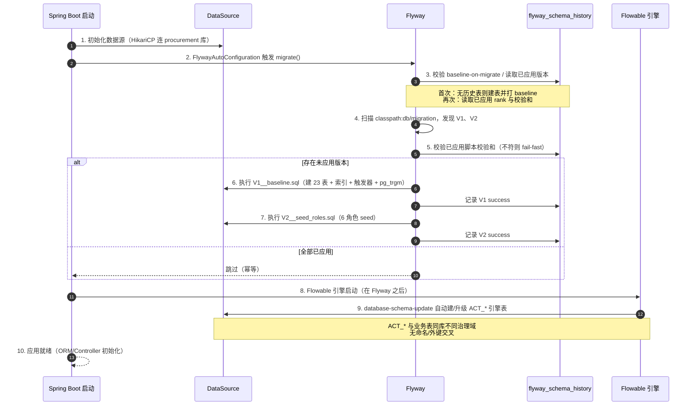

# U1 数据库基线 / Flyway 迁移 · 详细设计

> 阶段三·详细设计产物 · 创建日期：2026-06-05 · 状态：草稿
> 上游：阶段三 `tkxm-database`（数据库·DDL）、`tkxm-general`（概要设计）
> 下游：阶段四 `tkxm-coding`（编码与单测）、`tkxm-review`（审查）
> 对应：功能点 **U1**、基建/迁移、需求 **—**

---

## 1. 功能概述

U1 是整个系统的**数据库基线**功能点：把 `tkxm-database` 产出的可执行 DDL（23 张业务表 + 全部索引 + `updated_at` 触发器 + `pg_trgm` 扩展 + 初始 seed）落为**版本化 Flyway 迁移脚本**，使应用首次启动即自动建库到位、且任意环境（本机 / CI / 生产）以同一套脚本可重复演进。

本功能点是**基建/迁移类**，非 HTTP 接口：

- **交付物是迁移脚本与配置**，不是 Controller/Service。`backend/src/main/resources/db/migration/V1__baseline.sql`（建表）、`V2__seed_roles.sql`（角色 seed）、`application.yml` 的 `spring.flyway.*` 配置。
- **执行主体是 Flyway**：Spring Boot 启动时 `FlywayAutoConfiguration` 在数据源就绪后、JPA/ORM 初始化前自动运行 `migrate`。
- **范围边界**：只管业务表（`V*__*.sql`）；Flowable 审批引擎的 `ACT_*` 表由引擎自管（`flowable.database-schema-update`），不进 Flyway，二者**同库不同治理域**，需协调执行顺序与避免命名冲突（见 §5.4）。
- **是全系统的下游依赖根**：所有业务功能点（U2 认证、U3 预算、U7 审批、库存/采购/领用 …）都依赖本基线先就位。

设计选型依据：概要设计 §2.3「迁移 = Flyway（含 PG 模块）」、SEL-1「审批用 Flowable 7.1，引擎表 `ACT_*` 与业务表同库，建表顺序需协调（R-5 / general TBD-3）」。

> **与 DDL 文档的差异点（已对齐脚手架实现）**：DDL 附录 seed 含「默认管理员 `sys_user` + `user_role`」并使用占位 BCrypt 哈希。脚手架实际把 `V2__seed_roles.sql` **收敛为仅 6 个角色**，默认管理员账号改由 **U2 阶段的 `ApplicationRunner` 用真实 BCrypt 创建**（避免在迁移里硬编码无法校验、且 Flyway 校验和锁死的口令哈希）。本详设以脚手架为准，DDL 文档相应注记应在回看时同步。

---

## 2. 功能规约（SDD）

### 2.1 前置条件

- **P1**：U0（工程脚手架）已就位——`pom.xml` 含 `flyway-core` + `flyway-database-postgresql` + `postgresql` 驱动；目标 PostgreSQL 库 `procurement` 可连（`spring.datasource.url`）。
- **P2**：连接账号对目标 schema 有 `CREATE TABLE / CREATE INDEX / CREATE EXTENSION / CREATE TRIGGER / CREATE FUNCTION` 权限（`pg_trgm` 扩展需相应权限，云库可能需预装）。

### 2.2 后置条件

迁移成功执行后（无论全新库还是已迁移库再次启动）：

- **Q1（表）**：23 张业务表存在，结构与 `procurement-ddl.md` 完全一致（字段类型/允空/默认/CHECK 约束）。
- **Q2（索引）**：全部唯一索引、普通索引、`pg_trgm` GIN 索引存在；主数据「未删唯一」为**部分唯一索引** `WHERE is_deleted = 0`。
- **Q3（触发器/函数）**：`set_updated_at()` 函数存在；13 张含 `updated_at` 的表各挂一个 `BEFORE UPDATE` 触发器。
- **Q4（扩展）**：`pg_trgm` 扩展已安装。
- **Q5（seed）**：`role` 表含 6 个内置角色（`editor / purchase_mgr / dept_mgr / warehouse / requester / admin`）。
- **Q6（元数据）**：`flyway_schema_history` 表记录 V1、V2 两条 `Success` 记录，校验和与脚本一致。

### 2.3 不变量

- **INV-1（幂等）**：对同一已迁移库再次启动应用，Flyway 不重复执行已应用版本，库状态不变、不报错（幂等由 Flyway 版本记账保证，而非脚本自身 `IF NOT EXISTS`）。
- **INV-2（不可变历史）**：已应用的 `V1`/`V2` 脚本内容**冻结**，任何修改都会导致 Flyway 校验和不符而启动失败（见 §8）；演进只能追加 `V3+`。
- **INV-3（依赖闭合）**：单文件内建表顺序满足外键依赖——被引用表先建（`stock_item` 先于 `inbound_item/stocktake_item/requisition_item/outbound_item`；`budget`、`budget_subject` 先于 `purchase_item`；`purchase_order` 先于 `inbound_order`）。
- **INV-4（治理域隔离）**：Flyway 仅管理 `V*` 脚本声明的对象；`ACT_*` 引擎表不出现在任何 Flyway 脚本中。

### 2.4 验收标准（AC）

| 编号 | 验收标准 |
|---|---|
| AC-1 | 对全新空库启动应用，迁移成功，23 张业务表 + 全部索引 + 触发器 + `pg_trgm` + 6 角色 seed 全部就位（Q1–Q5）。 |
| AC-2 | 对已迁移库再次启动，Flyway 跳过已应用版本，无报错、库状态不变（INV-1）。 |
| AC-3 | `flyway_schema_history` 中 V1、V2 均为 `success=true`，版本顺序正确（Q6）。 |
| AC-4 | 篡改任一已应用脚本后启动，Flyway 因校验和不符而**快速失败**（fail-fast），不静默带病运行（INV-2）。 |
| AC-5 | Flowable `ACT_*` 表与业务表在同库共存、无命名/外键冲突，应用正常启动（INV-4）。 |
| AC-6 | Testcontainers 集成测试：一次性容器内执行迁移并断言 Q1–Q5，CI 可重复绿。 |

---

## 3. 迁移执行时序



### 顺序约束（硬约束）

1. **数据源 → Flyway**：Flyway 必须在数据源就绪后、任何 ORM/业务 Bean 之前运行（Spring Boot 默认保证 `flywayInitializer` 先于 `entityManagerFactory` / MyBatis）。
2. **Flyway → Flowable**：业务表迁移**先于** Flowable 引擎建表。虽然二者对象互不引用，但固定「先 Flyway 后 Flowable」可消除并发建表（同一连接池抢锁）与可观测性歧义。脚手架通过 U1 期 `flowable.check-process-definitions=false` 避免引擎启动期扫描；引擎建表本身随其 `ProcessEngine` Bean 初始化，时序上自然落在 Flyway 之后（见 §5.4 与 TBD-1）。
3. **V1 → V2**：建表先于 seed（角色 INSERT 依赖 `role` 表已存在）。
4. **文件内 → 依赖序**：单文件内严格按外键依赖排序（INV-3）。

---

## 4. 迁移文件布局与版本

### 4.1 目录布局

```
backend/src/main/resources/db/migration/
  ├── V1__baseline.sql      建 23 业务表 + 全部索引 + updated_at 触发器 + set_updated_at() 函数 + pg_trgm 扩展
  └── V2__seed_roles.sql    6 个内置角色 seed
```

`spring.flyway.locations = classpath:db/migration`，随 jar 打包，部署即随应用分发。

### 4.2 版本与命名规范

| 维度 | 约定 |
|---|---|
| 版本前缀 | `V` = 版本化迁移（versioned），按 `V<n>__<desc>.sql` 单调递增执行一次 |
| 分隔符 | 版本号与描述间用**双下划线** `__`；描述内单词用单下划线 |
| 描述 | 小写蛇形、语义化（`baseline` / `seed_roles`），描述会落入历史表 `description` |
| 排序 | Flyway 按版本号数值升序；同号不可重复 |
| 字符集 | UTF-8（含中文注释/角色名），`spring.flyway.encoding` 默认 UTF-8 |
| 可重复脚本 | 本期不使用 `R__` 可重复脚本（无视图/函数需随每次变更重放）；`set_updated_at()` 用 `CREATE OR REPLACE` 放在 V1，后续若需独立演进再评估提升为 `R__` |

### 4.3 V1 / V2 职责

**`V1__baseline.sql`（建表基线）**
- 通用对象：`CREATE OR REPLACE FUNCTION set_updated_at()`、`CREATE EXTENSION IF NOT EXISTS pg_trgm`。
- 按 BC1→BC2→BC3→BC5(库存先建)→BC4→BC5(盘点)→BC6 的依赖序建 23 表，每表紧跟其索引与 `updated_at` 触发器。
- 不含任何业务数据。

**`V2__seed_roles.sql`（角色 seed）**
- `INSERT` 6 个内置角色（`role` 表）。
- **不含默认管理员**：管理员账号在 U2 由 `ApplicationRunner` 用真实 BCrypt 哈希创建（理由见 §1 差异说明）。

### 4.4 后续 V3+ 增量约定

- 任何表结构/数据变更**一律追加新版本**（`V3__add_xxx.sql`、`V4__...`），严禁改动已应用脚本（INV-2）。
- 加列带默认值；大表（`stock_txn`）加索引用 `CREATE INDEX CONCURRENTLY`（注意 `CONCURRENTLY` 不能在事务块内，需配 `spring.flyway` 单语句/非事务执行或拆独立脚本）。
- 结构变更须回溯更新 E-R 与 db 规格，并提示 `tkxm-coding` 回看（对齐 db §8）。

---

## 5. 关键逻辑

### 5.1 建表依赖排序（INV-3）

外键为物理约束，被引用表必须先建。脚本内已固化以下关键序：

- `department` → `project_group` / `sys_user`（FK→department）；`role` → `user_role`。
- `budget_subject`、`budget` → `budget_item`（FK→两者）；`budget_subject` → `purchase_item`。
- `stock_item` **提前到 BC4 之前**建，供 `inbound_item / stocktake_item / requisition_item / outbound_item` 的 FK 引用。
- `purchase_order` → `purchase_item / delivery_note / inbound_order`；`inbound_order` → `inbound_item`。
- 自引用 `budget_subject.parent_id → budget_subject.id`：同表内引用，PG 允许在建表语句内声明自引用 FK，无需拆分。
- 逻辑外键不建物理约束：`stock_txn.stock_item_id`（高写入降耦合）、`approval.biz_id`（多业务类型多态）——故其排序不受约束限制。

### 5.2 is_deleted 部分唯一索引

主数据「编码/账号未删唯一」用**部分唯一索引**而非普通唯一约束：

```sql
CREATE UNIQUE INDEX uk_department_code ON department(code) WHERE is_deleted = 0;
```

- 语义：同一 `code` 在「未删」记录中唯一；软删后（`is_deleted=1`）该 `code` 可被新记录复用。
- 对齐 MyBatis-Plus 逻辑删除（`application.yml`：`logic-delete-field: isDeleted` / `logic-delete-value:1` / `logic-not-delete-value:0`）。
- 涉及表：`department / project_group / sys_user / role / budget_subject / stock_item`（含 `stock_item` 的 `(material_name, project_group_id)` 复合部分唯一）。

### 5.3 updated_at 触发器

PostgreSQL 无 `ON UPDATE` 语义，统一用触发器刷新：

```sql
CREATE OR REPLACE FUNCTION set_updated_at() RETURNS trigger AS $$
BEGIN NEW.updated_at = now(); RETURN NEW; END; $$ LANGUAGE plpgsql;
-- 每张含 updated_at 的表：
CREATE TRIGGER trg_<t>_updated BEFORE UPDATE ON <t> FOR EACH ROW EXECUTE FUNCTION set_updated_at();
```

- 覆盖 13 张含 `updated_at` 的表（主数据 6 + 单据/明细中含 `updated_at` 的 `budget / budget_item / approval / purchase_order / purchase_item / stocktake / requisition`）。
- 纯关系/流水表（`user_role / approval_record / stock_txn / *_item 中无 updated_at 的明细 / delivery_note / inbound_order / inbound_item / outbound_order / outbound_item`）**不挂**触发器（无 `updated_at` 列）。
- 函数用 `CREATE OR REPLACE`，保证幂等与未来可平滑替换。

### 5.4 Flowable 与 Flyway 协调

- **治理域分离**：Flyway 管 `V*` 业务对象；Flowable `ACT_*` 引擎表由 `flowable.database-schema-update: true` 自管。两者对象无交叉引用、无命名冲突（`ACT_` 前缀独占）。
- **执行顺序**：固定「先 Flyway 后 Flowable」。Spring Boot 中 `flywayInitializer` 早于 Flowable 的 `ProcessEngine` Bean 初始化；本期还通过 `flowable.check-process-definitions: false` 关闭 BPMN 扫描（U1 无流程定义，避免扫描空 `processes/` 报错），引擎仅做建表。
- **不混管**：绝不把 `ACT_*` 写进 Flyway 脚本（否则与引擎自管的 schema 升级冲突）；亦不让 Flyway 管理 Flowable 版本。
- 顺序最终落点见 TBD-1（与 general TBD-3 / R-5 对应）。

### 5.5 回滚 / 前滚策略

- **不依赖 Flyway 社区版 undo**（`U__` undo 为商业版特性，本项目不用）。
- **前滚（roll-forward）为主**：发现问题用新增 `V<n+1>__fix_xxx.sql` 修正，保持历史不可变（INV-2）。
- **失败处理**：单个迁移失败时，PostgreSQL 对建表/索引等 DDL 在 Flyway 单脚本事务内可回滚（PG DDL 事务安全），失败脚本不留 `success` 记录，修复脚本后重启即重试；若历史表残留 failed 记录，用 `flyway repair` 清理（运维动作，不在应用启动路径）。
- **环境级回滚**：开发/测试用一次性库（Testcontainers / 重建库）回到干净态；生产严禁手改库，走前滚补丁 + 备份恢复兜底。

### 5.6 幂等

- 幂等的**主语是 Flyway 记账**（`flyway_schema_history` 按版本去重），不是脚本自身写 `IF NOT EXISTS`。已应用版本不重跑（INV-1 / AC-2）。
- 通用对象用防御式写法兜底环境差异：`CREATE OR REPLACE FUNCTION`、`CREATE EXTENSION IF NOT EXISTS`。
- `baseline-on-migrate: true`：对**已有对象但无历史表**的库（如手工初始化过的环境），Flyway 先打 baseline 再迁移，避免对非空库报「found non-empty schema without history」。

---

## 6. Flyway 配置与脚本清单

### 6.1 `application.yml` 配置项

```yaml
spring:
  flyway:
    enabled: true                       # 启用 Flyway 自动迁移
    locations: classpath:db/migration   # 迁移脚本位置（随 jar 打包）
    baseline-on-migrate: true           # 非空库首跑先打 baseline，避免报错
```

| 配置项 | 取值 | 说明 |
|---|---|---|
| `enabled` | `true` | 应用启动自动 migrate |
| `locations` | `classpath:db/migration` | 仅业务脚本目录；不含 Flowable |
| `baseline-on-migrate` | `true` | 兼容已有对象的非空库 |
| 校验（默认） | `validate-on-migrate=true`（默认开） | 启动时校验已应用脚本校验和，不符则 fail-fast（AC-4） |
| `encoding`（默认） | UTF-8 | 支持脚本中文注释/角色名 |

> 校验为 Flyway 默认行为，未在 `application.yml` 显式声明即生效；如需在文档/CI 中显式固化可补 `spring.flyway.validate-on-migrate: true`（保持默认即可，无需改动脚手架）。

### 6.2 脚本清单

| 版本 | 文件 | 职责 | 关键内容 |
|---|---|---|---|
| V1 | `db/migration/V1__baseline.sql` | 建表基线 | `set_updated_at()` 函数、`pg_trgm` 扩展、23 表、全部索引、13 触发器 |
| V2 | `db/migration/V2__seed_roles.sql` | 角色 seed | 6 个内置角色 INSERT |

依赖：`pom.xml` 已含 `org.flywaydb:flyway-core` + `org.flywaydb:flyway-database-postgresql`（PG 17 支持需 PG 专用模块），版本由 Spring Boot 3.4.1 BOM 管理。

---

## 7. 测试点

> 用 Testcontainers 起一次性 PostgreSQL 容器，对真实 PG 行为验证（部分唯一索引、触发器、`pg_trgm` 均为 PG 特性，H2 不可替代）。

| 编号 | 测试点 | 类型 | 断言要点 |
|---|---|---|---|
| T-1 | 全新空库迁移成功建 23 表 | 集成 | 迁移后 `information_schema.tables` 含 23 张业务表（AC-1） |
| T-2 | 全部索引/约束就位 | 集成 | 抽查 `uk_department_code` 等部分唯一索引存在且带 `WHERE is_deleted=0`；`idx_subject_name_trgm` 为 GIN（AC-1/Q2） |
| T-3 | `pg_trgm` 扩展安装 | 集成 | `pg_extension` 含 `pg_trgm`（Q4） |
| T-4 | `updated_at` 触发器生效 | 集成 | 对 `department` UPDATE 后 `updated_at` 自动刷新为 `now()`（Q3） |
| T-5 | 部分唯一索引语义 | 集成 | 同 `code` 在 `is_deleted=0` 时冲突报错；软删后可复用同 `code`（§5.2） |
| T-6 | 6 角色 seed | 集成 | `role` 表恰好 6 行，code 集合匹配（Q5/AC-1） |
| T-7 | 重复迁移幂等 | 集成 | 同容器再次 `migrate()` 不新增历史记录、不报错、表数不变（AC-2/INV-1） |
| T-8 | 校验和 fail-fast | 集成 | 篡改已应用脚本后 `migrate()` 抛 `FlywayValidateException`（AC-4） |
| T-9 | 历史表记账 | 集成 | `flyway_schema_history` 中 V1、V2 `success=true`、版本有序（AC-3/Q6） |
| T-10 | Flowable 表共存 | 集成 | 完整 Spring 上下文启动后，`ACT_*` 表与 23 业务表同库共存，应用就绪（AC-5/INV-4） |

> T-1~T-9 可用轻量 Flyway + DataSource 切片测试（不必拉全上下文）；T-10 用 `@SpringBootTest` + Testcontainers 验证 Flyway/Flowable 端到端顺序与共存。

---

## 8. 异常处理

| 异常场景 | 触发条件 | 处理 |
|---|---|---|
| 迁移脚本执行失败 | DDL 语法错/权限不足/对象已存在冲突 | Flyway 中止启动、抛 `FlywayException`，该版本不记 `success`；修脚本/补权限后重启重试（PG DDL 事务回滚，无半成品） |
| 校验和不符 | 已应用脚本被改动（INV-2） | `validate-on-migrate` 触发 `FlywayValidateException`，**fail-fast 拒绝启动**；正确做法是新增 V3 而非改旧脚本；误判时用 `flyway repair` 重算校验和（运维显式动作） |
| 非空库无历史 | 库已有对象但无 `flyway_schema_history` | `baseline-on-migrate: true` 先打 baseline 再迁移，避免「non-empty schema」错误 |
| `pg_trgm` 不可用 | 库无扩展权限/未预装 | `CREATE EXTENSION` 报错中止；运维需以超级用户预装扩展或授权后重启 |
| 历史表残留 failed | 上次迁移中途失败留 failed 记录 | `flyway repair` 清理失败记录后重跑（不在应用自动路径，避免静默吞错） |
| 版本号回退/重复 | 误加更小或重复版本号 | Flyway 报 out-of-order/重复版本错误；保持版本单调递增 |
| Flowable 抢先建表冲突 | 顺序错配（理论上不会，前缀隔离） | 维持「先 Flyway 后 Flowable」；`ACT_*` 前缀独占，无业务表命名交叉（§5.4） |

---

## 9. 依赖与影响

- **依赖**：
  - **U0 工程脚手架**（pom 依赖、`application.yml`、数据源、可连 PG 库）。
  - 上游设计：`tkxm-database`（DDL 与库规格）、`tkxm-general`（Flyway/Flowable 选型 §2.3、SEL-1、R-5）。
- **被依赖（影响面）**：本基线是**全系统下游根**——所有业务功能点（U2 认证、U3 预算、U4 科目、U7 审批、采购/入库/库存/盘点/领用 …）的实体表、索引、seed 均来自本迁移。基线表结构若变更，须追加 V3+ 并通知所有受影响功能点回看。
- **横向协调**：与 Flowable（U7/U10 审批引擎）共库——执行顺序与治理域隔离见 §5.4。

---

## 10. 待确认（TBD）

| 编号 | 待确认项 | 现状/暂定 | 拍板人 |
|---|---|---|---|
| TBD-1 | Flowable 与 Flyway 执行顺序的固化方式 | 暂定靠 Spring Boot 默认 Bean 顺序（flywayInitializer 早于 ProcessEngine）+ U1 期 `check-process-definitions=false`；是否需显式 `@DependsOn` / 配置 Flowable 在 Flyway 后初始化，待 U7/U10 引入 BPMN 时确认（对应 general TBD-3 / R-5） | 技术 |
| TBD-2 | 回滚粒度 | 暂定纯前滚（roll-forward + 新版本补丁），不用社区版 undo；生产是否需配快照/备份恢复 SLA 待定 | 技术 |
| TBD-3 | `set_updated_at()` 是否提升为 `R__` 可重复脚本 | 暂放 V1 用 `CREATE OR REPLACE`；若后续函数频繁演进再评估独立可重复脚本 | 技术 |

---

> 可执行迁移脚本见 `backend/src/main/resources/db/migration/V1__baseline.sql`、`V2__seed_roles.sql`；DDL 权威来源 `docs/design/db/procurement-ddl.md`，本文不重复内联完整 DDL。
