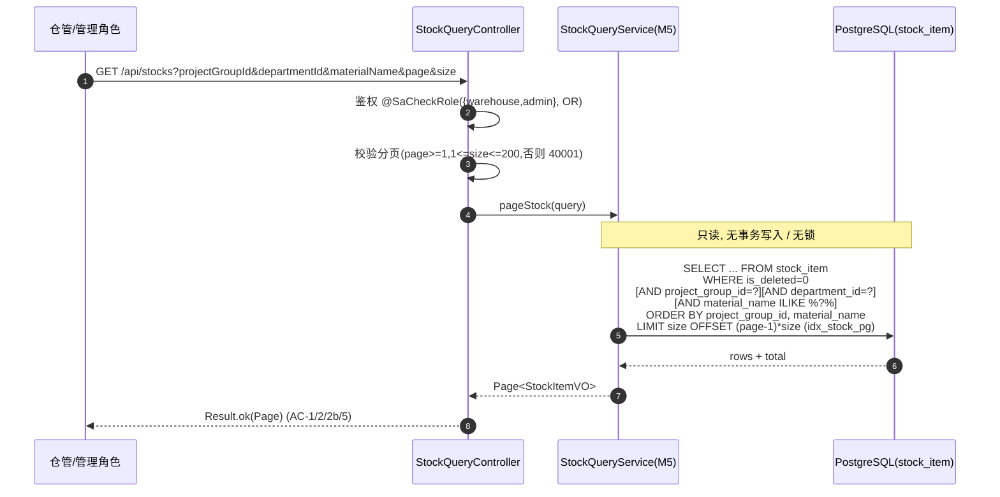
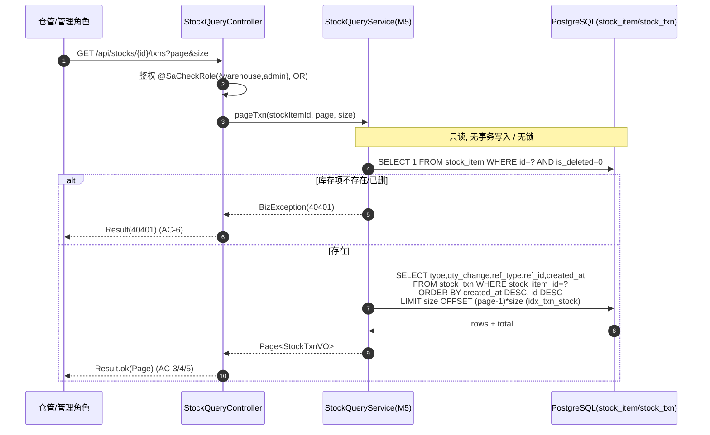
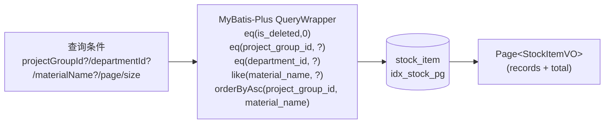
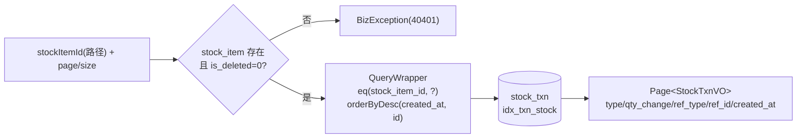

# U10 库存查询 + 库存流水 · 详细设计

> 阶段三 · 详细设计产物 · 创建日期：2026-06-05 · 状态：草稿
> 上游：`tkxm-general`（`docs/design/general/procurement-general.md` §4.1 M5 库存契约 / §3.2 库存记账时序 / §7 库存记账）、`tkxm-database`（`docs/design/db/procurement-db.md` §3.5 stock_item/stock_txn，索引 `idx_stock_pg`/`idx_txn_stock`）、`tkxm-prototype`（`docs/prototype/index.html` 库存内嵌于屏 `inbound`/`outbound`）
> 下游：阶段四 `tkxm-coding`（编码与单测）、`tkxm-review`（代码审查）
> 对应：功能点 **U10 库存查询 + 库存流水** · 模块 **M5 库存与资产（BC5）** · 需求 **FP-7** · 原型屏 `inbound`/`outbound` 内嵌
> 通用响应 / 错误码 / 鉴权约定与 `U6-budget-import.md` §6 一致（同一套 `Result<T>` / `BizException` / Sa-Token）。

---

## 1. 概述

U10 实现库存与库存流水的**只读查询**，是 M5 库存与资产上下文对外的查询能力（general §4「M5 对外提供能力：库存查询」）。它面向仓管 / 管理类角色，提供两类视图：

1. **库存查询** `GET /api/stocks`：按项目组 / 部门 / 物料名分页查询 `stock_item`，返回当前库存量 `quantity` 等聚合视图。
2. **库存流水查询** `GET /api/stocks/{id}/txns`：按某 `stock_item` 查 `stock_txn`，时间倒序分页，返回 `type/qty_change/ref_type/ref_id`，即库存变动的**审计流水**。

设计要点：

- **只读、无副作用**：U10 不写任何表，不持锁、不开写事务；查询为后置无副作用操作（AC 全部为「读后置无副作用」）。
- **分页**：两接口均分页（MyBatis-Plus `IPage`），避免大表全量返回（`stock_txn` 百万级，db §7）。
- **按归属过滤**：库存查询按项目组 / 部门 / 物料名过滤，命中索引 `idx_stock_pg`；数据按调用方归属范围可见（横切：general §7「数据按项目组 / 部门归属过滤」）。
- **流水即审计**：`stock_txn` 是 M5 的天然审计与对账依据（general §7 库存记账）；流水按 `(stock_item_id, created_at)` 倒序，命中索引 `idx_txn_stock`。
- **对账关系**：`stock_item.quantity == Σ stock_txn.qty_change`（库存 = 流水累计，db §3.5 / general §7 / ER D-5，INV-1），U10 提供对账查询面但不修复差异。

库存数据由 **U9（多次到货验收入库）** 等写入命令产生（`type=inbound`），后续由 U11（出库 `type=outbound`）、U12（盘点 `type=gain/loss`）追加流水；U10 仅读取，**不参与任何写入与记账**。本期不展示资产折旧字段（`asset_no/original_value/life_status` 预留，原型 `inbound` 屏明示预留 #8）。

- **角色**：仓管 / 管理类角色（`@SaCheckRole(value = {"warehouse", "admin"}, mode = SaMode.OR)`，见 §6）。
- **依赖**：硬依赖 **U9**（库存与流水须先由入库等写入命令产生，否则查询为空集，非错误）。
- **被依赖（下游）**：为 U11 领用核库存、U12 盘点账面数提供查询面（功能上并行，详 §9）。

---

## 2. 功能规约（AC，只读后置无副作用）

> 验收标准（Acceptance Criteria），与 §7 测试点 T-x 一一对应。所有用例的**后置条件统一为「不改变任何数据，无副作用」**（只读）。

### 2.1 库存查询 `库存查询(项目组?, 部门?, 物料名?, 分页)`

**前置条件**

- P1：调用方已登录且具备 `warehouse` 或 `admin` 角色（否则 40301）。
- P2：分页参数合法（`page ≥ 1`、`1 ≤ size ≤ 200`，缺省 1/20；否则 40001）。
- P3：过滤参数（`projectGroupId`/`departmentId`/`materialName`）均可空；非空时按值过滤，不存在的归属值返回空集（非错误）。

**后置条件**

- Q1：返回分页结果 `Page<StockItemVO>`，按 `idx_stock_pg` 命中项目组过滤；默认排序按 `project_group_id, material_name` 升序（稳定排序）。
- Q2：仅返回未删库存项（`is_deleted=0`，MyBatis-Plus 全局逻辑删除自动追加）。
- Q3：**不修改任何数据**（只读，无事务写入、无锁）。

### 2.2 库存流水查询 `库存流水查询(库存项 id, 分页)`

**前置条件**

- P4：调用方已登录且具备 `warehouse` 或 `admin` 角色（否则 40301）。
- P5：路径参数 `id` 对应的 `stock_item` 存在且未删（否则 40401「库存项不存在」）。
- P6：分页参数合法（同 P2；否则 40001）。

**后置条件**

- Q4：返回该 `stock_item` 的流水分页 `Page<StockTxnVO>`，按 `created_at` **倒序**（最新在前），命中索引 `idx_txn_stock (stock_item_id, created_at)`。
- Q5：每条含 `type`（inbound/outbound/gain/loss）、`qty_change`（带正负）、`ref_type`（inbound_order/outbound_order/stocktake）、`ref_id`、`created_at`。
- Q6：**不修改任何数据**（只读）。

**不变量（对账，贯穿但 U10 不修复）**

- INV-1：对任一 `stock_item`，恒有 `quantity == Σ stock_txn.qty_change`（库存 = 流水累计，db §3.5 CHECK `quantity>=0`、general §7、ER D-5）。U10 可据此提供对账查询（§5.4），差异修复属盘点 U12，不在本功能。

### 2.3 验收标准

- **AC-1 库存分页**：不带过滤分页查询，返回当前页库存项列表与总数；翻页参数生效；后置无副作用。
- **AC-2 按项目组过滤**：传 `projectGroupId`，仅返回该项目组库存项（命中 `idx_stock_pg`），其余项目组不出现。
- **AC-2b 按部门 / 物料名过滤**：传 `departmentId` 或 `materialName`（模糊）组合过滤，结果为交集；空过滤即全量分页。
- **AC-3 流水时间倒序**：查某库存项流水，结果按 `created_at` 倒序（最新在前），含 `type/qty_change/ref_type/ref_id`。
- **AC-4 流水分页**：流水分页参数生效，深翻页不丢条、不重复。
- **AC-5 空结果**：无匹配库存项 / 该库存项无流水 → 返回空列表 + `total=0`，HTTP 成功（非错误）。
- **AC-6 库存项不存在**：查不存在 / 已删库存项的流水 → 40401。
- **AC-7 对账一致**：某库存项 `quantity` 与其全部 `stock_txn.qty_change` 之和一致（INV-1 对账查询）。
- **AC-8 鉴权**：非 `warehouse`/`admin` 角色调用任一查询返回 40301。
- **AC-9 只读无副作用**：任一查询前后，`stock_item`/`stock_txn` 行数与值不变（无写入、无软删触发）。

---

## 3. 时序（查询库存 / 查询流水，只读无写）

### 3.1 库存查询



### 3.2 库存流水查询



---

## 4. 数据流（读 stock_item / stock_txn，按归属过滤，分页）

### 4.1 读表清单（全只读）

| 表 | 读 / 写 | 用途 | 关键列 / 索引 |
|---|---|---|---|
| `stock_item` | **读** | 库存项分页 + 流水查询前的存在性校验 | id, material_name, project_group_id, department_id, quantity；过滤命中 `idx_stock_pg (project_group_id)`、唯一删过滤 `is_deleted=0` |
| `stock_txn` | **读** | 某库存项流水倒序分页 | stock_item_id, type, qty_change, ref_type, ref_id, created_at；命中 `idx_txn_stock (stock_item_id, created_at)` |

> U10 **不写任何表**，不调用 M5 的写入内部能力 `adjustStock`（那是 U9/U11/U12 的记账入口）。

### 4.2 库存查询数据流



- 过滤维度：`project_group_id`（等值，命中 `idx_stock_pg`）、`department_id`（等值，冗余统计列）、`material_name`（`ILIKE '%kw%'` 模糊；量级十万级可接受，超大可后续加 trgm 索引，见 §10 TBD-2）。
- 逻辑删除：MyBatis-Plus 全局 `is_deleted` 逻辑删除自动追加 `is_deleted=0`，无需手写（对齐 db §1 通用约定）。
- 分页：`IPage<StockItem>`，由 `PaginationInnerInterceptor` 生成 `LIMIT/OFFSET` 与 `COUNT`。

### 4.3 库存流水数据流



- 流水为「事件」表，不软删（db §3.5），故流水查询不追加 `is_deleted` 条件。
- 排序：`created_at DESC` 主排，追加 `id DESC` 作稳定第二排序键，保证同一时刻多条流水深翻页稳定不重复（AC-4）。
- `stock_txn.stock_item_id` 为**逻辑外键**（db §4，高写入流水表降耦合）；存在性由 §4.3 的 `stock_item` 前置校验保证（而非物理 FK join）。

---

## 5. 关键逻辑

### 5.1 分页与排序（AC-1 / AC-3 / AC-4）

- 统一分页对象 `IPage`（MyBatis-Plus），`page` 缺省 1、`size` 缺省 20、上限 200（防全表扫；超限归一为 200 或抛 40001，本设计取**抛 40001**以显式提示）。
- 库存查询默认排序 `ORDER BY project_group_id ASC, material_name ASC`（稳定、便于按归属浏览）。
- 流水查询固定排序 `ORDER BY created_at DESC, id DESC`（最新在前，倒序即审计回溯；`id DESC` 作 tie-breaker 保证深翻页稳定）。
- 两查询均命中既有索引（`idx_stock_pg`、`idx_txn_stock`），满足 general §8「列表查询 P99 < 300ms」。

### 5.2 按项目组 / 部门 / 物料名过滤（AC-2 / AC-2b）

```
QueryWrapper<StockItem> qw = new QueryWrapper<>();
// is_deleted=0 由 MP 逻辑删除自动追加
if (projectGroupId != null) qw.eq("project_group_id", projectGroupId);   // 命中 idx_stock_pg
if (departmentId  != null) qw.eq("department_id",  departmentId);
if (StringUtils.hasText(materialName)) qw.like("material_name", materialName); // ILIKE %kw%
qw.orderByAsc("project_group_id", "material_name");
```

- 过滤参数全可空，组合为 AND 交集；全空即全量分页（仍受 `size` 上限保护）。
- `projectGroupId` 是最常用且高区分度过滤维度，优先命中 `idx_stock_pg`；`materialName` 模糊不单独建索引（低优先，见 §10）。
- 数据归属可见性：本期按显式过滤参数实现；若后续要求「按当前用户归属范围自动收敛」（仅可见本部门 / 项目组），追加用户上下文过滤（general §7，列 §10 TBD-3）。

### 5.3 流水倒序（AC-3 / 审计回溯）

- 流水查询语义 = 对某库存项的「变动事件回放」，倒序展示便于审计「最近发生了什么」。
- 每条流水自解释来源：`ref_type + ref_id` 指向产生该变动的单据（`inbound_order`/`outbound_order`/`stocktake`，db §3.5），前端可据此跳转溯源（原型 `inbound`/`outbound` 内嵌库存与流水视图）。
- `qty_change` 带正负：inbound/gain 为正、outbound/loss 为负，前端按正负着色展示。

### 5.4 quantity = 流水累计的对账关系（AC-7 / INV-1）

- 不变量 INV-1：`stock_item.quantity == Σ(该 stock_item 的 stock_txn.qty_change)`。该不变量由写入侧（U9/U11/U12「数量变更与流水成对、同事务」）维持；U10 作为**只读查询**仅**呈现 / 校验**，不修复。
- 对账查询（供运维 / 测试 / 盘点前核对）：

  ```sql
  SELECT s.id, s.quantity AS book_qty,
         COALESCE(SUM(t.qty_change), 0) AS txn_sum,
         s.quantity - COALESCE(SUM(t.qty_change), 0) AS diff
  FROM stock_item s
  LEFT JOIN stock_txn t ON t.stock_item_id = s.id
  WHERE s.id = ? AND s.is_deleted = 0
  GROUP BY s.id, s.quantity;
  ```

  `diff` 应恒为 0；非 0 表示记账被绕过（异常告警，转 U12 盘点核对 / 排查写入侧 bug）。本期作为流水查询响应的可选汇总字段（`StockTxnPageVO.txnSum` 见 §6.2），不单设独立接口。

### 5.5 只读无副作用保证（AC-9）

- Service 查询方法**不标注** `@Transactional`（或标注 `@Transactional(readOnly = true)` 以提示只读、禁写）；不调用任何 insert/update/delete、不持 `FOR UPDATE` 行锁。
- 不触发 MyBatis-Plus 逻辑删除写动作（仅 select 自动追加 `is_deleted=0` 条件，非 update）。
- 由此满足 AC-9：查询前后表数据零变化。

---

## 6. 接口定义

> 统一前缀 `/api`；统一返回 `Result<T>`（`code=0` 成功，非 0 为错误码）；鉴权 Sa-Token。通用响应 / 错误码 / 异常映射约定见 `U6-budget-import.md` §6。本功能错误码全集见 §8。共 **2** 个接口（均 GET、只读）。

**本功能错误码全集**

| code | 含义 | 触发 |
|---|---|---|
| 0 | 成功 | — |
| 40001 | 参数错误 | 分页参数非法（page<1 / size 越界）等 |
| 40301 | 无权限 | 非 `warehouse`/`admin` 角色（Sa-Token 拦截层 40300，业务侧细分 40301） |
| 40401 | 库存项不存在 | 流水查询的 `id` 在 `stock_item`（未删）中查无 |
| 50000 | 系统错误 | 未预期异常（DB / IO 等） |

### 6.1 库存查询

- **Method / Path**：`GET /api/stocks`
- **鉴权**：`@SaCheckRole(value = {"warehouse", "admin"}, mode = SaMode.OR)`
- **请求参数**（Query）：

  | 参数 | 类型 | 必填 | 约束 | 说明 |
  |---|---|---|---|---|
  | `projectGroupId` | Long | 否 | >0 | 按归属项目组过滤（命中 `idx_stock_pg`） |
  | `departmentId` | Long | 否 | >0 | 按归属部门过滤 |
  | `materialName` | String | 否 | ≤128 | 物料名模糊（`ILIKE %kw%`） |
  | `page` | int | 否 | ≥1，缺省 1 | 页码 |
  | `size` | int | 否 | 1~200，缺省 20 | 每页条数（越界 → 40001） |

- **响应** `Result<Page<StockItemVO>>`，`StockItemVO`：

  | 字段 | 类型 | 说明 |
  |---|---|---|
  | `stockItemId` | long | 库存项 id |
  | `materialName` | string | 物料 / 资产名 |
  | `projectGroupId` | long | 归属项目组 id |
  | `departmentId` | long | 归属部门 id |
  | `quantity` | decimal(18,3) | 当前库存量（= 流水累计，INV-1） |

  `Page` 含 `records`/`total`/`current`/`size`（MyBatis-Plus `IPage`）。

- **示例**：

  ```json
  // 请求: GET /api/stocks?projectGroupId=12&page=1&size=20
  // 响应
  { "code": 0, "message": "ok",
    "data": { "current": 1, "size": 20, "total": 2,
      "records": [
        { "stockItemId": 9001, "materialName": "GPU 服务器", "projectGroupId": 12, "departmentId": 3, "quantity": 2 },
        { "stockItemId": 9002, "materialName": "试剂盒",      "projectGroupId": 12, "departmentId": 3, "quantity": 40 }
      ] } }
  ```

- **错误**：40001 参数 / 40301 无权限 / 50000 系统。

### 6.2 库存流水查询

- **Method / Path**：`GET /api/stocks/{id}/txns`
- **鉴权**：`@SaCheckRole(value = {"warehouse", "admin"}, mode = SaMode.OR)`
- **请求参数**：

  | 参数 | 位置 | 类型 | 必填 | 约束 | 说明 |
  |---|---|---|---|---|---|
  | `id` | path | Long | 是 | >0 | 目标库存项 id（须存在且未删，否则 40401） |
  | `page` | query | int | 否 | ≥1，缺省 1 | 页码 |
  | `size` | query | int | 否 | 1~200，缺省 20 | 每页条数（越界 → 40001） |

- **响应** `Result<StockTxnPageVO>`，`StockTxnPageVO` = 分页 + 可选对账汇总：

  | 字段 | 类型 | 说明 |
  |---|---|---|
  | `page` | Page<StockTxnVO> | 流水分页（倒序） |
  | `bookQty` | decimal | 该库存项 `stock_item.quantity`（账面，AC-7 对账可选） |
  | `txnSum` | decimal | 全部流水 `qty_change` 之和（应 == bookQty，INV-1） |

  `StockTxnVO`：

  | 字段 | 类型 | 说明 |
  |---|---|---|
  | `txnId` | long | 流水 id |
  | `type` | string | inbound/outbound/gain/loss |
  | `qtyChange` | decimal(18,3) | 数量增减（带正负） |
  | `refType` | string | inbound_order/outbound_order/stocktake |
  | `refId` | long | 来源单 id（多态逻辑引用） |
  | `createdAt` | datetime | 发生时间（倒序排序键） |

- **示例**：

  ```json
  // 请求: GET /api/stocks/9001/txns?page=1&size=20
  // 响应
  { "code": 0, "message": "ok",
    "data": {
      "bookQty": 2, "txnSum": 2,
      "page": { "current": 1, "size": 20, "total": 3,
        "records": [
          { "txnId": 30021, "type": "outbound", "qtyChange": -1, "refType": "outbound_order", "refId": 8003, "createdAt": "2026-06-04T10:12:00Z" },
          { "txnId": 30015, "type": "inbound",  "qtyChange":  1, "refType": "inbound_order",  "refId": 7002, "createdAt": "2026-06-03T09:00:00Z" },
          { "txnId": 30009, "type": "inbound",  "qtyChange":  2, "refType": "inbound_order",  "refId": 7001, "createdAt": "2026-06-02T15:30:00Z" }
        ] } } }
  ```

  （示例中 `txnSum = -1 + 1 + 2 = 2 == bookQty`，对账一致。）

- **错误**：40001 参数 / 40301 无权限 / 40401 库存项不存在 / 50000 系统。

---

## 7. 测试点（T-x ↔ AC-x）

| 编号 | 关联 AC | 场景 | 预期 |
|---|---|---|---|
| **T-1** | AC-1 | 不带过滤分页查库存（多于一页） | 返回当前页 `records` + 正确 `total`；翻第 2 页内容不重叠；查询前后表数据不变 |
| **T-2** | AC-2 | 传 `projectGroupId` 过滤 | 仅返回该项目组库存项，其余项目组不出现；执行计划命中 `idx_stock_pg` |
| **T-2b** | AC-2b | 传 `departmentId` + `materialName` 组合过滤 | 返回交集；`materialName` 模糊命中包含子串的项；全空过滤=全量分页 |
| **T-3** | AC-3 | 查某库存项流水 | 按 `created_at` 倒序（最新在前）；每条含 `type/qtyChange/refType/refId/createdAt` |
| **T-4** | AC-4 | 流水深翻页 | 第 N 页与第 N+1 页无重复 / 无遗漏（`created_at DESC, id DESC` 稳定排序） |
| **T-5** | AC-5 | 无匹配库存 / 该库存项无流水 | 返回空 `records` + `total=0`，HTTP 成功（非 40401） |
| **T-6** | AC-6 | 查不存在 / 已删库存项的流水 | 返回 40401「库存项不存在」 |
| **T-7** | AC-7 | 对账：某库存项 `quantity` vs 流水累计 | `txnSum == bookQty == stock_item.quantity`（INV-1）；构造差异时 `diff≠0` 可被对账查询检出 |
| **T-8** | AC-8 | 非 `warehouse`/`admin` 角色调用任一查询 | 返回 40301，无数据返回 |
| **T-9** | AC-1/AC-4 | 分页参数越界（page=0 / size=0 / size=1000） | 返回 40001 |
| **T-10** | AC-9 | 任一查询前后比对 `stock_item`/`stock_txn` 行数与值 | 完全一致（只读、无写入、无软删触发） |
| **T-11** | AC-2/AC-3 | 性能：十万级 `stock_item` / 百万级 `stock_txn` 下分页 | 命中 `idx_stock_pg` / `idx_txn_stock`，P99 < 300ms（general §8） |

---

## 8. 异常处理

| 触发 | 错误码 | 处理 |
|---|---|---|
| 分页参数非法（page<1 / size 越界） | 40001 | `@Validated` + 服务层校验，抛 `BizException(40001,...)`；只读无回滚需求 |
| 非 `warehouse`/`admin` 角色 | 40301 | Sa-Token `@SaCheckRole(mode=OR)` 拦截（拦截层 40300），全局异常处理转 `Result.error(40301,...)` |
| 流水查询的库存项不存在 / 已删 | 40401 | 服务层前置 `SELECT ... WHERE id=? AND is_deleted=0` 查无，抛 `BizException(40401,"库存项不存在")` |
| 无匹配结果（库存空 / 流水空） | — | **非异常**：返回空分页（`records=[]`、`total=0`），HTTP 成功（AC-5，区别于 40401） |
| DB / IO 等未预期异常 | 50000 | 全局异常处理器记录日志，返回系统错误（不泄露堆栈，对齐 `GlobalExceptionHandler` 兜底） |

- 全局异常处理器（`GlobalExceptionHandler`，`@RestControllerAdvice`）统一将 `BizException.getCode()` 透传到 `Result.code`，未捕获异常归一为 50000（与 U6 §6 / U9 §8 一致）。
- **只读保证**：所有路径均不写库、不开写事务、不持锁；错误路径亦无副作用（AC-9）。
- **空集 vs 不存在**：库存查询无匹配→空分页（成功）；流水查询的**宿主库存项**不存在→40401。二者语义区分，避免把「合法的空」误报为错误。

---

## 9. 依赖与影响

| 维度 | 内容 |
|---|---|
| **硬依赖** | **U9 多次到货验收入库**（写 M5）：库存项 `stock_item` 与流水 `stock_txn` 须先由入库等写入命令产生；无数据时 U10 返回空集（非错误） |
| **数据来源（写入侧，非依赖调用）** | `stock_txn.type=inbound` 来自 U9；`outbound` 来自 U11；`gain/loss` 来自 U12。U10 只读，**不调用其写入能力 `adjustStock`** |
| **并行关系** | 与 **U11 领用 + 审批出库**、**U12 盘点 + 差异调整** 功能上并行（同属 D 域）：U11/U12 写流水、U10 读流水，经 `stock_item`/`stock_txn` 解耦，无直接调用依赖 |
| **被依赖（下游使用）** | U11 出库前可借库存查询核当前量（核库存防超发）；U12 盘点取账面数 `quantity`；前端原型在 `inbound`/`outbound` 屏内嵌库存项与流水视图 |
| **关联模块** | M1（鉴权 `warehouse`/`admin` 角色来自 U2/U4；项目组 / 部门归属语义） |
| **数据表** | 读：`stock_item`、`stock_txn`；**写：无** |
| **索引依赖** | `idx_stock_pg (project_group_id)`（库存按项目组过滤）、`idx_txn_stock (stock_item_id, created_at)`（流水倒序分页）；二者已在 db §3.5 定义 |
| **不变量呈现** | INV-1 `quantity == Σ qty_change`：U10 提供对账呈现（§5.4），差异修复属 U12（不在本功能） |

---

## 10. 待确认（TBD）

| 编号 | 待确认项 | 现状 / 暂定 | 拍板人 |
|---|---|---|---|
| **TBD-1** | 库存项聚合粒度（继承 ER / general / DB TBD-1） | 暂定 `(material_name, project_group_id)`；若后续按批次 / 序列号聚合，库存查询的展示维度与唯一性随之变更 | 业务 |
| **TBD-2** | `material_name` 模糊查询是否需 `pg_trgm` GIN 索引 | 暂定 `ILIKE '%kw%'` 顺序扫（十万级可接受）；若物料名模糊为高频查询，参照 `budget_subject` 加 trgm 索引（db §6） | 技术 |
| **TBD-3** | 数据归属可见性是否需按当前用户范围自动收敛 | 暂定按显式过滤参数查询（不自动按用户部门 / 项目组收敛）；若安全要求「仅可见本归属」，追加用户上下文过滤（general §7） | 业务 / 技术 |

> 接口数：**2**（库存查询、库存流水查询）。TBD 数：**3**（聚合粒度、模糊索引、归属可见性）。
