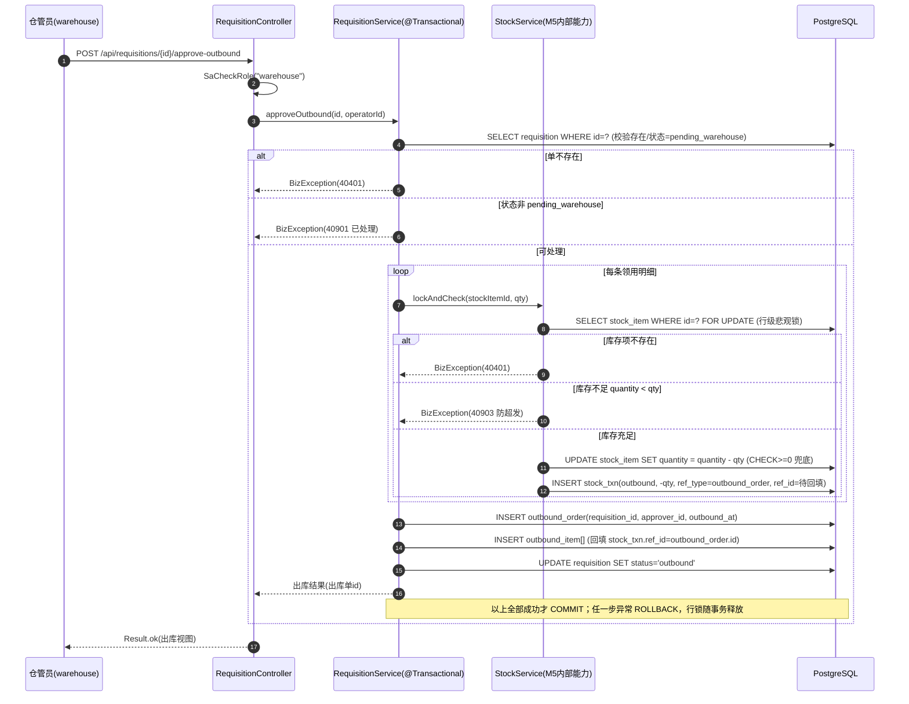
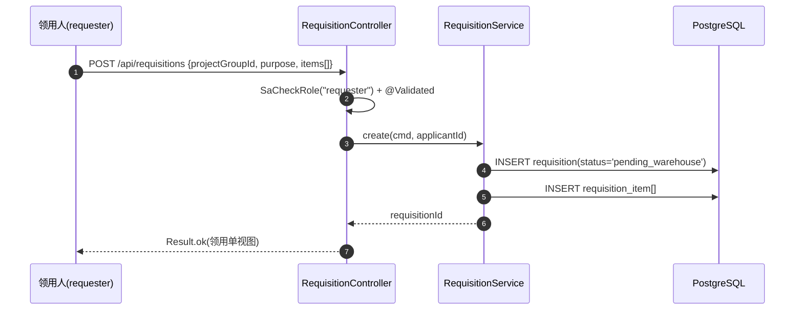
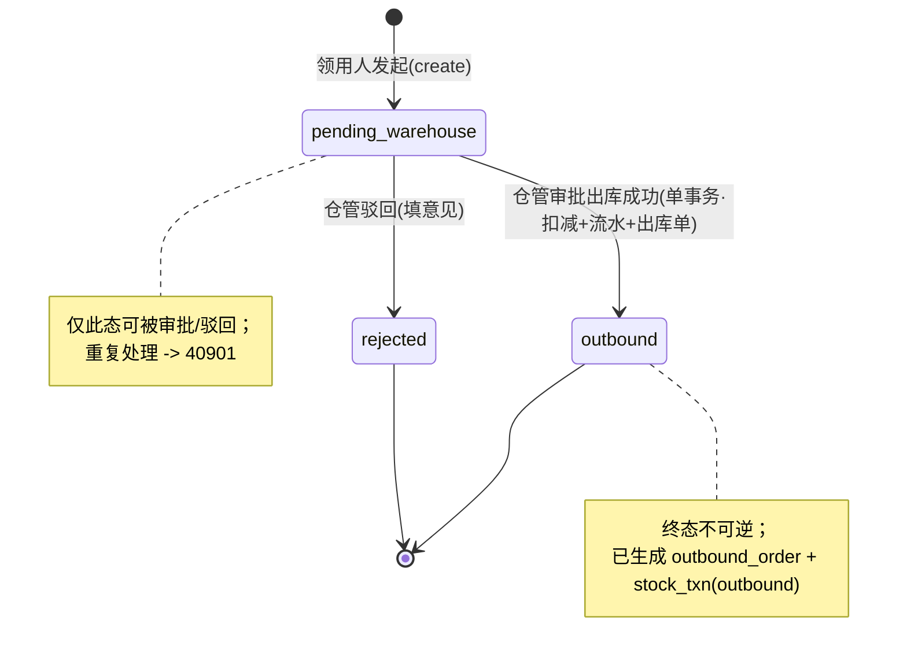

# U11 领用 + 仓管审批出库 · 详细设计

> 阶段三·详细设计产物 · 2026-06-05 · 草稿
> 上游：`tkxm-general`（`docs/design/general/procurement-general.md`）、`tkxm-database`（`docs/design/db/procurement-db.md`）、`tkxm-prototype`（`docs/prototype/index.html`）
> 下游：`tkxm-coding`（编码与单测）、`tkxm-review`（代码审查）
> 对应：功能点 **U11**、模块 **M6 领用与出库 + M5 库存（BC6/BC5）**、需求 **E1,E2,E3**、原型屏 `requisition` `outbound`

---

## 1. 概述

U11 实现「领用申请 → 仓管核库存审批出库（防超发）」闭环，对应原型 D 域 E1（`requisition` 发起领用）与 E2（`outbound` 仓管审批出库）两屏。

- **范围**：领用人发起领用单；仓管员查看待办、核对库存后审批出库或驳回；领用/出库查询。
- **核心价值**：出库**零超发**——审批出库在**单事务**内对库存项加**行级悲观锁**（`SELECT ... FOR UPDATE`）后校验、扣减、记流水、生成出库单、推进状态；库存不足直接拒绝。
- **领域归属**：领用单据（`requisition`/`requisition_item`/`outbound_order`/`outbound_item`）属 **M6（BC6）**；库存项与库存流水（`stock_item`/`stock_txn`）属 **M5（BC5）**，是库存唯一 SoR。M6 经 M5 的内部能力扣减库存，**不绕过 SoR 直接读写**（概要 §5）。
- **并发策略**：沿用概要 SEL-2 ADR——悲观行锁 `FOR UPDATE` + `stock_item.quantity` 的 `CHECK(quantity>=0)` 兜底，正确性优先（概要 §2.3.2、§7）。
- **依赖**：硬依赖 **U9（多次到货验收入库）**——出库前库存项须已由入库产生且 `quantity>0`。

> 通用响应/错误码/鉴权约定与 `U6-budget-import.md` §6 保持一致：统一 `Result<T>` 包装、`BizException` 业务异常、Sa-Token `@SaCheckRole` 角色校验。

---

## 2. 功能规约（SDD）

### 2.1 不变量（Invariant）

| # | 不变量 | 守护手段 |
|---|---|---|
| INV-1 | **库存不为负**：任一时刻 `stock_item.quantity >= 0` | 应用层行锁校验 + DB `CHECK(quantity>=0)` 兜底 |
| INV-2 | **不超发**：出库数量 `qty <= 当前库存`，绝不放行超出库存的出库 | `FOR UPDATE` 锁内重新读取并比对，不足即拒绝（40903） |
| INV-3 | **账实一致**：库存量变动必经 `stock_txn`，`quantity` 增减 = 流水累计 | 扣减与插流水在同一事务，`type=outbound`、`qty_change=-qty`、`ref_type=outbound_order` |
| INV-4 | **一领用单一出库单**：`outbound_order.requisition_id` 唯一 | DB `uk_ob_req(requisition_id)` + 状态机只允许 `pending_warehouse` 出库一次 |
| INV-5 | **状态单调**：`requisition.status` 仅 `pending_warehouse → outbound|rejected`，终态不可逆 | 处理前校验当前态，非待审即拒绝（40901） |

### 2.2 验收准则（Acceptance Criteria）

| AC | 描述 |
|---|---|
| AC-1 | 领用人发起领用：填物料(库存项)+数量(>0)+用途，生成 `requisition` + `requisition_item`，状态 `pending_warehouse`。 |
| AC-2 | 仓管查待办：返回所有 `status=pending_warehouse` 的领用单（含申请人、项目组、明细、当前库存）。 |
| AC-3 | 审批出库（库存充足）：单事务内行锁→校验→扣减→记流水→生成出库单/明细→`status=outbound`，全部成功提交。 |
| AC-4 | 审批出库（库存不足）：任一明细 `qty>当前库存`，整单拒绝（40903 防超发），不扣减、不改状态、事务回滚。 |
| AC-5 | 并发两笔出库竞争同一库存项：行锁串行化，仅库存足够的一笔成功，另一笔在锁释放后看到新值，不足则拒绝——合计不超发。 |
| AC-6 | 驳回：仓管对 `pending_warehouse` 单填写意见驳回，`status=rejected`；未填意见拒绝（42202）。 |
| AC-7 | 重复处理：对已 `outbound`/`rejected` 的单再次审批/驳回，拒绝（40901）。 |
| AC-8 | 鉴权：发起领用限 `requester`，审批出库/驳回限 `warehouse`，角色不符拒绝（40301）。 |

---

## 3. 时序设计（TDD/SDD）

### 3.1 审批出库（单事务：行锁 → 扣减 → 流水 → 状态）



> 实现要点：为避免「先建出库单才知道 ref_id」的回填，编码阶段（`tkxm-coding`）可调整为「先 INSERT outbound_order 拿到 id → 逐明细锁/扣减/插流水(ref_id=出库单id)/插出库明细」，时序语义等价、同一事务。

### 3.2 发起领用（简化）



---

## 4. 数据流与状态

### 4.1 领用单状态机



### 4.2 数据流与表写入

| 动作 | 写入表 | 关键字段 |
|---|---|---|
| 发起领用 | `requisition` | `status='pending_warehouse'`、`applicant_id`、`project_group_id`、`purpose` |
| | `requisition_item` | `stock_item_id`、`qty(>0)` |
| 审批出库 | `stock_item`（M5，锁内） | `quantity -= qty`（CHECK≥0） |
| | `stock_txn`（M5） | `type='outbound'`、`qty_change=-qty`、`ref_type='outbound_order'`、`ref_id=出库单id` |
| | `outbound_order` | `requisition_id`(唯一)、`approver_id`、`outbound_at` |
| | `outbound_item` | `stock_item_id`、`qty` |
| | `requisition`（M6） | `status='outbound'` |
| 驳回 | `requisition` | `status='rejected'`（意见记录见 §6.4，本期落在领用单驳回字段/审批记录，编码确认） |

---

## 5. 关键逻辑设计

### 5.1 悲观行锁防超发（INV-1/2，AC-3/4/5）

- 审批出库进入 `@Transactional(rollbackFor = Exception.class)`，事务隔离用 PostgreSQL 默认 `READ COMMITTED` 即可——`FOR UPDATE` 提供行级互斥，锁持有期间其他事务对同一行的 `FOR UPDATE`/`UPDATE` 阻塞至本事务提交/回滚。
- 对领用单每条明细的 `stock_item`，先 `SELECT ... FOR UPDATE` 重新取**锁内最新** `quantity`，再比对申请量：
  - `quantity < qty` → 抛 `BizException(40903, "库存不足，不可超发")`，事务回滚。
  - `quantity >= qty` → `UPDATE stock_item SET quantity = quantity - #{qty} WHERE id = #{id}`。
- DB `CHECK(quantity>=0)` 为兜底护栏：即便应用层逻辑被绕过，负库存的 UPDATE 也被数据库拒绝（触发约束异常 → 50000 或在编码层映射为 40903）。

> Mapper 示例（编码阶段实现）：`SELECT id, quantity FROM stock_item WHERE id = #{id} AND is_deleted = 0 FOR UPDATE`。逐项加锁；建议按 `stock_item_id` 升序加锁以避免多明细交叉造成的死锁。

### 5.2 扣减与流水（INV-3）

- 每次扣减必伴随一条 `stock_txn(type=outbound, qty_change=-qty)`，`ref_type='outbound_order'`、`ref_id=outbound_order.id`，保证「库存量 = 流水累计」可对账、天然审计（概要 §7 库存记账）。
- 出库单 `outbound_order` 与每条 `outbound_item` 同事务写入；`uk_ob_req` 保证一领用单仅一出库单（INV-4）。

### 5.3 单事务边界

- 审批出库的「行锁 → 校验 → 扣减 → 流水 → 出库单/明细 → 改状态」为**一个**应用层事务（M6 Service 编排，内部调用 M5 StockService 能力，同进程同事务，概要 §7 事务一致性）。
- 任一步抛异常 → 整体回滚，库存、流水、出库单、状态均不落库，行锁随事务释放。

---

## 6. 接口定义

> 统一前缀 `/api/requisitions`；统一 `Result<T>` 包装；鉴权 `@SaCheckRole`。错误码见 §7 约定。

### 6.1 发起领用 · `POST /api/requisitions`

- **鉴权**：`@SaCheckRole("requester")`
- **请求体**：
  ```json
  {
    "projectGroupId": 12,
    "purpose": "项目调试用",
    "items": [
      { "stockItemId": 1001, "qty": 3 }
    ]
  }
  ```
- **校验**：`projectGroupId` 必填；`items` 非空；每项 `stockItemId` 必填、`qty > 0`（`@Validated`，违反 → 40001）。
- **响应**：`Result<{ id, status }>`，`status='pending_warehouse'`。
- **错误**：40001 参数非法；40301 非 requester；50000 系统。

### 6.2 待办查询 · `GET /api/requisitions/todo`

- **鉴权**：`@SaCheckRole("warehouse")`
- **查询参数**：`projectGroupId?`、`page?`、`size?`（默认分页）。
- **响应**：`Result<Page<RequisitionTodoVO>>`，仅 `status=pending_warehouse`；每条含 `id`、`projectGroupName`、`applicantName`、`createdAt`、`items[]`（`materialName`、`qty`、`currentQuantity`、`enough` 核验标记，对应原型 `outbound` 屏「库存充足/不足」列）。
- **错误**：40301 非 warehouse；50000 系统。

### 6.3 审批出库 · `POST /api/requisitions/{id}/approve-outbound`

- **鉴权**：`@SaCheckRole("warehouse")`
- **路径参数**：`id` 领用单 id。
- **请求体**：无（或空对象）；审批人取登录态 `operatorId`。
- **处理**：§3.1 单事务（行锁→校验→扣减→流水→出库单→状态）。
- **响应**：`Result<{ requisitionId, outboundOrderId, status }>`，`status='outbound'`。
- **错误**：40301 非 warehouse；40401 领用单/库存项不存在；40901 状态不符（已处理）；40903 库存不足（防超发）；50000 系统。

### 6.4 驳回 · `POST /api/requisitions/{id}/reject`

- **鉴权**：`@SaCheckRole("warehouse")`
- **路径参数**：`id` 领用单 id。
- **请求体**：`{ "opinion": "库存紧张，暂缓" }`，`opinion` 必填非空白。
- **校验**：`opinion` 为空 → 42202（驳回未填意见）。
- **处理**：校验状态=pending_warehouse → `status='rejected'`，记录驳回意见。
- **响应**：`Result<{ requisitionId, status }>`，`status='rejected'`。
- **错误**：40301 非 warehouse；40401 不存在；40901 状态不符（已处理）；42202 未填意见；50000 系统。

### 6.5 查询 · `GET /api/requisitions` / `GET /api/requisitions/{id}`

- **鉴权**：`@SaCheckRole(value = {"requester", "warehouse"}, mode = SaMode.OR)`（领用人看本人/项目组，仓管看全部）。
- **列表参数**：`status?`、`projectGroupId?`、`applicantId?`、`page?`、`size?`。
- **响应**：
  - 列表：`Result<Page<RequisitionVO>>`（`id`、`status`、`applicantName`、`createdAt`、明细数）。
  - 详情：`Result<RequisitionDetailVO>`（领用单 + 明细 + 若已出库含 `outbound_order`/`outbound_item`）。
- **错误**：40301 角色不符；40401 详情 id 不存在；50000 系统。

> 接口总数：**5** 个（发起 / 待办 / 审批出库 / 驳回 / 查询）。

---

## 7. 测试点（T-x ↔ AC-x）

| T | 关联 AC | 场景 | 预期 |
|---|---|---|---|
| T-1 | AC-1 | requester 发起领用（qty>0、用途、单/多明细） | 201/Result.ok，`requisition` + `requisition_item` 落库，`status=pending_warehouse` |
| T-2 | AC-1 | 发起领用 qty<=0 或 items 为空 | 40001 参数非法，不落库 |
| T-3 | AC-2 | warehouse 查待办 | 仅返回 `pending_warehouse` 单，含明细与当前库存、enough 标记 |
| T-4 | AC-3 | 正常出库扣减：库存 40、申请 3 | `quantity` 40→37，插 1 条 `stock_txn(outbound,-3)`，生成出库单/明细，`status=outbound`，单事务提交 |
| T-5 | AC-4 | 库存不足拒绝：库存 2、申请 3 | 40903 防超发，`quantity` 不变、无流水、无出库单、`status` 仍 pending（事务回滚） |
| T-6 | AC-5 | 并发出库防超发：库存 2，两请求各申请 2 | 一笔成功(quantity→0)、另一笔 40903；合计扣减不超 2，无负库存 |
| T-7 | AC-5/INV-1 | CHECK 兜底：构造直减至负 | DB `CHECK(quantity>=0)` 拒绝，事务回滚 |
| T-8 | AC-6 | 驳回填意见 | `status=rejected`，意见落库 |
| T-9 | AC-6 | 驳回未填意见 | 42202，状态不变 |
| T-10 | AC-7 | 重复处理：对已 outbound/rejected 单再审批或驳回 | 40901 状态不符，无副作用 |
| T-11 | AC-7/INV-4 | 同一领用单二次出库 | 40901（状态已变）/ `uk_ob_req` 兜底唯一，不生成第二张出库单 |
| T-12 | AC-8 | 角色越权：非 requester 发起 / 非 warehouse 审批 | 40301 角色不符 |
| T-13 | AC-3 | 库存项不存在（明细引用已删/错误 id） | 40401 不存在，事务回滚 |

> 并发用例（T-6）建议用两线程 + `CountDownLatch` 触发同时进入 `approve-outbound`，或 Testcontainers PostgreSQL 验证 `FOR UPDATE` 真锁行为（单测/集成测在 `tkxm-coding` 落地，`tkxm-review` 复核覆盖）。

---

## 8. 异常处理

| 场景 | 错误码 | HTTP | 事务 | 说明 |
|---|---|---|---|---|
| 入参非法（qty<=0、items 空、必填缺失） | 40001 | 400 | 不开启/无副作用 | `@Validated` → `MethodArgumentNotValidException` → 统一处理 |
| 角色不符 / 无权限 | 40301 | 403 | — | Sa-Token `NotRoleException` 或显式 `BizException(40301)` |
| 领用单 / 库存项不存在 | 40401 | 400 | 回滚 | 查无记录抛 `BizException(40401)` |
| 状态不符（已处理） | 40901 | 400 | 回滚 | 非 `pending_warehouse` 拒绝重复处理 |
| 库存不足（防超发） | 40903 | 400 | **回滚** | 锁内校验不足；CHECK 兜底异常亦映射至此语义 |
| 驳回未填意见 | 42202 | 400 | 回滚 | `opinion` 空白校验 |
| 系统异常 | 50000 | 500 | 回滚 | 兜底，不泄露堆栈 |

- 审批出库 Service 标注 `@Transactional(rollbackFor = Exception.class)`，任一 `BizException` 或 DB 约束异常触发**整单回滚**：库存量、流水、出库单/明细、状态全部不落库，`FOR UPDATE` 行锁随事务结束释放，不留悬挂锁。
- 错误码经 `GlobalExceptionHandler` 统一转 `Result.error(code, message)`（与 `U6-budget-import.md` §6 一致）。

---

## 9. 依赖与影响

### 9.1 依赖

| 类型 | 对象 | 说明 |
|---|---|---|
| 硬依赖 | **U9 多次到货验收入库** | 出库前库存项须已由入库产生，`stock_item.quantity>0`；无库存项即 40401 |
| 模块依赖 | **M5 库存（BC5）** | M6 经 M5 内部能力 `lockAndCheck`/`deduct` 扣减库存、写流水；库存项为 M5 SoR，M6 不绕过直写 |
| 共享内核 | **M1（BC1）** | 当前登录用户（applicant_id/approver_id）、角色校验、项目组归属 |
| 基础设施 | `Result`/`BizException`/`GlobalExceptionHandler`、Sa-Token、MyBatis-Plus | 脚手架 common 类 |

### 9.2 影响

- **写 M5**：审批出库扣减 `stock_item.quantity`、新增 `stock_txn(outbound)`，影响 U10（库存查询+流水）展示与 U12（盘点）账面数。
- **生成单据**：`outbound_order`/`outbound_item`，供出库查询与后续审计。
- **无环依赖**：M6→M5 单向（概要 §5 DAG），不引入循环。

---

## 10. 待确认（TBD）

| 编号 | 待确认项 | 现状/暂定 | 拍板人 |
|---|---|---|---|
| TBD-1 | **库存聚合粒度**（继承 ER/DB TBD-1） | 暂定 `物料名 + 项目组`（`uk_stock`），不按批次/序列号；影响领用明细如何定位唯一库存项 | 业务 |
| TBD-2 | 驳回意见落库位置 | 暂定落领用单驳回字段或复用审批记录投影；M6 当前表无独立 reject_opinion 列，编码阶段（`tkxm-coding`）确认是否加列 | 技术/业务 |
| TBD-3 | 多明细加锁顺序与死锁规避 | 暂定按 `stock_item_id` 升序加锁；高并发下评估批量锁或乐观锁切换 | 技术 |

> TBD 数：**3**。

---

> 完成后进入 `tkxm-coding`（编码与单测）实现本设计，`tkxm-review` 复核库存零超发与单事务边界。
