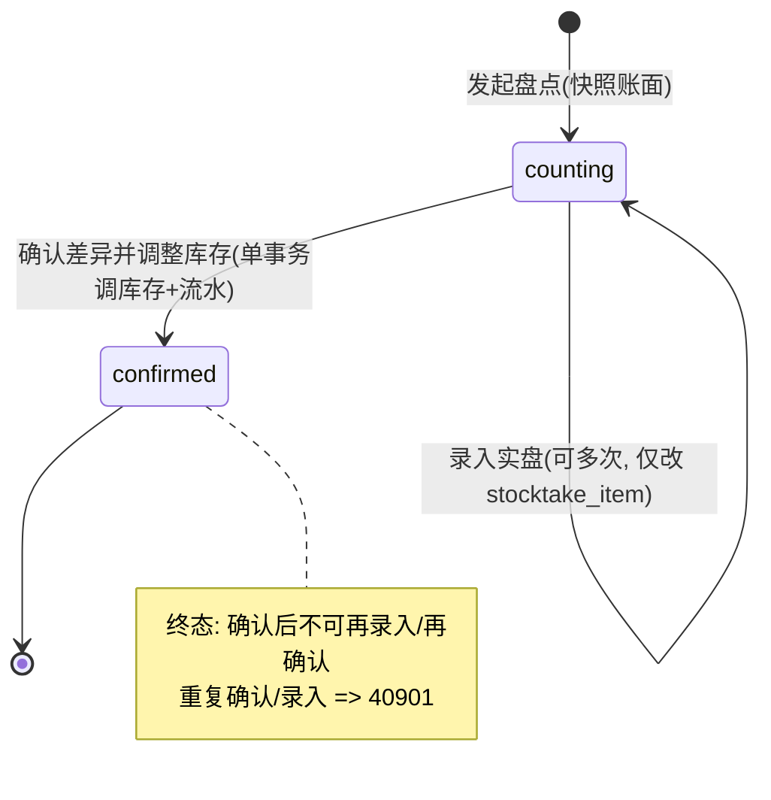

# U12 盘点 + 差异调整库存 · 详细设计

> 阶段三·详细设计产物 · 创建日期：2026-06-05 · 状态：草稿
> 上游：`tkxm-general`（`docs/design/general/procurement-general.md` §4.1 M5 盘点契约 / §3 库存记账时序 / §7 横切（事务一致性 / 库存记账））、`tkxm-database`（`docs/design/db/procurement-db.md` §3.5 stocktake/stocktake_item/stock_item/stock_txn、§5 diff_type 枚举）、`tkxm-prototype`（`docs/prototype/index.html` 屏 `stocktake`）
> 下游：`tkxm-coding`（编码与单测）、`tkxm-review`（代码审查）
> 对应：功能点 **U12 盘点 + 差异调整库存**、模块 **M5 库存与资产（BC5）**、需求 **F1,F2**、原型屏 `stocktake`
> 通用响应 / 错误码 / 鉴权约定与 `U6-budget-import.md` §6 一致（同一套 `Result<T>` / `BizException` / `GlobalExceptionHandler` / Sa-Token）。库存写入模式承接 `U9-inbound.md` §4.2/§5.2/§5.3（库存项是 BC5 SoR，数量仅经流水变更）。

---

## 1. 概述

U12 实现「盘点 → 录入实盘 → 确认差异并调整库存」：仓管员对某项目组（盘点范围）发起盘点，系统**快照**该范围下各库存项的账面数（`book_qty`）生成盘点清单；仓管员逐项录入实盘数（`actual_qty`）；确认时在**单事务**内逐 `stocktake_item` 把对应 `stock_item.quantity` 调整到实盘数，并为每个有差异的库存项插入一条 `stock_txn`（盘盈 `gain` / 盘亏 `loss`，`ref_type=stocktake`），盘点单状态由 `counting → confirmed`，确认后不可再改。

库存的唯一记账入口仍为 M5：调整经库存项行锁 + 流水记账（不绕过 SoR，见 general §5 / ER D-5）。差异调整属库存「绝对值校正」——与 U9（入库 `+`）/ U11（出库 `-`）的「增量」不同，盘点把 `quantity` 直接置为 `actual_qty`，流水 `qty_change` 记录这一校正的增减量（`actual_qty - 调整时库内当前 quantity`）。

- **范围内**：发起盘点（快照账面）、录入实盘、确认调整（调库存 + 记流水 + 状态机）、盘点单 / 明细查询。
- **不在范围内**：库存查询与流水浏览（U10）、入库（U9）/ 出库（U11）写库存、资产折旧（`asset_no/original_value/life_status` 预留）、盘点期间冻结库存（见 §10 TBD-2）。
- **角色与权限**：仓管员（`@SaCheckRole("warehouse")`）。
- **依赖**：硬依赖 **U9**（库存项与库存流水的写入模式 / SoR；盘点对象 = U9 入库形成的 `stock_item`）；与 **U10 / U11** 并行（共享 M5 库存 SoR）。

---

## 2. 功能规约（SDD · 先定规约）

> 规约为本功能点唯一事实源，§6 接口契约与 §7 测试点皆由它派生。

### 2.1 意图

在已有库存项的前提下，仓管员对一个项目组发起盘点并录入实盘后，确认时使该范围内每个库存项的 `quantity` 等于其实盘数，且每笔差异留有可审计的盘盈 / 盘亏流水；确认后盘点单冻结不可改。

### 2.2 命令与前置 / 后置条件

**C1 发起盘点 `发起盘点(scopeProjectGroupId)`**
- 前置：P1 调用方具 `warehouse` 角色（否则 40301）；P2 `scopeProjectGroupId` 对应项目组存在未删（否则 40401）。
- 后置：Q1 生成 1 张 `stocktake`（`status=counting`、`scope_project_group_id`）；Q2 对该项目组下所有未删 `stock_item`，**逐个**生成 1 条 `stocktake_item`，`book_qty` = 快照时点 `stock_item.quantity`、`actual_qty` 初始化 = `book_qty`、`diff=0`、`diff_type=none`；Q3 整批在同一事务内提交。

**C2 录入实盘 `录入实盘(stocktakeId, items[])`**
- 前置：P3 盘点单存在（否则 40401）且 `status=counting`（已确认 → 40901）；P4 每条 `stocktakeItemId` 属于该盘点单（否则 40401）；P5 每条 `actualQty ≥ 0`（否则 42204）。
- 后置：Q4 更新对应 `stocktake_item.actual_qty`；Q5 重算 `diff = actual_qty - book_qty`、`diff_type`（>0 → gain，<0 → loss，=0 → none）；Q6 不触碰 `stock_item`（实盘只录账，不调库存）。

**C3 确认调整 `确认调整(stocktakeId)`**
- 前置：P6 盘点单存在（否则 40401）且 `status=counting`（已确认 → 40901，幂等拒绝重复确认）。
- 后置：在**同一事务**内：Q7 对每条 `stocktake_item`，若 `diff_type != none`，把对应 `stock_item.quantity` 置为该明细 `actual_qty`，并插 1 条 `stock_txn`（`type=diff_type(gain/loss)`、`qty_change = actual_qty - 调整时库内当前 quantity`、`ref_type=stocktake`、`ref_id=stocktakeId`）；`diff_type=none` 的明细不调库存、不记流水；Q8 置 `stocktake.status=confirmed`；Q9 Q7–Q8 单事务提交，任一步失败整体回滚。

### 2.3 不变量

- INV-1：对任一 `stocktake_item`，恒有 `diff == actual_qty - book_qty` 且 `diff_type` 与 `diff` 符号一致（`gain↔>0 / loss↔<0 / none↔=0`）。
- INV-2：确认成功后，对每条 `stocktake_item` 对应的 `stock_item`，恒有 `quantity == actual_qty` 且 `quantity ≥ 0`（DB `CHECK (quantity >= 0)` 兜底）。
- INV-3：`stock_item.quantity == 该库存项所有 stock_txn.qty_change 之和`（库存 = 流水累计；盘点差异同样经流水记账，账实可对账，ER D-5）。
- INV-4：盘点单一旦 `confirmed` 不可再录入 / 再确认（`counting → confirmed` 单向终态）。

### 2.4 验收准则（AC-x ↔ §7 T-x）

| 编号 | Given | When | Then |
|---|---|---|---|
| AC-1 | 项目组下有 N 个库存项 | 发起盘点 | 返回 stocktakeId，`status=counting`，生成 N 条 `stocktake_item`，`book_qty`=各库存项当时 `quantity`，`actual_qty=book_qty`，`diff=0`，`diff_type=none` |
| AC-2 | 盘点单 counting，某项实盘 > 账面 | 录入实盘 | `diff=actual-book>0`，`diff_type=gain`，`stock_item` 不变 |
| AC-3 | 盘点单 counting，某项实盘 < 账面 | 录入实盘 | `diff<0`，`diff_type=loss`，`stock_item` 不变 |
| AC-4 | 盘点单 counting，实盘 = 账面 | 录入实盘 | `diff=0`，`diff_type=none` |
| AC-5 | 盘点单 counting，含盘盈 / 盘亏 / 无差异各若干 | 确认调整 | 各 `stock_item.quantity` = 对应 `actual_qty`；盘盈 / 盘亏项各插 1 条 `gain/loss` 流水（`ref=stocktake`）；无差异项不调不记；盘点单 `confirmed` |
| AC-6 | 盘点单已 confirmed | 再次录入实盘 / 再次确认 | 拒绝，40901，无任何写入 |
| AC-7 | 录入实盘 `actualQty < 0` | 录入实盘 | 拒绝，42204，无写入 |
| AC-8 | 调用方非 warehouse 角色 | 任一接口 | 拒绝，40301 |
| AC-9 | 确认后 | 对账 | 每个调整库存项 `quantity == Σ stock_txn.qty_change`，且 `quantity == actual_qty` |

---

## 3. 处理流程与时序（发起快照 → 录入实盘 → 确认单事务调库存 + 流水）

```mermaid
sequenceDiagram
    autonumber
    participant W as 仓管员(屏 stocktake)
    participant C as StocktakeController
    participant S as StocktakeService(M5)
    participant K as StockService(M5)
    participant DB as PostgreSQL
    W->>C: POST /api/stocktakes(scopeProjectGroupId)
    C->>C: 鉴权 @SaCheckRole("warehouse")
    C->>S: createStocktake(cmd)
    Note over S,DB: 单事务 @Transactional
    S->>DB: 校验 project_group 存在
    S->>DB: select stock_item(scope, is_deleted=0) 快照账面
    S->>DB: insert stocktake(status=counting)
    loop 每个库存项
        S->>DB: insert stocktake_item(book_qty=quantity, actual_qty=book_qty, diff=0, none)
    end
    S-->>C: stocktakeId
    C-->>W: Result.ok({stocktakeId})

    W->>C: PUT /api/stocktakes/{id}/items(实盘[])
    C->>S: saveActuals(id, items)
    S->>DB: 校验 stocktake 存在且 counting(否则 40901)
    loop 每条实盘
        S->>S: 校验 actualQty>=0(否则 42204)
        S->>S: diff=actual-book; diff_type=sign(diff)
        S->>DB: update stocktake_item(actual_qty, diff, diff_type)
    end
    S-->>C: ok
    C-->>W: Result.ok

    W->>C: POST /api/stocktakes/{id}/confirm
    C->>S: confirm(id)
    Note over S,DB: 单事务 @Transactional
    S->>DB: select stocktake FOR UPDATE(校验 counting, 否则 40901)
    S->>DB: select stocktake_item(本单全部)
    loop 每条 diff_type != none
        S->>K: adjustTo(stock_item_id, actual_qty, ref=stocktake, id)
        K->>DB: select stock_item FOR UPDATE
        K->>DB: update stock_item.quantity = actual_qty
        K->>DB: insert stock_txn(gain/loss, qty_change=actual-当前, ref=stocktake)
    end
    S->>DB: update stocktake.status='confirmed'
    Note over S,DB: 提交(任一步异常整体回滚)
    S-->>C: ok
    C-->>W: Result.ok({status:"confirmed"})
```

**关键步骤说明**：① 发起时**单事务**快照账面 + 批量建明细（事务边界包住 stocktake + N 条 stocktake_item）。② 录入实盘仅写 `stocktake_item`，不触碰库存（账面快照与库存解耦，见 §5.3）。③ 确认是核心事务边界：先对盘点单行锁校验 `counting`（防并发重复确认），再逐项对 `stock_item` 行锁、置数到实盘、插 `gain/loss` 流水，最后翻状态；任一步异常整体回滚。

---

## 4. 数据流与状态

### 4.1 读写表

| 表 | 读 / 写 | 用途 | 关键列 |
|---|---|---|---|
| `project_group` | 读 | 校验盘点范围存在 | id |
| `stock_item` | 读（发起快照）/ 写（确认置数） | 快照 `book_qty`；确认时 `quantity = actual_qty` | quantity, project_group_id, is_deleted |
| `stocktake` | 写 | 盘点单聚合根，状态 counting→confirmed | scope_project_group_id, status |
| `stocktake_item` | 写 | 账实差异明细 | book_qty, actual_qty, diff, diff_type |
| `stock_txn` | 写（确认时） | 盘盈 / 盘亏记账（事件，不软删） | type(gain/loss), qty_change, ref_type=stocktake, ref_id |

### 4.2 字段映射

| 来源 | → 字段 | 说明 |
|---|---|---|
| 发起请求 `scopeProjectGroupId` | `stocktake.scope_project_group_id` | 盘点范围 |
| 快照时点 `stock_item.quantity` | `stocktake_item.book_qty` | 账面数（快照） |
| 录入请求 `items[].actualQty` | `stocktake_item.actual_qty` | 实盘数（`≥0`） |
| 计算 | `stocktake_item.diff` | `= actual_qty - book_qty` |
| 计算 | `stocktake_item.diff_type` | `diff>0→gain / diff<0→loss / diff=0→none`（DB §5 枚举） |
| 确认计算 | `stock_txn.qty_change` | `= actual_qty - 调整时库内当前 quantity`（带正负） |

### 4.3 盘点单状态机（stocktake.status）



| 来源状态 | 事件 | 目标状态 | 守卫条件 |
|---|---|---|---|
| (无) | 发起盘点 | counting | 项目组存在；快照成功生成明细 |
| counting | 录入实盘 | counting | 盘点单 counting；`actualQty≥0` |
| counting | 确认调整 | confirmed | 盘点单 counting（行锁校验）；逐项调库存 + 流水成功 |
| confirmed | 录入 / 确认 | （拒绝） | 终态不可变，返回 40901 |

---

## 5. 关键逻辑与算法

### 5.1 差异计算（INV-1 / AC-2~4）

- 录入实盘时对每条明细：`diff = actualQty - book_qty`；`diff_type = diff > 0 ? "gain" : (diff < 0 ? "loss" : "none")`（`NUMERIC(18,3)` 精度比较，避免浮点）。
- `book_qty` 取**发起快照时**的值，录入阶段不重读 `stock_item`（账面以快照为准，见 §5.3）。
- `diff` 与 `diff_type` 始终成对落库，保证 INV-1；查询 / 导出据此渲染原型 `stocktake` 的「差异 / 类型」列（盘盈 `+5` / 盘亏 `-2`）。

### 5.2 确认时单事务逐项调整 + 流水（AC-5 / AC-9 / INV-2/3）

```text
confirm(stocktakeId):
  st = select stocktake where id=stocktakeId FOR UPDATE
  if st is null: throw BizException(40401)
  if st.status != 'counting': throw BizException(40901)   // 幂等防重复确认
  items = select stocktake_item where stocktake_id=stocktakeId
  for it in items:
     if it.diff_type == 'none': continue                   // 无差异不调不记
     si = select stock_item where id=it.stock_item_id FOR UPDATE
     change = it.actual_qty - si.quantity                  // 校正增减量(带正负)
     si.quantity = it.actual_qty                           // 绝对值置数(CHECK>=0 兜底)
     insert stock_txn(stock_item_id=si.id, type=it.diff_type,
                      qty_change=change, ref_type='stocktake', ref_id=stocktakeId)
  st.status = 'confirmed'
  // 单事务提交; 任一步异常 -> 整体回滚
```

- **绝对值置数 vs 增量**：盘点是账实校正，`quantity` 直接置为 `actual_qty`（不是 `+= diff`）。`qty_change` 用「实盘 − 调整时库内当前 quantity」而非「实盘 − book_qty」——若盘点期间库存被 U9/U11 改动（未冻结，TBD-2），以调整时点实际值计算流水，保证 INV-3（`quantity == Σ qty_change`）严格成立；此时实际校正量可能与录入时的 `diff` 不同（见 §5.4 并发）。
- `diff_type=none` 的明细跳过，既不写 `stock_item` 也不写 `stock_txn`（无差异零副作用）。
- 每个有差异库存项**恰好一条**流水，`type` 取 `gain/loss`（与 `diff_type` 一致），`ref_type=stocktake`、`ref_id=stocktakeId`，作为 M5 审计与对账依据（general §7）。

### 5.3 账面快照时点（book_qty 语义）

- `book_qty` 在**发起盘点**那一刻从 `stock_item.quantity` 快照，写入 `stocktake_item` 后不再随库存变动刷新。理由：盘点是「某时点账实核对」，账面须固定为基线，否则 `diff` 无意义。
- 副作用：发起到确认之间若库存被入库 / 出库改动，确认时按「调整时库内当前值」计算 `qty_change`（§5.2），可能与录入时 `diff` 不一致。是否在盘点期间冻结库存（拒绝 U9/U11 写该范围）属 **TBD-2**，本期不冻结、以确认时点实际值为准记账。

### 5.4 并发与事务

- **确认幂等 / 防重复**：`confirm` 先 `SELECT ... FOR UPDATE` 锁盘点单并校验 `status=counting`，并发的第二次确认会被行锁串行化后看到 `confirmed` 而抛 40901，杜绝重复调库存 / 重复流水。
- **库存行锁**：逐项 `SELECT stock_item ... FOR UPDATE`，与 U9 入库 / U11 出库对同一库存项的并发写串行化（general §7 并发控制：行锁 + `CHECK(quantity>=0)`）。
- **置数与超发**：盘点置数为绝对值，若实盘数 `≥0`（P5 保证）则 `quantity` 不会为负，CHECK 兜底；不存在「超发」语义，但若并发出库使库存低于实盘录入预期，仍以实盘绝对值校正（账实以盘点为准）。
- **事务边界**：`StocktakeService.confirm` 标注 `@Transactional(rollbackFor = Exception.class)`，覆盖逐项调库存 + 插流水 + 翻状态；M5 内部 `adjustTo` 同进程同步、同事务（传播 `REQUIRED`），不开新事务、不远程调用。发起 `createStocktake` 同样单事务（快照 + 批量建明细）。

---

## 6. 接口定义

> 统一前缀 `/api`；统一返回 `Result<T>`（`code=0` 成功，非 0 为错误码，见 `U6-budget-import.md` §6）；鉴权 Sa-Token，三个写接口均 `@SaCheckRole("warehouse")`。错误码全集见 §7 引言。共 **3** 个接口。

**本功能错误码全集**

| code | HTTP | 含义 | 触发 |
|---|---|---|---|
| 0 | 200 | 成功 | — |
| 40001 | 400 | 参数错误 | 入参缺失 / 非法（如缺 scopeProjectGroupId、items 为空） |
| 40301 | 403 | 无权限 | 非 `warehouse` 角色 |
| 40401 | 404 | 盘点单 / 库存项不存在 | stocktakeId / 项目组 / stocktakeItemId / stock_item 查无 |
| 40901 | 409 | 状态不符 | 盘点单已 `confirmed`，不可再录入 / 再确认 |
| 42204 | 422 | 实盘数为负 | `actualQty < 0` |
| 50000 | 500 | 系统错误 | 未预期异常 |

### 6.1 发起盘点

| 项 | 内容 |
|---|---|
| 方法 / 路由 | `POST /api/stocktakes` |
| 鉴权 | `@SaCheckRole("warehouse")` |
| 幂等 | 否（每次发起生成新盘点单） |

**请求体** `CreateStocktakeCmd`

| 字段 | 类型 | 必填 | 校验 | 说明 |
|---|---|---|---|---|
| `scopeProjectGroupId` | long | 是 | `@NotNull`，>0，存在未删 | 盘点范围（按项目组）|

**响应** `Result<CreateStocktakeVO>`

| 字段 | 类型 | 说明 |
|---|---|---|
| `stocktakeId` | long | 新建盘点单 id |
| `status` | string | `counting` |
| `items[].stocktakeItemId` | long | 盘点明细 id |
| `items[].stockItemId` | long | 库存项 id |
| `items[].materialName` | string | 物料名 |
| `items[].bookQty` | decimal | 快照账面数 |

```json
// 请求
{ "scopeProjectGroupId": 12 }
// 响应
{ "code": 0, "message": "ok",
  "data": { "stocktakeId": 3001, "status": "counting",
    "items": [ { "stocktakeItemId": 8001, "stockItemId": 9001, "materialName": "试剂盒", "bookQty": 40 } ] } }
```

错误：40001 / 40301 / 40401（项目组不存在）/ 50000。

### 6.2 录入实盘

| 项 | 内容 |
|---|---|
| 方法 / 路由 | `PUT /api/stocktakes/{id}/items` |
| 鉴权 | `@SaCheckRole("warehouse")` |
| 幂等 | 是（同 id + 同实盘数重复提交结果一致，counting 内可多次修订）|

**路径参数**：`id`（盘点单 id）。**请求体** `SaveActualsCmd`

| 字段 | 类型 | 必填 | 校验 | 说明 |
|---|---|---|---|---|
| `items` | array | 是 | 非空 | 实盘录入项 |
| `items[].stocktakeItemId` | long | 是 | >0，属本盘点单 | 盘点明细 id |
| `items[].actualQty` | decimal(18,3) | 是 | `≥0`（否则 42204）| 实盘数 |

**响应** `Result<SaveActualsVO>`

| 字段 | 类型 | 说明 |
|---|---|---|
| `items[].stocktakeItemId` | long | 明细 id |
| `items[].diff` | decimal | `actual - book` |
| `items[].diffType` | string | `gain/loss/none` |

```json
// 请求
{ "items": [ { "stocktakeItemId": 8001, "actualQty": 38 }, { "stocktakeItemId": 8002, "actualQty": 105 } ] }
// 响应
{ "code": 0, "message": "ok",
  "data": { "items": [ { "stocktakeItemId": 8001, "diff": -2, "diffType": "loss" },
                       { "stocktakeItemId": 8002, "diff": 5, "diffType": "gain" } ] } }
```

错误：40001 / 40301 / 40401（盘点单 / 明细不存在）/ 40901（已确认不可改）/ 42204（实盘数为负）/ 50000。

### 6.3 确认调整

| 项 | 内容 |
|---|---|
| 方法 / 路由 | `POST /api/stocktakes/{id}/confirm` |
| 鉴权 | `@SaCheckRole("warehouse")` |
| 幂等 | 是（已 confirmed 再确认返回 40901，不重复调库存）|

**路径参数**：`id`（盘点单 id）。无 body。

**响应** `Result<ConfirmStocktakeVO>`

| 字段 | 类型 | 说明 |
|---|---|---|
| `stocktakeId` | long | 盘点单 id |
| `status` | string | `confirmed` |
| `adjustedCount` | int | 实际调整的库存项数（`diff_type != none`）|
| `items[].stockItemId` | long | 被调整库存项 id |
| `items[].quantity` | decimal | 调整后库存（= actual_qty）|
| `items[].txnType` | string | `gain/loss`（无差异项不返回）|

```json
// 响应
{ "code": 0, "message": "ok",
  "data": { "stocktakeId": 3001, "status": "confirmed", "adjustedCount": 2,
    "items": [ { "stockItemId": 9001, "quantity": 38, "txnType": "loss" },
               { "stockItemId": 9002, "quantity": 105, "txnType": "gain" } ] } }
```

错误：40301 / 40401（盘点单不存在）/ 40901（已确认）/ 50000。

---

## 7. 测试点（T-x ↔ AC-x）

| 编号 | 类型 | 关联 AC | 场景 | 预期 |
|---|---|---|---|---|
| T-1 | 正常 | AC-1 | 对有 N 个库存项的项目组发起盘点 | 返回 stocktakeId，`status=counting`；生成 N 条 `stocktake_item`，`book_qty`=各库存项当时 quantity，`actual_qty=book_qty`，`diff=0`，`diff_type=none` |
| T-2 | 正常 | AC-2 | 录入实盘 > 账面（38→… 实盘 105，账面 100）| `diff=+5`，`diff_type=gain`，`stock_item.quantity` 不变 |
| T-3 | 正常 | AC-3 | 录入实盘 < 账面（账面 40，实盘 38）| `diff=-2`，`diff_type=loss`，`stock_item` 不变 |
| T-4 | 边界 | AC-4 | 录入实盘 = 账面 | `diff=0`，`diff_type=none` |
| T-5 | 正常 | AC-5/AC-9 | 含盘盈 / 盘亏 / 无差异混合，确认 | 各 `stock_item.quantity` = 对应 `actual_qty`；盘盈 / 盘亏各插 1 条 `gain/loss` 流水（`ref_type=stocktake`,`ref_id`=盘点单）；无差异项不调不记；盘点单 `confirmed`；`adjustedCount` = 有差异项数 |
| T-6 | 状态机 | AC-6 | 已 confirmed 后再录入实盘 | 40901，`stocktake_item` 不变 |
| T-6b | 状态机 | AC-6 | 已 confirmed 后再确认 | 40901，库存 / 流水不重复写入（幂等）|
| T-7 | 异常 | AC-7 | 录入 `actualQty=-1` | 42204，无写入 |
| T-8 | 权限 | AC-8 | 非 warehouse 角色调用三接口任一 | 40301，无写入 |
| T-9 | 异常 | AC-1 | 发起盘点项目组不存在 / 确认盘点单不存在 | 40401，无写入 |
| T-10 | 记账对账 | AC-9/INV-3 | 确认后对账 | 每个调整库存项 `quantity == Σ stock_txn.qty_change` 且 `quantity == actual_qty`；`qty_change` 符号与 `diff_type` 一致 |
| T-11 | 并发 | INV-4/§5.4 | 两请求并发确认同一盘点单 | 仅一次生效调库存 + 流水，另一次 40901（行锁串行化）|
| T-12 | 并发 | §5.3/§5.4 | 发起后、确认前库存被 U9/U11 改动 | 确认按调整时库内当前值算 `qty_change`，`quantity` 最终 = `actual_qty`，INV-3 仍成立 |

- 覆盖目标：状态机三态转移、差异三类（gain/loss/none）、确认事务全或无、并发重复确认幂等全覆盖。
- Mock：`stock_item` / `stock_txn` 以集成测试（真实事务 + 行锁）验证记账与并发；纯算法（diff / diff_type）独立单测。

---

## 8. 异常处理

| 场景 | 错误码 | 处理策略 | 返回 / 影响 |
|---|---|---|---|
| 参数缺失 / `items` 为空 | 40001 | `@Validated` + 服务层校验 | 不进业务，事务未开启 |
| 非 `warehouse` 角色 | 40301 | Sa-Token `@SaCheckRole` 拦截 → `GlobalExceptionHandler` | `Result.error(40301)`，无写入 |
| 项目组 / 盘点单 / 明细 / 库存项不存在 | 40401 | 服务层查不到，抛 `BizException(40401)` | 事务回滚，无写入 |
| 盘点单已 `confirmed` 再录入 / 再确认 | 40901 | 状态守卫（确认时 `FOR UPDATE` 后校验）抛 `BizException(40901)` | 拒绝，无重复调库存 / 流水（幂等）|
| 实盘数 `actualQty < 0` | 42204 | 服务层校验抛 `BizException(42204)` | 事务回滚，无写入 |
| 确认时 DB `CHECK(quantity>=0)` 违例（兜底）| 42204 / 50000 | 捕获 PG `23514` 约束违例 | 整事务回滚（理论上 P5 已保证 `actualQty≥0`，此为绕过兜底）|
| 确认事务中途任一步失败 | 50000 | `@Transactional(rollbackFor=Exception.class)` | **整体回滚**：不留「部分调整」——已调的库存 / 已插流水 / 状态翻转一并撤销，盘点单仍 `counting` 可重试 |
| 其他未预期异常 | 50000 | `GlobalExceptionHandler` 兜底，脱敏日志 + 链路 ID | `Result.error(50000)`，回滚 |

- **回滚一致性**：确认是全或无——不存在「调了一半库存就翻状态」的中间态；失败后盘点单保持 `counting`，可修正后重新确认。
- **可观测**：确认成功记录 `stocktakeId / adjustedCount / 各库存项 qty_change` 审计日志；库存流水（`gain/loss`）本身即业务审计流水（general §7）。

---

## 9. 依赖与影响

| 维度 | 内容 |
|---|---|
| **硬依赖** | **U9 多次到货验收入库**：盘点对象 = U9 入库形成的 `stock_item`；复用其库存写入模式（行锁 + 流水记账 + `CHECK(quantity>=0)`，见 `U9-inbound.md` §4.2/§5.2/§5.3）|
| **并行（共享 SoR）** | **U10 库存查询 + 流水**（读 `stock_item`/`stock_txn`，本功能写入的 `gain/loss` 流水在 U10 可见）；**U11 领用 + 审批出库**（与盘点对同一 `stock_item` 并发，行锁串行化；冻结与否见 TBD-2）|
| **写入模块** | **M5 库存（BC5）**：经内部能力 `adjustTo` 置数 `stock_item.quantity` + 插 `stock_txn`，不绕过 SoR |
| **关联模块** | M1（鉴权 `warehouse`；项目组校验）|
| **数据表** | 写：`stocktake`、`stocktake_item`、`stock_item`（确认置数）、`stock_txn`（确认记账）；读：`project_group`、`stock_item`（发起快照）|
| **不变量护栏** | DB `CHECK(quantity>=0)`；盘点单状态守卫（`counting→confirmed` 单向终态 + 确认行锁幂等）|
| **影响面** | 不改 U9/U10/U11 既有逻辑；新增 M5 盘点能力，复用现有库存流水表 / 记账入口；无数据迁移 |

---

## 10. 待确认（TBD）

| 编号 | 待确认项 | 现状 / 暂定 | 拍板人 |
|---|---|---|---|
| TBD-1 | 账面快照 vs 实时账面（`book_qty` 取发起时点快照，还是确认时实时重读）| 暂定**发起时点快照**为账实核对基线；确认按调整时库内当前值算 `qty_change`（§5.2/§5.3），二者不一致时以实盘绝对值校正库存 | 业务 |
| TBD-2 | 盘点期间是否冻结库存（counting 期间拒绝 U9 入库 / U11 出库写该范围）| 暂定**不冻结**：盘点与入 / 出库并发，确认时以实际库内值记账、置数到实盘；若业务要求严格账实一致再引入范围级冻结 | 业务 |

> TBD 数：**2**（TBD-1 账面快照 vs 实时、TBD-2 盘点期间冻结库存与否）。
