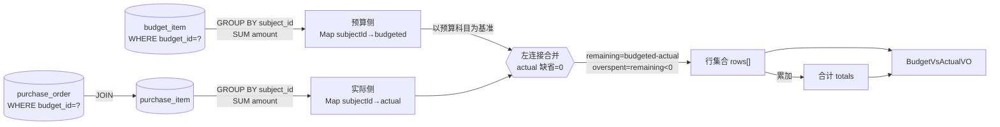

# U13 预算 vs 实际 · 详细设计

> 阶段三 · 详细设计产物 · 创建日期 2026-06-05 · 状态 草稿
> 上游：`tkxm-general`（`docs/design/general/procurement-general.md` §4.1 M2「预算vs实际读模型」契约、§4/§5 M4→M2 只读读模型依赖）、`tkxm-database`（`docs/design/db/procurement-db.md` §3.2 `budget`/`budget_item`/`budget_subject`、§3.4 `purchase_order`/`purchase_item`、§7 读模型扩展点）、`tkxm-prototype`（`docs/prototype/index.html` 屏 `subject` 内「预算 vs 实际（仅展示，不核减）」卡）
> 下游：阶段四 `tkxm-coding`（编码与单测）、`tkxm-review`（代码审查）
> 对应：功能点 **U13 预算 vs 实际**、模块 **M2 预算与科目（BC2）**、需求 **D4**、原型屏 `subject` 内卡
> 说明：抬头通用约定（响应体 / 错误码 / 鉴权）与 `U6-budget-import.md` §6 一致，本文不重复展开，仅列差异。

---

## 1. 概述

### 1.1 功能目标

U13 为**只读读模型**：给定一条预算（`budget`），按**预算科目**（`budget_subject`）聚合「预算金额 vs 实际已发生金额」对比，供编制人 / 采购主管 / 管理类角色在预算科目屏（`subject`）内的「预算 vs 实际」卡查看。核心做一件事：

- **按科目对比**：每个出现金额的叶子科目一行，给出 `预算金额`（budgeted）、`已发生金额`（actual）、`差额`（remaining = 预算 − 已发生）、`是否超支`（overspent = 差额 < 0）。

### 1.2 关键定位（强调读模型、不核减）

| 定位 | 说明 | 依据 |
|---|---|---|
| **纯查询、零副作用** | 仅做 SQL 聚合查询（`GROUP BY subject_id`），**不写任何表、不开事务、不改预算状态** | general §4「M4→M2 只读读模型」、ER D-6 |
| **不新增实体 / 表** | 复用 `budget_item`（预算侧）+ `purchase_item`（实际侧）现有表聚合，**不落表、不实体化冗余**（可选物化视图，见 §5.4） | ER D-6、db §7「预算 vs 实际用视图/读模型」 |
| **仅展示，不核减** | **不做余额占用 / 核减 / 超预算拦截**；超支只在结果里标识（`overspent=true`、差额为负），不阻断任何采购写操作 | 原型 `subject` 卡注「本期仅展示对比，不做余额占用/核减/超预算拦截」、general §1「预算与实际仅展示对比、不核减」 |
| **预算侧口径** | 预算 = 该 `budget` 下 `budget_item.amount` 按 `subject_id` 汇总（金额仅挂叶子，ER D-7） | db §3.2 |
| **实际侧口径** | 实际 = 关联**同一 `budget`** 的采购单（`purchase_order.budget_id`）其 `purchase_item.amount` 按 `subject_id` 汇总（「已发生」口径见 §10 TBD-1） | db §3.4、U8 §5.2 |

### 1.3 范围边界

- **在范围内**：单个 `budget` 的预算 vs 实际按科目对比查询（聚合 + 差额 + 超支标识 + 汇总合计）。
- **不在范围内**：预算导入（U6）、科目树维护（U5）、采购写入（U8/U9）、余额核减 / 超预算拦截（明确 Non-goal，本期仅展示）、跨预算 / 跨项目组的横向汇总报表（后续按需）。

---

## 2. 功能规约（AC）

> 验收标准（Acceptance Criteria），与 §7 测试点 T-x 一一对应。
> **后置无副作用**：所有 AC 执行后，`budget`/`budget_item`/`purchase_order`/`purchase_item` 及其它任何表的数据**保持不变**（纯查询）。**超支不拦截**：超支仅体现为返回值标识，不抛错、不阻断。

| 编号 | 场景 | 验收标准 |
|---|---|---|
| **AC-1** | 正常对比 | 给定存在的 `budgetId`，返回按 `subject_id` 聚合的行集合：每行含 `subjectId`/`subjectName`/`subjectCode`/`budgeted`/`actual`/`remaining`/`overspent`；`remaining = budgeted − actual`，金额两位小数；同时返回三项合计 `totalBudgeted`/`totalActual`/`totalRemaining`。`Result.code=0`。 |
| **AC-2** | 超支展示不拦截 | 某科目 `actual > budgeted` 时，该行 `remaining < 0`、`overspent=true`，接口**正常返回 200/code=0**，不抛错、不拦截（对齐原型「存储节点 -¥5,000 超支(不拦截)」）。 |
| **AC-3** | 无采购时实际为 0 | 某科目在该预算下**无任何采购明细**（`purchase_item`）时，该行 `actual=0.00`、`remaining=budgeted`、`overspent=false`，仍出现在结果中（不被过滤掉）。 |
| **AC-4** | 按科目聚合正确 | 同一 `subject_id` 在 `budget_item` / `purchase_item` 有多行时，各自 `SUM(amount)` 后再相减；不同科目互不串行；预算侧多行预算明细、实际侧跨多张采购单 / 多明细行均正确汇总。 |
| **AC-5** | 预算不存在 | `budgetId` 在 `budget` 中查无（含已不存在）→ 返回 **40401**，不返回行集合。 |
| **AC-6** | 参数非法 | `budgetId` 缺失 / 非法（非正整数）→ 返回 **40001**。 |
| **AC-7** | 鉴权 | 接口要求登录且具备管理类查看角色（`@SaCheckRole`，见 §6）；未登录 → 401（40100），无角色 → 403（40301）。 |
| **AC-8** | 实际侧仅同预算 | 「已发生」只统计 `purchase_order.budget_id = 当前预算` 的采购明细；**其它预算 / 其它项目组**的同名 / 同 `subject_id` 采购金额**不计入**。 |
| **AC-9** | 仅查询无副作用 | 调用前后相关表行数与金额完全一致；接口不触发任何写、不改 `budget.status`、不占用 / 核减预算。 |

---

## 3. 时序（查询 → 聚合预算 + 实际 → 返回对比）

```mermaid
sequenceDiagram
    autonumber
    participant FE as 前端(屏 subject 卡)
    participant CT as BudgetVsActualController
    participant SV as BudgetVsActualService
    participant BM as budget(读·校验存在)
    participant RM as VsActualReadMapper(聚合查询)
    participant DB as budget_item + purchase_order/purchase_item(只读)

    FE->>CT: GET /api/budgets/{id}/vs-actual
    CT->>CT: @SaCheckRole(查看角色) + 路径参校验(id 正整数)
    alt id 非法
        CT-->>FE: Result(40001)
    end
    CT->>SV: getVsActual(budgetId)
    SV->>BM: selectById(budgetId)
    alt 预算不存在
        BM-->>SV: null
        SV-->>CT: BizException(40401)
        CT-->>FE: Result(40401)
    else 预算存在
        BM-->>SV: budget
        Note over SV,RM: 纯只读查询, 不开写事务
        SV->>RM: aggregateBudgetBySubject(budgetId)
        RM->>DB: SELECT subject_id, SUM(amount) FROM budget_item WHERE budget_id=? GROUP BY subject_id
        DB-->>RM: 预算侧 Map<subjectId, budgeted>
        SV->>RM: aggregateActualBySubject(budgetId)
        RM->>DB: SELECT pi.subject_id, SUM(pi.amount) FROM purchase_item pi JOIN purchase_order po ON pi.purchase_order_id=po.id WHERE po.budget_id=? GROUP BY pi.subject_id
        DB-->>RM: 实际侧 Map<subjectId, actual>
        SV->>SV: 以预算侧科目为基准左连接实际侧(无采购→actual=0)
        SV->>SV: 逐行 remaining=budgeted-actual; overspent=remaining<0(仅标识,不拦截)
        SV->>SV: 汇总 totalBudgeted/totalActual/totalRemaining
        SV-->>CT: BudgetVsActualVO(rows[], totals)
        CT-->>FE: Result.ok(BudgetVsActualVO) (含超支行,不拦截)
    end
```

---

## 4. 数据流（只读）

### 4.1 读取表（全只读，无写）

| 表 | 读 / 写 | 用途 | 聚合键 / 关键列 |
|---|---|---|---|
| `budget` | 读 | 校验 `budgetId` 存在（聚合根） | id, project_group_id, name, status |
| `budget_item` | 读 | **预算侧**：按 `subject_id` 汇总 `amount` | budget_id（过滤）, subject_id（GROUP BY）, amount（SUM） |
| `purchase_order` | 读 | 关联到同一 `budget`（连接桥） | id, budget_id（过滤） |
| `purchase_item` | 读 | **实际侧**：按 `subject_id` 汇总 `amount` | purchase_order_id（JOIN）, subject_id（GROUP BY）, amount（SUM） |
| `budget_subject` | 读（可选） | 补全 `subjectName`/`subjectCode` 展示（未删） | id, name, code, is_leaf |

> 不写任何表；`budget_subject` 仅为展示补名，缺名亦不影响金额对比（可仅返回 `subjectId`）。

### 4.2 数据流向（聚合 → 合并 → 对比）



- **基准侧**：以**预算侧科目集合**为基准做左连接——保证「有预算无采购」的科目 `actual=0` 仍出现（AC-3）。
- **超支**：合并阶段仅计算 `overspent = remaining < 0` 标识，**不在任何位置抛错或过滤**（AC-2）。

---

## 5. 关键逻辑

### 5.1 预算侧聚合（budgeted）

```sql
-- 预算金额：该 budget 下 budget_item 按科目汇总（金额仅挂叶子，ER D-7）
SELECT bi.subject_id,
       SUM(bi.amount) AS budgeted
FROM budget_item bi
WHERE bi.budget_id = #{budgetId}
GROUP BY bi.subject_id;
```

- 走 `idx_bi_budget (budget_id)`；`uk_bi(budget_id, subject_id)` 保证同预算同科目至多一行，`SUM` 兼容未来放宽（多行仍正确，AC-4）。
- `amount` 为 `NUMERIC(18,2)`，用 `BigDecimal` 承接，禁用浮点。

### 5.2 实际侧聚合（actual）

```sql
-- 已发生金额：关联同一 budget 的采购单，其采购明细按科目汇总
SELECT pi.subject_id,
       SUM(pi.amount) AS actual
FROM purchase_item pi
JOIN purchase_order po ON po.id = pi.purchase_order_id
WHERE po.budget_id = #{budgetId}
GROUP BY pi.subject_id;
```

- 连接桥 `purchase_order.budget_id` 锚定**同一预算**（AC-8：不串其它预算 / 项目组）；走 `idx_po_budget (budget_id)` + `idx_pi_po (purchase_order_id)`。
- 「已发生」口径本期取**采购金额**（下单口径，`purchase_item.amount`），非入库实收金额——见 §10 TBD-1。
- 是否排除作废采购单（`purchase_order.status='void'`）：本期**不排除**（保持口径简单，void 量级小且 U8 未实现作废触发）；如需排除加 `AND po.status <> 'void'`，列为实现期可选项（不改对外契约）。

### 5.3 合并与差额计算（应用层）

```
budgetedMap = aggregateBudgetBySubject(budgetId)   // subjectId -> budgeted
actualMap   = aggregateActualBySubject(budgetId)   // subjectId -> actual
rows = []
for (subjectId, budgeted) in budgetedMap:           // 以预算侧为基准
    actual    = actualMap.getOrDefault(subjectId, 0.00)   // 无采购→0 (AC-3)
    remaining = budgeted.subtract(actual)                 // 预算-已发生
    overspent = remaining.signum() < 0                    // 仅标识,不拦截 (AC-2)
    rows.add(Row(subjectId, name?, code?, budgeted, actual, remaining, overspent))
// 合计
totalBudgeted  = Σ budgeted
totalActual    = Σ actual
totalRemaining = totalBudgeted - totalActual
```

- **差额** `remaining = budgeted − actual`；负数即超支，`overspent=true`，原样返回（前端按 ER 卡用红 `pill danger` 标「超支(不拦截)」，正数用 `pill ok`）。
- **基准选择**：以预算侧科目为基准——预算未列但有采购（异常数据）的科目本期**不单列**（属数据异常，保持「预算 vs 实际」语义以预算科目为骨架）；如需暴露「无预算却有采购」可在实现期改为全外连接，列实现期可选项（不改对外契约结构）。
- 金额统一 `setScale(2, HALF_UP)`；`subjectName`/`subjectCode` 由 `budget_subject` 批量补名（一次 `IN` 查询），缺名容错为 `null`。

### 5.4 实现方式（SQL 聚合 vs 视图）

- **本期实现**：应用层两段聚合 SQL（§5.1 / §5.2）+ 内存合并（§5.3），由 `VsActualReadMapper`（MyBatis-Plus 自定义 XML / `@Select`）承载，**不建物理表**。
- **可选物化视图**（不在本期，预留 db §7「用视图/读模型」）：
  ```sql
  -- 预留: 单预算可即时聚合, 暂无需物化; 如做跨预算报表再评估
  CREATE VIEW v_budget_vs_actual AS
  SELECT b.id AS budget_id, s.subject_id,
         s.budgeted, COALESCE(a.actual, 0) AS actual,
         s.budgeted - COALESCE(a.actual, 0) AS remaining
  FROM budget b
  JOIN (SELECT budget_id, subject_id, SUM(amount) budgeted
        FROM budget_item GROUP BY budget_id, subject_id) s ON s.budget_id = b.id
  LEFT JOIN (SELECT po.budget_id, pi.subject_id, SUM(pi.amount) actual
             FROM purchase_item pi JOIN purchase_order po ON po.id = pi.purchase_order_id
             GROUP BY po.budget_id, pi.subject_id) a
         ON a.budget_id = s.budget_id AND a.subject_id = s.subject_id;
  ```
- 选型：单预算查询量级小（科目十级 / 明细十万级中单预算占比极小），**应用层聚合即可**，视图为后续跨预算报表的预留接入点（不改本期对外契约）。

---

## 6. 接口定义

> 通用响应体 `Result<T>`、`BizException`/`GlobalExceptionHandler`、HTTP 状态映射均与 `U6-budget-import.md` §6 一致，本文不重复。
> **鉴权**：`@SaCheckRole`，本接口为**只读查看**，开放给管理 / 编制类角色：允许 `editor`（编制人）/ `purchase_mgr`（采购主管）/ `dept_mgr`（部门主管）/ `admin`（管理员）查看，用 `@SaCheckRole(value={"editor","purchase_mgr","dept_mgr","admin"}, mode=SaMode.OR)`。未登录 40100、无任一角色 40301。

### 6.0 本功能错误码全集

| code | 含义 | 触发 |
|---|---|---|
| 0 | 成功 | 正常返回对比（含超支行，不拦截） |
| 40001 | 参数错误 | `budgetId` 缺失 / 非正整数 |
| 40301 | 无权限 | 无任一查看角色（Sa-Token 拦截层 40300） |
| 40401 | 预算不存在 | `budgetId` 在 `budget` 中查无 |
| 50000 | 系统错误 | 未预期异常（聚合 SQL / DB 异常等） |

### 6.1 预算 vs 实际查询

- **`GET /api/budgets/{id}/vs-actual`**
- **鉴权**：`@SaCheckRole(value={"editor","purchase_mgr","dept_mgr","admin"}, mode=SaMode.OR)`
- **路径参数**：

  | 参数 | 类型 | 必填 | 校验 | 说明 |
  |---|---|---|---|---|
  | id | Long | 是 | `@Positive` | 预算 id（`budget.id`） |

- **响应**：`Result<BudgetVsActualVO>`

  `BudgetVsActualVO`：
  | 字段 | 类型 | 说明 |
  |---|---|---|
  | budgetId | Long | 预算 id |
  | budgetName | String | 预算名称（便于卡片标题） |
  | rows | List\<RowVO\> | 按科目的对比行 |
  | totalBudgeted | BigDecimal | 预算合计（Σ budgeted） |
  | totalActual | BigDecimal | 已发生合计（Σ actual） |
  | totalRemaining | BigDecimal | 差额合计（预算−已发生） |

  `RowVO`（一行 = 一个科目）：
  | 字段 | 类型 | 说明 |
  |---|---|---|
  | subjectId | Long | 预算科目 id |
  | subjectName | String | 科目名（展示，缺可空） |
  | subjectCode | String | 科目编码（展示，缺可空） |
  | budgeted | BigDecimal | 预算金额（budget_item.amount 按科目 SUM） |
  | actual | BigDecimal | 已发生金额（purchase_item.amount 按科目 SUM，无采购=0.00） |
  | remaining | BigDecimal | 差额 = budgeted − actual（负=超支） |
  | overspent | Boolean | 是否超支（remaining < 0），**仅标识不拦截** |

- **成功响应示例**（对应原型卡两行，含超支行）：

  ```json
  { "code": 0, "message": "ok",
    "data": {
      "budgetId": 1001, "budgetName": "2026 计算平台预算",
      "rows": [
        { "subjectId": 31, "subjectName": "计算节点", "subjectCode": "SB-JS01",
          "budgeted": 120000.00, "actual": 52400.00, "remaining": 67600.00, "overspent": false },
        { "subjectId": 32, "subjectName": "存储节点", "subjectCode": "SB-CC01",
          "budgeted": 66000.00, "actual": 71000.00, "remaining": -5000.00, "overspent": true }
      ],
      "totalBudgeted": 186000.00, "totalActual": 123400.00, "totalRemaining": 62600.00
    } }
  ```

- **错误响应**：40001（参数）、40301（无权限）、40401（预算不存在）、50000（系统）。
- **对应**：AC-1~AC-9 / T-1~T-7。

> 接口数：**1**（预算 vs 实际查询）。

---

## 7. 测试点（T-x ↔ AC-x）

| 编号 | 关联 AC | 用例 | 预期 |
|---|---|---|---|
| **T-1** | AC-1/AC-4 | 预算 + 采购数据齐全，单接口查询 | 返回各科目 `budgeted`/`actual`/`remaining(=budgeted-actual)`/`overspent`，合计三项正确，`code=0` |
| **T-2** | AC-2/AC-9 | 某科目 `actual > budgeted`（超支） | 该行 `remaining<0`、`overspent=true`，接口仍 200/`code=0`，**不抛错不拦截**；调用前后数据无变化 |
| **T-3** | AC-3 | 某有预算科目在该预算下无任何采购明细 | 该行 `actual=0.00`、`remaining=budgeted`、`overspent=false`，**仍出现在 rows 中** |
| **T-4** | AC-4 | 同科目多条预算明细 + 跨多张采购单 / 多明细行 | 预算侧 / 实际侧各自 `SUM` 后相减；不同科目互不串 |
| **T-5** | AC-8 | 其它预算 / 项目组存在同 `subject_id` 采购金额 | 当前预算结果**不计入**他预算采购（按 `purchase_order.budget_id` 隔离） |
| **T-6** | AC-5 | `budgetId` 不存在 | `code=40401`，无 rows |
| **T-7** | AC-6/AC-7 | `id` 非正整数 / 未登录 / 无查看角色 | 40001 / 40100 / 40301 |

> 全部测试点均断言「接口为纯查询、调用前后 `budget`/`budget_item`/`purchase_order`/`purchase_item` 数据零变化」（AC-9）。

---

## 8. 异常处理

| 异常 / 场景 | 处理策略 | 返回 |
|---|---|---|
| `id` 缺失 / 非正整数 | 路径参 `@Positive` 校验失败 | 40001 |
| 预算不存在 | 前置 `selectById` 为 null → 抛 `BizException(40401)` | 40401 |
| 超支（actual>budgeted） | **正常业务结果**，仅置 `overspent=true`、`remaining<0`，不抛错 | 0（200） |
| 无采购数据 | 实际侧聚合空 Map，逐行 `actual=0.00` | 0（200） |
| 无查看角色 / 未登录 | Sa-Token 拦截 → 40300（业务记 40301）/ 40100 | 40301 / 40100 |
| 聚合 SQL / DB 异常 | 捕获包装 `BizException(50000)`，记日志（不泄堆栈，兜底 `GlobalExceptionHandler`） | 50000 |

- **无副作用保证**：Service 方法标 `@Transactional(readOnly = true)`（或不开事务），杜绝任何写；超支 / 空数据均为正常返回路径，错误码仅用于参数 / 预算不存在 / 系统异常。

---

## 9. 依赖与影响

### 9.1 硬依赖（DAG 上游）

| 依赖 | 类型 | 说明 |
|---|---|---|
| **U6 预算模板导入** | 硬依赖 | 提供预算侧基准 `budget` + `budget_item.amount`（U6 §9.2 已声明被 U13 消费） |
| **U8 采购执行 + 到货单** | 硬依赖 | 提供实际侧 `purchase_order`(`budget_id`) + `purchase_item.amount`（U8 §9「下游 M2 读模型」已声明） |

### 9.2 波次与并行（计划对齐）

- 计划 `procurement-plan.md`：U13 依赖 **U6 + U8**，位于**波次 8**，**与 U9 并行**（U13 仅需 U6+U8，不依赖 U9 入库；§3 DAG `U8→U13`、波次表 `波次8 = U9 + U13`）。
- U13 经依赖精化后**离开关键路径尾段**（plan §5），不压在 U9 之后。

### 9.3 被依赖（下游影响）

| 下游 | 影响 |
|---|---|
| U14 前端集成 | `subject` 屏「预算 vs 实际」卡消费本接口（plan 里程碑 M5「预算对比 + 可演示」） |

### 9.4 对其它模块的影响

- **只读、零副作用**：不写任何表、不开写事务、不改 `budget.status`、不占用 / 核减预算 → **不影响 U6/U8/U9 及其它任何功能点**；与 U9 并行开发无冲突（概要 §5「M4→M2 为只读读模型」）。

### 9.5 技术依赖

- MyBatis-Plus 3.5.9：`budget` Mapper（校验存在）+ `VsActualReadMapper`（聚合查询，XML / `@Select`）；全局逻辑删除 `is_deleted` 不影响业务单据表（`budget_item`/`purchase_item` 不软删，db §1）。
- Sa-Token 1.40（`@SaCheckRole(... mode=OR)`）；`Result`/`BizException`/`GlobalExceptionHandler`（common 脚手架）。

---

## 10. 待确认（TBD）

| 编号 | 待确认项 | 现状 / 暂定 | 拍板人 |
|---|---|---|---|
| **TBD-1** | 「已发生」口径：**采购下单** vs **入库实收** | 本期取**采购金额**（`purchase_item.amount`，下单口径），与原型「已发生」一致；如改入库实收口径，可按 `inbound_item.received_qty` × 单价折算（U9 数据），需补单价 / 计价规则——属后续精化，不改本接口对外结构 | 业务 / 财务 |

> TBD 数：**1**（TBD-1「已发生」口径）。
