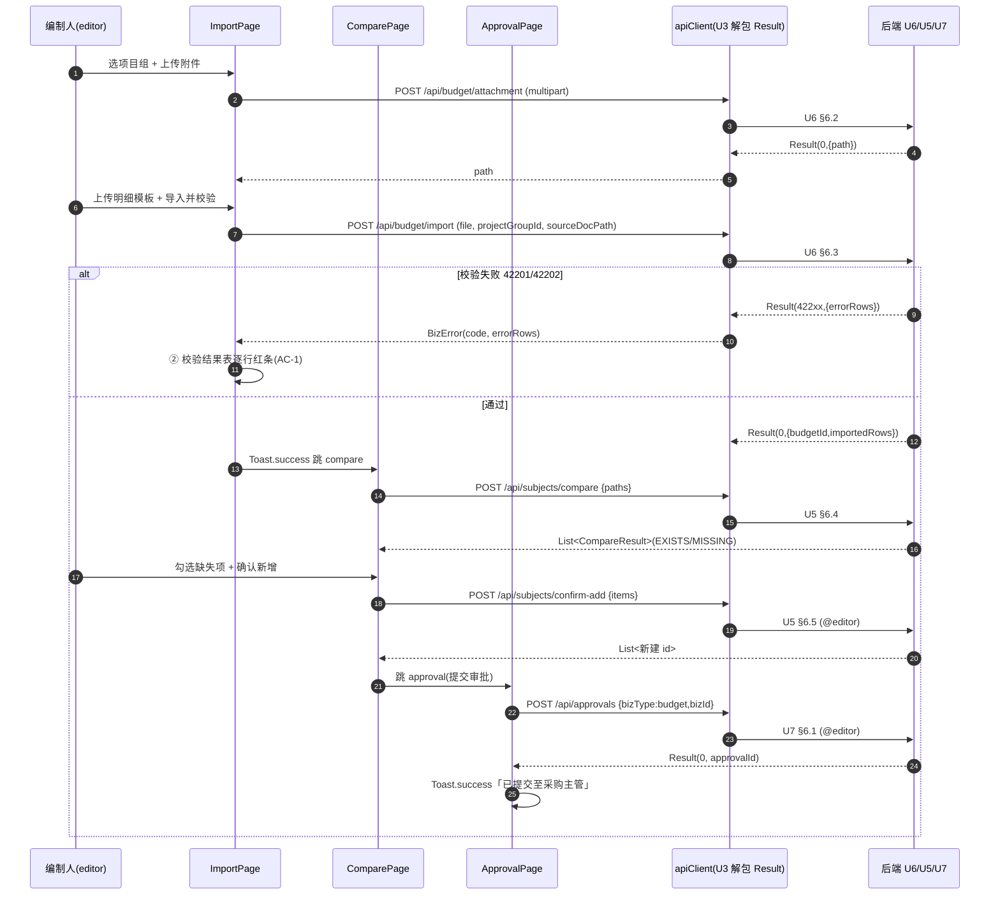
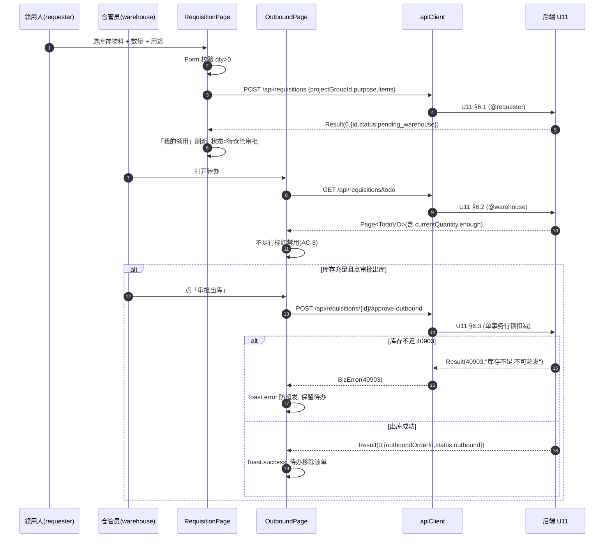

# U14 前端业务页面集成 · 详细设计

> 阶段三·详细设计产物 · 创建日期：2026-06-05 · 状态：草稿
> 上游：阶段三 `tkxm-general`（概要设计）、`tkxm-prototype`（原型图）、各后端详设 `tkxm-detail`（接口契约）
> 下游：阶段四 `tkxm-coding`（编码与单测）、`tkxm-review`（审查）
> 对应：功能点 **U14**、前端集成、需求 **全部**、原型屏 `dashboard` + 全部

---

## 1. 功能概述

U14 是采购项目管理系统的**前端业务页面集成**功能点：在 **U3 前端外壳**（Semi UI 布局 / 二级导航 / 路由 / `apiClient` 解包 / 角色可见性）之上，**填充各业务页面**，把原型 `docs/prototype/index.html` 的 11 个屏（dashboard / org / import / subject / compare / approval / purchase / inbound / requisition / outbound / stocktake）逐一落为可运行的 React 页面组件，并对接 U4–U13 各后端模块的 REST 接口契约。

- **依赖类型（关键）**：U14 为**软·契约级**依赖各后端模块（U4–U13）。只要后端**接口契约**（路由 / 入参 / 出参 / 错误码）确定，前端即可基于 **mock** 并行开发，**联调收口**安排在各后端真实产物完成后（计划波次 8/9 后，里程碑 M5）。对 **U3 外壳为硬依赖**（Layout / Router / `apiClient` / 角色态是本功能点的承载底座）。
- **范围内**：
  - 11 个业务页面组件的实现与路由挂载（沿用 U3 的导航 4 域 A/B/D/F）。
  - 每页对接的后端接口调用（GET 列表 / 详情、POST/PUT 命令）、请求/响应 DTO 与各后端详设 §6 契约对齐。
  - **工作台聚合**（dashboard）：待办、统计卡片、状态机展示、待办行跳转到对应处理页。
  - **表单校验**（前端 `Form` rules）+ **后端错误码呈现**（`Result.code` → `Toast` / 行内错误 / 错误清单表）。
  - **文件上传**（预算立项附件、到货单）与下载、上传态。
  - 列表**分页 / 筛选**、空 / 加载 / 错误状态（对齐原型空/加载/错误样式）。
- **范围外**：
  - 后端业务逻辑、库存事务、审批引擎（属 U4–U13）。
  - U3 已实现的外壳能力（登录页、Layout、路由表、`apiClient`、全局 `Toast`/异常拦截、角色态 store）—— U14 **复用**，不重复实现。
  - 细粒度权限点、字段级授权（轻量 RBAC，原型 `org` 屏 Non-goal）。

> U3 外壳约定（本功能点承接的底座）：`apiClient` 统一发起请求并**解包 `Result<T>`**（`code=0` 取 `data`，非 0 抛 `BizError(code,message)` 供页面 `catch`）；登录态 token 注入 header；401（40110/40100）触发跳登录；角色态 `useAuthStore().roles` 控制按钮 / 菜单可见性。**注**：U3 详设（`U3-frontend-shell.md`）尚未落档，本功能点以上述约定为接口面，U3 落档后以其为准（见 §10 TBD-1）。

---

## 2. 功能规约（页面级 AC）

> 前端 AC 聚焦「页面交互 + 与后端校验一致的呈现」。每条 AC 标注其依赖的后端 AC / 错误码（来自各后端详设 §6），确保前端**不自造规则**、与后端校验同源。

| 编号 | 页面 | 验收准则（前端表现需与后端校验一致） |
|---|---|---|
| **AC-1** | import | 上传非 `.xlsx` 或缺列 / 空金额 / 非叶子科目时，导入接口返回 `42201/42202`，前端在「②导入校验结果」表按 `errorRows[].rowNo` **逐行红条**呈现 `reason`，不跳转下一步（对齐 U6 AC-3/4/5/8、原型 `import` ② 红条）。 |
| **AC-2** | import | 全部行校验通过返回 `code=0` 与 `{budgetId, importedRows}`，`Toast.success` 并可跳 `subject`；立项附件经 `POST /api/budget/attachment` 先上传得 `path` 再回填导入（U6 AC-2/AC-9）。 |
| **AC-3** | subject / compare | 科目树懒加载（`lazy`）展开；模糊搜索空关键字被前端 `Form` 拦截（不发请求），命中后高亮 `ancestorPath`；新增子级 / 确认新增仅 `editor` 角色可见可点（U5 AC-2/3/4，非 editor 隐藏按钮，越权调用回 40301 → Toast）。 |
| **AC-4** | approval | 「驳回」必须填写意见，前端 `Form` rule 必填；空意见后端回 `42202`，前端定位到意见输入框报错（U7 AC-5）。当前节点与登录角色不符时按钮置灰 / 调用回 `40301` Toast（U7 AC-7）。 |
| **AC-5** | purchase | 「创建采购单」仅当来源预算 `status=approved` 可建；前端从预算下拉只列 approved 预算，若误建非 approved 预算后端回 `40901`，前端 Toast「预算非已通过状态」（U8 AC-1）。供应商 / 合同号选填不阻断（U8 AC-5）。 |
| **AC-6** | inbound | 实收数量录入；累计已收 + 本次 > 采购数量时后端回 `42203`，前端在该明细行行内报错「累计超收」并禁用提交（U9 AC-3）。到货单可多文件上传，列出上传人 / 时间 / 下载（U9 / U8 AC-7）。 |
| **AC-7** | requisition | 领用数量 `qty>0` 前端校验；提交后转待仓管审批，「我的领用」列表展示状态（U11 AC-1）。 |
| **AC-8** | outbound | 待办按 `warehouse` 角色可见；每明细按 `currentQuantity` 与申请量比对，**库存不足行**标红「库存不足，不可超发」并禁用「审批出库」；后端 `40903` 防超发 Toast（U11 AC-2/4，原型 `outbound` 核验列）。 |
| **AC-9** | stocktake | 实盘录入，前端实时算差异（实盘-账面）与盘盈 / 盘亏标记；「确认差异并调整库存」调 U12 接口，成功后刷新（对齐原型 `stocktake`）。 |
| **AC-10** | dashboard | 工作台聚合「待我审批 / 执行中采购 / 待出库领用 / 在管项目」统计与「我的待办」列表；待办行「去审批 / 去入库 / 去出库」跳转对应页并定位单据（原型 `dashboard`）。 |
| **AC-11** | 全局 | 任一接口失败：401→跳登录；403/40301→Toast「无权限」并隐藏越权入口；4xx 业务码→Toast 对应 `message`；5xx→Toast「系统繁忙」+ 可重试（§8）。 |
| **AC-12** | 全局 | 列表页统一支持分页（`page/size`）与筛选（`status/projectGroupId` 等）；加载中显示 `Spin` / 骨架，空数据显示原型 `.empty` 空态，错误显示重试态（§5.5 / §8）。 |

---

## 3. 关键交互时序（跨页主线）

> 选 2 条跨页主线（覆盖 B 域写链与 D 域出库链），均经 U3 `apiClient` 解包；mock 期返回桩数据，联调期切真实后端。

### 3.1 主线一：预算导入 → 科目比对 → 提交审批（B 域）

### 3.2 主线二：领用申请 → 仓管审批出库（D 域·防超发）

---

## 4. 页面 ↔ 接口 ↔ 组件映射表

> 每屏：页面组件 / 调用接口（GET/POST 路由，来自对应后端详设 §6）/ Semi 组件 / 关键交互。`@角色` 标注前端按钮可见性（沿用 U3 角色态）。导航域 A/B/D/F 与原型一致。

| 域 | 原型屏 | 页面组件 | 调用接口（方法 路由） | 来源详设 | Semi 组件 | 关键交互 |
|---|---|---|---|---|---|---|
| A | `dashboard` | `DashboardPage` | `GET /api/approvals/todo`、`GET /api/requisitions/todo`、`GET /api/purchase/orders?status=executing`（统计聚合，见 §5.4） | U7/U11/U8 | `Card`/`Descriptions`/`Steps`/`Table`/`Tag` | 统计卡片、状态机 `Steps`、待办表行「去审批/去入库/去出库」跳转 |
| A | `org` | `OrgPage` | `GET/POST/PUT/DELETE /api/org/departments`、`/project-groups`、`/users`、`PUT /api/org/users/{id}/roles`、`GET /api/org/roles` | U4 §6 | `Tree`/`Table`/`Modal`/`Form`/`Select`/`Tag` | 部门/项目组树、用户表、角色多选分配（`@admin` 写）、删除 RESTRICT 提示 40901 |
| B | `import` | `ImportPage` | `POST /api/budget/template/download`、`POST /api/budget/attachment`、`POST /api/budget/import` | U6 §6 | `Form`/`Select`/`Upload`/`Button`/`Table`/`Banner` | 选项目组、附件 `Upload`、模板 `Upload`、导入、② 错误行红条（`errorRows`） |
| B | `subject` | `SubjectPage` | `GET /api/subjects/tree?lazy=`、`GET /api/subjects/search`、`POST /api/subjects`、`DELETE /api/subjects/{id}`；`GET 预算vs实际`（U13，见下） | U5 §6 / U13 | `Tree`(懒加载)/`Input`(search)/`Modal`/`Form`/`Table` | 多级树展开、模糊搜索高亮祖先路径、新增子级（`@editor`）、预算vs实际对比卡 |
| B | `compare` | `ComparePage` | `POST /api/subjects/compare`、`POST /api/subjects/confirm-add` | U5 §6.4/6.5 | `Table`/`Tag`/`Form`/`Checkbox`/`Button` | 对照表 已存在/缺失、缺失项确认新增（`@editor`） |
| B | `approval` | `ApprovalPage` | `GET /api/approvals/todo`、`POST /api/approvals/{id}/approve`、`POST /api/approvals/{id}/reject`、`GET /api/approvals/{id}/history` | U7 §6 | `Steps`/`Descriptions`/`Table`/`Form`/`TextArea`/`Modal` | 两级审批 `Steps`、通过/驳回（意见必填 `@purchase_mgr/dept_mgr`）、流转历史表 |
| D | `purchase` | `PurchasePage` | `GET /api/purchase/orders`、`GET /api/purchase/orders/{id}`、`POST /api/purchase/orders`、`POST .../delivery-notes` | U8 §6 | `Form`/`Select`/`Table`/`Upload`/`Input` | 选 approved 预算建单、明细表、供应商/合同选填、到货单上传 |
| D | `inbound` | `InboundPage` | `POST /api/inbounds`、`GET /api/inbounds?purchaseOrderId=`、`POST/GET .../delivery-notes`、`GET .../download` | U9 §6 / U8 §6.3-6.4 | `Upload`/`Table`/`InputNumber`/`Button` | 到货单多文件上传/下载、实收录入、累计超收行内报错（42203）、入库 |
| D | `requisition` | `RequisitionPage` | `POST /api/requisitions`、`GET /api/requisitions?applicantId=` | U11 §6.1/6.5 | `Form`/`Select`/`InputNumber`/`TextArea`/`Table` | 选库存物料（含库存量）、数量、用途、我的领用列表 |
| D | `outbound` | `OutboundPage` | `GET /api/requisitions/todo`、`POST /api/requisitions/{id}/approve-outbound`、`POST /api/requisitions/{id}/reject` | U11 §6.2/6.3/6.4 | `Table`/`Tag`/`Button`/`Modal`/`TextArea` | 待办核库存、不足行标红禁用、审批出库（防超发 Toast）、驳回意见 |
| D | （嵌入 inbound/outbound） | `StockPanel`（库存查询/流水，复用组件） | `GET /api/stocks`、`GET /api/stocks/{id}/txns` | U10（契约见 §6.D） | `Table`/`Tag` | 库存列表、流水明细（入库/出库/盘盈亏） |
| F | `stocktake` | `StocktakePage` | `POST /api/stocktakes`、`GET /api/stocktakes/{id}`、`POST /api/stocktakes/{id}/adjust` | U12（契约见 §6.F） | `Form`/`Select`/`Table`/`InputNumber`/`Button` | 发起盘点、实盘录入、实时差异/盘盈亏、确认差异调整库存 |

> 覆盖页面：**11**（dashboard / org / import / subject / compare / approval / purchase / inbound / requisition / outbound / stocktake）；其中 U10 库存以嵌入面板 `StockPanel` 复用于 inbound/outbound/subject。

---

## 5. 关键逻辑

### 5.1 mock 先行策略（软·契约级并行）

- **契约即真相**：以各后端详设 §6 的「路由 + 入参 + 出参 + 错误码」为前后端共同契约。前端开发期不等后端，按契约写 **mock handler**。
- **mock 方案（暂定，见 §10 TBD-2）**：用 **MSW（Mock Service Worker）** 在浏览器层拦截 `/api/**`，按契约返回桩 `Result<T>`；以 `import.meta.env.VITE_USE_MOCK` 开关切换 mock / 真实后端，`apiClient` baseURL 不变（拦截在网络层，业务代码零改动）。
- **桩数据来源**：直接取各后端详设 §6 的「成功示例 / 错误示例」JSON（如 U6 的 `errorRows`、U9 的入库响应、U11 的待办 `enough`），保证 mock 与契约一字不差。
- **联调收口**：后端真实接口就绪后（波次 8/9 后），关闭对应路由的 mock，逐页回归；契约不一致项记入联调清单回推后端（里程碑 M5）。

### 5.2 表单校验与后端错误码呈现（双层校验，单一事实源在后端）

- **前端层（即时反馈）**：Semi `Form` `rules` 做必填 / 数值 / 长度的即时校验（如领用 `qty>0`、驳回 `opinion` 必填、采购明细 `qty≥0.001`），与后端 `@Validated` 同语义但**只为体验**，不作为放行依据。
- **后端层（权威）**：业务规则（预算 approved、不超收、防超发、节点-角色、编码重复）一律由后端裁决，前端**不复刻业务判断**，仅**呈现** `Result.code`。
- **错误码 → 呈现策略**（统一映射，集中在 `apiClient` + 页面 `catch`）：

| 错误码段 | 场景 | 前端呈现 |
|---|---|---|
| `40001` | 参数校验失败 | `Toast.error(message)`，并尽量定位到对应字段（按后端返回的字段名）|
| `40110/40100` | 未登录/失效 | 清登录态 → 跳登录页 |
| `40300/40301` | 缺角色/无权限 | `Toast.error(message)`；同时**隐藏**越权按钮（前置防护，§5.6）|
| `40401/40405` | 资源不存在 | `Toast.error`，列表/详情回退空态或刷新 |
| `40901/40902/40903` | 状态冲突/编码重复/库存不足 | `Toast.error(message)`，保留当前页（如 outbound 待办不移除）|
| `42201/42202/42203` | 校验清单/意见必填/超收 | **结构化呈现**：`42201/42202` 渲染 `errorRows` 表（逐行红条）；`42202` 定位输入框；`42203` 明细行内报错 |
| `50000` | 系统异常 | `Toast.error("系统繁忙，请稍后重试")` + 可重试 |

### 5.3 文件上传（预算附件 / 到货单）

- **组件**：Semi `Upload`，`action` 指向后端 multipart 接口；`beforeUpload` 做扩展名白名单（`.xlsx` 用于模板导入；附件 `.pdf/.doc/.docx/.xls/.xlsx/.png/.jpg`，对齐 U6 §5.4）与大小上限前端预校验。
- **预算立项附件**：`POST /api/budget/attachment` → 取响应 `data.path`，**回填**到导入请求 `sourceDocPath`（先传附件、后导入，见 §3.1）。
- **预算明细模板**：`POST /api/budget/import` 走 `multipart`（`file` + 表单字段 `projectGroupId/name/sourceDocPath`），**自定义上传**（用 `Upload` 的 `customRequest` 或表单 + `apiClient` 直传，因需附带多个表单字段并处理 `errorRows` 结构化错误）。
- **到货单**：`POST /api/purchase/orders/{id}/delivery-notes`（多文件，`Upload multiple`）；列表 `GET .../delivery-notes` 展示 `uploadedByName/uploadedAt`，下载 `GET /api/purchase/delivery-notes/{noteId}/download`（`Content-Disposition: attachment`，前端用 `window.open` 或 a 标签触发）。
- **上传态**：`Upload` 内置 `uploading/success/fail` 状态；导入这类「上传即触发校验」的接口用按钮 loading + 结果区渲染，而非单纯 `Upload` 进度。

### 5.4 工作台聚合（dashboard）

- **数据来源**：dashboard 无专用聚合后端接口（各后端详设未定义 `/api/dashboard`），本期由前端**并行调用既有列表/待办接口聚合**：
  - 待我审批数 = `GET /api/approvals/todo`（total）；
  - 待出库领用数 = `GET /api/requisitions/todo`（total）；
  - 执行中采购数 = `GET /api/purchase/orders?status=executing`（total）；
  - 在管项目数 = `GET /api/org/project-groups`（count）。
- **聚合方式**：`Promise.allSettled` 并行拉取，任一失败不阻断其余卡片（失败卡显示「—」+ 重试）。
- **待办列表**：合并 approvals/requisitions/inbound 待办为统一「我的待办」表，每行带 `跳转目标页 + 单据 id`；点击经 U3 路由 `navigate(target, {state:{bizId}})` 跳转并定位（对齐原型 `data-go`）。
- **状态机展示**：采购单流转 `Steps`（编制中→采购主管待审→部门主管待审→已通过→执行中→已入库）为静态展示组件，复用 approval 的 `Steps` 配置。
- **TBD（§10 TBD-3）**：若后续提供聚合接口 `GET /api/dashboard/summary`，前端切换为单请求，减少首屏并发。

### 5.5 列表分页 / 筛选

- 统一封装 `usePagedQuery(fetchFn, {page,size,filters})` hook：管理 `page/size/loading/data/total/error`；Semi `Table` 的 `pagination` 受控，`onChange` 回拉。
- 筛选项（`status` / `projectGroupId` / `applicantId` 等）用 Semi `Select` / `Form`，变更即重置到第 1 页重拉。
- 分页参数对齐后端：U4 用户列表、U7 todo（`page/size`）、U9 入库记录（`page/size`）、U11 列表（`page/size`）（各列表页分页参数已统一为 `page/size`）。

### 5.6 角色可见性（沿用 U3）

- `useAuthStore().roles`（来自 `GET /api/auth/me`）驱动：菜单项、页内写按钮（新增 / 导入 / 审批 / 出库 / 删除）按角色 `editor/purchase_mgr/dept_mgr/warehouse/requester/admin` 显隐。
- **前置防护**（隐藏入口）+ **后置兜底**（越权调用仍回 40301，由 §5.2 统一 Toast）双保险——前端隐藏不替代后端鉴权。

---

## 6. 各页面契约概要（按导航域 A/B/D/F 分组）

> 逐页列出对接的后端接口（路由取自各后端详设 §6）。U10/U12/U13 暂无独立详设，接口契约依概要 §4 / 计划 §2 与原型字段**前瞻拟定**，以其落档详设为准（§10 TBD-4）。

### 6.A · A 域（基础与权限）

- **DashboardPage**（`dashboard`）：聚合 `GET /api/approvals/todo`、`GET /api/requisitions/todo`、`GET /api/purchase/orders?status=executing`、`GET /api/org/project-groups`（统计）；待办跳转无新接口。
- **OrgPage**（`org`，来源 U4）：
  - 部门：`GET /api/org/departments`、`GET /{id}`、`POST`、`PUT /{id}`、`DELETE /{id}`（`@admin` 写）。
  - 项目组：`GET /api/org/project-groups?departmentId=`、`GET /{id}`、`POST`、`PUT /{id}`、`DELETE /{id}`。
  - 用户：`GET /api/org/users?departmentId=`（分页）、`GET /{id}`、`POST`、`PUT /{id}`、`DELETE /{id}`。
  - 角色：`GET /api/org/users/{id}/roles`、`PUT /api/org/users/{id}/roles`（全量覆盖）、`GET /api/org/roles`（字典）。
  - 错误呈现：40901 删除受限 / 40902 编码重复 / 40401 部门不存在 / 40301 非 admin。

### 6.B · B 域（预算科目与审批）

- **ImportPage**（`import`，来源 U6）：`POST /api/budget/template/download`（下载模板）、`POST /api/budget/attachment`（附件→path）、`POST /api/budget/import`（导入，`42201/42202` 返回 `errorRows`）。`@editor` 写。
- **SubjectPage**（`subject`，来源 U5 + U13）：`GET /api/subjects/tree?budgetId=&lazy=&parentId=`、`GET /api/subjects/search?keyword=&limit=`、`POST /api/subjects`、`DELETE /api/subjects/{id}`（`@editor` 写）；预算vs实际卡 `GET /api/budgets/{id}/vs-actual`（U13 拟定，见 6.B 末）。
- **ComparePage**（`compare`，来源 U5）：`POST /api/subjects/compare`（`{paths}`→EXISTS/MISSING）、`POST /api/subjects/confirm-add`（`{items}`，`@editor`）。
- **ApprovalPage**（`approval`，来源 U7）：`GET /api/approvals/todo`、`POST /api/approvals`（提交，`@editor`）、`POST /api/approvals/{id}/approve`、`POST /api/approvals/{id}/reject`（意见必填 42202）、`GET /api/approvals/{id}/history`（`@purchase_mgr/dept_mgr` 审）。
- **U13 预算 vs 实际（拟定契约，待 U13 详设落档）**：`GET /api/budgets/{id}/vs-actual` → `List<{subjectId, subjectName, budgetAmount, actualAmount, diff}>`（只读对比、不核减，对齐原型 `subject` 屏「预算 vs 实际」卡 + 概要 §4.1 M2）。

### 6.D · D 域（采购入库与领用出库）

- **PurchasePage**（`purchase`，来源 U8）：`GET /api/purchase/orders?status=&projectGroupId=&page=&size=`、`GET /api/purchase/orders/{id}`、`POST /api/purchase/orders`（来源 approved 预算，40901/40401/40001）、`POST /api/purchase/orders/{id}/delivery-notes`（到货单）。`@editor` 写。
- **InboundPage**（`inbound`，来源 U9 + U8 到货单）：`POST /api/inbounds`（实收，42203 超收）、`GET /api/inbounds?purchaseOrderId=&page=&size=`、`POST/GET /api/purchase/orders/{id}/delivery-notes`、`GET /api/purchase/delivery-notes/{noteId}/download`。`@warehouse` 入库。
- **RequisitionPage**（`requisition`，来源 U11）：`POST /api/requisitions`（`@requester`，qty>0）、`GET /api/requisitions?applicantId=&status=&page=&size=`、`GET /api/requisitions/{id}`。
- **OutboundPage**（`outbound`，来源 U11）：`GET /api/requisitions/todo`（`@warehouse`，含 `currentQuantity/enough`）、`POST /api/requisitions/{id}/approve-outbound`（40903 防超发）、`POST /api/requisitions/{id}/reject`（意见必填 42202）。
- **StockPanel**（嵌入，来源 U10 拟定）：`GET /api/stocks?materialName=&projectGroupId=&page=&size=`（库存列表）、`GET /api/stocks/{id}/txns?page=&size=`（流水：入库/出库/盘盈亏）。**待 U10 详设落档**，依概要 §4 M5 与原型库存字段拟定。

### 6.F · F 域（盘点）

- **StocktakePage**（`stocktake`，来源 U12 拟定）：`POST /api/stocktakes`（发起盘点：范围 projectGroup / 全部）、`GET /api/stocktakes/{id}`（盘点单 + 明细：账面 / 实盘 / 差异 / 类型）、`POST /api/stocktakes/{id}/adjust`（确认差异据实调整库存，写 `stock_txn` 盘盈亏）、`GET /api/stocktakes/{id}/export`（导出）。**待 U12 详设落档**，依概要 §4 M5 与原型 `stocktake` 字段拟定。

---

## 7. 测试点

> T-x 映射 §2 页面 AC，编码阶段（`tkxm-coding`）落为前端组件测试（Vitest + Testing Library）/ E2E（mock 后端）。

| 编号 | 测试点 | 映射 | 期望 |
|---|---|---|---|
| **T-1** | import 上传缺列/空金额/非叶子，返回 42201/42202 | AC-1 | ② 结果表按 `rowNo` 渲染红条 + `reason`，不跳转 |
| **T-2** | import 全通过 | AC-2 | `Toast.success`，展示 `importedRows`，可跳 subject；附件 path 回填 |
| **T-3** | 附件上传非白名单扩展名 | §5.3 | `beforeUpload` 拦截，不发请求并提示 |
| **T-4** | subject 模糊搜索空关键字 | AC-3 | 前端拦截不发请求；命中后高亮 `ancestorPath` |
| **T-5** | subject/compare 非 editor 角色 | AC-3/§5.6 | 写按钮隐藏；强制调用回 40301 → Toast |
| **T-6** | approval 驳回未填意见 | AC-4 | `Form` rule 报错；若绕过，后端 42202 定位输入框 |
| **T-7** | approval 当前节点角色不符 | AC-4 | 按钮置灰 / 40301 Toast，流程不动 |
| **T-8** | purchase 选 approved 预算建单；误建非 approved | AC-5 | 下拉仅列 approved；40901 Toast |
| **T-9** | inbound 累计超收（当前+本次>采购量） | AC-6 | 明细行内报错 42203，禁用提交 |
| **T-10** | inbound/purchase 到货单多文件上传 + 下载 | AC-6 | 列出上传人/时间，下载触发附件流 |
| **T-11** | outbound 待办库存不足行 | AC-8 | 行标红「库存不足，不可超发」并禁用审批出库；40903 Toast |
| **T-12** | requisition 领用 qty<=0 | AC-7 | 前端 `Form` 拦截，不发请求 |
| **T-13** | stocktake 实盘录入差异计算 | AC-9 | 实时算差异 + 盘盈/盘亏标记；确认调整成功刷新 |
| **T-14** | dashboard 待办跳转 | AC-10 | 「去审批/去入库/去出库」跳对应页并带 bizId 定位 |
| **T-15** | dashboard 统计某接口失败 | AC-10/§5.4 | 失败卡显示「—」+ 重试，其余卡正常（`allSettled`）|
| **T-16** | 全局 401 拦截 | AC-11 | 清登录态跳登录页 |
| **T-17** | 全局 5xx | AC-11 | Toast「系统繁忙」+ 可重试 |
| **T-18** | 列表分页/筛选 | AC-12 | 翻页/改筛选回拉，加载 `Spin`、空态、错误重试态正确 |
| **T-19** | mock/真实切换 | §5.1 | `VITE_USE_MOCK` 开关切换，业务代码无改动 |

---

## 8. 异常处理（对齐原型 空/加载/错误 状态）

| 状态 | 触发 | 前端表现 | 对齐原型 |
|---|---|---|---|
| **加载态** | 请求 in-flight | `Table`/`Card` 用 Semi `Spin` 或骨架；按钮 `loading`（导入/审批/出库提交） | 原型交互占位 |
| **空态** | 列表返回空 / 无待办 | 原型 `.empty` 居中提示（如「暂无待办」「暂无库存」），不显空表 | 原型 `.empty` |
| **错误态** | 接口失败（网络/5xx） | 区域内「加载失败，点击重试」+ 重试按钮；不污染其他区域 | — |
| **业务错误** | `Result.code != 0` | 经 `apiClient` 抛 `BizError` → 页面 `catch`，按 §5.2 映射（Toast / 行内 / 错误清单） | 原型 `.note.err` 红条 |
| **未登录** | 401（40110/40100） | 清 token → 跳登录（U3 拦截器统一处理） | — |
| **越权** | 403（40300/40301） | Toast「无权限」+ 隐藏越权入口（§5.6） | 原型 `org` 轻量 RBAC |
| **校验清单** | 42201/42202（import） | `errorRows` 结构化红条表，逐行 `rowNo + reason` | 原型 `import` ② |
| **防超发/超收** | 40903 / 42203 | 行内或 Toast 明确「库存不足/累计超收」，保留当前操作上下文 | 原型 `outbound`/`inbound` 红条 |

- **统一拦截**：401 跳登录、5xx 兜底 Toast 在 U3 `apiClient` 响应拦截器集中处理；页面只处理「需结构化呈现」的业务错误（42201/42202/42203/40903）。
- **不吞错**：所有 `await apiClient` 调用包 `try/catch`，失败置区域错误态，避免页面白屏。

---

## 9. 依赖与影响

### 9.1 依赖

| 依赖 | 类型 | 说明 |
|---|---|---|
| **U3 前端外壳** | **硬依赖** | Layout / 二级导航 / 路由表 / `apiClient`（解包 `Result`、token 注入、401 拦截、5xx 兜底）/ 角色态 store —— U14 在其上填充页面。U3 详设尚未落档（§10 TBD-1）。 |
| **U4 组织/角色** | 软·契约级 | `org` 页 18 接口；项目组下拉 / 用户角色为多页归属维度。 |
| **U5 预算科目树** | 软·契约级 | `subject`/`compare` 页 6 接口（树/搜索/新增/比对/确认/删除）。 |
| **U6 预算导入** | 软·契约级 | `import` 页 3 接口（模板/附件/导入），`errorRows` 结构化。 |
| **U7 通用审批** | 软·契约级 | `approval`/`dashboard` 待办 5 接口（提交/待办/通过/驳回/历史）。 |
| **U8 采购执行** | 软·契约级 | `purchase`/`inbound` 到货单 4 接口（建单/详情/上传/下载）。 |
| **U9 验收入库** | 软·契约级 | `inbound` 页 2 接口（入库/入库记录），42203 超收。 |
| **U10 库存查询** | 软·契约级 | `StockPanel`（嵌入）2 接口（库存/流水）—— **契约待 U10 详设落档**。 |
| **U11 领用出库** | 软·契约级 | `requisition`/`outbound` 5 接口（发起/待办/出库/驳回/查询），40903 防超发。 |
| **U12 盘点** | 软·契约级 | `stocktake` 页 4 接口（发起/详情/调整/导出）—— **契约待 U12 详设落档**。 |
| **U13 预算vs实际** | 软·契约级 | `subject` 页对比卡 1 接口（只读对比）—— **契约待 U13 详设落档**。 |
| Semi UI + React 18 + Vite + TS | 库 | 设计风格 Semi Design（概要 §2.3，原型固定 Semi 主题）。 |

### 9.2 影响

- U14 为**可演示终点**：里程碑 **M5（预算对比 + 可演示）** 达成条件含「U13 + U14 前端联调通过」（计划 §6）。
- 不被任何功能点依赖（前端集成为 DAG 叶子，软依赖不计入硬关键路径，计划 §3/§5）。
- **联调收口**：各后端真实接口完成后（波次 8/9 后）逐页切 mock→真实，契约偏差回推后端修正。

---

## 10. 待确认（TBD）

| 编号 | 待确认项 | 现状 / 暂定 | 拍板人 |
|---|---|---|---|
| **TBD-1** | U3 外壳契约落档（`apiClient` 解包约定、路由表、角色态 store、401/5xx 拦截器签名） | 本功能点以 §1/§5.6 约定为接口面；U3 详设落档后以其为准，差异回归 U14 | 技术 |
| **TBD-2** | mock 方案选型（MSW vs 本地 json-server vs Vite 中间件） | 暂定 **MSW**（网络层拦截、业务代码零改、`VITE_USE_MOCK` 开关） | 技术 |
| **TBD-3** | dashboard 是否提供聚合后端接口 `GET /api/dashboard/summary` | 暂定前端 `allSettled` 并行聚合既有列表/待办接口；后端若提供聚合接口则切单请求 | 技术/产品 |
| **TBD-4** | U10/U12/U13 接口契约（详设未落档） | 本文 §6 依概要 §4 + 计划 + 原型字段**前瞻拟定**（`/api/stocks`、`/api/stocktakes`、`/api/budgets/{id}/vs-actual`）；以其详设落档为准 | 技术 |
| **TBD-5** | 分页参数命名（已统一为 `page/size`） | 后端 U7 已对齐 `page/size`，各详设一致 | 技术 |
| **TBD-6** | 状态管理方案（全局 store） | 暂定 Zustand（轻量，承 U3 角色态 / 当前用户）+ 页面局部 hook；是否引入 React Query 做服务端缓存待定 | 技术 |
| **TBD-7** | 联调环境（mock 切真实的环境配置与后端联调地址） | 暂定 `.env.development`（mock）/ `.env.staging`（联调后端 baseURL）；CI 联调环境待定 | 技术/运维 |

---

> 完成。覆盖页面：**11**（dashboard / org / import / subject / compare / approval / purchase / inbound / requisition / outbound / stocktake，其中 U10 库存以嵌入面板复用）；TBD 数：**7**。Mermaid：2 个 `sequenceDiagram`，已核对 `autonumber`/`alt`/`else` 语法成对、无全角符号。
