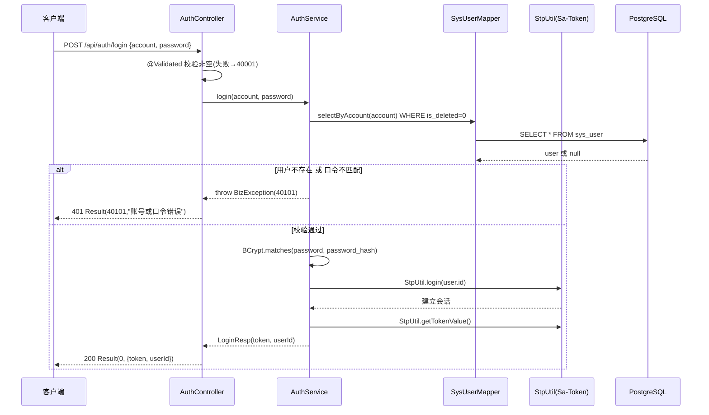
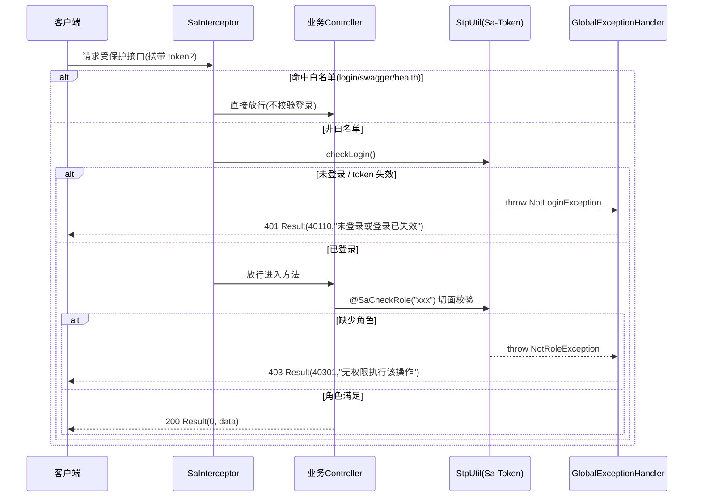

# U2 认证/权限基座 · 详细设计

> 阶段三·详细设计产物 · 创建日期：2026-06-05 · 状态：草稿
> 上游：阶段三 `tkxm-general`（概要设计·E-R）、`tkxm-database`（数据库）、`tkxm-prototype`（原型图）
> 下游：阶段四 `tkxm-coding`（编码与单测）、`tkxm-review`（审查）
> 对应：功能点 **U2**、模块 **M1 组织与权限（BC1）**、需求 **A2**、原型屏 `org`

---

## 1. 功能概述

U2 是采购项目管理系统的**认证与权限基座**，为后续所有业务模块（M2–M6）提供统一的「登录态」与「角色校验」能力。

- **范围内**：
  - 登录认证：账号 + 口令 → 颁发 token（BCrypt 校验口令哈希）。
  - 登出：注销当前会话登录态。
  - 当前用户：返回当前登录用户基本信息及其角色集合。
  - 基座能力：Sa-Token `StpUtil` 登录态管理；`SaInterceptor` 注册 + 路由白名单（login / swagger / health）；`@SaCheckRole` 注解式角色校验；`NotLoginException → 401`、`NotRoleException → 403` 统一映射进 `GlobalExceptionHandler`。
- **范围外（明确不含）**：
  - 组织 / 用户 / 角色的 CRUD（部门、项目组、用户、角色的增删改查、用户授角）—— 属 **U4**，本期仅消费 `sys_user / role / user_role` 表的现有数据（含 DDL seed 的内置角色与默认管理员）。
  - 细粒度权限点（`@SaCheckPermission`）、字段级授权、组织树鉴权 —— 原型 `org` 屏标注为 Non-goal，本系统采用轻量 RBAC（角色控制可见/可操作）。
- **依赖**：U1（数据库基线，提供 `sys_user / role / user_role` 表与 seed 数据）。
- **被依赖**：所有业务模块（M2–M6）的接入层鉴权与 `@SaCheckRole` 角色校验。M1 在概要设计 §5 中为「共享内核」，被全员依赖。
- **角色枚举**（`role.code`，db 规格 §5）：`editor`（编制人）/ `purchase_mgr`（采购主管）/ `dept_mgr`（部门主管）/ `warehouse`（仓管员）/ `requester`（领用人）/ `admin`（管理员）。一个用户可被赋予多个角色（原型 `org`：赵仓管 = 仓管员 + 领用人）。

---

## 2. 功能规约

### 2.1 前置条件（Pre-conditions）

| 编号 | 前置条件 |
|---|---|
| PRE-1 | `sys_user / role / user_role` 表已由 U1 建立并完成 seed（至少含内置 6 角色与默认管理员）。|
| PRE-2 | 用户口令以 BCrypt 哈希存储于 `sys_user.password_hash`（VARCHAR(128)），非明文。|
| PRE-3 | 登录/登出/当前用户接口的请求经接入层，已注册 `SaInterceptor`。|

### 2.2 后置条件（Post-conditions）

| 编号 | 后置条件 |
|---|---|
| POST-1 | 登录成功后，Sa-Token 会话建立（`StpUtil.login(userId)`），返回 `tokenValue`；后续请求携带该 token 即视为已登录。|
| POST-2 | 登出成功后，当前 token 对应登录态被注销（`StpUtil.logout()`），该 token 失效。|
| POST-3 | `GET /api/auth/me` 在已登录态下返回当前用户 id / account / name / department_id 及角色 code 列表。|
| POST-4 | 任何非白名单受保护接口，在未登录时返回 401（错误码 40110）、角色不符时返回 403（错误码 40301）。|

### 2.3 不变量（Invariants）

| 编号 | 不变量 |
|---|---|
| INV-1 | 口令永不以明文存储或返回；响应体不包含 `password_hash`。|
| INV-2 | 登录态唯一标识为 `sys_user.id`（loginId）；角色校验始终基于该 id 实时（或会话缓存）加载 `user_role → role.code`。|
| INV-3 | 仅 `is_deleted = 0` 的用户可登录、仅 `is_deleted = 0` 的角色参与权限判定。|
| INV-4 | 账号不存在与口令错误对外返回**同一错误**（40101「账号或口令错误」），不泄露账号是否存在。|

### 2.4 验收准则（Given-When-Then）

- **AC-1（正常登录）**
  Given 存在未删除用户 `account=admin`、其 `password_hash` 为明文口令的 BCrypt 哈希；
  When 调用 `POST /api/auth/login`，body=`{account:"admin", password:"<正确口令>"}`；
  Then 返回 `code=0`，`data.token` 非空，且该 token 可用于后续受保护请求。

- **AC-2（错误口令）**
  Given 用户 `admin` 存在；
  When 以错误口令调用 `POST /api/auth/login`；
  Then 返回 HTTP 401、`code=40101`、message=「账号或口令错误」，不颁发 token。

- **AC-3（账号不存在）**
  Given 不存在 `account=ghost` 的未删除用户；
  When 以 `account=ghost` 调用登录；
  Then 返回 HTTP 401、`code=40101`、message=「账号或口令错误」（与 AC-2 表现一致，不泄露账号存在性，见 INV-4）。

- **AC-4（未登录访问受保护接口）**
  Given 未携带有效 token；
  When 调用 `GET /api/auth/me`（或任意非白名单接口）；
  Then 返回 HTTP 401、`code=40110`、message=「未登录或登录已失效」。

- **AC-5（角色不符）**
  Given 用户 `editor` 已登录但仅持 `editor` 角色；
  When 调用一个标注 `@SaCheckRole("purchase_mgr")` 的受保护接口；
  Then 返回 HTTP 403、`code=40301`、message=「无权限执行该操作」。

- **AC-6（当前用户与多角色）**
  Given 用户 `赵仓管` 持 `warehouse` 与 `requester` 两角色且已登录；
  When 调用 `GET /api/auth/me`；
  Then 返回 `code=0`，`data.roles` 包含 `["warehouse","requester"]`（顺序不限），且不含 `password_hash`。

- **AC-7（登出）**
  Given 已登录持有 token T；
  When 调用 `POST /api/auth/logout`，随后用 T 调用 `GET /api/auth/me`；
  Then 登出返回 `code=0`；其后用 T 的 me 请求返回 401（40110）。

- **AC-8（参数缺失）**
  Given `account` 或 `password` 为空白；
  When 调用 `POST /api/auth/login`；
  Then 返回 HTTP 400、`code=40001`（参数校验失败，由 `@Validated` 触发）。

---

## 3. 处理流程与时序

### 3.1 登录时序



### 3.2 受保护请求时序（含未登录 / 角色不符两条分支）



---

## 4. 数据流与状态

### 4.1 读写表

| 表 | 操作 | 触点 | 字段 |
|---|---|---|---|
| `sys_user` | 读 | 登录校验、加载当前用户 | `id / account / password_hash / name / department_id / is_deleted` |
| `role` | 读 | 加载角色 code（权限判定） | `id / code / is_deleted` |
| `user_role` | 读 | 关联用户与角色 | `user_id / role_id` |

> U2 **只读** BC1 三张表，不产生写操作（用户/角色维护属 U4）。表/字段引用 db 规格 §3.1。

### 4.2 登录态会话

- **会话标识**：`loginId = sys_user.id`（Long）。Sa-Token 以此为会话主键。
- **token 载体**：默认 Sa-Token 配置（token 名、有效期、是否并发登录、是否共享 token 由 `application.yml` 的 `sa-token.*` 决定，详见 §10 TBD-1）。
- **角色解析**：实现 `StpInterface.getRoleList(loginId, loginType)`，按 `loginId` 查 `user_role JOIN role`（`is_deleted=0`）返回 `List<String>`（role code）。`@SaCheckRole` 与 `StpUtil.getRoleList()` 均经此回调；可叠加 Sa-Token 会话级缓存以降库压。
- **角色权限模型**：role code → 角色；权限点列表为空（轻量 RBAC，不用 `getPermissionList`）。

### 4.3 状态

U2 自身**无业务状态机**。登录态仅两态：`未登录 ↔ 已登录`，由 `StpUtil.login / logout` 切换；token 失效（超时/被注销）回落到「未登录」。

---

## 5. 关键逻辑

### 5.1 口令 BCrypt 校验

- 入库哈希：U4 创建用户时用 `new BCryptPasswordEncoder().encode(rawPassword)`（spring-security-crypto），结果写入 `sys_user.password_hash`。U2 不写库，仅校验。
- 登录校验：`bCryptPasswordEncoder.matches(rawPassword, user.getPasswordHash())`。
- `BCryptPasswordEncoder` 声明为单例 `@Bean`（无状态、线程安全）。
- INV-4 落地：用户不存在时**不可短路返回**，应继续按「校验失败」统一抛 `BizException(40101)`；为防时序侧信道，可在用户不存在时对一个固定 dummy 哈希执行一次 `matches` 后再抛错（可选加固，见 §10 TBD-2）。

### 5.2 角色加载（StpInterface 实现）

```text
class StpInterfaceImpl implements StpInterface:
  getRoleList(loginId, loginType):
     userId = Long(loginId)
     return roleMapper.selectRoleCodesByUserId(userId)   // user_role JOIN role WHERE role.is_deleted=0
  getPermissionList(loginId, loginType):
     return Collections.emptyList()   // 轻量 RBAC，不用权限点
```

- SQL（示意）：`SELECT r.code FROM user_role ur JOIN role r ON ur.role_id = r.id WHERE ur.user_id = #{userId} AND r.is_deleted = 0`。
- 多角色：返回多条 code，`@SaCheckRole` 默认 `SaMode.OR`（持任一即过）；需「同时持有多角色」时显式 `mode = SaMode.AND`。

### 5.3 白名单与拦截器顺序

- **拦截器注册**（`WebMvcConfigurer.addInterceptors`）：注册 `SaInterceptor(handle -> StpUtil.checkLogin())`，`addPathPatterns("/**")`，`excludePathPatterns` 排除白名单。
- **白名单**（excludePathPatterns）：
  - `/api/auth/login`（登录本身不需登录态）
  - `/swagger-ui/**`、`/v3/api-docs/**`（springdoc）
  - `/actuator/health`、`/api/health`（健康检查）
  - 注：`/api/auth/logout`、`/api/auth/me` **不在白名单**（需登录态）。
- **顺序**：`SaInterceptor`（登录态校验，拦截器层）先于 `@SaCheckRole`（角色校验，AOP 切面层）。即「先认证、后鉴权」：未登录请求在拦截器即抛 `NotLoginException`（40110），不会进入方法体的角色切面；已登录但角色不符则在方法切面抛 `NotRoleException`（40301）。
- 异常映射：两类异常在现有 `GlobalExceptionHandler` 统一转 `Result` + 对应 HTTP 状态（见 §8）。

---

## 6. 接口定义

> 统一前缀 `/api`。统一响应 `com.gov.procurement.common.Result<T>`（`code=0` 成功）。包根 `com.gov.procurement`。

### 6.1 `POST /api/auth/login` — 登录

| 项 | 内容 |
|---|---|
| 路由 | `POST /api/auth/login` |
| 鉴权 | 白名单，无需登录态 |
| Content-Type | `application/json` |

**请求体 `LoginReq`**

| 字段 | 类型 | 必填 | 校验 | 说明 |
|---|---|---|---|---|
| account | String | 是 | `@NotBlank` | 登录账号 |
| password | String | 是 | `@NotBlank` | 明文口令（HTTPS 传输） |

**响应 `Result<LoginResp>`**

| 字段 | 类型 | 说明 |
|---|---|---|
| data.token | String | Sa-Token tokenValue |
| data.userId | Long | 登录用户 id |

成功示例：`{"code":0,"message":"ok","data":{"token":"xxxx","userId":1}}`

| 错误码 | HTTP | 场景 |
|---|---|---|
| 40001 | 400 | account/password 为空（`@Validated`） |
| 40101 | 401 | 账号不存在或口令错误（统一） |
| 50000 | 500 | 系统异常 |

### 6.2 `POST /api/auth/logout` — 登出

| 项 | 内容 |
|---|---|
| 路由 | `POST /api/auth/logout` |
| 鉴权 | 需登录态（非白名单）|
| 请求体 | 无（token 经 header 传递） |

**响应 `Result<Void>`**：`{"code":0,"message":"ok","data":null}`

实现：`StpUtil.logout()`（注销当前 token）。

| 错误码 | HTTP | 场景 |
|---|---|---|
| 40110 | 401 | 未登录 / token 失效 |
| 50000 | 500 | 系统异常 |

> 说明：登出对「已失效 token」是否幂等返回成功，取决于是否放白名单。本设计将 logout 置于受保护路径，未登录调用返回 40110；若产品希望幂等成功，见 §10 TBD-3。

### 6.3 `GET /api/auth/me` — 当前用户与角色

| 项 | 内容 |
|---|---|
| 路由 | `GET /api/auth/me` |
| 鉴权 | 需登录态（非白名单）|
| 请求参数 | 无 |

**响应 `Result<MeResp>`**

| 字段 | 类型 | 说明 |
|---|---|---|
| data.userId | Long | 用户 id（= `StpUtil.getLoginIdAsLong()`） |
| data.account | String | 登录账号 |
| data.name | String | 姓名 |
| data.departmentId | Long | 所属部门 id |
| data.roles | List\<String\> | 角色 code 列表（如 `["warehouse","requester"]`） |

成功示例：`{"code":0,"message":"ok","data":{"userId":4,"account":"zhao","name":"赵仓管","departmentId":3,"roles":["warehouse","requester"]}}`

实现：`userId = StpUtil.getLoginIdAsLong()` → 查 `sys_user`（剔除 `password_hash`）→ `roles = StpUtil.getRoleList()`。

| 错误码 | HTTP | 场景 |
|---|---|---|
| 40110 | 401 | 未登录 / token 失效 |
| 50000 | 500 | 系统异常 |

### 6.4 关键类清单（编码指引）

| 类 | 包 | 职责 |
|---|---|---|
| `AuthController` | `com.gov.procurement.auth.controller` | 三接口入口、`@Validated` |
| `AuthService` / `AuthServiceImpl` | `com.gov.procurement.auth.service` | 登录校验、组装 me/login 响应 |
| `LoginReq` / `LoginResp` / `MeResp` | `com.gov.procurement.auth.dto` | 请求/响应 DTO |
| `StpInterfaceImpl` | `com.gov.procurement.auth.security` | `StpInterface`：角色加载 |
| `SaTokenConfig` | `com.gov.procurement.config` | `WebMvcConfigurer`：注册 `SaInterceptor` + 白名单 |
| `PasswordEncoderConfig` | `com.gov.procurement.config` | `BCryptPasswordEncoder` `@Bean` |
| `SysUser` / `Role` 实体、`SysUserMapper` / `RoleMapper` | `com.gov.procurement.auth.domain` / `.mapper` | MyBatis-Plus 实体与 Mapper（只读） |

---

## 7. 测试点

> T-x 映射 §2.4 的 AC-x；编码阶段（`tkxm-coding`）落为单测/集成测试（MockMvc + Testcontainers PostgreSQL）。

| 编号 | 测试点 | 映射 | 类型 | 期望 |
|---|---|---|---|---|
| T-1 | 正确账号+口令登录 | AC-1 | 集成 | `code=0`，token 非空，token 可访问 me |
| T-2 | 正确账号+错误口令 | AC-2 | 集成 | HTTP 401，`code=40101` |
| T-3 | 不存在账号登录 | AC-3 | 集成 | HTTP 401，`code=40101`（与 T-2 表现一致） |
| T-4 | 未登录访问 `/api/auth/me` | AC-4 | 集成 | HTTP 401，`code=40110` |
| T-5 | 已登录但角色不符（命中 `@SaCheckRole`） | AC-5 | 集成 | HTTP 403，`code=40301` |
| T-6 | 多角色用户 me 返回全部角色且无口令 | AC-6 | 集成 | roles 含全部 code，响应不含 `password_hash` |
| T-7 | 登出后旧 token 失效 | AC-7 | 集成 | logout `code=0`；旧 token 调 me 返回 40110 |
| T-8 | 登录参数缺失（空 account/password） | AC-8 | 单元/集成 | HTTP 400，`code=40001` |
| T-9 | `StpInterfaceImpl.getRoleList` SQL 仅返回 `is_deleted=0` 角色 | INV-3 | 单元 | 软删角色不出现在结果 |
| T-10 | BCrypt `matches` 对正确/错误口令分别 true/false | §5.1 | 单元 | 校验逻辑正确 |
| T-11 | 白名单路径（health/swagger/login）免登录可达 | §5.3 | 集成 | 无 token 也返回非 401 |

---

## 8. 异常处理

> 错误码全集（本功能用到）：40001 参数 / 40101 账号或口令错误(401) / 40110 未登录或 token 失效(401) / 40301 角色不符或无权限(403) / 50000 系统。

| 异常 | 触发 | 错误码 | HTTP | message | 处理位置 |
|---|---|---|---|---|---|
| `MethodArgumentNotValidException` | `@Validated` 校验失败 | 40001 | 400 | 字段错误聚合 | `GlobalExceptionHandler.handleValidation` |
| `BizException(40101,...)` | 账号不存在/口令错误 | 40101 | 401 | 账号或口令错误 | `AuthService` 抛 → `GlobalExceptionHandler.handleBiz` |
| `NotLoginException` | 未登录/token 失效 | 40110 | 401 | 未登录或登录已失效 | `GlobalExceptionHandler.handleNotLogin` |
| `NotRoleException` / `NotPermissionException` | 角色不符/无权限 | 40301 | 403 | 无权限执行该操作 | `GlobalExceptionHandler.handleNoPermission` |
| `Exception`（兜底） | 其余未捕获 | 50000 | 500 | 服务器内部错误 | `GlobalExceptionHandler.handleOther` |

**对现有脚手架 `GlobalExceptionHandler` 的差异（编码阶段需对齐错误码）**：现有实现 `handleNotLogin` 返回 `40100`、`handleNoPermission` 返回 `40300`、`handleValidation`/`handleBiz` 默认 `40000`。本功能约定使用 **40110 / 40301 / 40001 / 40101**。编码时应：
- 将 `handleNotLogin` 的 `40100` 改为 `40110`；
- 将 `handleNoPermission` 的 `40300` 改为 `40301`；
- 业务侧 `BizException` 显式传 `40101`（账号或口令错误）、`40001`（参数）等具体码，由 `handleBiz` 透传 `e.getCode()`；
- `BizException` 默认构造的 `40000` 仅作兜底，登录场景必须显式传 40101。
> 注意：`handleBiz` 当前固定返回 HTTP 400，而 40101 语义为 401。编码阶段需让 `handleBiz` 依据错误码或异常类型映射 HTTP（例如 401 系列码 → `UNAUTHORIZED`），或为「账号或口令错误」单独定义异常/分支返回 401。此点列入 §10 TBD-4。

---

## 9. 依赖与影响

### 9.1 依赖

| 依赖 | 类型 | 说明 |
|---|---|---|
| U1 数据库基线 | 强依赖 | 提供 `sys_user / role / user_role` 表及 seed（6 内置角色、默认管理员） |
| Sa-Token 1.40（`sa-token-spring-boot3-starter`） | 库 | 登录态、`SaInterceptor`、`@SaCheckRole`、`StpInterface`；`backend/pom.xml` 已含 |
| spring-security-crypto（BCrypt） | 库 | 口令哈希校验；`backend/pom.xml` 已含 |
| `common.Result / BizException / GlobalExceptionHandler` | 脚手架 | 统一响应与异常映射（§8 需对齐错误码） |
| MyBatis-Plus 3.5.9 | 库 | `sys_user/role/user_role` 实体与 Mapper（只读） |

### 9.2 影响（被依赖）

- **所有业务模块（M2–M6）**：接入层统一经 `SaInterceptor` 校验登录态；命令型接口用 `@SaCheckRole(...)` 控制角色（如 `purchase_mgr` 审批、`warehouse` 出库审批、`requester` 发起领用）。
- **数据归属过滤**：本期不在 U2 实现（轻量 RBAC + 数据归属是各模块自身的查询过滤维度）；U2 仅提供 `StpUtil.getLoginIdAsLong()` 供各模块获取当前用户作归属判定。
- **U4（组织/用户/角色 CRUD）**：复用 U2 的 `BCryptPasswordEncoder` 做口令入库；写入的 `password_hash` 被 U2 登录校验消费。

---

## 10. 待确认（TBD）

| 编号 | 待确认项 | 现状/暂定 | 拍板人 |
|---|---|---|---|
| TBD-1 | Sa-Token 会话参数（token 有效期、是否并发登录、是否共享 token、token 风格） | 暂用 starter 默认；按内部系统安全策略在 `application.yml` 配置 | 技术 |
| TBD-2 | 是否对「账号不存在」做时序侧信道加固（dummy `matches`） | 暂定加固（恒定时延），降信息泄露 | 技术/安全 |
| TBD-3 | `logout` 是否幂等成功（放白名单 vs 受保护返回 40110） | 暂定受保护、未登录返回 40110 | 产品 |
| TBD-4 | `handleBiz` 的 HTTP 状态映射（40101 需 401 而非 400） | 编码阶段按错误码分段映射 HTTP 状态 | 技术 |
| TBD-5 | 角色列表是否启用 Sa-Token 会话缓存（降库压 vs 授角变更实时性） | 暂定实时查库；如需缓存须配套失效策略 | 技术 |
