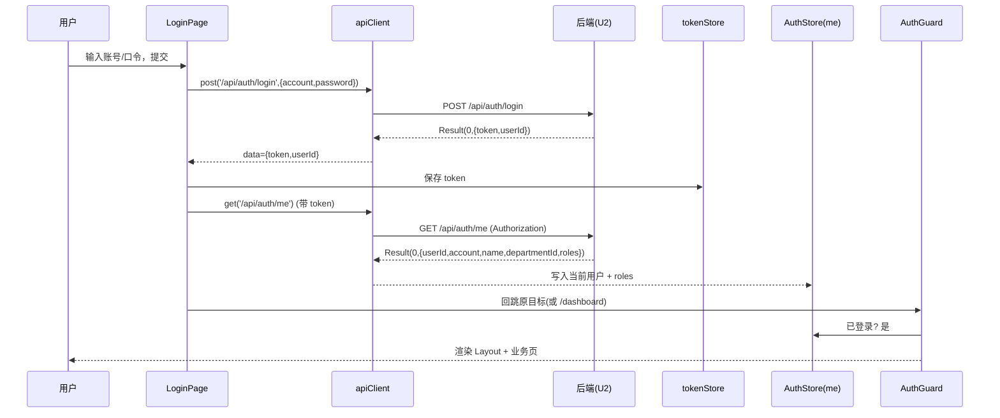
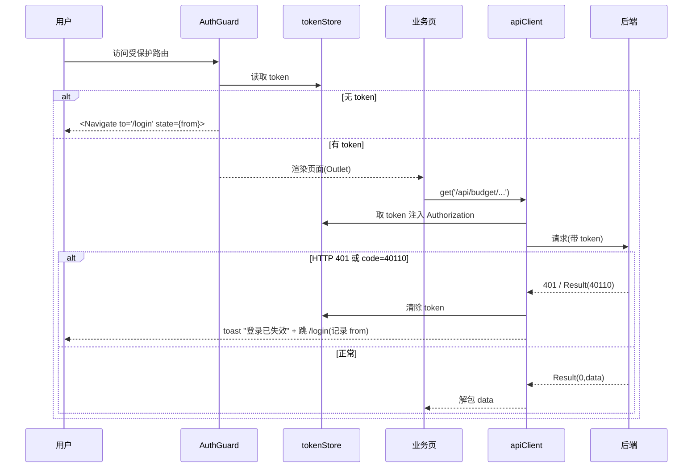
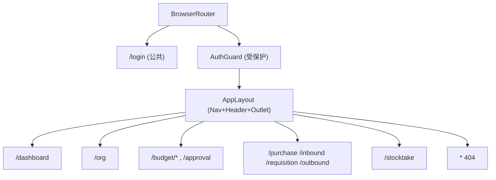

# U3 前端外壳 · 详细设计

> 阶段三·详细设计产物 · 创建日期：2026-06-05 · 状态：草稿
> 上游：阶段三 `tkxm-general`（概要设计）、`tkxm-prototype`（原型图）
> 下游：阶段四 `tkxm-coding`（编码与单测）、`tkxm-review`（审查）
> 对应：功能点 **U3**、前端外壳、需求 **A2**、原型屏 `全局导航`

---

## 1. 功能概述

U3 是采购项目管理系统的**前端应用外壳（Application Shell）**，基于 React 18 + Vite 6 + TypeScript 5 + Semi UI（Semi Design）构建。它为后续所有业务页（U14 集成各业务功能点）提供统一的「壳子」：整体布局、侧边导航、路由、登录页与路由守卫、按角色的菜单可见性、以及统一的 API 客户端。

- **范围内**：
  - **整体布局（Layout）**：左侧导航（4 导航域 A/B/D/F）+ 顶部条（当前用户 / 登出）+ 内容区（路由出口 `<Outlet>`），对齐原型 `index.html` 的信息架构。
  - **路由表（React Router v6）**：原型每一屏（screen id）映射为一条受保护路由；登录页为公共路由。
  - **登录页 + 路由守卫**：基于 U2 登录态（token + `/api/auth/me`）；未登录访问受保护路由跳转 `/login`，登录后回跳原目标。
  - **按角色显示/隐藏菜单**：消费 `/api/auth/me` 返回的 `roles`（Sa-Token 角色 code），在前端控制菜单项可见性（轻量 RBAC，前端可见性为体验层，权威鉴权仍在后端 `@SaCheckRole`）。
  - **统一 API 客户端（apiClient）**：封装 fetch、统一解包 `Result<T>`（`code=0` 取 `data`，否则抛 `ApiError`）、自动附带 token、401 跳登录、错误 toast。
  - **Vite 代理**：`/api` 代理到后端 8080（脚手架已有，复述并固化约定）。
- **范围外（明确不含）**：
  - 各业务页的具体表单/表格/交互逻辑 —— 属各业务功能点，**由 U14 前端集成填充**进 U3 提供的路由占位与 `apiClient`。
  - 后端接口实现（登录 / me / 业务接口）—— 属 U2 及各后端功能点。
  - 细粒度权限点、字段级授权 —— 系统采用轻量 RBAC（角色控制可见/可操作），与 U2 一致。
- **依赖**：**软·契约级依赖 U2**——仅需 U2 的登录契约（`POST /api/auth/login`、`GET /api/auth/me`、`POST /api/auth/logout`）与 `Result<T>` 响应约定；U2 未就绪时前端可基于该契约 **mock 先行**开发。
- **被依赖**：**U14 前端集成**（各业务页在 U3 的路由槽位内挂载，统一经 `apiClient` 调后端）；所有前端业务页共用 U3 的 Layout、AuthGuard、apiClient。

### 1.1 现状脚手架确认

| 项 | 现状（来自 `frontend/`） | U3 动作 |
|---|---|---|
| React / ReactDOM | `^18.3.1`（`main.tsx` 用 `createRoot` + `StrictMode`） | 沿用 |
| Vite | `^6.0.3`；`/api` 代理 8080、port 5173 已配 | 沿用代理配置 |
| Semi UI | `@douyinfe/semi-ui` `^2.74.0`、`@douyinfe/semi-icons` `^2.74.0`；`semi.min.css` 已在 `main.tsx` 引入 | 沿用，扩展 `Layout/Nav/Toast` 等组件 |
| React Router | `react-router-dom` `^6.28.0` 已在依赖 | U3 启用（脚手架未接线，当前 `App.tsx` 仅为 U1 健康检查占位） |
| 测试 | Vitest `^2.1.8` + `@testing-library/react` + jsdom，`vite.config.ts` 已配 test | U3 单测落于此栈 |

> 当前 `App.tsx` 是 U1 的 `/api/health` 联通占位页，U3 将其改造为「Router + Shell」。无需新增运行时依赖。

---

## 2. 功能规约

### 2.1 前置条件（Pre-conditions）

| 编号 | 前置条件 |
|---|---|
| PRE-1 | U2 登录契约可用或可 mock：`POST /api/auth/login` → `Result<{token,userId}>`；`GET /api/auth/me` → `Result<{userId,account,name,departmentId,roles}>`。|
| PRE-2 | 后端统一响应为 `Result<T>`（`{code,message,data}`，`code=0` 成功），未登录/失效返回 HTTP 401。|
| PRE-3 | Vite dev server `/api` 代理到后端 8080（`vite.config.ts` 已配）。|

### 2.2 后置条件（Post-conditions）

| 编号 | 后置条件 |
|---|---|
| POST-1 | 未登录访问任意受保护路由，浏览器地址跳转 `/login`，并记录原目标（登录后回跳）。|
| POST-2 | 登录成功后 token 持久化（见 §10 TBD-1），后续 `apiClient` 请求自动携带；`me` 拉取成功后进入应用外壳。|
| POST-3 | 应用外壳渲染左侧 4 导航域（A/B/D/F），菜单项按当前用户 `roles` 过滤可见。|
| POST-4 | `apiClient` 对 `code=0` 解包返回 `data`；`code≠0` 抛 `ApiError` 并 toast 错误 message；HTTP 401 触发登出并跳 `/login`。|

### 2.3 不变量（Invariants）

| 编号 | 不变量 |
|---|---|
| INV-1 | 前端菜单/路由可见性仅为**体验层**；权威鉴权恒在后端（Sa-Token `@SaCheckRole`）。前端隐藏不等于安全边界。|
| INV-2 | 所有业务数据请求统一经 `apiClient`，不直接裸调 `fetch`（健康检查等无鉴权探针除外）。|
| INV-3 | token 只在登录成功后写入、登出/401 时清除；`me` 信息（含 roles）随会话存于内存态（不长久持久化敏感信息，见 §10 TBD-1）。|
| INV-4 | 路由表与原型 screen id 一一对应（不新增/不遗漏屏），导航域归属与概要 §6 的 A/B/D/F 对照一致。|

### 2.4 验收准则（Given-When-Then）

- **AC-1（未登录跳登录）**
  Given 无有效 token；
  When 直接访问受保护路由（如 `/approval`）；
  Then 渲染跳转到 `/login`，且原目标 `/approval` 被记录用于登录后回跳。

- **AC-2（登录成功进入外壳并回跳）**
  Given 在 `/login` 输入正确账号口令；
  When 提交，`login` 返回 `code=0` 且 `data.token` 非空，随后 `me` 成功；
  Then token 被持久化、`apiClient` 后续请求携带，地址回跳至原目标（无原目标则进 `/dashboard`），左侧导航渲染。

- **AC-3（按角色展示菜单）**
  Given 登录用户仅持 `editor` 角色；
  When 进入外壳；
  Then 左侧仅展示对该角色可见的菜单项（如 A·工作台/组织、B·预算导入/科目/审批的发起项），不展示仅 `warehouse`/`purchase_mgr` 可见的项（如「仓管审批出库」）。

- **AC-4（Result 成功解包）**
  Given 某接口返回 `{code:0,message:"ok",data:{...}}`；
  When 业务页经 `apiClient.get(url)` 调用；
  Then Promise resolve 为 `data`（不含 `code/message` 外壳）。

- **AC-5（Result 业务失败抛错并 toast）**
  Given 某接口返回 `{code:40001,message:"参数校验失败",data:null}`（HTTP 200/400 均可）；
  When 经 `apiClient` 调用；
  Then Promise reject 为 `ApiError(code=40001, message)`，并弹出错误 toast 显示该 message。

- **AC-6（401 跳登录）**
  Given token 失效；
  When 任意 `apiClient` 请求返回 HTTP 401（或 `code=40110`）；
  Then 清除 token、清空会话态，跳转 `/login`（记录当前路径回跳），仅 toast 一次「登录已失效」。

- **AC-7（登出）**
  Given 已登录，点击顶部「登出」；
  When 调用 `POST /api/auth/logout`（成功或失败均继续本地登出）；
  Then 清 token 与会话态，跳 `/login`。

- **AC-8（未知路由）**
  Given 访问不存在的路径；
  When 路由匹配失败；
  Then 渲染 404 占位（已登录）或按守卫跳 `/login`（未登录）。

---

## 3. 关键交互时序

### 3.1 登录 → 存 token → 守卫放行



### 3.2 受保护路由守卫 + 请求拦截带 token + 401 跳登录



---

## 4. 路由与导航结构

### 4.1 路由表（路径 → 页面 → 导航域 → 原型屏 id → 可见角色）

> 导航域 A/B/D/F 与原型左侧分组、概要 §6 对照一致；路由路径取语义化英文，与原型 `data-s`（screen id）一一对应。**可见角色**为前端菜单可见性建议（最终以后端 `@SaCheckRole` 为准）；`admin` 默认可见全部，下表省略。

| 路径 | 页面组件（占位，U14 填充） | 导航域 | 原型屏 id | 菜单标签 | 建议可见角色 |
|---|---|---|---|---|---|
| `/login` | `LoginPage` | —（公共） | —（新增登录页） | — | 全部（未登录可达） |
| `/dashboard` | `DashboardPage` | A | `dashboard` | A1 工作台 | 全部已登录 |
| `/org` | `OrgPage` | A | `org` | A2 组织与权限 | `admin` |
| `/budget/import` | `BudgetImportPage` | B | `import` | B1 预算导入 | `editor` |
| `/budget/subject` | `BudgetSubjectPage` | B | `subject` | B2 预算科目划分 | `editor` |
| `/budget/compare` | `SubjectComparePage` | B | `compare` | B4 科目比对·新增 | `editor` |
| `/approval` | `ApprovalPage` | B | `approval` | C1 两级审批 | `purchase_mgr`,`dept_mgr` |
| `/purchase` | `PurchasePage` | D | `purchase` | D1 采购执行 | `editor`,`purchase_mgr` |
| `/inbound` | `InboundPage` | D | `inbound` | D3 验收入库 | `warehouse` |
| `/requisition` | `RequisitionPage` | D | `requisition` | E1 领用申请 | `requester` |
| `/outbound` | `OutboundPage` | D | `outbound` | E2 仓管审批出库 | `warehouse` |
| `/stocktake` | `StocktakePage` | F | `stocktake` | F1 盘点与差异 | `warehouse` |
| `*` | `NotFoundPage` | —（兜底） | — | — | 已登录可见 |

- **默认路由**：`/` 重定向到 `/dashboard`（已登录）；未登录经守卫落 `/login`。
- **导航域结构**（左侧 4 段，对齐原型 stage 颜色分组）：
  - **A · 基础与权限**：工作台、组织与权限。
  - **B · 预算科目与审批**：预算导入、预算科目划分、科目比对·新增、两级审批。
  - **D · 采购入库与领用出库**：采购执行、验收入库、领用申请、仓管审批出库。
  - **F · 盘点**：盘点与差异。

> 注：原型把 6 个后端模块在 UI 合并为 A/B/D/F 四域（B=M2+M3、D=M4+M5+M6），U3 导航沿用此 4 域划分。

### 4.2 路由结构（嵌套）



---

## 5. 关键逻辑

### 5.1 统一 API 客户端（apiClient）

封装于 `src/api/client.ts`，对外暴露 `get/post/put/del`（及上传用 `postForm`）。核心职责：

1. **基址与代理**：所有 URL 以 `/api` 开头，经 Vite 代理转发后端（生产环境同源部署，亦走 `/api`）。
2. **请求拦截**：从 `tokenStore` 取 token，若存在则注入请求头（Sa-Token 默认 header 名 `satoken`，见 §10 TBD-3 与 U2 对齐）；JSON 请求设 `Content-Type: application/json`。
3. **响应处理**：
   - HTTP 401 → 触发统一登出流程（清 token、跳 `/login`、去抖 toast），抛 `ApiError(40110)`。
   - HTTP 5xx / 网络错误 → toast 通用错误，抛 `ApiError`。
   - HTTP 2xx → 解析 JSON 为 `Result<T>`，按 5.2 解包。
4. **错误 toast**：默认对失败弹 `Toast.error(message)`；调用方可传 `{ silent: true }` 关闭（用于需自定义错误处理的场景）。

伪代码：

```text
async function request(method, url, body?, opts?):
  headers = { ...jsonHeaders(body) }
  token = tokenStore.get()
  if token: headers[TOKEN_HEADER] = token
  resp = await fetch(url, { method, headers, body: serialize(body) })
  if resp.status == 401:
       handleUnauthorized()            // 清 token + 跳 /login + 去抖 toast
       throw new ApiError(40110, "登录已失效")
  if resp.status >= 500 or !resp.ok and not json:
       if !opts.silent: Toast.error("服务异常，请稍后重试")
       throw new ApiError(resp.status, "server error")
  result = await resp.json()           // Result<T>
  return unwrap(result, opts)          // 见 5.2
```

### 5.2 Result 解包与错误处理

```text
function unwrap(result, opts):
  if result.code === 0:
       return result.data              // 成功取 data
  else:
       if !opts.silent: Toast.error(result.message || "操作失败")
       if isAuthCode(result.code):     // 40110 等 → 也触发登出
            handleUnauthorized()
       throw new ApiError(result.code, result.message)
```

- 约定：`code=0` 成功；任何非 0 视为业务失败，抛 `ApiError{code,message}`。
- HTTP 401 与 `code=40110`（未登录/失效）双通道兜底——后端可能以 HTTP 401 体现，也可能 HTTP 200/4xx 携带 `code=40110`，两者都触发登出。
- `ApiError` 携带 `code`，便于业务页对特定错误码做定制处理（catch 后判断）。

### 5.3 路由守卫（AuthGuard）

- 组件 `AuthGuard` 包裹受保护路由组（React Router v6 的布局路由 + `<Outlet>`）。
- 判定：`tokenStore.get()` 有 token 且 `authStore.me` 已加载 → 放行渲染 `<AppLayout>`；否则：
  - 无 token → `<Navigate to="/login" state={{ from: location }} replace />`。
  - 有 token 但 `me` 未加载（刷新页面后内存态丢失）→ 触发一次 `GET /api/auth/me`：成功则填充 `authStore` 放行；失败（401）则按未登录处理跳 `/login`。期间渲染全局 `Spin`。
- 登录后回跳：`LoginPage` 读取 `location.state.from`，登录成功后 `navigate(from ?? '/dashboard', { replace: true })`。

### 5.4 菜单按角色过滤

- 菜单定义为静态配置 `navConfig`（数组：`{domain, label, path, screenId, roles?}`，`roles` 即 §4.1「建议可见角色」）。
- 渲染时：`visible = !item.roles || item.roles.some(r => myRoles.includes(r)) || myRoles.includes('admin')`。
- 空导航域（该用户在某域下无任何可见项）不渲染该域分组标题。
- 该过滤为体验层（INV-1）；直接输入受限路由 URL 仍会被后端 `@SaCheckRole` 拦截（403），前端 `apiClient` 对 403 toast「无权限」。

### 5.5 token 存储（tokenStore）

- 抽象为 `tokenStore`（`get()/set(token)/clear()`）单一出入口，便于切换底层存储。
- 暂定底层用 `localStorage`（键 `pmp_token`），保证刷新后仍登录；最终选型见 §10 TBD-1（localStorage vs cookie）。
- `me`（含 roles）存内存态（`authStore`），刷新后经 5.3 重新拉取，不持久化到 localStorage（降敏感信息暴露面，INV-3）。

---

## 6. 前端模块/组件契约

> 目录建议（`frontend/src/`）：`api/`（client、types）、`auth/`（store、guard、login）、`layout/`、`pages/`（各业务页占位）、`router.tsx`。

| 模块/组件 | 文件（建议） | 职责 / 对外契约 |
|---|---|---|
| `apiClient` | `api/client.ts` | `get/post/put/del/postForm(url, body?, opts?)`：注入 token、解包 `Result<T>`、401 登出、错误 toast；返回 `Promise<T>`，失败 reject `ApiError`。|
| `ApiError` | `api/client.ts` | `class ApiError extends Error { code:number; message:string }`。|
| `Result<T>` 类型 | `api/types.ts` | `{ code:number; message:string; data:T }`，与后端约定一致。|
| `tokenStore` | `auth/tokenStore.ts` | `get():string\|null / set(token) / clear()`；底层 localStorage（TBD-1）。|
| `authStore` | `auth/authStore.ts` | 当前用户与角色内存态：`me:MeResp\|null`、`setMe/clear`、`hasRole(code)`；选型见 §10 TBD-2。|
| `AuthGuard` | `auth/AuthGuard.tsx` | 受保护路由布局：校验登录态、必要时拉 `me`、未登录 `<Navigate to=/login>`，放行渲染 `<AppLayout>`。|
| `LoginPage` | `auth/LoginPage.tsx` | 登录表单（account/password）→ `apiClient.post('/api/auth/login')` → 存 token → 拉 `me` → 回跳。|
| `AppLayout` | `layout/AppLayout.tsx` | Semi `Layout`：左 `Nav`（4 域，按角色过滤）+ 顶部（用户名 + 登出）+ `Content`（`<Outlet>`）。|
| `navConfig` | `layout/navConfig.ts` | 静态导航配置（§4.1 表），驱动菜单与可对照路由表。|
| `useLogout` | `auth/useLogout.ts` | 登出钩子：`POST /api/auth/logout`（忽略失败）→ `tokenStore.clear()` + `authStore.clear()` → 跳 `/login`。|
| 各业务页占位 | `pages/*.tsx` | `DashboardPage/OrgPage/.../StocktakePage/NotFoundPage`：U3 仅给最小占位（标题 + 「待 U14 实现」提示），路由可达；**业务逻辑由 U14 填充**。|

**MeResp（前端类型，对齐 U2 §6.3）**

```text
type MeResp = {
  userId: number; account: string; name: string;
  departmentId: number; roles: string[];   // role code 列表，如 ["warehouse","requester"]
}
```

---

## 7. 测试点

> T-x 映射 §2.4 AC-x；落于 Vitest + `@testing-library/react`（jsdom），后端以 mock `apiClient` / mock fetch 替身。

| 编号 | 测试点 | 映射 | 类型 | 期望 |
|---|---|---|---|---|
| T-1 | 未登录访问受保护路由跳 `/login` 并记录 from | AC-1 | 组件 | 渲染 `<Navigate to=/login>`，`state.from` = 原路径 |
| T-2 | 登录成功存 token、拉 me、回跳原目标 | AC-2 | 组件 | token 写入 store，`me` 填充，跳转 from（或 `/dashboard`） |
| T-3 | `editor` 角色仅见对应菜单项 | AC-3 | 组件 | 渲染含 editor 可见项，不含 `warehouse`/`purchase_mgr` 专属项 |
| T-4 | `code=0` 解包返回 data | AC-4 | 单元 | `apiClient.get` resolve 为 `data` 对象 |
| T-5 | `code≠0` 抛 ApiError 并 toast | AC-5 | 单元 | reject `ApiError(40001)`，`Toast.error` 被调用且文案=message |
| T-6 | HTTP 401 清 token 跳登录（去抖 toast 一次） | AC-6 | 单元 | token 被清、跳 `/login`、toast 仅一次 |
| T-7 | 登出清态跳登录（logout 失败仍本地登出） | AC-7 | 组件 | token/authStore 清空，跳 `/login` |
| T-8 | 未知路由渲染 404（已登录） | AC-8 | 组件 | 渲染 `NotFoundPage` |
| T-9 | 刷新后内存 me 丢失 → 守卫重新拉 me 放行 | §5.3 | 组件 | 有 token 时触发 `GET /api/auth/me`，成功放行 |
| T-10 | `silent:true` 时业务失败不弹 toast | §5.1 | 单元 | reject ApiError 但 `Toast.error` 未被调用 |
| T-11 | 路由表与原型 screen id 一一对应（无缺漏） | INV-4 | 单元 | `navConfig` 的 screenId 集合 == 原型屏集合 |

---

## 8. 异常处理

| 场景 | 触发 | 前端处理 | 用户感知 |
|---|---|---|---|
| 网络错误 / 请求超时 | `fetch` reject、断网 | 捕获 → `Toast.error("网络异常，请检查连接")` → 抛 `ApiError(-1)` | 错误 toast，停留当前页 |
| token 失效 / 未登录 | HTTP 401 或 `code=40110` | `tokenStore.clear()` + `authStore.clear()` → 跳 `/login`（记录 from）→ 去抖 toast「登录已失效」 | 跳登录页，提示一次 |
| 角色不符 | HTTP 403 或 `code=40301` | `Toast.error("无权限执行该操作")`，不跳转 | 错误 toast，停留当前页 |
| 业务校验失败 | `code=40001` 等非 0 业务码 | `unwrap` 抛 `ApiError{code,message}`，toast message（除非 `silent`） | 显示后端 message |
| 后端 5xx | HTTP 500/502/503 | `Toast.error("服务异常，请稍后重试")`，抛 `ApiError(status)` | 通用错误 toast |
| JSON 解析失败 | 响应非合法 JSON | toast 通用错误，抛 `ApiError` | 通用错误 toast |

- **去抖**：连续多请求同时 401 时，登出与 toast 仅触发一次（用 module 级标志位/时间窗去抖），避免 toast 风暴与重复跳转。
- 错误码与 U2 对齐：`40001` 参数 / `40101` 账号或口令错误(401) / `40110` 未登录或失效(401) / `40301` 无权限(403) / `50000` 系统。

---

## 9. 依赖与影响

### 9.1 依赖

| 依赖 | 类型 | 说明 |
|---|---|---|
| U2 认证/权限基座 | **软·契约级** | 仅依赖登录契约（`login`/`me`/`logout`）与 `Result<T>` 约定；U2 未就绪可按契约 mock 先行，无代码强耦合 |
| React Router v6（`react-router-dom`） | 库（已在依赖） | 路由表、`AuthGuard`、`<Outlet>`、`<Navigate>` |
| Semi UI（`@douyinfe/semi-ui`/`-icons`） | 库（已在依赖） | `Layout/Nav/Toast/Form/Spin/Button` 等 |
| Vite `/api` 代理 | 脚手架（已配） | dev 转发后端 8080；生产同源 |

### 9.2 影响（被依赖）

- **U14 前端集成**：各业务页（`pages/*`）在 U3 提供的路由槽位内实现，统一经 `apiClient` 调后端、复用 `AppLayout`/`AuthGuard`/`authStore`。U3 交付即为 U14 的「外壳与基础设施」。
- **所有前端业务功能**：共享统一的 token 注入、Result 解包、401/403/5xx 处理与错误 toast 规范；新增页只需注册路由 + 配 `navConfig` 一条。
- **现有 `App.tsx`**：U1 健康检查占位页被 U3 的 Router/Shell 改造取代（健康检查可保留为 `/dashboard` 或独立探针，不强制）。

---

## 10. 待确认（TBD）

| 编号 | 待确认项 | 现状/暂定 | 拍板人 |
|---|---|---|---|
| TBD-1 | token 存储方式：`localStorage` vs `cookie`（HttpOnly） | 暂定 `localStorage`（键 `pmp_token`，刷新保活，前端可读写注入 header）；若安全要求 HttpOnly cookie 则需后端 Set-Cookie 配合且改请求头注入逻辑 | 技术/安全 |
| TBD-2 | 前端状态管理选型（`authStore`/全局态） | 暂定轻量自管理（React Context + `useState`/订阅）或 Zustand；当前无第三方状态库依赖，避免过度引入 | 技术 |
| TBD-3 | token 请求头名称与传递方式（与 U2/Sa-Token 对齐） | 暂定 Sa-Token 默认 header `satoken`；需与 U2 §10 TBD-1 的 token 风格/header 配置一致 | 技术 |
| TBD-4 | 菜单可见角色映射（§4.1「建议可见角色」）是否需产品确认 | 暂按业务语义推定；以后端 `@SaCheckRole` 为权威，前端仅作可见性体验 | 产品/技术 |
