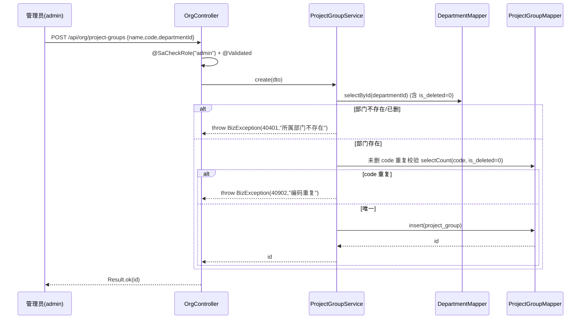
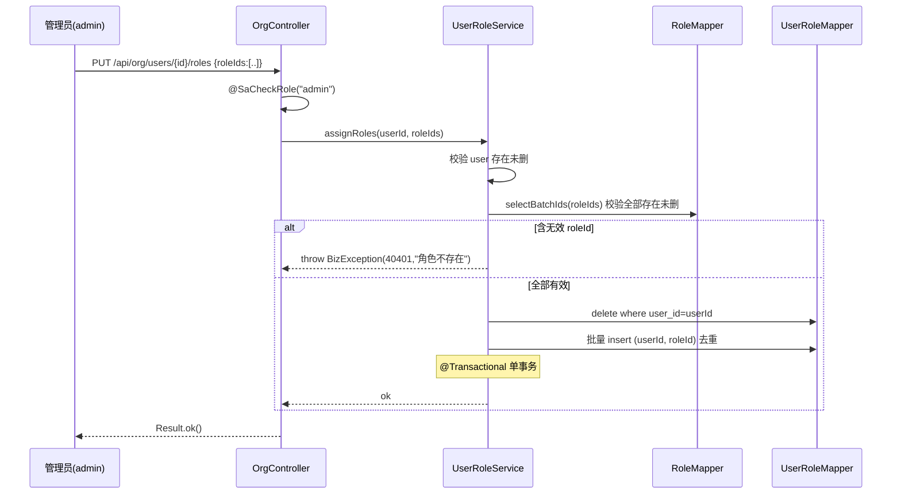
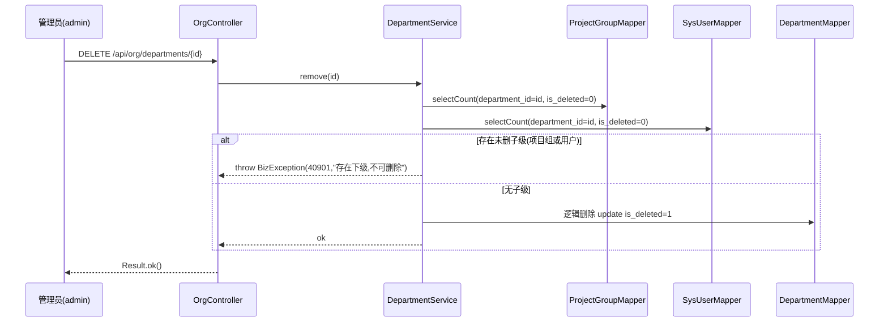
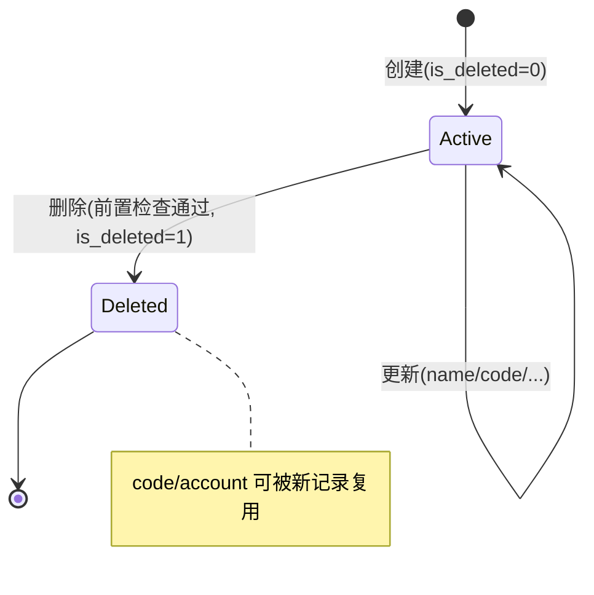

# U4 组织/项目组/用户角色管理 · 详细设计

> 阶段三·详细设计产物 · 创建日期：2026-06-05 · 状态：草稿
> 上游：`tkxm-general`（`docs/design/general/procurement-general.md` §4 M1 契约/角色）、`tkxm-database`（`docs/design/db/procurement-db.md` §3.1 BC1）、`tkxm-prototype`（`docs/prototype/index.html` 屏 `org`）
> 下游：`tkxm-coding`（编码）、`tkxm-review`（代码审查）
> 对应：功能点 **U4**、模块 **M1 组织与权限（BC1）**、需求 **A1, A2**、原型屏 `org`

---

## 1. 功能概述

U4 负责 BC1 组织与权限上下文中**主数据维护**与**用户授权关系维护**，是全系统的「共享内核」——部门 / 项目组作为所有业务模块（M2–M6）的数据归属维度被依赖，角色作为 Sa-Token 注解式鉴权（`@SaCheckRole`）的判定来源。

范围（4 类对象，5 张表）：

| 对象 | 表 | 维护内容 | 说明 |
|---|---|---|---|
| 部门 | `department` | CRUD | 组织单元，软删；`code` 未删唯一 |
| 项目组 | `project_group` | CRUD | 必须挂某部门（`department_id` 非空 FK）；软删；`code` 未删唯一 |
| 用户 | `sys_user` | CRUD | 软删；`account` 未删唯一；口令哈希 BCrypt（委托 U2） |
| 用户↔角色 | `user_role`（读 `role`） | 分配 / 解绑 / 查询 | 一人多角色；`(user_id, role_id)` 唯一 |

边界与约定：
- **不含登录鉴权**：登录、当前用户、token 由 **U2 认证基座**提供；本功能仅在接入层**复用** `@SaCheckRole("admin")` 做写权限护栏。
- **角色为内置枚举**（`role.code` ∈ editor/purchase_mgr/dept_mgr/warehouse/requester/admin，见 db §5），本功能只读角色、维护「用户↔角色」关系，**不提供角色 CRUD**（角色由 seed 初始化）。
- **软删除**：部门 / 项目组 / 用户走 `is_deleted`（0/1）逻辑删除（MyBatis-Plus 全局逻辑删除），物理记录保留；唯一性按「未删唯一」部分索引判定，软删后 `code`/`account` 可复用。
- **删除前置检查**：有子级（部门下有项目组 / 项目组挂用户引用）或被业务引用时 **RESTRICT**，返回 40901 提示，不级联删。

非功能：列表 / 树查询 P99 < 300ms（db §8）；越权写拒绝（40301）；口令不明文（BCrypt）。

---

## 2. 功能规约（AC）

> SDD：先定验收准则。AC 编号在 §7 与测试点 T-x 双向对应。

| 编号 | 验收准则 |
|---|---|
| **AC-1** | 创建部门：`name`、`code` 非空；`code` 在未删记录内唯一，重复返回 40902；成功落 `is_deleted=0`。 |
| **AC-2** | 创建项目组：`department_id` 必填且**指向存在且未删的部门**，否则 40401；`code` 未删唯一，重复 40902。 |
| **AC-3** | 创建用户：`account`、`name`、初始口令、`department_id` 必填；`account` 未删唯一（重复 40902）；`department_id` 须存在未删部门（否则 40401）；口令经 **BCrypt** 落 `password_hash`，明文不入库。 |
| **AC-4** | 用户↔角色分配：传入 `roleIds` 全量覆盖；每个 `roleId` 须存在未删角色，否则 40401；`(user_id, role_id)` 不重复（幂等覆盖）；支持一人多角色。 |
| **AC-5** | 删除部门：若其下存在未删项目组 **或** 未删用户，RESTRICT，返回 40901；否则软删（`is_deleted=1`）。 |
| **AC-6** | 删除项目组：若被业务单据引用（budget / stock_item / purchase_order / requisition 等以 `project_group_id` 关联），RESTRICT 返回 40901；否则软删。 |
| **AC-7** | 删除用户：软删（`is_deleted=1`）；同步清理 `user_role` 该用户绑定。被业务单据以 `*_by`/`applicant_id` 等引用时仅软删，不影响历史外键。 |
| **AC-8** | 软删后唯一性可复用：删除 `code=X` 的部门后，可再建 `code=X` 的部门（未删唯一索引放行）。 |
| **AC-9** | 写操作鉴权：仅持 `admin` 角色者可执行部门 / 项目组 / 用户 / 角色分配的增删改；否则 40301。查询不限角色（登录态即可）。 |
| **AC-10** | 更新：`code`/`account` 改为已存在的他人未删值时 40902；改 `department_id` 同样校验部门存在（40401）。 |

---

## 3. 时序

### 3.1 创建项目组（校验所属部门存在）



### 3.2 用户↔角色分配（全量覆盖）



### 3.3 删除部门（前置子级检查 RESTRICT）



---

## 4. 数据流与状态

### 4.1 软删除（is_deleted）

- 三张主数据表（`department`/`project_group`/`sys_user`）均含 `is_deleted SMALLINT(0/1)`，对齐脚手架 `application.yml` 的 MyBatis-Plus 全局逻辑删除（`logic-delete-field: isDeleted`，删=1 / 未删=0）。
- Mapper 的 `selectById`/`selectList`/`selectCount` 自动追加 `is_deleted = 0`；`deleteById` 自动转 `UPDATE ... SET is_deleted=1`。
- `role` 亦软删但本功能只读；`user_role` 为关系表，**不软删**，物理删/重建。

### 4.2 未删唯一（部分唯一索引）

依赖 db §3.1 的部分唯一索引（`WHERE is_deleted=0`），应用层在写前再做一次显式 count 校验以返回友好错误码 40902（避免直接抛 DB 唯一冲突）：

| 表 | 未删唯一索引（db） | 应用层校验字段 |
|---|---|---|
| `department` | `uk_department_code (code) WHERE is_deleted=0` | `code` |
| `project_group` | `uk_pg_code (code) WHERE is_deleted=0` | `code` |
| `sys_user` | `uk_user_account (account) WHERE is_deleted=0` | `account` |
| `user_role` | `uk_user_role (user_id, role_id)`（非部分） | `(user_id, role_id)` 覆盖去重 |

> DB 唯一索引为**最终防线**（并发下双写）；捕获 `DuplicateKeyException` 兜底转 40902。

### 4.3 状态流转

主数据无业务状态机，仅 `is_deleted` 两态：



---

## 5. 关键逻辑

### 5.1 项目组归属部门校验
创建 / 更新项目组及创建 / 更新用户时，对传入 `departmentId` 调 `departmentMapper.selectById`（已隐含 `is_deleted=0`）；为空判定为部门不存在 → `BizException(40401, "所属部门不存在")`。保证「项目组必挂存在部门」「用户必属存在部门」的归属不变量。

### 5.2 删除前置检查（RESTRICT）

| 删除对象 | 检查项（均限 `is_deleted=0` / 有效引用） | 命中处理 |
|---|---|---|
| 部门 | `project_group.department_id=id` 计数 > 0 **或** `sys_user.department_id=id` 计数 > 0 | 40901 |
| 项目组 | 被 `budget`/`purchase_order`/`stock_item`/`requisition`/`inbound_item` 等以 `project_group_id` 引用计数 > 0 | 40901 |
| 用户 | （软删，无硬阻断）；先删 `user_role` 绑定，再软删用户 | 直接软删 |

> 项目组引用检查范围在 §10 TBD-1 收敛为「按需查询的引用表清单」；编码阶段以一个聚合 `existsReferencedByBusiness(pgId)` 封装。

### 5.3 口令初始置位（委托 U2 的 BCrypt）
创建用户的初始口令、（可选）重置口令时，调用 **U2 已提供**的口令编码能力（`spring-security-crypto` 的 `BCryptPasswordEncoder.encode(raw)`），将密文写入 `sys_user.password_hash`。本功能**不实现**编码逻辑、不存明文、不回传哈希。账号登录校验由 U2 负责。

---

## 6. 接口定义

> 统一前缀 `/api/org`；统一响应 `Result<T>`（`code=0` 成功）；写操作均 `@SaCheckRole("admin")`，查询仅需登录态（U2）。错误码见 §6.6。

### 6.1 部门 Department

| # | 方法 | 路由 | 鉴权 | 说明 |
|---|---|---|---|---|
| 1 | GET | `/api/org/departments` | 登录 | 列表（默认仅未删） |
| 2 | GET | `/api/org/departments/{id}` | 登录 | 详情 |
| 3 | POST | `/api/org/departments` | admin | 创建 |
| 4 | PUT | `/api/org/departments/{id}` | admin | 更新 |
| 5 | DELETE | `/api/org/departments/{id}` | admin | 软删（前置检查） |

- 创建/更新入参：`name`(必, ≤128)、`code`(必, ≤64)。
- 出参：列表 `List<DepartmentVO{id,name,code}>`；创建返回 `id`。
- 错误码：40001 / 40301 / 40401（更新id不存在）/ 40901（删受限）/ 40902（code重复）。

### 6.2 项目组 ProjectGroup

| # | 方法 | 路由 | 鉴权 | 说明 |
|---|---|---|---|---|
| 6 | GET | `/api/org/project-groups?departmentId=` | 登录 | 列表（可按部门过滤） |
| 7 | GET | `/api/org/project-groups/{id}` | 登录 | 详情 |
| 8 | POST | `/api/org/project-groups` | admin | 创建（挂部门） |
| 9 | PUT | `/api/org/project-groups/{id}` | admin | 更新 |
| 10 | DELETE | `/api/org/project-groups/{id}` | admin | 软删（前置检查） |

- 创建/更新入参：`name`(必, ≤128)、`code`(必, ≤64)、`departmentId`(必, BIGINT)。
- 出参：`ProjectGroupVO{id,name,code,departmentId,departmentName}`。
- 错误码：40001 / 40301 / 40401（部门不存在 或 id不存在）/ 40901（被业务引用）/ 40902（code重复）。

### 6.3 用户 SysUser

| # | 方法 | 路由 | 鉴权 | 说明 |
|---|---|---|---|---|
| 11 | GET | `/api/org/users?departmentId=` | 登录 | 列表（含角色名，分页） |
| 12 | GET | `/api/org/users/{id}` | 登录 | 详情（含角色列表） |
| 13 | POST | `/api/org/users` | admin | 创建（口令 BCrypt） |
| 14 | PUT | `/api/org/users/{id}` | admin | 更新（name/department，不改口令） |
| 15 | DELETE | `/api/org/users/{id}` | admin | 软删 + 清绑定 |

- 创建入参：`account`(必, ≤64)、`name`(必, ≤64)、`password`(必, 明文初值)、`departmentId`(必)。
- 更新入参：`name`、`departmentId`（不含 `account`/`password`；口令重置另议，见 §10 TBD-2）。
- 出参：`SysUserVO{id,account,name,departmentId,departmentName,roles:[{id,code,name}]}`（**绝不含 `password_hash`**）。
- 错误码：40001 / 40301 / 40401（部门/id不存在）/ 40902（account重复）。

### 6.4 用户↔角色分配 UserRole

| # | 方法 | 路由 | 鉴权 | 说明 |
|---|---|---|---|---|
| 16 | GET | `/api/org/users/{id}/roles` | 登录 | 查该用户角色列表 |
| 17 | PUT | `/api/org/users/{id}/roles` | admin | 全量覆盖分配（一人多角色） |

- 入参：`{ roleIds: number[] }`（空数组=清空全部角色）。
- 出参：`List<RoleVO{id,code,name}>`（覆盖后结果）。
- 错误码：40001 / 40301 / 40401（user不存在 或 含无效roleId）。
- 语义：全量覆盖、幂等；事务内先删该用户全部绑定再批量去重插入（见 §3.2）。

### 6.5 角色字典（只读，辅助分配 UI）

| # | 方法 | 路由 | 鉴权 | 说明 |
|---|---|---|---|---|
| 18 | GET | `/api/org/roles` | 登录 | 内置角色列表（供分配下拉） |

- 出参：`List<RoleVO{id,code,name}>`（仅未删；不提供角色增删改）。

> 接口总数：**18**（部门 5 + 项目组 5 + 用户 5 + 角色分配 2 + 角色字典 1）。

### 6.6 错误码表

| code | 含义 | 触发场景 |
|---|---|---|
| 40001 | 参数错误 | `@Validated` 校验失败、空必填、长度超限 |
| 40301 | 无权限 | 非 admin 调写接口（`@SaCheckRole` 拦截） |
| 40401 | 资源不存在 | id / departmentId / roleId 指向不存在或已删记录 |
| 40901 | 删除受限 | 部门有子级 / 项目组被业务引用（RESTRICT） |
| 40902 | 编码重复 | `code`/`account` 未删唯一冲突 |
| 50000 | 系统错误 | 未捕获异常，全局兜底 |

---

## 7. 测试点（T-x ↔ AC-x）

| 编号 | 对应 AC | 测试点 | 预期 |
|---|---|---|---|
| **T-1** | AC-2 | 建项目组挂存在部门 | 成功，`department_id` 落库 |
| **T-2** | AC-2 | 建项目组挂不存在/已删部门 | 40401 |
| **T-3** | AC-1 | 同名 `code` 在未删记录内重复建部门 | 40902 |
| **T-4** | AC-5 | 删有未删项目组的部门 | 40901，记录仍 `is_deleted=0` |
| **T-5** | AC-5 | 删有未删用户的部门 | 40901 |
| **T-6** | AC-6 | 删被 budget 引用的项目组 | 40901 |
| **T-7** | AC-4 | 给用户分配多角色（如 warehouse+requester） | 成功，`user_role` 两行 |
| **T-8** | AC-4 | 分配含无效 roleId | 40401，事务回滚不写任何行 |
| **T-9** | AC-4 | 重复 roleId / 重复调用同一组 | 幂等，无重复行 |
| **T-10** | AC-8 | 软删 `code=X` 部门后再建 `code=X` | 成功（未删唯一放行） |
| **T-11** | AC-3 | 建用户后查 `password_hash` | 为 BCrypt 密文，VO 不返回 |
| **T-12** | AC-9 | 非 admin 调 POST 部门 | 40301 |
| **T-13** | AC-9 | 登录态查列表 | 成功（不限角色） |
| **T-14** | AC-3 | 建用户 `account` 未删重复 | 40902 |
| **T-15** | AC-7 | 删用户 | 软删 + `user_role` 绑定被清 |
| **T-16** | AC-10 | 更新 `code` 改为他人未删值 | 40902 |

---

## 8. 异常处理

| 来源 | 异常 | 处理 |
|---|---|---|
| 参数校验 | `MethodArgumentNotValidException` / 约束违反 | 全局处理器 → `Result.error(40001, 首条message)` |
| 鉴权 | `NotRoleException`（Sa-Token） | → `Result.error(40301, "无权限,仅管理员可维护组织")` |
| 资源缺失 | `BizException(40401, ...)` | 透传 → `Result.error(40401, msg)` |
| 删除受限 | `BizException(40901, ...)` | 透传 → `Result.error(40901, msg)` |
| 唯一冲突 | `BizException(40902,...)` / 兜底 `DuplicateKeyException` | → `Result.error(40902, "编码/账号已存在")` |
| 兜底 | 其余 `Exception` | → `Result.error(50000, "系统繁忙")` + 日志 |

- 所有写用例标 `@Transactional`；删用户、角色覆盖分配为多表写，必须单事务（异常整体回滚，见 T-8）。
- `BizException` 由概要 §7 约定的全局异常处理器统一转 `Result`；错误码取 `BizException.getCode()`。

---

## 9. 依赖与影响

**依赖（上游）**
- **U2 认证基座（M1）**：提供登录态、Sa-Token 上下文、`@SaCheckRole` 注解、`BCryptPasswordEncoder`（口令编码委托）。本功能不重复实现登录/口令编码。
- DB：`department`/`project_group`/`sys_user`/`role`/`user_role`（db §3.1）及其未删唯一部分索引、物理 FK；`role` 由 seed 初始化 6 个内置角色（db §8）。
- 脚手架：`Result`、`BizException`、MyBatis-Plus 全局逻辑删除配置。

**影响（下游 / 被依赖）**
- M1 为共享内核，被 M2–M6 全员依赖（概要 §5）：项目组 / 部门是 budget、purchase_order、stock_item、requisition、stocktake 等的归属维度；用户是审批人 / 验收人 / 领用人 / 上传人。
- 因此**删除 RESTRICT 必须严格**：项目组被业务引用即不可删，避免悬挂归属（AC-6 / §5.2）。
- 角色分配结果直接决定全系统 `@SaCheckRole` 判定，影响 U2 及各业务模块的可操作性。

---

## 10. 待确认（TBD）

| 编号 | 待确认项 | 现状/暂定 | 拍板人 |
|---|---|---|---|
| TBD-1 | 项目组删除时「被业务引用」的精确检查表清单与方式（逐表 count vs 统一引用视图） | 暂定按 budget/purchase_order/stock_item/requisition/inbound_item 逐表 count，封装 `existsReferencedByBusiness` | 技术 |
| TBD-2 | 用户口令重置 / 修改入口归属（U4 提供 admin 重置 vs U2 个人改密） | 暂定个人改密在 U2；admin 重置接口本期不开，留扩展 | 技术 |
| TBD-3 | 用户列表是否需分页与关键字搜索（量级千级） | 暂定提供分页参数，搜索按需 | 业务 |
```
