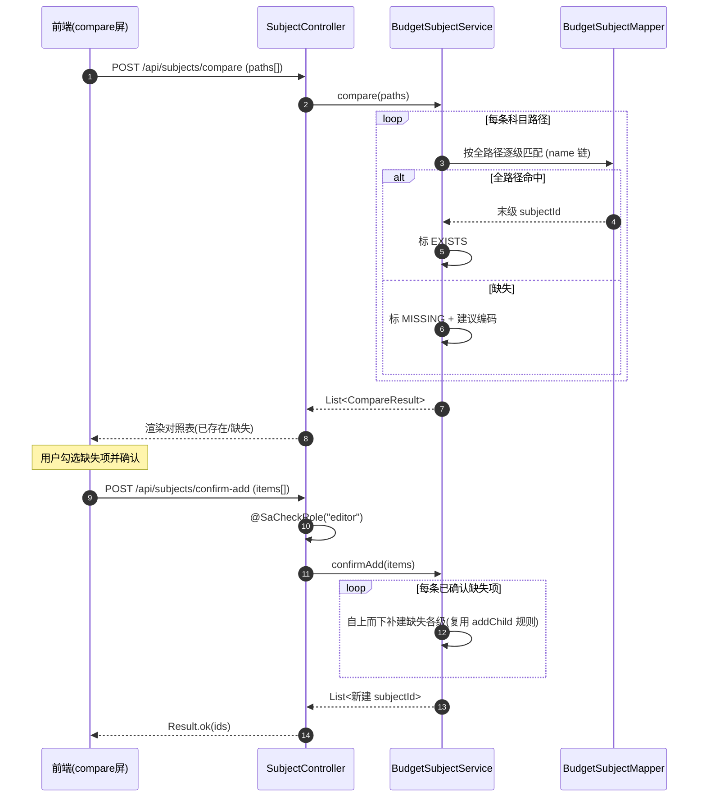

# U5 预算科目树 · 详细设计

> 阶段三 · 详细设计产物 · 2026-06-05 · 草稿
> 上游：`tkxm-general`（`docs/design/general/procurement-general.md` §4.1 M2 契约）、`tkxm-database`（`docs/design/db/procurement-db.md` §3.2 `budget_subject`）、`tkxm-prototype`（`docs/prototype/index.html` 屏 `subject` / `compare`）
> 下游：`tkxm-coding`（编码与单测）、`tkxm-review`（代码审查）
> 对应：功能点 **U5 预算科目树**、模块 **M2 预算与科目（BC2）**、需求 **B2 / B3 / B4**、原型屏 `subject` `compare`
> 设计方法：SDD（先定功能规约 AC）+ TDD（先定测试点 T）叠加

---

## 1. 概述

### 1.1 范围

U5 负责**预算科目主数据**的维护与查询，是 M2 预算上下文的基础读写能力。具体含：

- **科目树查询**（展开 / 折叠）：自引用多级树，父级金额由叶子汇总（查询时算，不落库）。
- **名称 / 编码模糊搜索**：基于 PostgreSQL `pg_trgm` 的 `ILIKE` 模糊匹配（需求 B2/B3）。
- **任意非叶节点下新增子级**：自动计算 `level`、把父节点 `is_leaf` 置 `false`（支持超过 5 级，需求 B2）。
- **与库中科目比对**：对一组「划分出的科目路径」标记 **已存在 / 库中缺失**（需求 B4）。
- **缺失科目人工确认后新增**：未确认不写库（需求 B4）。

### 1.2 不在本功能点范围（边界）

| 排除项 | 归属 |
|---|---|
| 预算模板导入（Excel 解析、生成预算明细） | U6 |
| 预算 vs 实际读模型（聚合采购实际支出） | U13 |
| 提交两级审批 | U7（原型 `compare` 屏「确认新增并提交审批」仅做跳转，提交动作属 U7） |
| 金额录入到 `budget_item` | U6 / U13 |

> 本功能点**只维护科目树本身**与「金额挂叶子」的不变量校验；金额数据归 U6/U13。原型 `subject` 屏底部「预算 vs 实际」卡片属 U13，本设计仅复用其展示树。

### 1.3 关键约束

- **金额只挂叶子**：`budget_item.subject_id` 必须指向 `is_leaf = true` 的科目；本功能点提供校验入口（新增子级使父变非叶时，若父已被预算引用则拦截）。
- **父级金额 = 子级汇总**：树查询返回的非叶节点 `amount` 为其子树叶子金额之和，**查询时计算，不持久化**。
- **编码未删唯一**：`uk_subject_code (code) WHERE is_deleted = 0`。
- **有子级 / 被预算引用不可删**：自引用 `ON DELETE RESTRICT` + 应用层前置校验（错误码 40901）。

### 1.4 鉴权

| 能力 | 角色（`@SaCheckRole`） |
|---|---|
| 树查询、模糊搜索、比对 | 登录即可（任意已认证用户，读） |
| 新增子级、确认新增、删除 | `editor`（编制人维护科目） |

---

## 2. 功能规约（AC）

| 编号 | 验收标准 |
|---|---|
| **AC-1** | 树查询返回完整自引用树（或指定子树），每节点带 `level`、`isLeaf`、`children`；非叶节点 `amount` = 其子树所有叶子的预算金额之和；叶子 `amount` = 自身预算金额（无则 0/null）。 |
| **AC-2** | 展开 / 折叠由前端按 `children` 控制；后端支持「整树」与「按 `parentId` 取单层子节点」（懒加载）两种取数，参数 `lazy` 切换。 |
| **AC-3** | 模糊搜索按 `keyword` 对 `name` 或 `code` 做 `ILIKE '%kw%'`（`pg_trgm` 加速）；命中节点返回时附带其**祖先路径**（便于在树中定位高亮）。空 `keyword` 返回 400（40001）。 |
| **AC-4** | 在**非叶**节点下新增子级：新节点 `parent_id` = 目标节点，`level` = 父 `level + 1`，`is_leaf` = true；同时把父节点 `is_leaf` 置 false。`level` **不设上限**（可超 5 级）。 |
| **AC-5** | 在**叶子**节点下新增子级前，若该叶子**已被 `budget_item` 引用**（已挂金额），拒绝（40901，金额只能挂叶子，父变非叶会破坏不变量）；若叶子未被引用，允许新增并把其转为非叶。 |
| **AC-6** | 新增子级时 `code` 在「未删」范围内重复 → 拒绝（40902）。 |
| **AC-7** | 比对：输入一组「科目路径」（如 `耗材/试剂`），逐条按**全路径**在库中匹配，标记 `EXISTS`（命中已有科目，返回其 `subjectId`）或 `MISSING`（库中缺失，给出建议编码）。 |
| **AC-8** | 确认新增（比对缺失项）：仅对前端勾选确认的 `MISSING` 项写库；未确认项不写。逐项复用 AC-4/AC-5/AC-6 的新增规则（按路径自上而下创建缺失的各级）。 |
| **AC-9** | 删除科目：有子级或被 `budget_item` 引用 → 拒绝（40901）；否则软删（`is_deleted=1`），并在删除后若父节点已无其它子级，将父 `is_leaf` 复位为 true。 |
| **AC-10** | 所有写操作要求 `editor` 角色；非 `editor` → 40301。 |

---

## 3. 时序

### 3.1 新增子级（置父非叶 + level 计算）

```mermaid
sequenceDiagram
    autonumber
    participant FE as 前端(subject屏)
    participant C as SubjectController
    participant S as BudgetSubjectService
    participant M as BudgetSubjectMapper
    participant DB as PostgreSQL
    FE->>C: POST /api/subjects (parentId,name,code)
    C->>C: @SaCheckRole("editor")
    C->>S: addChild(cmd)
    S->>M: selectById(parentId)
    alt 父不存在
        M-->>S: null
        S-->>C: BizException(40401)
    end
    S->>M: existsByCode(code) WHERE is_deleted=0
    alt 编码重复
        M-->>S: true
        S-->>C: BizException(40902)
    end
    alt 父当前是叶子且已被预算引用
        S->>M: countBudgetItemBySubject(parentId)
        M-->>S: >0
        S-->>C: BizException(40901 金额只挂叶子)
    end
    S->>S: level = parent.level + 1; isLeaf=true
    S->>M: insert(child)
    S->>M: update parent SET is_leaf=false (若原为叶)
    M->>DB: 同一事务提交
    S-->>C: subjectId
    C-->>FE: Result.ok(subjectId)
```

### 3.2 比对 → 缺失人工确认新增



---

## 4. 数据流与状态

### 4.1 树结构与 level

- 表 `budget_subject` 自引用：`parent_id` → `budget_subject.id`，根节点 `parent_id = NULL`、`level = 1`。
- `level` 在**新增时**由 `parent.level + 1` 派生，**无上限**（DB 默认值仅说明「常见 ≤5」，可向下扩展）。
- 树查询：一次性 `SELECT` 全部未删科目（万级，可全量内存建树），按 `parent_id` 在应用层组装 `children`；或 `lazy=true` 时只取单层。

### 4.2 `is_leaf` 维护规则

| 触发 | 维护动作 |
|---|---|
| 在节点 P 下新增第一个子级 | P.`is_leaf` 由 true → false |
| 在已是非叶节点 P 下再增子级 | P.`is_leaf` 保持 false |
| 删除节点 C 后 P 已无其它未删子级 | P.`is_leaf` 复位 true |
| 新建的子节点本身 | `is_leaf` = true |

> 不变量：**`is_leaf = (无未删子级)`**。所有写路径必须在同一事务内维护此不变量。

### 4.3 金额归属与汇总（查询时算）

- 金额来源 `budget_item.amount`（属 U6/U13 写入），按 `subject_id` 聚合。
- 叶子节点 `amount` = `SUM(budget_item.amount WHERE subject_id = 叶子)`（同一预算内通常一行；跨预算视查询入参决定，本功能点默认不限预算，由调用方传 `budgetId` 过滤，缺省汇总全部）。
- 非叶节点 `amount` = 其子树所有叶子之和（后序遍历累加）。
- **不落库**：避免冗余金额与树结构不一致；树查询每次实时算。

### 4.4 状态（科目软删状态）

科目无业务流转状态，仅 `is_deleted`（0 有效 / 1 已删）。`is_leaf` 为结构标志非业务状态。

---

## 5. 关键逻辑

### 5.1 模糊搜索（pg_trgm ILIKE）

- 索引：`idx_subject_name_trgm`（`gin (name gin_trgm_ops)`，db 规格 §3.2 / §6）。
- 名称走 GIN 加速；`code` 模糊命中量小，可同一 `ILIKE` 表达式（必要时另建 `code` trgm 索引，列入 TBD）。

```sql
-- 名称或编码模糊（参数 #{kw} 已做 %包裹% 由 Mapper 传入）
SELECT id, parent_id, name, code, level, is_leaf
FROM   budget_subject
WHERE  is_deleted = 0
  AND (name ILIKE #{kw} OR code ILIKE #{kw})
ORDER BY level, code
LIMIT  #{limit};
```

命中后在应用层为每个命中节点回溯 `parent_id` 链，拼出祖先路径（`祖→...→命中`）返回，便于前端定位与高亮。

### 5.2 比对算法（命中 / 缺失）

输入：`paths[]`，每条为有序科目名链（如 `["耗材","试剂"]`）。

```text
function compare(paths):
    results = []
    treeIndex = loadAllSubjects()          # 预载未删科目，建 (parentId,name)->node 索引
    for path in paths:
        parentId = NULL                    # 从根开始
        matched  = true
        lastId   = NULL
        for name in path:
            node = treeIndex.get(parentId, name)   # 同父下按名精确匹配
            if node == null:
                matched = false
                break
            parentId = node.id
            lastId   = node.id
        if matched:
            results.add({ path, status: EXISTS, subjectId: lastId })
        else:
            results.add({ path, status: MISSING,
                          suggestedCode: suggestCode(path) })   # 见 TBD-U5-1
    return results
```

- 匹配按**全路径同父逐级名匹配**（非全局名匹配），避免同名异父误判。
- `MISSING` 给出 `suggestedCode`（编码规则未定，见 §10 TBD-U5-1，暂用「父编码前缀 + 名拼音/序号」占位）。

### 5.3 汇总计算（父级金额 = 子级汇总）伪代码

```text
function buildTreeWithAmount(budgetId?):
    nodes   = selectAllSubjects(is_deleted=0)
    amtMap  = selectLeafAmounts(budgetId)          # subject_id -> SUM(budget_item.amount)
    roots   = assembleTree(nodes)                  # 按 parent_id 建 children
    for root in roots:
        computeAmount(root, amtMap)
    return roots

function computeAmount(node, amtMap):               # 后序遍历
    if node.isLeaf:
        node.amount = amtMap.getOrDefault(node.id, 0)
    else:
        sum = 0
        for c in node.children:
            computeAmount(c, amtMap)
            sum += c.amount
        node.amount = sum
    return node.amount
```

### 5.4 新增子级核心（level / is_leaf 不变量）

```text
function addChild(parentId, name, code):
    parent = selectById(parentId) or throw 40401
    if existsByCode(code, is_deleted=0): throw 40902
    if parent.isLeaf and countBudgetItem(parentId) > 0:
        throw 40901   # 父已挂金额，不能再降级为非叶
    child = new Subject(parentId, name, code,
                        level = parent.level + 1, isLeaf = true)
    insert(child)
    if parent.isLeaf:
        update parent set is_leaf = false
    return child.id      # 全过程单事务
```

---

## 6. 接口定义

> 基址 `/api/subjects`；统一返回 `Result<T>`；错误经 `GlobalExceptionHandler` 转 `Result`。鉴权见 §1.4。

### 6.1 树查询 `GET /api/subjects/tree`

| 项 | 说明 |
|---|---|
| 鉴权 | 登录即可 |
| Query | `budgetId?`（Long，限定汇总金额的预算，缺省汇总全部）、`lazy?`（Boolean，默认 false）、`parentId?`（Long，`lazy=true` 时取该父的单层子节点；缺省取根层） |
| 响应 `data` | `List<SubjectTreeNode>` |
| AC | AC-1, AC-2 |

`SubjectTreeNode`：`{ id, parentId, name, code, level, isLeaf, amount, children[] }`（`lazy` 时 `children` 为空，前端按需再拉）。

### 6.2 模糊搜索 `GET /api/subjects/search`

| 项 | 说明 |
|---|---|
| 鉴权 | 登录即可 |
| Query | `keyword`（String，必填，非空）、`limit?`（默认 50） |
| 响应 `data` | `List<SubjectHit>`：`{ id, name, code, level, isLeaf, ancestorPath:[{id,name}...] }` |
| 异常 | `keyword` 空白 → 40001 |
| AC | AC-3 |

### 6.3 新增子级 `POST /api/subjects`

| 项 | 说明 |
|---|---|
| 鉴权 | `@SaCheckRole("editor")` |
| Body | `{ parentId:Long(必填), name:String(必填,≤128), code:String(必填,≤64) }` |
| 响应 `data` | `Long`（新科目 id） |
| 异常 | 父不存在 40401；编码重复 40902；父已挂金额 40901；参数 40001 |
| AC | AC-4, AC-5, AC-6 |

> `parentId` 允许指向叶子节点（AC-5 校验未挂金额后转非叶）。如需新建**根科目**（`parentId=null`），由独立入口或本接口放行 null（`level=1`），细节在编码阶段定，默认本期只在已有树上挂子级。

### 6.4 比对 `POST /api/subjects/compare`

| 项 | 说明 |
|---|---|
| 鉴权 | 登录即可 |
| Body | `{ paths: List<List<String>> }`（每条为有序科目名链） |
| 响应 `data` | `List<CompareResult>`：`{ path:[...], status:EXISTS\|MISSING, subjectId?, suggestedCode? }` |
| AC | AC-7 |

### 6.5 确认新增 `POST /api/subjects/confirm-add`

| 项 | 说明 |
|---|---|
| 鉴权 | `@SaCheckRole("editor")` |
| Body | `{ items: List<ConfirmAddItem> }`，`ConfirmAddItem = { path:[...], codes:[...]? }`（仅前端确认的 MISSING 项；`codes` 为各缺失级最终编码，缺省用建议码） |
| 响应 `data` | `List<Long>`（新建科目 id，按路径末级） |
| 处理 | 逐项自上而下补建路径中**缺失**的各级（已存在级跳过），复用 §5.4 新增规则（单事务，整批失败回滚） |
| 异常 | 编码重复 40902；中途破坏「金额挂叶子」40901；参数 40001 |
| AC | AC-8 |

### 6.6 删除科目 `DELETE /api/subjects/{id}`

| 项 | 说明 |
|---|---|
| 鉴权 | `@SaCheckRole("editor")` |
| Path | `id`（Long） |
| 响应 `data` | 无 |
| 处理 | 有未删子级或被 `budget_item` 引用 → 40901；否则软删 + 父 `is_leaf` 复位（若父已无其它子级） |
| 异常 | 不存在 40401；受限 40901 |
| AC | AC-9 |

> **接口数：6**（树查询 / 模糊搜索 / 新增子级 / 比对 / 确认新增 / 删除）。

---

## 7. 测试点（T ↔ AC）

| 编号 | 测试点 | ↔ AC |
|---|---|---|
| **T-1** | 整树查询：非叶 `amount` = 子树叶子之和；叶子 `amount` = 自身预算（含无金额返回 0） | AC-1 |
| **T-2** | `lazy=true` 按 `parentId` 只返回单层子节点，`children` 为空 | AC-2 |
| **T-3** | 模糊搜索 `name`/`code` 命中（`pg_trgm` ILIKE），返回祖先路径；空 `keyword` → 40001 | AC-3 |
| **T-4** | 在 L5 叶子下新增子级成功（**超 5 级**）：新节点 `level=6`、`isLeaf=true`，父 `is_leaf` 置 false | AC-4 |
| **T-5** | 在**已挂预算金额的叶子**下新增子级 → 40901（金额只挂叶子拦截） | AC-5 |
| **T-6** | 在**未挂金额的叶子**下新增子级成功，叶子转非叶 | AC-5 |
| **T-7** | 新增子级编码重复（未删范围）→ 40902 | AC-6 |
| **T-8** | 比对：全路径命中标 EXISTS 返回 subjectId；同名异父不误判 | AC-7 |
| **T-9** | 比对缺失标 MISSING 并给建议编码 | AC-7 |
| **T-10** | 确认新增：仅写已确认 MISSING 项，未确认不写；按路径补建缺失各级 | AC-8 |
| **T-11** | 删除：有子级 / 被预算引用 → 40901；可删时软删并复位父 `is_leaf` | AC-9 |
| **T-12** | 非 `editor` 调用写接口（新增/确认/删除）→ 40301 | AC-10 |
| **T-13** | 父 `parentId` 不存在新增 → 40401 | AC-4 |

---

## 8. 异常

| 错误码 | 含义 | 触发场景 |
|---|---|---|
| 40001 | 参数错误 | `keyword` 空、`name`/`code` 空或超长、`paths` 为空 |
| 40301 | 无权限 | 非 `editor` 调用写接口 |
| 40401 | 科目不存在 | `parentId` / 删除 `id` 指向不存在或已删科目 |
| 40901 | 删除受限 / 不变量受限 | 删除有子级或被预算引用；在已挂金额叶子下新增子级（破坏「金额挂叶子」） |
| 40902 | 编码重复 | 新增 / 确认新增的 `code` 在未删范围已存在 |
| 50000 | 系统错误 | 未预期异常（DB 等），由 `GlobalExceptionHandler` 兜底 |

> 业务异常统一抛 `BizException(code, message)`，成功 `Result.ok(data)`。

---

## 9. 依赖

| 方向 | 对象 | 说明 |
|---|---|---|
| 依赖 | **U2 认证 / 权限基座** | Sa-Token 登录态与 `@SaCheckRole("editor")` 角色校验 |
| 依赖 | DB 扩展 `pg_trgm` + `idx_subject_name_trgm` | 模糊搜索（db 规格 §6） |
| 被依赖 | **U6 预算模板导入** | 导入时按科目路径映射到 `subject_id`，复用本功能点的比对 / 确认新增能力；金额仅挂叶子由本功能点保障 |
| 被依赖 | **U13 预算 vs 实际** | 复用树结构与叶子金额聚合（汇总算法可共用） |
| 关联 | `budget_item`（U6 写） | 「被预算引用」判断的数据源（`countBudgetItemBySubject`） |

---

## 10. 待确认（TBD）

| 编号 | 待确认项 | 现状 / 暂定 | 拍板人 |
|---|---|---|---|
| **TBD-U5-1** | 科目编码规则（`suggestedCode` 生成、是否含层级前缀 / 部门段 / 序号） | 暂定「父编码前缀 + 名拼音缩写 + 序号」占位（如 `CW-XJ-001`），未定正式规则 | 业务 |

> **TBD 数：1**

---

> 完成。接口数：6；TBD 数：1。
