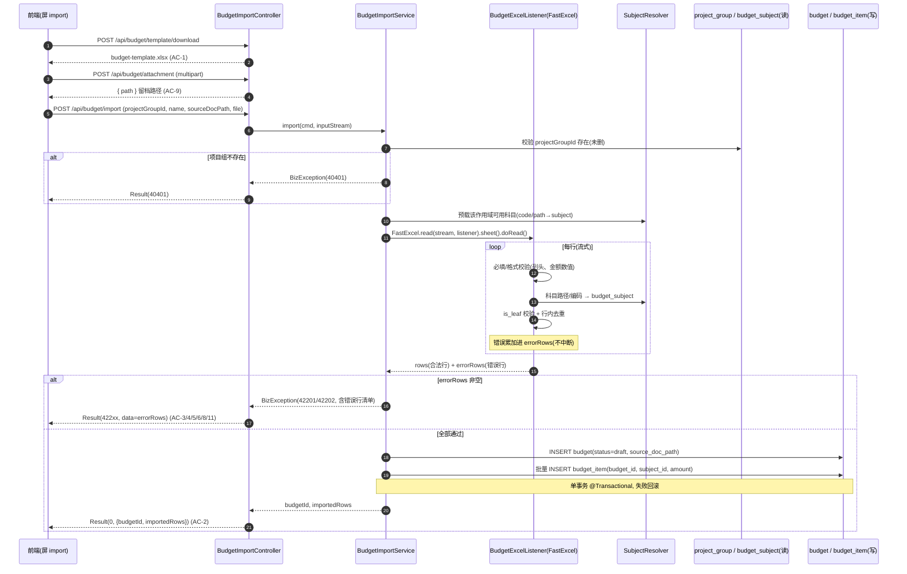
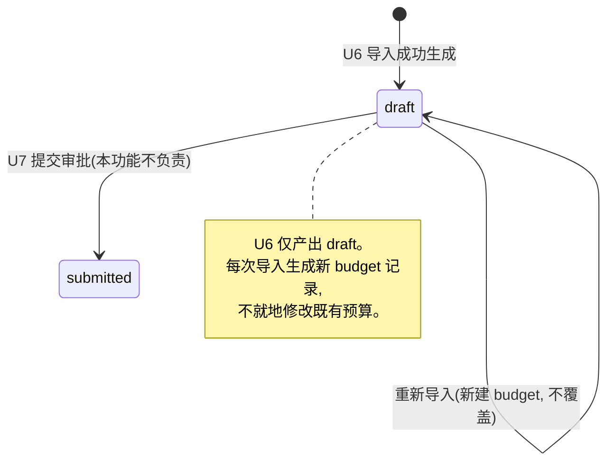

# U6 预算模板导入 · 详细设计

> 阶段三 · 详细设计产物 · 2026-06-05 · 草稿
> 上游：`tkxm-general`（`docs/design/general/procurement-general.md` §4.1 M2 导入预算契约）、`tkxm-database`（`docs/design/db/procurement-db.md` §3.2 budget/budget_item/budget_subject）、`tkxm-prototype`（`docs/prototype/index.html` 屏 `import`）
> 下游：`tkxm-coding`（编码与单测）、`tkxm-review`（代码审查）
> 对应：功能点 **U6 预算模板导入** · 模块 **M2 预算与科目（BC2）** · 需求 **B1** · 原型屏 `import`
> 说明：本文件作为详设抬头的「通用约定」基准，其它详设可引用本文 **§2 / §6** 抬头约定（响应体 / 错误码 / 鉴权）。

---

## 1. 概述

### 1.1 功能目标

U6 实现预算从 Excel 模板的结构化导入，是 M2 预算编制的入口环节。覆盖 4 件事：

1. **下载预算模板**：提供标准 `.xlsx` 模板供编制人填写（含列头与示例行）。
2. **导入预算明细**：基于 **FastExcel 1.1 流式解析** + **行级校验**，校验通过后生成 `budget` 聚合根 + `budget_item` 明细。
3. **立项文档附件留档**：立项 / 预算文档仅上传留档（不解析），路径写入 `budget.source_doc_path`。
4. **错误行可定位**：校验失败时不中断，**汇总全部错误行清单**返回（行号 + 科目路径 + 原因），前端按行定位提示。

### 1.2 关键约束（回指需求 B1 / 非功能目标）

| 约束 | 说明 | 依据 |
|---|---|---|
| 流式解析 | FastExcel `ReadListener` 逐行回调，避免大文件 OOM | general §2.3 ADR-5、R-3 |
| 行级校验 + 错误可定位 | 格式 / 必填列 / 金额 / 科目映射逐行校验，错误带行号 | 原型 `import` ②、B1 |
| 金额仅挂叶子 | `budget_item.subject_id` 必须 `is_leaf=true`，否则拒绝（42202） | db §3.2、general §4.1「金额仅挂叶子级」 |
| 科目映射 | 模板「科目路径 / 编码」映射到既有 `budget_subject`，缺失即报错（不在 U6 内新建科目，新建走 U5/比对屏） | db §3.2、原型 `compare` |
| 校验失败零落库 | 任一行错误则整批拒绝、不写 `budget`/`budget_item`（单事务） | §3、§8 |

### 1.3 范围边界

- **在范围内**：模板下载、明细导入校验、附件留档、生成 `budget`+`budget_item`。
- **不在范围内**：科目树维护与新增（U5）、库中缺失科目的人工比对新增（原型 `compare` 屏，属 U5 / 后续）、提交审批（U7）、预算 vs 实际（U13）。
- **导入产物状态**：生成的 `budget.status='draft'`（编制态），后续由 U7 提交审批。

---

## 2. 功能规约（AC）

> 验收标准（Acceptance Criteria），与 §7 测试点 T-x 一一对应。

| 编号 | 场景 | 验收标准 |
|---|---|---|
| **AC-1** | 下载模板 | 调用下载接口返回标准 `.xlsx`（含列头「科目路径\|科目编码\|金额」+ 1 行示例），`Content-Disposition: attachment`，文件可被 Excel 正常打开。 |
| **AC-2** | 正常导入 | 选定项目组 + 上传合法模板，全部行校验通过 → 生成 1 条 `budget`（status=draft）+ N 条 `budget_item`，金额与文件一致，`Result.code=0` 返回 budgetId 与导入行数。 |
| **AC-3** | 缺列 / 格式错 | 模板缺少必填列（如缺「金额」列）或非 `.xlsx` → 返回 **42201**，message 指明缺失列；不落库。 |
| **AC-4** | 空金额定位行 | 某行金额为空 / 非数字 / ≤0 → 校验失败，错误清单含该行**行号**与原因「金额必填且须为正数」；不落库。 |
| **AC-5** | 金额挂非叶子 | 某行科目映射到 `is_leaf=false` 的科目 → 返回 **42202**，错误清单含该行行号与原因「金额只能录在叶子级科目」；不落库。 |
| **AC-6** | 科目不存在 | 某行科目路径 / 编码在 `budget_subject` 中查无（未删）→ 错误清单含该行行号与原因「科目不存在」（项目组 / 科目不存在归 **40401**，批量校验汇总归 42201 错误清单）。 |
| **AC-7** | 项目组不存在 | 入参 `projectGroupId` 在 `project_group`（未删）中查无 → 返回 **40401**。 |
| **AC-8** | 多错误汇总 | 文件含多行错误 → 一次返回全部错误行（不在第一行即中断），便于一次性修正。 |
| **AC-9** | 附件留档 | 上传立项文档 → 存储到约定路径，返回相对路径；导入时该路径写入 `budget.source_doc_path`。 |
| **AC-10** | 鉴权 | 三个写 / 导入接口均要求登录且具 `editor` 角色；缺角色返回 40300（Sa-Token），缺登录 40100。 |
| **AC-11** | 重复科目行 | 同一文件内同一叶子科目出现多行 → 视为冲突，错误清单提示「科目重复」（对齐 `uk_bi(budget_id,subject_id)`）。 |

---

## 3. 时序（上传 → 流式解析 → 逐行校验 → 落库）



---

## 4. 数据流与状态（读 budget_subject / project_group，写 budget + budget_item）

### 4.1 读写表

| 表 | 读 / 写 | 用途 | 关键列 |
|---|---|---|---|
| `project_group` | 读 | 校验目标项目组存在（`is_deleted=0`） | id |
| `budget_subject` | 读 | 科目路径 / 编码映射 + `is_leaf` 判定（`is_deleted=0`） | id, parent_id, name, code, is_leaf |
| `budget` | 写 | 导入成功生成聚合根 | project_group_id, name, source_doc_path, version=1, status='draft' |
| `budget_item` | 写 | 批量写入叶子级明细 | budget_id, subject_id, amount |

### 4.2 状态流转（budget.status）



- 落库字段固定值：`version=1`、`status='draft'`、`source_doc_path` 取附件接口返回路径（可空）。
- `budget_item.amount` 来源模板金额列（`NUMERIC(18,2)`，解析时统一保留两位）。

---

## 5. 关键逻辑

### 5.1 FastExcel 流式监听器（`BudgetExcelListener`）

- 使用 `cn.idev.excel:fastexcel:1.1.0`。继承 `com.alibaba.excel.read.listener.ReadListener<BudgetRow>`（FastExcel 沿用 EasyExcel 包名兼容）。
- 表头映射：行 DTO `BudgetRow` 用 `@ExcelProperty` 绑定列头「科目路径 / 科目编码 / 金额」。
- `invokeHeadMap(...)`：校验列头集合是否含全部必填列；缺列 → 标记致命错误（AC-3，整批 42201）。
- `invoke(BudgetRow data, AnalysisContext ctx)`：逐行回调，`ctx.readRowHolder().getRowIndex()` 取**物理行号**（0 基，对外 +1 / 含表头折算为用户可见行号）。每行执行 §5.2 校验，错误进 `errorRows`，合法行进 `validRows`，**不抛异常以保证不中断**（AC-8）。
- `doAfterAllAnalysed(...)`：解析完成，Service 据 `errorRows` 是否为空决定落库或抛 `BizException`。
- 资源：以 `InputStream` 读取，单 sheet；不缓存整文件，内存仅持有累积的行结果（量级十万级明细可接受，超大文件后续可分页落库 TBD）。

### 5.2 行级校验规则（按列）

| 顺序 | 校验项 | 规则 | 失败码 / 归类 |
|---|---|---|---|
| 1 | 必填列 / 列头 | 表头含「科目路径」「科目编码」「金额」 | 42201（致命，整批） |
| 2 | 科目定位非空 | 科目路径或科目编码至少一项非空 | 行错误 → 汇总 42201 |
| 3 | 金额格式 | 非空、可解析为正数、≤2 位小数；`amount > 0` | 行错误「金额必填且须为正数」 |
| 4 | 科目映射 | 编码优先精确匹配 `code`；否则按路径匹配（§5.3）；查无 → 行错误「科目不存在」 | 行错误（40401 语义，汇总入 42201 清单） |
| 5 | 叶子校验 | 命中科目 `is_leaf=true` | **42202**「金额只能录在叶子级科目」 |
| 6 | 行内去重 | 同一 `subject_id` 不得在文件内重复 | 行错误「科目重复」（对齐 `uk_bi`） |

> 校验聚合：逐行收集 `ErrorRow{ rowNo, subjectPath, amountRaw, reason }`。存在任一行错误即整批失败；主导错误码取「是否含非叶子错误」决定 42202，否则 42201（清单中每行仍带各自原因）。

### 5.3 科目路径 / 编码映射（`SubjectResolver`）

- **预载**：导入开始时一次性加载 `budget_subject`（未删）全集到内存索引，避免逐行查库：
  - `byCode: Map<String, Subject>`（科目编码 → 科目）。
  - `byPath: Map<String, Subject>`（全路径名「L1 / L2 / L3」→ 科目，路径按 `parent_id` 逐级拼接 `name`，分隔符 ` / `）。
- **匹配优先级**：科目编码非空 → 用 `byCode`；否则用 `byPath`（路径需大小写 / 空白归一化后精确匹配）。
- **冲突 / 歧义**：路径重名（不同分支同名叶子）以全路径区分；编码全局唯一（`uk_subject_code`）故无歧义。
- **缺失**：两索引均未命中 → 「科目不存在」行错误（AC-6）。U6 不在此环节新增科目（缺失科目的人工新增属 U5 / 原型 `compare` 屏）。

### 5.4 附件存储路径

- 立项 / 预算文档**仅留档不解析**（原型 `import` ① 明示）。
- 存储介质 **TBD-3（general TBD-2 / db TBD-3）**：暂定落本地文件系统 / 对象存储，库内仅存**相对路径**写入 `budget.source_doc_path`。
- 约定路径模板：`budget/{projectGroupId}/{yyyyMMdd}/{uuid}-{原文件名}`；返回相对路径供导入接口回填。
- 安全：校验扩展名白名单（`.pdf/.doc/.docx/.xls/.xlsx/.png/.jpg`）与大小上限；文件名做安全化（去路径分隔符）。

---

## 6. 接口定义

> **通用抬头约定（供其它详设引用）**
> - **响应体**：统一 `Result<T>`（`record Result<>(int code, String message, T data)`），`code=0` 成功，非 0 为错误码；见 `common/Result.java`。
> - **错误码**：业务可预期错误抛 `BizException(code, message)`，由 `GlobalExceptionHandler`（`@RestControllerAdvice`）统一转 `Result` 并映射 HTTP 状态（业务 / 校验 → 400、未登录 → 401、缺角色 → 403、兜底 → 500）。
> - **鉴权**：Sa-Token，写 / 导入接口标注 `@SaCheckRole("editor")`；缺登录 → 40100，缺角色 → 40300。
> - **本功能错误码全集**：

| code | 含义 | 触发 |
|---|---|---|
| 0 | 成功 | — |
| 40001 | 参数错误 | 入参缺失 / 非法（如缺 projectGroupId、文件为空） |
| 40301 | 无权限 | 非 editor 角色（业务侧细分；Sa-Token 拦截层为 40300） |
| 40401 | 项目组 / 科目不存在 | projectGroupId 查无；或单点科目定位查无 |
| 42201 | 模板校验失败 | 缺列 / 格式 / 必填 / 科目不存在等，`data` 返回错误行清单 |
| 42202 | 金额挂非叶子 | 命中科目 `is_leaf=false`，`data` 返回错误行清单 |
| 50000 | 系统错误 | 未预期异常（解析 IO 等） |

### 6.1 下载预算模板

- **`POST /api/budget/template/download`**（或 `GET`；用 POST 便于扩展过滤参数）
- **鉴权**：`@SaCheckRole("editor")`
- **请求**：无 body
- **响应**：二进制流，`Content-Type: application/vnd.openxmlformats-officedocument.spreadsheetml.sheet`，`Content-Disposition: attachment; filename="budget-template.xlsx"`
- **模板内容**：表头「科目路径 | 科目编码 | 金额」+ 1 行示例（`设备采购 / 服务器 / 计算节点` | `SB-FWQ-JS01` | `120000.00`）。列定义详 **TBD-2**。
- **对应**：AC-1 / T-1

### 6.2 立项文档附件上传（留档）

- **`POST /api/budget/attachment`**（`multipart/form-data`）
- **鉴权**：`@SaCheckRole("editor")`
- **请求**：`file`（MultipartFile，必填）、`projectGroupId`（Long，用于路径分桶）
- **响应**：`Result<AttachmentVO>`，`AttachmentVO{ path, fileName, size }`
- **校验**：非空、扩展名白名单、大小上限；失败 → 40001
- **对应**：AC-9 / T-6（上传 / 下载留档）

### 6.3 导入预算（解析 + 校验 + 落库）

- **`POST /api/budget/import`**（`multipart/form-data`）
- **鉴权**：`@SaCheckRole("editor")`
- **请求参数**：

  | 参数 | 类型 | 必填 | 说明 |
  |---|---|---|---|
  | projectGroupId | Long | 是 | 目标项目组（`@NotNull`） |
  | name | String | 是 | 预算名称（`@NotBlank`，≤128） |
  | sourceDocPath | String | 否 | 6.2 返回的立项文档留档路径 |
  | file | MultipartFile | 是 | 预算明细 `.xlsx`（`@NotNull`，非空） |

- **成功响应**：`Result<ImportResultVO>`

  ```json
  { "code": 0, "message": "ok",
    "data": { "budgetId": 1001, "importedRows": 25 } }
  ```

- **校验失败响应**（HTTP 400，`code=42201`/`42202`）：`data` 为错误行清单

  ```json
  { "code": 42201, "message": "模板校验失败，请修正后重新导入",
    "data": { "errorRows": [
      { "rowNo": 3, "subjectPath": "耗材 / 试剂", "amount": null, "reason": "金额必填且须为正数" },
      { "rowNo": 5, "subjectPath": "设备采购 / 服务器", "amount": "8000.00", "reason": "金额只能录在叶子级科目" }
    ] } }
  ```

- **对应**：AC-2/3/4/5/6/7/8/11 / T-2~T-5、T-8

> 接口数：**3**（下载模板、附件上传、导入预算）。

---

## 7. 测试点（T-x ↔ AC-x）

| 编号 | 关联 AC | 用例 | 预期 |
|---|---|---|---|
| **T-1** | AC-1 | 下载模板 | 返回可打开的 `.xlsx`，含 3 列头 + 示例行，`attachment` 头 |
| **T-2** | AC-2 | 正常导入（全合法 N 行） | 生成 1 `budget`(draft) + N `budget_item`，金额一致，返回 budgetId / importedRows |
| **T-3** | AC-3 | 缺「金额」列 / 非 xlsx | `code=42201`，message 指明缺列；零落库 |
| **T-4** | AC-4 | 某行金额空 / 非数字 / ≤0 | 错误清单含该行 `rowNo` + 「金额必填且须为正数」；零落库 |
| **T-5** | AC-5 | 某行科目 `is_leaf=false` | `code=42202`，错误清单含该行 + 「只能录叶子级」；零落库 |
| **T-6** | AC-9 | 附件上传 + 留档路径回填导入 | 上传返回 path；导入后 `budget.source_doc_path` = 该 path；可下载 |
| **T-7** | AC-7 | projectGroupId 不存在 | `code=40401`；零落库 |
| **T-8** | AC-6/8/11 | 多错误（科目不存在 + 重复 + 空金额）混合 | 一次返回全部错误行（不在首错中断）；零落库 |
| **T-9** | AC-10 | 非 editor / 未登录调用导入 | 403/40300（缺角色）、401/40100（未登录） |
| **T-10** | AC-2 | 落库事务性：批量插入中途模拟失败 | 整批回滚，无残留 `budget`/`budget_item` |

---

## 8. 异常处理（错误行汇总不中断）

| 异常 / 场景 | 处理策略 | 返回 |
|---|---|---|
| 列头缺失 | `invokeHeadMap` 检出致命错误，标记后停止行解析 | 42201（指明缺列） |
| 单行格式 / 必填 / 科目映射 / 重复错误 | **累加进 `errorRows`，继续解析后续行**（不抛异常、不中断）| 解析后整批 42201，`data=errorRows` |
| 金额挂非叶子 | 累加进 `errorRows`（标记非叶子类）| 主码取 42202（清单含全部行）|
| 项目组不存在 | 解析前前置校验，直接抛 `BizException(40401)` | 40401 |
| 文件为空 / 非法 multipart | 入参校验 | 40001 |
| FastExcel IO / 解析底层异常 | 捕获包装为 `BizException(50000)`，记录日志（不泄露堆栈，对齐 `GlobalExceptionHandler` 兜底） | 50000 |
| 落库阶段 DB 异常 | `@Transactional` 整批回滚 | 50000（或唯一键冲突映射 42201）|

- **零落库原则**：解析 / 校验阶段不写库；仅当 `errorRows` 为空才进入落库事务，保证「校验失败 → 无副作用」。
- **错误行结构**：`ErrorRow{ rowNo(用户可见行号，从数据首行 1 起), subjectPath, amount(原始串), reason }`，前端按 `rowNo` 在结果表定位高亮（原型 `import` ② 错误行红条）。

---

## 9. 依赖与影响

### 9.1 硬依赖（DAG 上游）

| 依赖 | 类型 | 说明 |
|---|---|---|
| **U4 组织 / 项目组 / 用户角色** | 硬依赖 | 导入需选定有效 `project_group`；鉴权用户角色 `editor` 来自 U4/U2 |
| **U5 预算科目树** | 硬依赖 | 科目路径 / 编码映射依赖 `budget_subject` 已建树；缺失科目报错，不在 U6 内补建 |

### 9.2 被依赖（下游影响）

| 下游 | 影响 |
|---|---|
| U7 通用审批 | 消费 U6 产出的 `budget`(draft)，提交进入两级审批 |
| U13 预算 vs 实际 | 以 `budget_item.amount` 为预算侧基准聚合对比 |

### 9.3 技术依赖

- FastExcel `cn.idev.excel:fastexcel:1.1.0`（pom 已声明）。
- MyBatis-Plus 3.5.9（`budget`/`budget_item`/`budget_subject`/`project_group` Mapper，全局逻辑删除 `is_deleted`）。
- Sa-Token 1.40（`@SaCheckRole`）；`Result`/`BizException`/`GlobalExceptionHandler`（common 脚手架）。

---

## 10. 待确认（TBD）

| 编号 | 待确认项 | 现状 / 暂定 | 关联 | 拍板人 |
|---|---|---|---|---|
| **TBD-2** | 预算模板列定义（确切列头、是否含层级 / 计量单位 / 备注列、示例行内容） | 暂定「科目路径 \| 科目编码 \| 金额」三列 | 待 PRD 细化 | 产品 |
| **TBD-3** | 附件（立项文档）存储介质与路径规范 | 暂定存路径，文件落本地 / 对象存储（同 general TBD-2 / db TBD-3）；路径 `budget/{pgId}/{date}/{uuid}-{name}` | 技术 |

> TBD 数：**2**（TBD-2 模板列定义、TBD-3 附件存储）。
