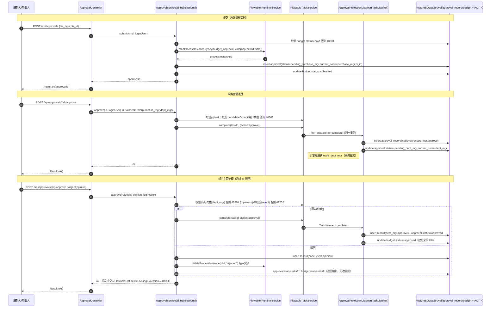
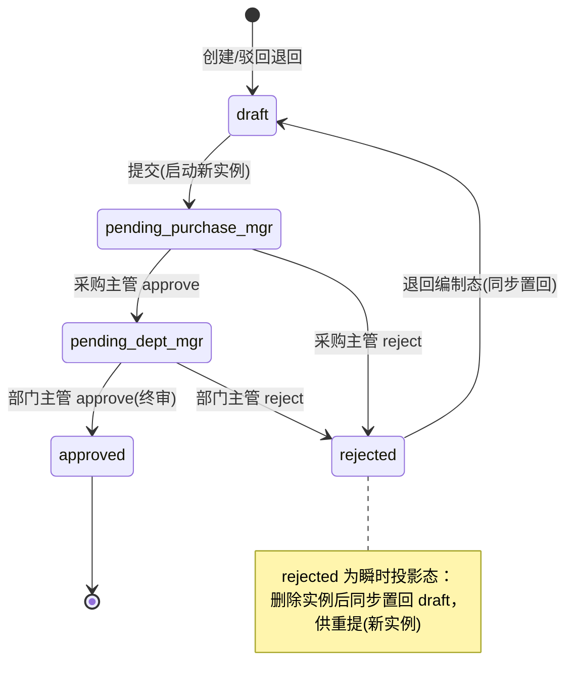
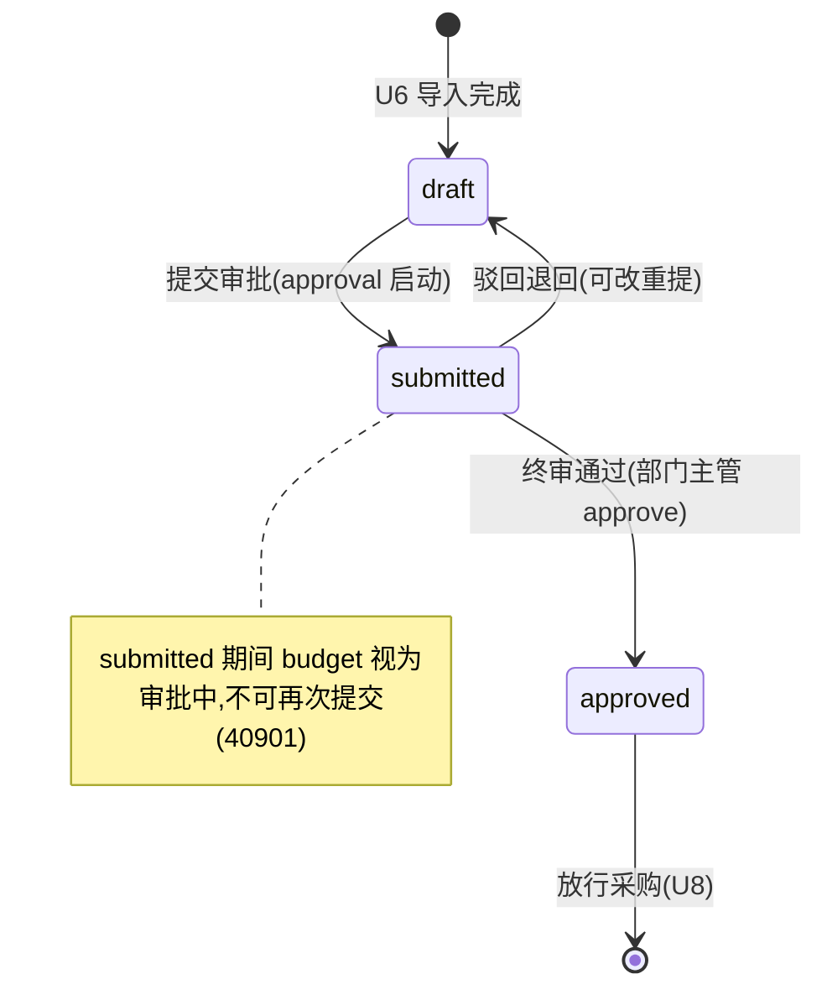

# U7 通用审批（Flowable） · 详细设计

> 阶段三·详细设计产物 · 创建日期：2026-06-05 · 状态：草稿
> 上游：`tkxm-general`（概要设计 `docs/design/general/procurement-general.md` §3.1/§5.1/SEL-1）、`tkxm-database`（`docs/design/db/procurement-db.md` §3.3/§5）、`tkxm-prototype`（`docs/prototype/index.html` 屏 `approval`）
> 下游：`tkxm-coding`（编码与单测）、`tkxm-review`（代码审查）
> 对应：功能点 **U7**、模块 **M3 审批（BC3）**、需求 **C1,C2,C3**、原型屏 `approval`

---

## 1. 概述

- **目标**：以 Flowable 7.1 嵌入式 BPMN 流程定义 `budget_approval`（采购主管 → 部门主管 两节点）驱动**通用审批**，本期承载预算（`biz_type=budget`）的两级审批、驳回退回重提、流转历史查询。
- **范围**：提交审批（启动流程实例）、待办查询、通过、驳回（意见必填）、流转历史。**不含**可配置审批流的运行时编排（预留 `flow_code`/`node_seq`，见 §10）。
- **设计要点**：
  - 审批权威流转状态在 Flowable 引擎表 `ACT_RU_*`/`ACT_HI_*`；`approval`/`approval_record` 为**业务投影**，便于列表/历史查询与 `budget` 状态同步。
  - 投影写入与 budget 状态同步**集中在 TaskListener 单点**，与 `taskService.complete()` 同处一个 Spring 事务，保证「引擎推进 ↔ 业务投影」原子一致。
  - 节点-角色校验：BPMN `candidateGroup` = 角色 code（`purchase_mgr`/`dept_mgr`）；接口层 `@SaCheckRole` + 服务层节点比对双重护栏。
  - 驳回 = **流程结束 + 退回编制态**（`budget.status=draft`、`approval.status=draft`），重提为**新流程实例**（决策 D-3）。
  - 并发用 Flowable 自带乐观锁（`ACT_*` 的 `REV_` 版本列），任务重复处理触发 `FlowableOptimisticLockingException`，统一转 40901。
- **技术栈**：Spring Boot 3.4.1 + Flowable 7.1（`flowable-spring-boot-starter-process`）+ MyBatis-Plus 3.5.9 + PostgreSQL；包根 `com.gov.procurement`。
- **依赖**：硬依赖 **U6 预算导入**（预算须处于 `draft` 才可提交）；为下游 **U8 采购执行**放行（`budget.status=approved` 方可采购）。

### 1.1 BPMN 流程定义（`budget_approval`）

```
[Start] → (UserTask: node_purchase_mgr, candidateGroup=purchase_mgr)
        → (UserTask: node_dept_mgr,     candidateGroup=dept_mgr)
        → [End: approved]
```

- 资源文件：`src/main/resources/processes/budget_approval.bpmn20.xml`（Flowable 启动自动部署 `processes/*.bpmn20.xml`）。
- 两个 UserTask 均绑定 `TaskListener(event=complete)` → `ApprovalProjectionListener`，写投影 + 同步 budget 状态。
- 通过：顺序流推进到下一节点 / End。驳回：在 Service 内 `runtimeService.deleteProcessInstance(piId, reason)` 结束实例（D-3，不走同实例回退）。

---

## 2. 功能规约（AC）

| 编号 | 验收标准（Given/When/Then） |
|---|---|
| **AC-1 提交启动实例** | Given 预算 `budget.status=draft`；When 编制人 `POST /api/approvals`(biz_type=budget,biz_id)；Then 启动 `budget_approval` 实例、写 `approval`(status=`pending_purchase_mgr`,current_node=`purchase_mgr`,process_instance_id)、`budget.status=submitted`，返回 approvalId。 |
| **AC-2 采购主管通过** | Given approval 处于 `pending_purchase_mgr`、当前用户具 `purchase_mgr`；When `POST /approve`；Then complete 任务、流转到 `dept_mgr`、`approval.status=pending_dept_mgr`、写一条 `approval_record`(node=purchase_mgr,action=approve)。 |
| **AC-3 部门主管通过（终审）** | Given `pending_dept_mgr`、用户具 `dept_mgr`；When `POST /approve`；Then 流程结束、`approval.status=approved`、`budget.status=approved`、写 record(node=dept_mgr,approve)。 |
| **AC-4 驳回退回（任一节点）** | Given 节点一或节点二待审；When `POST /reject`(opinion 非空)；Then 写 record(action=reject,opinion)、结束流程实例、`approval.status=rejected`→随后置 `draft`、`budget.status=draft`（退回编制态可改）。 |
| **AC-5 驳回意见必填** | Given 驳回请求 opinion 为空/空白；When `POST /reject`；Then 拒绝（**42203**，编码归一后，见 §8 注），不推进流程、不写 record。 |
| **AC-6 重提为新实例** | Given 被驳回回到 `draft` 的预算；When 编制人再次 `POST /api/approvals`；Then 启动**新**流程实例（新 process_instance_id），从 `purchase_mgr` 重走；历史保留旧 record（按 approval_id 全量可查）。 |
| **AC-7 节点-角色校验** | Given 当前节点 `purchase_mgr`；When `dept_mgr` 或他角色调 `/approve`；Then 拒绝（**40301** 角色与当前节点不符），流程不动。 |
| **AC-8 待办按角色** | Given 登录用户角色集合；When `GET /api/approvals/todo`；Then 仅返回 candidateGroup ∈ 用户角色 且未完成的任务（采购主管见节点一、部门主管见节点二）。 |
| **AC-9 任务已处理幂等** | Given 任务已被 complete（或并发重复提交）；When 再次 `approve`/`reject`；Then 拒绝（**40903** 状态不符/任务已处理），无重复 record、无重复状态翻转。 |
| **AC-10 流转历史完整** | Given 任一 approval；When `GET /{id}/history`；Then 按 acted_at 升序返回全部 record（节点/处理人/动作/时间/意见），含驳回与多轮重提。 |
| **AC-11 对象不存在** | Given biz/approval/budget 不存在；When 任一接口引用；Then 拒绝（**40401**，沿用全局 NOT_FOUND）。 |

---

## 3. 时序（提交 → 采购主管 → 部门主管 → 通过/驳回）



---

## 4. 数据流与状态机

### 4.1 approval.status 状态机



### 4.2 budget.status 状态机（与 approval 同步）



### 4.3 状态映射对照

| 引擎/动作 | approval.status | approval.current_node | budget.status | 写 record |
|---|---|---|---|---|
| 提交启动实例 | pending_purchase_mgr | purchase_mgr | submitted | — |
| 采购主管 approve | pending_dept_mgr | dept_mgr | submitted | purchase_mgr/approve |
| 部门主管 approve | approved | dept_mgr | approved | dept_mgr/approve |
| 任一节点 reject | draft（经 rejected 瞬态） | 保留处理时节点 | draft | 节点/reject(+opinion) |

---

## 5. 关键逻辑

### 5.1 节点-角色校验（candidateGroup=角色 code）
- BPMN 两 UserTask 配 `flowable:candidateGroups="purchase_mgr"` / `"dept_mgr"`，与 `role.code` 同名。
- 接口层：`@SaCheckRole(value={"purchase_mgr","dept_mgr"}, mode=SaMode.OR)` 粗粒度放行（缺角色 → Sa-Token 40300）。
- 服务层（细粒度，权威）：根据 approval 当前活动任务取 candidateGroup，比对**登录用户角色集合**是否含该 group；不含 → `BizException(40301)`。即「采购主管不能审部门主管节点」由此拦截。
- 任务获取：`taskService.createTaskQuery().processInstanceId(pi).active().singleResult()`；空（已无活动任务）→ 40901。

### 5.2 驳回 = 新实例（D-3）
- 驳回不走同实例回退：先写 reject `approval_record`，再 `runtimeService.deleteProcessInstance(piId, "rejected by ...")` 结束实例（保留 `ACT_HI_*` 历史），最后同步 `approval.status=draft`、`budget.status=draft`、`approval.process_instance_id` 置空（或保留旧值仅作历史，见 §10 TBD）。
- 重提：编制人改完再次 `POST /api/approvals`，**复用同一 approval 行**（按 biz_type+biz_id 命中）或新建 approval（见 §10 TBD），启动**新** process_instance_id，从 `purchase_mgr` 重走。历史 record 按 `approval_id` 累积，多轮可查（AC-10）。

### 5.3 投影一致性（TaskListener 单点 + 同事务）
- **通过路径**：状态翻转 + 写 record 全在 `ApprovalProjectionListener(complete)` 内完成。该监听器在 `taskService.complete()` 调用栈内执行，**与引擎推进共享同一 Spring 事务**（Flowable 默认与 Spring 事务管理器集成）→ 引擎表与业务投影同提交/同回滚，杜绝「引擎走了、投影没写」。
- **驳回路径**：因驳回是「结束实例」而非「complete 推进」，写 record + 状态置回放在 `ApprovalService.reject(...)` 的 `@Transactional` 方法内，与 `deleteProcessInstance` 同事务。
- 监听器内通过流程变量 `action` 区分（仅 complete 通过路径触发）；`approvalId` 以流程变量传入，避免反查。
- 投影写库统一走 MyBatis-Plus Mapper，禁止在监听器内吞异常（异常须冒泡以触发回滚）。

### 5.4 并发与乐观锁
- 依赖 Flowable 自带乐观锁：`ACT_RU_TASK`/`ACT_RU_EXECUTION` 等含 `REV_` 版本列，两个请求并发 complete 同一 task 时，落后者抛 `FlowableOptimisticLockingException`。
- `GlobalExceptionHandler` 新增映射：`FlowableOptimisticLockingException` / `FlowableTaskAlreadyClaimedException` → `Result.error(40901,...)`（HTTP 409）。
- 业务侧补充护栏：approve/reject 前置校验 `approval.status` 是否仍为对应 pending 态，已变更 → 40901（覆盖「重复点击」AC-9，先于引擎冲突拦截，减少噪声）。

### 5.5 flow_code 预留可配置
- `approval.flow_code` 本期固定写入 `budget_approval`；提交时由常量 `ApprovalConst.FLOW_BUDGET` 提供。
- 未来可配置审批流：按 `biz_type` 查 `flow_code` 再 `startProcessInstanceByKey(flow_code,...)`，节点-角色由 BPMN candidateGroup 配置驱动，本设计的 `node_seq`/`current_node` 投影结构无需改动（见 §10 TBD）。

---

## 6. 接口定义

> 统一前缀 `/api/approvals`。通用响应 `Result<T>`（`code=0` 成功）、错误码、鉴权约定与 `U6-budget-import.md` §6 抬头一致。所有接口需登录（Sa-Token）。
> 包：`com.gov.procurement.modules.approval`（controller/service/listener/mapper/entity/dto）。

### 6.1 提交审批 — `POST /api/approvals`
- **鉴权**：`@SaCheckRole("editor")`（编制人提交）。
- **请求体**：
  ```json
  { "bizType": "budget", "bizId": 1014 }
  ```
  - `bizType` 非空（本期仅 `budget`）；`bizId` 非空、>0。
- **逻辑**：校验 budget 存在(40401) 且 `status=draft`(否则 40903) → 启动实例 → 写 approval（pending_purchase_mgr）→ budget=submitted。
- **响应**：`Result<Long>`（approvalId）。
- **错误码**：40401 / 40903 / 50000。

### 6.2 待办查询 — `GET /api/approvals/todo`
- **鉴权**：`@SaCheckRole(value={"purchase_mgr","dept_mgr"}, mode=SaMode.OR)`。
- **查询参数**：`page`(默认 1)、`size`(默认 20)。
- **逻辑**：取登录用户角色集合，`taskService.createTaskQuery().taskCandidateGroupIn(roles).active().orderByTaskCreateTime().desc()` 分页；按 processInstanceId 关联 approval 投影补全 biz 信息。
- **响应**：`Result<Page<TodoItemVO>>`，`TodoItemVO{ approvalId, taskId, bizType, bizId, node, budgetName, projectGroupName, createdAt }`。

### 6.3 通过 — `POST /api/approvals/{id}/approve`
- **鉴权**：`@SaCheckRole(value={"purchase_mgr","dept_mgr"}, mode=SaMode.OR)`。
- **路径参数**：`id`=approvalId。
- **逻辑**：取 approval(40401)→ 校验仍处 pending(40903)→ 取活动 task、节点-角色比对(40301)→ `complete(taskId,{action:approve})`（TaskListener 写 record + 翻状态、终审同步 budget=approved）。
- **响应**：`Result<Void>`。
- **错误码**：40301 / 40903 / 40401 / 50000。

### 6.4 驳回 — `POST /api/approvals/{id}/reject`
- **鉴权**：同 6.3。
- **请求体**：
  ```json
  { "opinion": "科目划分不合理，请修订后重提" }
  ```
  - `opinion` **必填**、非空白、≤512；空白 → **42203**。
- **逻辑**：取 approval(40401)→ pending 校验(40903)→ 节点-角色(40301)→ 写 record(reject,opinion)→ `deleteProcessInstance`→ approval=draft、budget=draft（退回编制）。
- **响应**：`Result<Void>`。
- **错误码**：40301 / 40903 / 42203 / 40401 / 50000。

### 6.5 流转历史 — `GET /api/approvals/{id}/history`
- **鉴权**：`@SaCheckLogin`（登录可查；如需更严按项目组归属过滤，见 §10）。
- **路径参数**：`id`=approvalId。
- **逻辑**：校验 approval 存在(40401)→ 查 `approval_record WHERE approval_id=? ORDER BY acted_at ASC`（`idx_ar_approval`）。
- **响应**：`Result<List<HistoryItemVO>>`，`HistoryItemVO{ nodeSeq, node, approverName, action, opinion, actedAt }`（含多轮重提的全部记录，AC-10）。

> 接口数：**5**（提交 / 待办 / 通过 / 驳回 / 历史）。

---

## 7. 测试点（T-x ↔ AC-x）

| 编号 | 测试点 | 覆盖 AC | 类型 |
|---|---|---|---|
| **T-1** | 两级全通过：提交→采购主管 approve→部门主管 approve；断言 approval=approved、budget=approved、2 条 approve record | AC-1/2/3 | 集成 |
| **T-2** | 节点一驳回：采购主管 reject(意见)；断言流程结束、approval=draft、budget=draft、1 条 reject record | AC-4 | 集成 |
| **T-3** | 节点二驳回：通过节点一后部门主管 reject；断言退回 draft、含节点一 approve + 节点二 reject 两条 record | AC-4 | 集成 |
| **T-4** | 驳回未填意见 → 42202，流程不动、无 record | AC-5 | 单元/集成 |
| **T-5** | 驳回重提为新实例：reject 后再 submit；断言新 process_instance_id ≠ 旧、从 purchase_mgr 起、历史 record 累积 | AC-6 | 集成 |
| **T-6** | 错误角色：当前 purchase_mgr 节点用 dept_mgr/他角色 approve → 40301，流程不动 | AC-7 | 集成 |
| **T-7** | 待办按角色：purchase_mgr 仅见节点一、dept_mgr 仅见节点二、无角色为空 | AC-8 | 集成 |
| **T-8** | 并发/重复处理：同 task 两次 approve（或并发）→ 一次成功、一次 40901，无重复 record/状态翻转 | AC-9 | 集成 |
| **T-9** | 重复提交已 submitted 预算 → 40901；不启动第二个实例 | AC-1/9 | 集成 |
| **T-10** | 历史完整：含一次驳回 + 重提 + 终审，history 按 acted_at 升序返回全部 | AC-10 | 集成 |
| **T-11** | 对象不存在：bizId/approvalId 不存在 → 40405 | AC-11 | 单元 |
| **T-12** | 投影一致性：模拟 TaskListener 内写库异常 → 引擎推进与投影一并回滚（task 仍在原节点、无脏 record） | AC-2/3 | 集成 |

> 测试基座：MockMvc + Testcontainers(PostgreSQL)（含 Flowable 自动建表 + BPMN 部署）。

---

## 8. 异常处理

> **编码阶段错误码归一（TBD-7 已拍板）**：本文初稿用的 `40901`/`42202`/`40405` 与既有模块冲突——`40901`=`DELETE_RESTRICTED`、`42202`=`AMOUNT_NOT_LEAF`（U6）已占用，`40405` 与全局 `NOT_FOUND(40401)` 重复。编码时统一为：状态冲突 **40903**（`STATE_CONFLICT`，新增，与 40901/40902 同属 409 段）、驳回意见必填 **42203**（`REJECT_OPINION_REQUIRED`，新增）、对象不存在沿用 **40401**（`NOT_FOUND`）、节点-角色不符沿用 **40301**（`NO_PERMISSION`）。`GlobalExceptionHandler` 已按 `code/100` 派生 HTTP 状态，新码无需额外映射逻辑。

| 场景 | 错误码 | HTTP | 抛出点 |
|---|---|---|---|
| 角色与当前节点不符 | 40301 | 403 | Service 节点-角色比对 |
| 状态不符 / 任务已处理 / 重复提交 | 40903 | 409 | Service 状态前置校验 + Flowable 乐观锁映射 |
| 驳回未填意见 | 42203 | 422 | reject Service 校验（空白） |
| 审批单 / 预算 / 业务单据不存在 | 40401 | 404 | Service 查询空 |
| 缺角色（粗粒度） | 40300 | 403 | Sa-Token `@SaCheckRole`（既有处理器） |
| 未登录 | 40100 | 401 | Sa-Token（既有处理器） |
| 系统/未捕获 | 50000 | 500 | 全局兜底 |

- `GlobalExceptionHandler` 已扩展：新增 `@ExceptionHandler(FlowableOptimisticLockingException.class)` → 40903(409)；`BizException` 仍按 `code/100` 派生状态（40301→403、40903→409、42203→422、40401→404）。
- 监听器内**不得吞异常**：任何投影写库失败须冒泡以回滚引擎推进（§5.3）。

---

## 9. 依赖与影响

- **硬依赖 U6（预算 draft）**：提交审批前 `budget` 须存在且 `status=draft`；U6 产出预算聚合与状态字段。
- **Flowable 引擎表 `ACT_*`**：与业务表同库 `procurement`，由 `flowable-spring-boot-starter-process` 自动建表（`spring.flowable` 配置）；BPMN `budget_approval` 随应用启动自动部署（`processes/*.bpmn20.xml`）。
- **角色基座 U2/U4（M1）**：candidateGroup 取值依赖 `role.code`（`purchase_mgr`/`dept_mgr`/`editor`）与用户角色关系。
- **下游 U8 采购执行**：终审通过置 `budget.status=approved`，是 U8「仅已通过预算可采购」的前置。
- **数据库**：读写 `approval`、`approval_record`、`budget`（仅改 status）；不直接改其他模块表。
- **横切**：复用 `Result`/`BizException`/`GlobalExceptionHandler`/Sa-Token；`GlobalExceptionHandler` 需新增 Flowable 乐观锁映射与错误码-HTTP 映射（§8）。

---

## 10. 待确认（TBD）

| 编号 | 待确认项 | 现状/暂定 | 拍板人 |
|---|---|---|---|
| TBD-1 | 节点-角色绑定方式 | 暂定 BPMN `candidateGroups` 直绑 `role.code`，服务层比对登录用户角色集合；是否引入 Flowable Group/User 同步表待定 | 技术 |
| TBD-2 | Flowable 引擎表与 Flyway 迁移执行顺序（继承 general TBD-3 / db §8） | 暂定先 Flowable 自动建表（`database-schema-update`）再业务 Flyway 迁移；或全交 Flyway 管控 `ACT_*` | 技术 |
| TBD-3 | 审批人指定 vs 角色任意领取 | 暂定**角色任意领取**（candidateGroup，组内任一人可审）；是否需指定具体 assignee（审批人指定）待业务确认 | 业务 |
| TBD-4 | 重提复用同一 approval 行 vs 新建 approval | 暂定复用同一行（按 biz_type+biz_id），多轮 record 累积；新建行则历史更隔离 | 技术 |
| TBD-5 | 驳回后 process_instance_id 处理 | 暂定置空（仅 record 留痕）；或保留旧值供 `ACT_HI_*` 回溯 | 技术 |
| TBD-6 | history/todo 数据权限 | 暂定登录即可查 history；是否按项目组/部门归属过滤待定 | 业务 |
| ~~TBD-7~~ | BizException 错误码→HTTP 状态映射 | **已拍板（编码阶段）**：复用 handler 的 `code/100` 派生，新增 40903/42203、对象不存在沿用 40401（详见 §8 归一说明） | 技术 ✅ |

---

> 渲染自检：本文 Mermaid 含 1 个 `sequenceDiagram` + 2 个 `stateDiagram-v2`，已核对 `autonumber`/`alt`/`note` 语法与 `-->`/`:` 标签成对，无全角符号。
