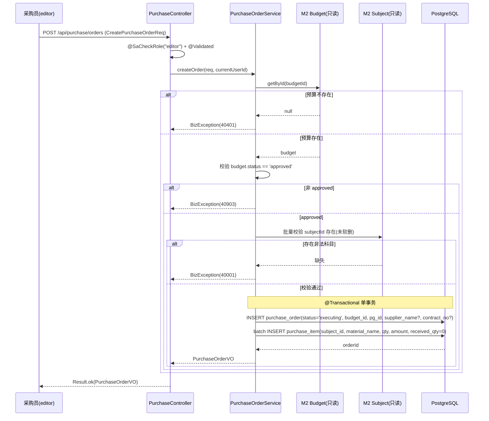
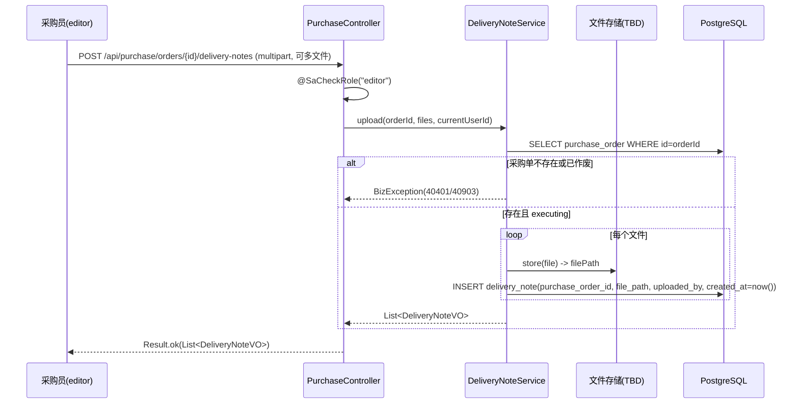
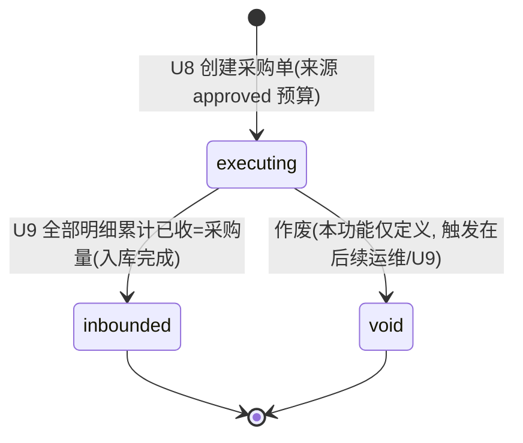

# U8 采购执行 + 到货单上传 · 详细设计

> 阶段三·详细设计产物 · 2026-06-05 · 草稿
> 上游：`tkxm-general`（`docs/design/general/procurement-general.md` §4.1 M4 契约、§5.2 采购入库时序）、`tkxm-database`（`docs/design/db/procurement-db.md` §3.4 `purchase_order`/`purchase_item`/`delivery_note`）、`tkxm-prototype`（`docs/prototype/index.html` 屏 `purchase`）
> 下游：`tkxm-coding`、`tkxm-review`
> 对应：功能点 **U8**、模块 **M4 采购与入库（BC4）**、需求 **D1, D2**、原型屏 `purchase`
> 硬依赖：**U7 通用审批（审批通过 → budget.status=approved）**；下游：U9 多次到货验收入库

---

## 1. 概述

本功能覆盖采购流程的「执行」起点：审批通过后，采购员针对**已通过预算**（`budget.status=approved`）创建采购单（`purchase_order`），填写采购明细（`purchase_item`：科目 / 物料 / 数量 / 金额），并上传到货单附件（`delivery_note`，记录上传人与上传时间，可下载）。

- **业务边界**：本功能只负责「采购单 + 明细 + 到货单附件」的创建与查询；**实际入库写库存（received_qty 累加、写 `stock_item`/`stock_txn`）属于 U9**，本文不涉及。
- **职责定位**：M4 采购与入库上下文（BC4）的写入口；只读引用 M2 的 `budget`/`budget_subject`（预算状态校验、科目关联），**不写 M2 的表**。
- **关键约束**：
  - 仅 `budget.status = approved` 的预算可进入采购执行（否则拒绝，错误码 40903）。
  - 供应商名称（`supplier_name`）、合同号（`contract_no`）为**可选轻量字段，不阻断**；不建独立供应商/合同模块（Non-goal）。
  - 采购明细的 `subject_id` 必须关联到已有预算科目（`budget_subject`），且应为叶子级。
  - 采购单创建后状态置 `executing`；到货单可对同一采购单上传多张。
- **角色**：editor / 采购员（`@SaCheckRole`，编码常量 `editor`，原型语境即"采购员"）。

---

## 2. 功能规约（AC）

> 验收标准（Acceptance Criteria），与 §7 测试点 T-x 一一对应。

| 编号 | 规约 |
|---|---|
| **AC-1** | 仅当来源预算存在且 `status=approved` 时，可创建采购单；非 approved（draft/submitted/rejected）拒绝并返回 40903。 |
| **AC-2** | 来源预算 `budget_id` 不存在时，返回 40401。 |
| **AC-3** | 创建采购单时一并写入采购明细（≥1 行）；明细含 `subject_id`（预算科目）/`material_name`/`qty`/`amount`；主单 + 明细在**单事务**内写入。 |
| **AC-4** | 采购明细的 `subject_id` 必须命中已有 `budget_subject`（未软删）；非法科目返回 40001。 |
| **AC-5** | 供应商名称、合同号**不填可通过**（可选字段），填写则原样保存。 |
| **AC-6** | 采购单创建成功后 `status=executing`，`received_qty` 初值为 0。 |
| **AC-7** | 可对同一采购单上传多张到货单（多次/多文件）；每张记录 `file_path`、`uploaded_by`、`created_at`（上传时间），且可按 id 下载。 |
| **AC-8** | 创建 / 上传 / 查询接口均要求登录且具备 `editor` 角色，否则 401（未登录）/ 40301（无权限）。 |
| **AC-9** | 查询采购单详情返回主单 + 明细 + 到货单列表；查询到货单返回上传人、上传时间，并提供下载。 |

---

## 3. 时序

### 3.1 创建采购单（校验预算 approved → 写主单 + 明细）



### 3.2 上传到货单（可多次）



---

## 4. 数据流与状态

### 4.1 涉及表（读 / 写）

| 表 | 读 / 写 | 本功能职责 |
|---|---|---|
| `budget`（M2） | 读 | 校验来源预算存在且 `status=approved` |
| `budget_subject`（M2） | 读 | 校验采购明细 `subject_id` 合法（叶子级、未软删） |
| `purchase_order`（M4） | 写 | 创建采购主单，`status=executing` |
| `purchase_item`（M4） | 写 | 创建采购明细，`received_qty` 初值 0 |
| `delivery_note`（M4） | 写 | 上传到货单附件，记录上传人/时间 |

### 4.2 `purchase_order.status` 状态机



- 本功能仅产生 `executing`；`inbounded` 由 U9（received_qty 累计到 qty）驱动，`void`（作废）为预留状态，本文不实现其触发逻辑。
- 枚举落代码常量并以 DB `CHECK` 约束护栏（见 db §5）：`executing / inbounded / void`。

---

## 5. 关键逻辑

### 5.1 预算状态校验（AC-1 / AC-2）

```
budget = budgetMapper.selectById(budgetId)
if budget == null            -> throw BizException(40401, "来源预算不存在")
if budget.status != approved -> throw BizException(40903, "预算非已通过状态，不可执行采购")
```

- `approved` 为常量（`BudgetStatus.APPROVED`），与 db §5 枚举一致。
- 仅做**只读**校验，不修改 `budget`；M4 与 M2 解耦（概要 §5 依赖说明）。

### 5.2 金额与科目关联（AC-3 / AC-4）

- 明细行 `subject_id` 须命中 `budget_subject`（`is_deleted=0`）；建议批量查询 `id IN (...)` 后做差集判断，缺失即 40001。
- 科目应为叶子级（`is_leaf=true`，仅叶子可挂金额）——若校验叶子级，命中非叶子同样 40001（提示"科目非叶子级"）。
- `amount`（`NUMERIC(18,2)`）、`qty`（`NUMERIC(18,3)`）用 `BigDecimal`，禁用浮点；`qty>0`、`amount>=0` 由入参 `@Validated` + 业务双重校验。
- 「预算 vs 实际」为 M2 的只读读模型（按 `subject_id` 聚合 `purchase_item.amount`），本功能只负责写明细，不在此计算对比。

### 5.3 附件路径（AC-7）

- 到货单文件经文件存储后仅在库内存**相对路径** `delivery_note.file_path`（`VARCHAR(512)`），与立项文档同策略（概要 §7 附件存储；db TBD-3）。
- 存储介质（本地 FS / 对象存储）为 **TBD-1**，本文以 `FileStorage` 抽象（`store(MultipartFile)->path`、`load(path)->Resource`）隔离，详设不锁定实现。
- 上传时间取 `delivery_note.created_at`（DB 默认 `now()`，UTC 存储，展示层转本地）；上传人取当前登录用户 `StpUtil.getLoginIdAsLong()`。
- 下载：按 `delivery_note.id` 查 `file_path`，经 `FileStorage.load` 返回 `Resource`，`Content-Disposition: attachment`。

---

## 6. 接口定义

> 通用响应体 `Result<T>`、错误码、鉴权约定与本项目一致（`Result`/`BizException`/`GlobalExceptionHandler`；`@SaCheckRole("editor")`）。鉴权失败：未登录 401（40100）、无角色 403（40301/40300）。下文 4 个接口。

### 6.1 创建采购单（含明细）

- **`POST /api/purchase/orders`**
- 鉴权：`@SaCheckRole("editor")`
- 请求体 `CreatePurchaseOrderReq`：

| 字段 | 类型 | 必填 | 校验 | 说明 |
|---|---|---|---|---|
| budgetId | Long | 是 | `@NotNull` | 来源预算 id（须 approved） |
| projectGroupId | Long | 是 | `@NotNull` | 归属项目组 |
| supplierName | String | 否 | `@Size(max=128)` | 供应商名称（可选，不阻断） |
| contractNo | String | 否 | `@Size(max=64)` | 合同号（可选） |
| items | List\<ItemReq\> | 是 | `@NotEmpty` `@Valid` | 采购明细，≥1 行 |

`ItemReq`：`subjectId`(Long,`@NotNull`)、`materialName`(String,`@NotBlank @Size(max=128)`)、`qty`(BigDecimal,`@NotNull @DecimalMin("0.001")`)、`amount`(BigDecimal,`@NotNull @DecimalMin("0.00")`)。

- 响应 `Result<PurchaseOrderVO>`（含 `id`/`status`/`supplierName`/`contractNo`/`items[]`）。
- 错误：40001（参数 / 科目非法）、40401（预算不存在）、40903（预算非 approved）、40301（无权限）、50000。

### 6.2 查询采购明细（采购单详情）

- **`GET /api/purchase/orders/{id}`**
- 鉴权：`@SaCheckRole("editor")`
- 路径参：`id`（采购单 id）。
- 响应 `Result<PurchaseOrderDetailVO>`：主单字段 + `items[]`（科目 / 物料 / 数量 / 金额 / received_qty）+ `deliveryNotes[]`。
- 错误：40401（采购单不存在）、40301、50000。

> 采购单列表（按状态分页）`GET /api/purchase/orders?status=&projectGroupId=&page=&size=` 作为详情的配套读接口，复用 `idx_po_status`/`idx_po_pg`；列表项为 `PurchaseOrderVO` 摘要。计入 §6.2 同一「查询」能力，不单列编号。

### 6.3 上传到货单（支持多文件）

- **`POST /api/purchase/orders/{id}/delivery-notes`**（`multipart/form-data`）
- 鉴权：`@SaCheckRole("editor")`
- 路径参：`id`（采购单 id）；表单：`files`（一个或多个文件，`@NotEmpty`）。
- 后置：每文件落存储得 `file_path`，插入 `delivery_note`（`uploaded_by`=当前用户、`created_at`=now）。
- 响应 `Result<List<DeliveryNoteVO>>`（`id`/`fileName`/`uploadedBy`/`uploadedByName`/`uploadedAt`/`downloadUrl`）。
- 错误：40001（无文件 / 超限）、40401（采购单不存在）、40903（采购单非 executing 不可上传）、40301、50000。

### 6.4 下载 / 查询到货单

- **`GET /api/purchase/orders/{id}/delivery-notes`** → `Result<List<DeliveryNoteVO>>`，列出该采购单全部到货单（含上传人、上传时间）。
- **`GET /api/purchase/delivery-notes/{noteId}/download`** → 二进制流（`Content-Disposition: attachment`），按 `file_path` 经 `FileStorage.load` 返回。
- 鉴权：`@SaCheckRole("editor")`。
- 错误：40401（到货单 / 文件不存在）、40301、50000。

> 接口数：**4**（创建采购单含明细 / 查询采购单详情（含列表配套）/ 上传到货单 / 查询与下载到货单）。

---

## 7. 测试点

> T-x ↔ AC-x。

| 编号 | 对应 AC | 测试点 | 预期 |
|---|---|---|---|
| **T-1** | AC-1 | 来源预算 `status=approved` 创建采购单 | 成功，`status=executing` |
| **T-2** | AC-1 | 来源预算 `status=draft/submitted/rejected` 创建 | 拒绝，40903 |
| **T-3** | AC-2 | `budgetId` 不存在 | 拒绝，40401 |
| **T-4** | AC-3/AC-6 | 创建含 N 行明细 | 主单 + N 行明细单事务写入，`received_qty=0` |
| **T-5** | AC-4 | 明细 `subjectId` 不存在 / 非叶子 | 拒绝，40001，事务回滚 |
| **T-6** | AC-5 | 不填供应商 / 合同号创建 | 成功通过；填写则原样保存 |
| **T-7** | AC-7 | 同一采购单上传多张到货单（多次 + 多文件） | 全部写入 `delivery_note`，各记上传人/时间 |
| **T-8** | AC-7/AC-9 | 上传后查询并下载到货单 | 返回上传人 + 时间；下载返回原文件流 |
| **T-9** | AC-8 | 未登录 / 无 editor 角色调用各接口 | 401 / 40301 |
| **T-10** | AC-3 | 明细行金额/数量非法（qty≤0、amount<0） | 40001，回滚 |
| **T-11** | AC-7 | 向非 `executing`（如 void）采购单上传到货单 | 拒绝，40903 |

---

## 8. 异常

> **编码阶段错误码归一（与 U7 一致）**：初稿用的 `40901` 与既有 `DELETE_RESTRICTED(40901)` 冲突，统一为 **40903**（`STATE_CONFLICT`）。HTTP 状态由 `GlobalExceptionHandler` 按 `code/100` 派生——故对象不存在 `40401→404`、状态冲突 `40903→409`（下表 HTTP 列已据此修正初稿的 400）。

| 错误码 | HTTP | 触发 | 抛出 |
|---|---|---|---|
| 40001 | 400 | 参数校验失败、科目非法（不存在 / 非叶子）、金额数量非法、上传无文件 | `@Validated` 聚合 / `BizException(40001,...)` |
| 40301 | 403 | 缺 `editor` 角色 | Sa-Token `NotRoleException` → 40300（无权限场景统一 403，本功能业务语义记 40301） |
| 40401 | 404 | 来源预算不存在 / 采购单不存在 / 到货单不存在 | `BizException(40401,...)` |
| 40903 | 409 | 预算非 approved / 采购单非 executing 不可上传 | `BizException(40903,...)` |
| 50000 | 500 | 文件存储 IO 失败、未预期异常 | 兜底 `handleOther` → 50000 |

- 事务：创建采购单（主单 + 明细）`@Transactional`，任一明细校验或写入失败整体回滚（T-5/T-10）。
- 上传多文件：建议**逐文件落库**，单文件 IO 失败仅该文件失败（返回部分成功列表）或整体回滚——本期取**整体事务**（任一失败回滚，提示重传），实现细节在编码确认。

---

## 9. 依赖与影响

- **硬依赖 U7**：审批通过后 `budget.status=approved` 才可进入采购执行；U7 未完成则本功能无可用预算（40903/40401）。
- **只读依赖 M2**：读 `budget`（状态校验）、`budget_subject`（科目校验），不写其表。
- **下游 U9（多次到货验收入库）**：消费本功能产生的 `purchase_order`(executing) 与 `purchase_item`(received_qty=0)，累加 `received_qty`、写 `stock_item`/`stock_txn`，并在累计已收=采购量时把 `purchase_order.status` 推进到 `inbounded`。本功能须保证 `received_qty` 初值 0 且 `CHECK(received_qty<=qty)` 不被破坏。
- **下游 M2 读模型（U13 预算 vs 实际）**：按 `subject_id` 聚合本功能写入的 `purchase_item.amount`，本功能保证明细科目关联正确。
- **共享内核 M1**：登录态 / 角色由 Sa-Token 提供；上传人取当前登录用户。

---

## 10. 待确认（TBD）

| 编号 | 待确认项 | 现状 / 暂定 | 拍板人 |
|---|---|---|---|
| TBD-1 | 附件（到货单）存储介质 | **编码已落地抽象**：`com.gov.procurement.common.storage.FileStorage` 接口 + `LocalFileStorage`（落 `app.upload.dir`、UUID 子目录隔离、下载做目录穿越防护）；介质切换对象存储仅换实现，不动业务层。生产介质仍待技术拍板 | 技术 |

> TBD 数：**1**（存储介质待定，抽象已就位）。
