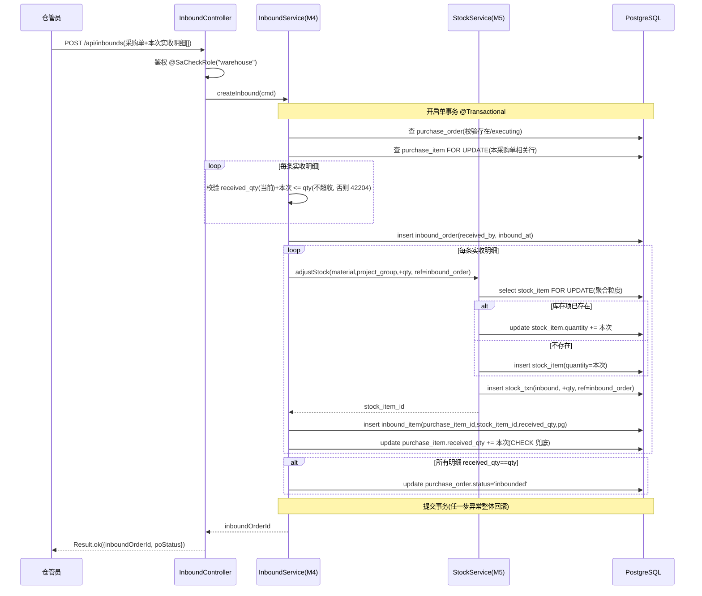
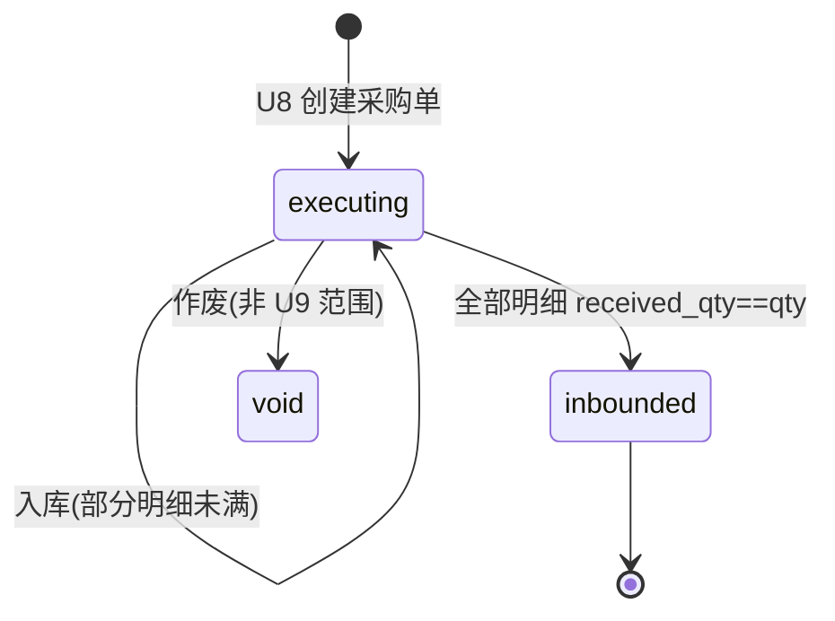

# U9 多次到货验收入库 · 详细设计

> 阶段三·详细设计产物 · 创建日期：2026-06-05 · 状态：草稿
> 上游：`tkxm-general`（`docs/design/general/procurement-general.md` §4.1 M4 入库契约 / §3.2 多次到货时序 / §7 库存记账）、`tkxm-database`（`docs/design/db/procurement-db.md` §3.4 inbound_order/inbound_item/purchase_item、§3.5 stock_item/stock_txn）、`tkxm-prototype`（`docs/prototype/index.html` 屏 `inbound`）
> 下游：`tkxm-coding`（编码与单测）、`tkxm-review`（代码审查）
> 对应：功能点 **U9 多次到货验收入库**、模块 **M4 采购与入库 + M5 库存（BC4/BC5）**、需求 **D3**、原型屏 `inbound`
> 通用响应 / 错误码 / 鉴权约定与 `U6-budget-import.md` §6 一致（同一套 `Result<T>` / `BizException` / Sa-Token）。

---

## 1. 概述

U9 实现「多次到货分批验收入库」：一张已执行的采购单（U8 产出，`status=executing`）可被仓管员多次验收入库，每次提交「本次实收明细」。系统在**单事务**内完成四张表写入并维护库存 SoR：

1. 写 `inbound_order`（本次入库单）+ `inbound_item`（本次实收明细）；
2. 累加 `purchase_item.received_qty`（累计已收），**不超收**（`received_qty ≤ qty`，CHECK 兜底）；
3. `upsert` `stock_item.quantity`（按 `material_name + project_group_id` 聚合，`+本次实收`）；
4. 插 `stock_txn`（`type=inbound`，`qty_change=+本次`，`ref_type=inbound_order`，`ref_id=入库单 id`）；
5. 当采购单所有明细 `received_qty == qty` 全部入完时，置 `purchase_order.status=inbounded`。

库存的唯一记账入口为 M5：M4 通过 M5 的内部能力 `调整库存(+qty, 来源=inbound_order)` 写入，**不跨模块直接读写库存表外的语义**（库存项是 BC5 的 SoR，见 general §5 / ER D-5）。本期不实现资产折旧字段（`asset_no/original_value/life_status` 预留）。

- **角色**：仓管员（`@SaCheckRole("warehouse")`）。
- **依赖**：硬依赖 **U8**（采购单与采购明细必须先存在且 `status=executing`）。
- **下游影响**：写入的库存供 **U10**（库存查询 + 流水）展示、**U11**（领用 + 审批出库）扣减、**U12**（盘点）核对。

---

## 2. 功能规约

### 2.1 入库命令 `入库(采购单, 本次实收明细[])`

**前置条件**
- P1：调用方已登录且具备 `warehouse` 角色（否则 40301）。
- P2：`purchaseOrderId` 对应采购单存在且未作废（`status ∈ {executing}`；否则 40401 / 状态非法）。
- P3：每条实收明细的 `purchaseItemId` 属于该采购单且存在（否则 40401）。
- P4：每条 `receivedQty > 0`（本次实收为正；否则 40001）。
- P5：对每条明细，`purchase_item.received_qty(库内当前) + 本次 receivedQty ≤ qty`（不超收；否则 42204）。

**后置条件**
- Q1：生成 1 张 `inbound_order`（`received_by=当前仓管`、`inbound_at=now()`）。
- Q2：每条实收生成 1 条 `inbound_item`（含 `purchase_item_id`、`stock_item_id`、`received_qty`、`project_group_id`）。
- Q3：每条对应 `purchase_item.received_qty` 累加本次实收。
- Q4：每条对应 `stock_item.quantity` 累加本次实收（无则按聚合粒度新建，`upsert`）。
- Q5：每条生成 1 条 `stock_txn`（`type=inbound`、`qty_change=+本次`、`ref_type=inbound_order`、`ref_id=入库单 id`）。
- Q6：若该采购单全部明细 `received_qty == qty`，置 `purchase_order.status=inbounded`；否则保持 `executing`。
- Q7：上述 Q1–Q6 在**同一数据库事务**内提交，任一步失败整体回滚（无半成品入库单 / 无库存虚增）。

**不变量（贯穿生命周期）**
- INV-1：对任一 `purchase_item`，恒有 `0 ≤ received_qty ≤ qty`（应用层校验 + DB `CHECK (received_qty >= 0 AND received_qty <= qty)` 兜底）。
- INV-2：对任一 `stock_item`，恒有 `quantity ≥ 0`（DB `CHECK (quantity >= 0)`）。
- INV-3：`stock_item.quantity == 该库存项所有 stock_txn.qty_change 之和`（库存 = 流水累计，账实可对账，见 ER D-5）。
- INV-4：`Σ inbound_item.received_qty(某 purchase_item)` == 该 `purchase_item.received_qty`（累计已收一致）。

### 2.2 验收标准（Acceptance Criteria）

- **AC-1 单次入库**：对 `executing` 采购单提交一次实收（小于采购数量），返回入库单 id；`received_qty`、`stock_item.quantity` 正确累加，生成 inbound 流水，采购单仍 `executing`。
- **AC-2 分批多次入库**：同一采购单多次提交，每次累加，`received_qty` 逐次逼近 `qty`，库存量逐次增加，流水逐条追加。
- **AC-3 累计超收拒绝**：`received_qty(当前) + 本次 > qty` 时拒绝（42204），不写任何表（事务回滚）。
- **AC-4 库存正确累加 / 聚合**：相同 `material_name + project_group_id` 的多次/多明细入库聚合到同一 `stock_item`，`quantity` 为累加值。
- **AC-5 全部入完转 inbounded**：当采购单所有明细 `received_qty == qty`，采购单 `status` 由 `executing → inbounded`。
- **AC-6 鉴权**：非 `warehouse` 角色调用入库返回 40301。
- **AC-7 并发入库**：对同一采购单 / 库存项的并发入库，最终 `received_qty`、`quantity`、流水总和一致，不超收、不丢更新。

---

## 3. 时序（单事务入库写四表）



---

## 4. 数据流与状态

### 4.1 采购单状态流转



- 仅当采购单 `status=executing` 可入库；`inbounded` / `void` 拒绝入库（状态非法）。
- 入库不直接改采购单状态，**除非**触发 Q6（全部入完）才置 `inbounded`。
- 不变量 INV-1 决定：`received_qty` 单调不减、上界为 `qty`。

### 4.2 库存项 upsert 聚合粒度

- 聚合键 = `(material_name, project_group_id)`，对齐 `uk_stock (material_name, project_group_id) WHERE is_deleted=0`（DB §3.5），与 ER / general 的 **TBD-1** 暂定粒度一致。
- `material_name` 取自对应 `purchase_item.material_name`；`project_group_id` 取自入库命令（默认采购单的 `project_group_id`）；`department_id` 由 `project_group → department` 推导冗余写入。
- upsert 语义：命中聚合键的未删库存项 → `quantity += 本次`；否则新建 `quantity = 本次`。新建/更新均紧随一条 `stock_txn` 记账，保证 INV-3。
- 并发下 upsert 用 `SELECT ... FOR UPDATE` 行锁（命中时）；新建竞态由部分唯一索引 `uk_stock` 兜底（重复插入 → 唯一冲突 → 回退为更新或事务重试，见 §8）。

### 4.3 数据写入清单（单事务）

| 步骤 | 表 | 动作 | 关键字段 |
|---|---|---|---|
| 1 | `inbound_order` | insert | `purchase_order_id`、`received_by`=当前仓管、`inbound_at`=now() |
| 2 | `stock_item` | upsert | 聚合键 `(material_name, project_group_id)`，`quantity += 本次` |
| 3 | `stock_txn` | insert | `type=inbound`、`qty_change=+本次`、`ref_type=inbound_order`、`ref_id`=入库单 id |
| 4 | `inbound_item` | insert | `inbound_order_id`、`purchase_item_id`、`stock_item_id`、`received_qty`、`project_group_id` |
| 5 | `purchase_item` | update | `received_qty += 本次`（CHECK ≤ qty 兜底） |
| 6 | `purchase_order` | update（条件） | 全部入完时 `status=inbounded` |

---

## 5. 关键逻辑

### 5.1 不超收校验（INV-1 / AC-3）

- 入库前对每条明细按 `purchase_item_id` 行锁读取库内当前 `received_qty`、`qty`：
  - `if (received_qty + 本次 receivedQty > qty) throw new BizException(42204, "累计超收：明细 " + purchaseItemId)`。
- 同一请求若包含同一 `purchase_item_id` 的多行，需先在内存按明细累加本次合计再比对（避免单行各自通过、合计超收）。
- DB `CHECK (received_qty >= 0 AND received_qty <= qty)` 为最终兜底：任何绕过应用层的写入触发约束违例 → 事务回滚（映射 42204，见 §8）。

### 5.2 stock_item upsert（AC-4）

```
findByAggKey(material_name, project_group_id) FOR UPDATE
  ├─ 命中 → update quantity = quantity + 本次
  └─ 未命中 → insert (material_name, project_group_id, department_id, quantity=本次)
                  └─ 唯一冲突(并发新建) → 重读后改 update（或抛出由事务重试）
return stock_item_id  // 回填 inbound_item.stock_item_id
```

- 聚合键与 DB 唯一索引一致；`quantity` 仅经此处 +，且必与 §5.3 流水成对，保证 INV-3。

### 5.3 stock_txn 记账（INV-3 / 库存审计）

- 每条实收对应**恰好一条** `stock_txn`：`type=inbound`、`qty_change=+receivedQty`、`ref_type=inbound_order`、`ref_id=inboundOrderId`、`created_at=now()`。
- 流水为「事件」表（不软删），是 M5 的天然审计与对账依据（general §7 库存记账）。
- 「先改库存数量、后插流水」与「先插流水、后改数量」均可，但二者必须同事务；推荐数量与流水紧邻写入以降低交错。

### 5.4 事务边界（Q7 / AC-3 回滚）

- `InboundService.createInbound` 标注 `@Transactional(rollbackFor = Exception.class)`，覆盖步骤 1–6 全部写入。
- M4 调 M5 的 `adjustStock` 为**同进程同步**内部能力，运行在同一事务（同一 `@Transactional` 传播 `REQUIRED`），不开新事务、不跨服务远程调用。
- 任一校验失败（42204/40401/40001）或 DB 约束违例 → 抛异常 → 整体回滚，保证「不写半张入库单 / 不虚增库存」。
- 并发控制：`purchase_item` 与 `stock_item` 均以 `SELECT ... FOR UPDATE` 行锁串行化同一行的并发入库（AC-7），配合 CHECK 兜底，杜绝超收与丢更新。

---

## 6. 接口定义

> 统一前缀 `/api`；统一返回 `Result<T>`（`code=0` 成功，非 0 为错误码）；鉴权 Sa-Token。错误码见 §7。共 **2** 个接口。

### 6.1 入库（创建入库单）

- **Method / Path**：`POST /api/inbounds`
- **鉴权**：`@SaCheckRole("warehouse")`
- **请求体** `CreateInboundCmd`：

| 字段 | 类型 | 必填 | 约束 | 说明 |
|---|---|---|---|---|
| `purchaseOrderId` | long | 是 | >0 | 目标采购单（须 `executing`） |
| `projectGroupId` | long | 否 | >0 | 归属项目组（默认取采购单 `project_group_id`） |
| `items` | array | 是 | 非空 | 本次实收明细 |
| `items[].purchaseItemId` | long | 是 | >0，属本采购单 | 对应采购明细 |
| `items[].receivedQty` | decimal(18,3) | 是 | >0 | 本次实收数量 |

- **响应** `Result<CreateInboundVO>`：

| 字段 | 类型 | 说明 |
|---|---|---|
| `inboundOrderId` | long | 新建入库单 id |
| `purchaseOrderStatus` | string | 入库后采购单状态（`executing` / `inbounded`） |
| `items[].purchaseItemId` | long | 明细 id |
| `items[].receivedQtyTotal` | decimal | 该明细累计已收 |
| `items[].stockItemId` | long | 写入的库存项 id |

- **示例**：

```json
// 请求
{ "purchaseOrderId": 1001, "items": [ { "purchaseItemId": 5001, "receivedQty": 1 } ] }
// 响应
{ "code": 0, "message": "ok",
  "data": { "inboundOrderId": 7001, "purchaseOrderStatus": "executing",
            "items": [ { "purchaseItemId": 5001, "receivedQtyTotal": 1, "stockItemId": 9001 } ] } }
```

- **错误**：40001 参数 / 40301 无权限 / 40401 采购单或明细不存在 / 42204 累计超收 / 50000 系统。

### 6.2 入库记录查询

- **Method / Path**：`GET /api/inbounds?purchaseOrderId={id}&page={p}&size={s}`
- **鉴权**：`@SaCheckRole("warehouse")`
- **请求参数**：`purchaseOrderId`（必填，按采购单查其多次入库历史）、`page`/`size`（分页，默认 1/20）。
- **响应** `Result<Page<InboundOrderVO>>`：

| 字段 | 类型 | 说明 |
|---|---|---|
| `inboundOrderId` | long | 入库单 id |
| `purchaseOrderId` | long | 采购单 id |
| `receivedBy` | long | 验收人（仓管）id |
| `inboundAt` | datetime | 入库时间 |
| `items[].purchaseItemId` | long | 采购明细 id |
| `items[].materialName` | string | 物料名 |
| `items[].receivedQty` | decimal | 本次实收 |
| `items[].stockItemId` | long | 库存项 id |

- **错误**：40301 无权限 / 40401 采购单不存在 / 50000 系统。

---

## 7. 测试点（T-x ↔ AC-x）

| 编号 | 关联 AC | 场景 | 预期 |
|---|---|---|---|
| T-1 | AC-1 | 单次入库（实收 < 采购数量） | 返回 inboundOrderId；`purchase_item.received_qty` 增本次；`stock_item.quantity` 增本次；生成 1 条 inbound 流水；采购单仍 `executing` |
| T-2 | AC-2 | 分批多次入库（同明细两次） | 两次累加，`received_qty`=两次和，`quantity`=两次和，流水 2 条 |
| T-3 | AC-3 | 累计超收（当前+本次 > qty） | 抛 42204；inbound_order/inbound_item/stock_txn 均未写入，`received_qty`/`quantity` 不变（回滚） |
| T-3b | AC-3 | 同请求同明细多行合计超收 | 内存合计比对触发 42204，整体回滚 |
| T-4 | AC-4 | 相同 material+project_group 多明细/多次 | 聚合到同一 `stock_item`，`quantity` 为累加值；首入新建库存项、再入更新 |
| T-5 | AC-5 | 末次入库使所有明细满量 | 采购单 `status` 由 `executing → inbounded` |
| T-5b | AC-5 | 仍有明细未满量 | 采购单保持 `executing` |
| T-6 | AC-6 | 非 warehouse 角色调用 | 返回 40301，无写入 |
| T-7 | AC-7 | 同一采购单/库存项并发入库（FOR UPDATE 串行化） | 最终 `received_qty`/`quantity`/流水和一致；不超收、不丢更新；超收的并发请求被 42204 拒绝 |
| T-8 | AC-1/INV | 采购单不存在 / 明细不属本单 | 返回 40401，无写入 |
| T-9 | AC-1 | `receivedQty <= 0` 或 items 为空 | 返回 40001，无写入 |
| T-10 | INV-3 | 入库后对账 | `stock_item.quantity == Σ stock_txn.qty_change`；`purchase_item.received_qty == Σ inbound_item.received_qty` |

---

## 8. 异常处理

> **编码阶段错误码归一（与 U7/U8 一致）**：初稿「累计超收」用的 `42203` 与 U7 `REJECT_OPINION_REQUIRED(42203)` 冲突，统一为 **42204**（`OVER_RECEIVE`，新增）。「采购单存在但非 executing」从初稿的 40401 拆出，记 **40903**（`STATE_CONFLICT`，与 U8 一致）；「采购单 / 明细不存在」沿用 **40401**。HTTP 由 `code/100` 派生：40401→404、40903→409、42204→422、40001→400。
> **并发库存 upsert**：编码以 `INSERT ... ON CONFLICT (material_name, project_group_id) WHERE is_deleted=0 DO UPDATE SET quantity = quantity + EXCLUDED.quantity RETURNING id` 原子实现「命中累加 / 未命中新建」，DB 层化解并发新建与并发累加竞态（替代初稿的「重读改 update / 事务重试」描述，效果等价且更简洁）；`purchase_item` 仍以 `SELECT ... FOR UPDATE` 锁行串行化不超收校验。

| 触发 | 错误码 | HTTP | 处理 |
|---|---|---|---|
| 参数缺失 / `receivedQty<=0` / items 空 | 40001 | 400 | `@Validated` + 服务层校验，抛 `BizException(40001,...)` |
| 非 `warehouse` 角色 | 40301 | 403 | Sa-Token `@SaCheckRole` 拦截，全局异常处理转 `Result.error(40301,...)` |
| 采购单 / 采购明细不存在（明细不属本单） | 40401 | 404 | 服务层查不到，抛 `BizException(40401,...)`，回滚 |
| 采购单非 `executing`（已入库 / 作废） | 40903 | 409 | 状态前置校验，抛 `BizException(40903,...)`，回滚 |
| 累计超收（应用层 FOR UPDATE 下比对） | 42204 | 422 | 抛 `BizException(42204,...)`，整事务回滚（AC-3） |
| DB CHECK 违例（`received_qty<=qty` / `quantity>=0` 兜底） | — | 500 | FOR UPDATE 串行化使应用层校验权威，CHECK 仅理论兜底；若触发即视为严重不一致，归 50000 并回滚 |
| 其他未预期异常 | 50000 | 500 | 全局异常处理记录日志，返回系统错误，事务回滚 |

- 全局异常处理器（`GlobalExceptionHandler`）统一将 `BizException.getCode()` 透传到 `Result.code`；未捕获异常归一为 50000。
- 所有错误路径均不得留下「半成品入库单」或「库存虚增」——由 §5.4 单事务保证。

---

## 9. 依赖与影响

| 维度 | 内容 |
|---|---|
| **硬依赖** | **U8**（采购执行 + 到货单）：采购单 / 采购明细必须先存在且 `status=executing`；到货单上传为 U8/前置语义（原型 inbound 屏含上传位） |
| **写入模块** | **M5 库存（BC5）**：通过内部能力 `adjustStock` upsert `stock_item` + 插 `stock_txn`；库存项是 M5 的 SoR，M4 不绕过 M5 改库存 |
| **被依赖（下游）** | **U10** 库存查询 + 流水（读 `stock_item` / `stock_txn`）；**U11** 领用 + 审批出库（扣减本功能写入的库存）；**U12** 盘点 + 差异调整（核对库存） |
| **关联模块** | M1（鉴权 / 项目组-部门归属推导冗余 `department_id`） |
| **数据表** | 写：`inbound_order`、`inbound_item`、`purchase_item`、`stock_item`、`stock_txn`、`purchase_order`（状态）；读：`purchase_order`、`purchase_item`、`project_group` |
| **不变量护栏** | DB `CHECK(received_qty<=qty)`、`CHECK(quantity>=0)`、`uk_stock` 部分唯一索引 |

---

## 10. 待确认（TBD）

| 编号 | 待确认项 | 现状 / 暂定 | 拍板人 |
|---|---|---|---|
| TBD-1 | 库存项聚合粒度（继承 ER / general / DB TBD-1） | 暂定 `(material_name, project_group_id)`，不按批次 / 序列号；若后续按批次入库，`stock_item` 聚合键与 `uk_stock` 需同步调整，本设计 §4.2/§5.2 的 upsert 键随之变更 | 业务 |
