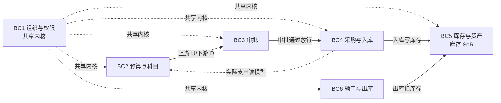
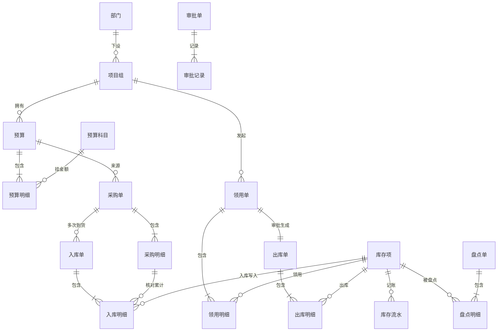
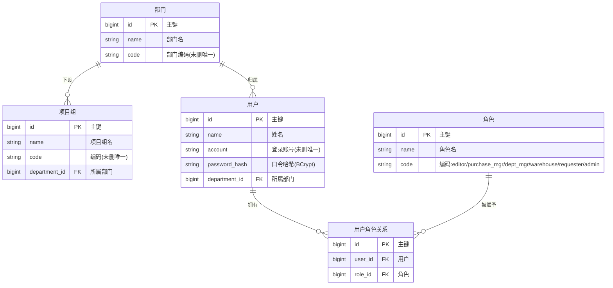
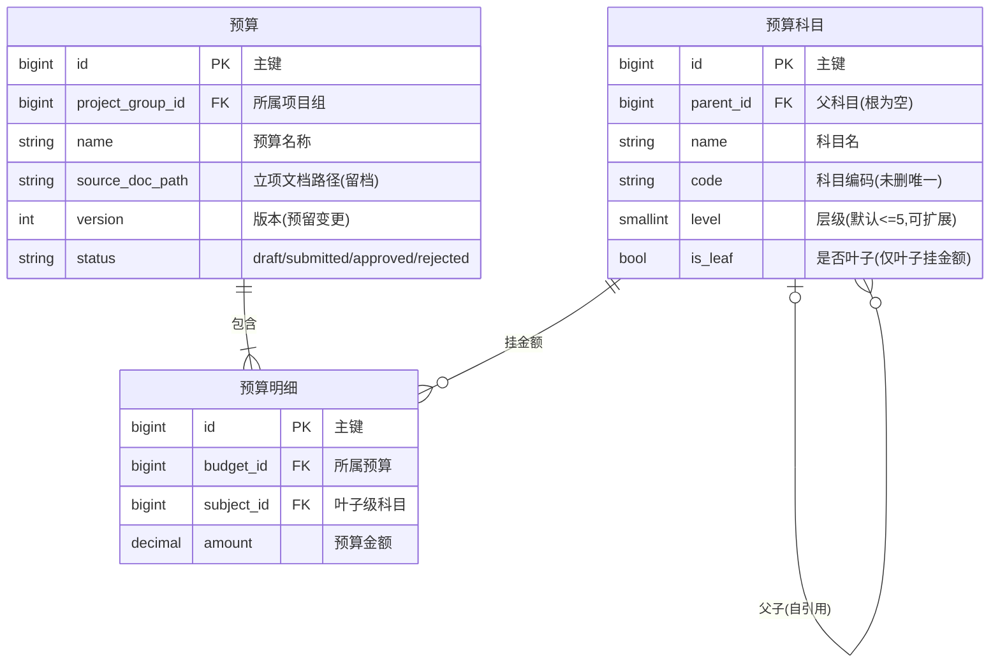
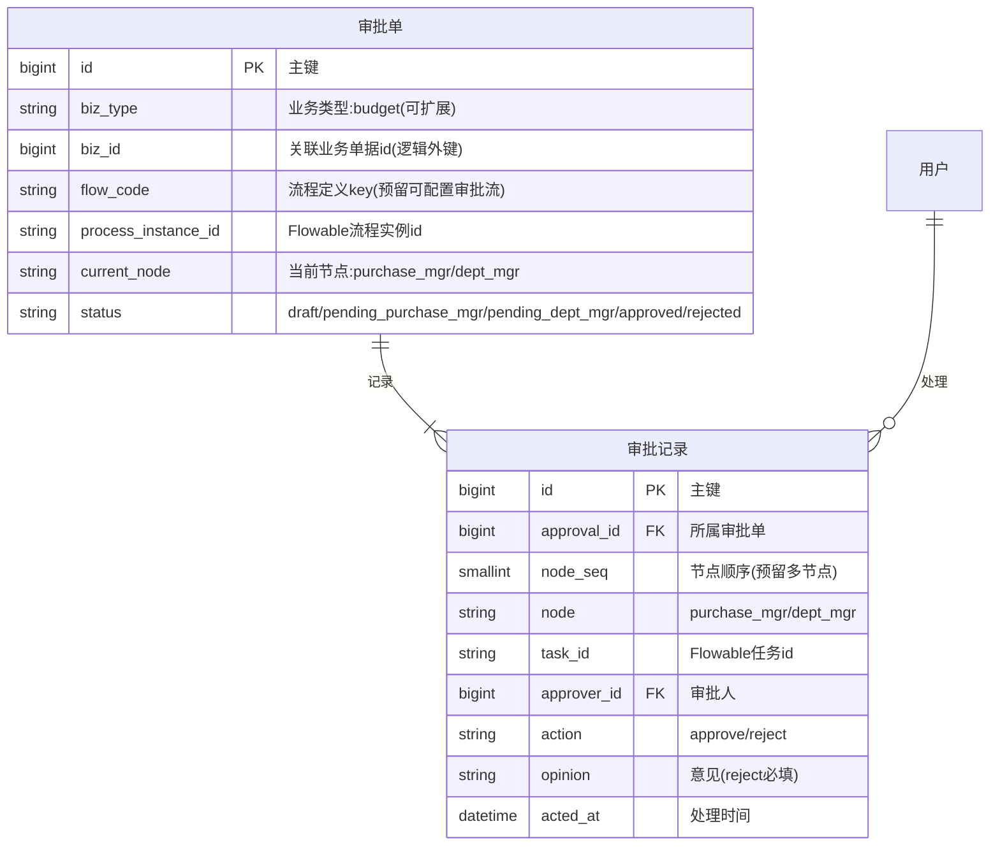
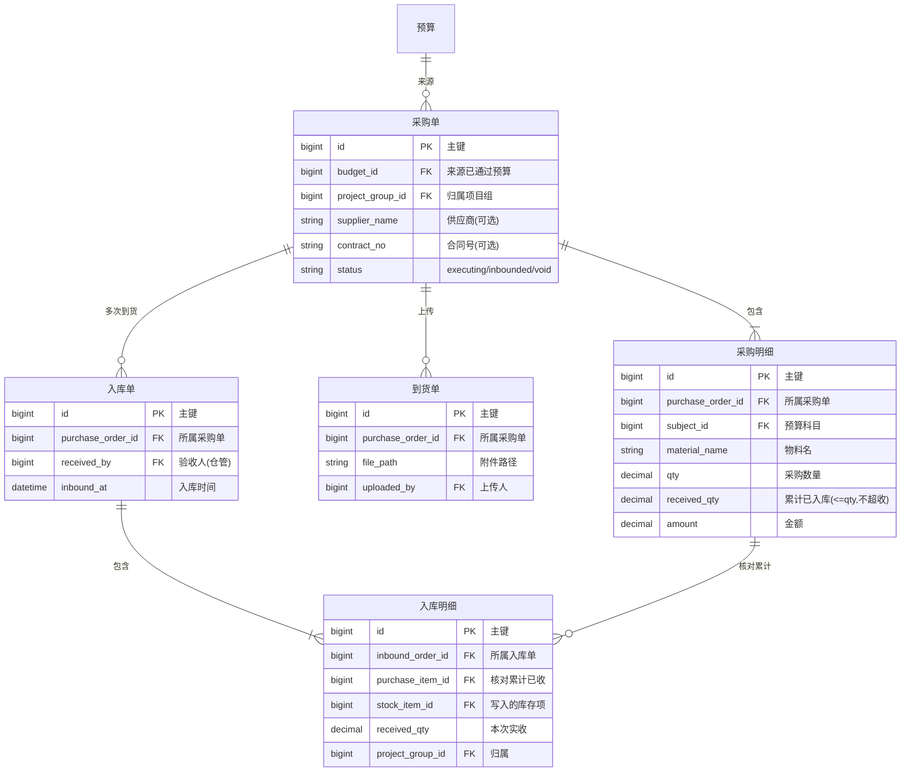
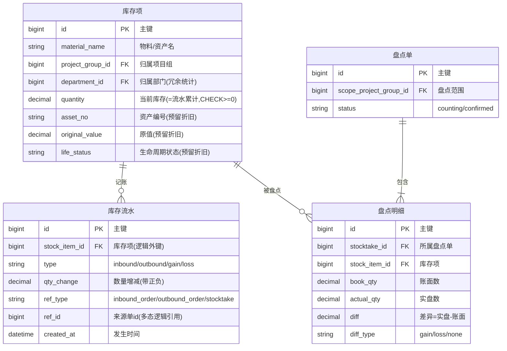
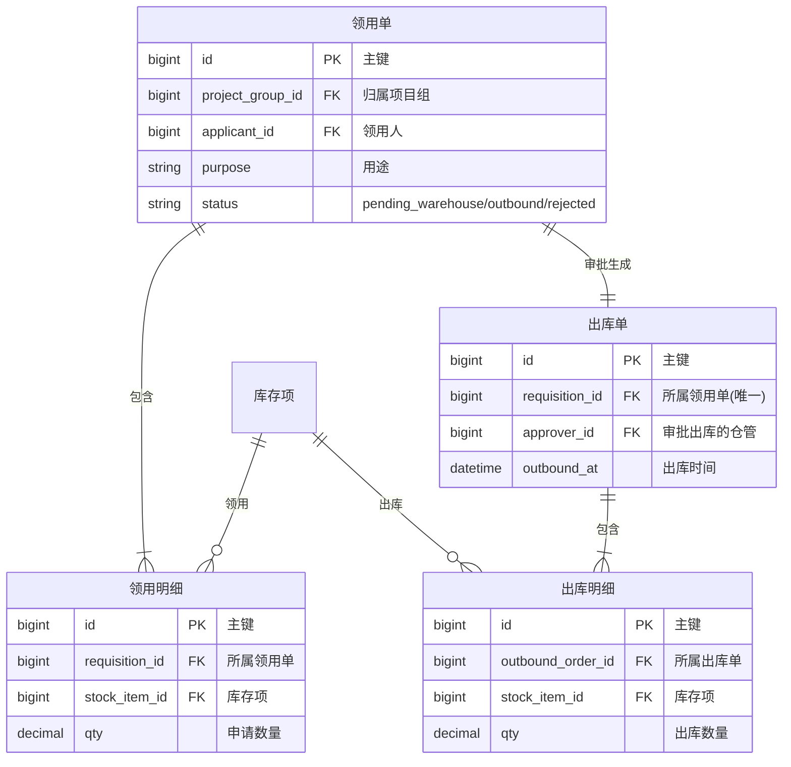

# 采购项目管理系统 · E-R 设计文档

> 阶段三·概要设计的 E-R 设计产物（DDD，与 `tkxm-general` 概要设计文档同步产出） · 创建日期：2026-06-05 · 状态：草稿
> 上游：产品阶段 `tkxm-prd`（`docs/prd/procurement-prd.md`）、`tkxm-prototype`（`docs/prototype/index.html`）、`tkxm-plan`（`docs/plan/procurement-plan.md`）
> 下游：阶段三 `tkxm-database`（`docs/design/db/procurement-db.md`）、`tkxm-detail`（`docs/design/detail/`）
> 来源：现行 PRD + 原型 + 计划；物理表/类型/索引以 `tkxm-database` 为准。

---

## 1. 概述

- **建模范围**：覆盖「组织/权限 → 预算/科目 → 两级审批 → 采购执行/验收入库 → 库存/资产 → 领用/出库 → 盘点」全链路；多项目（项目组/部门）为数据归属维度。
- **建模方法**：领域驱动设计（DDD）— 先划分 6 个限界上下文，再在各上下文内识别聚合根/实体/值对象并建关系。
- **图例约定**：统一用 Mermaid `erDiagram`；基数 `|`=一（必选）、`o`=零（可选）、`{`=多；多对多一律拆为独立关联实体（如 `用户角色关系`）。**中文/含空格实体名一律加半角双引号**。
- **渲染自检**：所有图已过 `references/mermaid-er-checklist.md`（实体名引号、关系带标签、属性带类型、无全角符号）。
- **静态 SVG**：本环境暂无 `mmdc`（mermaid-cli），SVG 兜底**待导出**；Mermaid 源码为唯一事实源，后续 `mmdc -i procurement-er.md -o svg/...` 导出到 `./svg/` 即可。

---

## 2. 限界上下文划分（Bounded Context）

> 先分领域、再建模。6 个上下文高内聚、低耦合；**UI 域 ≠ 领域边界**：原型把 B 域（预算科目与审批）= BC2+BC3、D 域（采购入库与领用出库）= BC4+BC5+BC6 合并为导航分组，仅为操作动线归并，领域边界仍按下表。

| 上下文 | 职责（做什么） | 核心实体 | 与其他上下文的关系 |
|---|---|---|---|
| BC1 组织与权限 | 部门/项目组/用户/角色维护、登录鉴权 | 部门、项目组、用户、角色、用户角色关系 | **共享内核**（被全员依赖） |
| BC2 预算与科目 | 预算导入、多级科目树、科目比对新增、预算vs实际读模型 | 预算、预算明细、预算科目 | 上游 → BC3；下游 ← BC1 |
| BC3 审批 | 通用审批（多业务类型）、两级审批、驳回退回、流转历史 | 审批单、审批记录 | 上游 → BC4；对 BC2 为发布语言（biz 投影） |
| BC4 采购与入库 | 采购执行、到货单、多次到货验收入库 | 采购单、采购明细、到货单、入库单、入库明细 | 上游 → BC5（写库存）；下游 ← BC2/BC3 |
| BC5 库存与资产 | 库存项 SoR、库存流水、盘点与差异调整 | 库存项、库存流水、盘点单、盘点明细 | **被 BC4/BC6 写入**（供应商/客户） |
| BC6 领用与出库 | 领用申请、仓管核库存审批出库、扣减库存 | 领用单、领用明细、出库单、出库明细 | 上游 → BC5（扣库存） |

### 上下文映射图（Context Map）



> 📎 静态图：`./svg/context-map.svg`（待导出）

---

## 3. 总览 E-R 图

> 跨上下文整体视图，重**可读性**：只画核心实体与主关系，属性留到 §4 分上下文图与 §5 实体清单。



> 📎 静态图：`./svg/overview.svg`（待导出）
> 说明：`审批单` 以 `业务类型 + 业务单据id` 多态**逻辑**关联业务单据（本期 = 预算），无物理外键，故不画实线，详见 §6 D-2。

---

## 4. 分上下文 E-R 图

> 每个上下文一张带属性图；属性为**逻辑类型**，物理类型/长度/索引见 `tkxm-database`。

### 4.1 BC1 组织与权限



> 📎 静态图：`./svg/ctx-bc1.svg`（待导出）

### 4.2 BC2 预算与科目



> 📎 静态图：`./svg/ctx-bc2.svg`（待导出）
> 「预算 vs 实际」(U13/FP-10) 为只读读模型：按 `subject_id` 聚合 `预算明细.amount`(预算) 与 `采购明细.amount`(实际)，不新增实体。

### 4.3 BC3 审批



> 📎 静态图：`./svg/ctx-bc3.svg`（待导出）
> 审批由 Flowable BPMN 引擎驱动（流程定义 `budget_approval`），`审批单`/`审批记录` 为业务侧链接 + 投影；权威流转状态在引擎表 `ACT_*`。

### 4.4 BC4 采购与入库



> 📎 静态图：`./svg/ctx-bc4.svg`（待导出）

### 4.5 BC5 库存与资产



> 📎 静态图：`./svg/ctx-bc5.svg`（待导出）

### 4.6 BC6 领用与出库



> 📎 静态图：`./svg/ctx-bc6.svg`（待导出）

---

## 5. 实体清单（Data Dictionary）

> 23 个实体，标注聚合根（AR）。物理类型/长度/默认值见 `tkxm-database`。

| # | 实体 | 上下文 | 聚合根 | 业务含义 |
|---|---|---|---|---|
| 1 | 部门 | BC1 | 是 | 组织单元，资产/项目归属顶层 |
| 2 | 项目组 | BC1 | 是 | 项目单元，归属部门；业务数据主归属维度 |
| 3 | 用户 | BC1 | 是 | 系统用户（表名 sys_user，避保留字） |
| 4 | 角色 | BC1 | 是 | 权限角色（6 内置 code） |
| 5 | 用户角色关系 | BC1 | 否（属用户） | 用户↔角色 多对多关联实体 |
| 6 | 预算科目 | BC2 | 是 | 多级科目树（自引用），仅叶子挂金额 |
| 7 | 预算 | BC2 | 是 | 项目组的一次预算（聚合根） |
| 8 | 预算明细 | BC2 | 否（属预算） | 叶子级科目预算金额 |
| 9 | 审批单 | BC3 | 是 | 通用审批（多业务类型），Flowable 投影/链接 |
| 10 | 审批记录 | BC3 | 否（属审批单） | 审批节点动作流水（驳回意见） |
| 11 | 采购单 | BC4 | 是 | 采购执行主单 |
| 12 | 采购明细 | BC4 | 否（属采购单） | 采购物料行，累计已收不超收 |
| 13 | 到货单 | BC4 | 否（属采购单） | 到货凭证附件 |
| 14 | 入库单 | BC4 | 是 | 验收入库主单（一采购单可多张=多次到货） |
| 15 | 入库明细 | BC4 | 否（属入库单） | 本次实收，写入库存项 |
| 16 | 库存项 | BC5 | 是 | 库存/资产唯一 SoR |
| 17 | 库存流水 | BC5 | 否（事件） | 入库/出库/盘盈亏事件，天然审计 |
| 18 | 盘点单 | BC5 | 是 | 盘点任务 |
| 19 | 盘点明细 | BC5 | 否（属盘点单） | 账实差异 |
| 20 | 领用单 | BC6 | 是 | 领用申请 |
| 21 | 领用明细 | BC6 | 否（属领用单） | 领用物料行 |
| 22 | 出库单 | BC6 | 是 | 仓管审批后出库（一领用单一出库单） |
| 23 | 出库明细 | BC6 | 否（属出库单） | 出库物料行 |

> 状态枚举详见 `tkxm-database` §5；本表与库设计同名同义。

---

## 6. 关键设计决策与权衡

| 编号 | 决策 | 备选方案 | 理由 |
|---|---|---|---|
| D-1 | 多对多 `用户角色关系` 拆为独立关联实体 | 数组字段 | 关系可扩展（赋予时间等）、可索引、符合范式 |
| D-2 | `审批单` 用 `biz_type+biz_id` 多态**逻辑**关联业务单据 | 每业务类型一张审批表 | 通用审批泛化多业务类型，无法建物理外键；预留可配置审批流 |
| D-3 | 驳回 = 流程结束 + 退回编制态，重提为**新流程实例** | 同实例回退 | 满足「驳回退回重提，重走采购主管」语义；审批历史清晰 |
| D-4 | `库存流水.stock_item_id` 用**逻辑外键** | 物理外键 | 高写入流水表降并发耦合；库存项是 BC5 的 SoR |
| D-5 | 库存项唯一 SoR + 全变动经流水 | 各单据各记库存 | 账实可对账、天然审计；扣减经行锁 + CHECK 防超发 |
| D-6 | 预算 vs 实际为只读读模型（聚合查询） | 实体化冗余表 | 仅展示不核减，无需落表；按 subject 聚合即可 |
| D-7 | 金额仅挂 `is_leaf=true` 科目，父级汇总 | 任意层挂金额 | 避免重复计金；汇总由查询/应用层算 |

---

## 7. 预留与扩展点

- **资产折旧/消耗**：`库存项` 预留 `asset_no`/`original_value`/`life_status`；后续加 `折旧记录`/`消耗台账` 实体挂库存项，不改主流程。
- **预算变更/台账**：`预算` 预留 `version`；后续加 `预算变更单` 实体；「预算 vs 实际」读模型已就位，余额核减为预留接入点。
- **可配置审批流**：`审批单.flow_code` + `审批记录.node_seq` 预留；后续加 `审批流程定义`/`审批节点定义` 实体，按 `biz_type` 部署不同 BPMN，无需改现有实体。

---

## 8. 待确认 (TBD)

| 编号 | 待确认项 | 现状/暂定 | 拍板人 |
|---|---|---|---|
| TBD-1 | 库存项聚合粒度 | 暂定 物料名 + 项目组，不按批次/序列号 | 业务 |
| TBD-2 | 物料/资产区分口径 | 暂定统一为库存物料，资产标识为可选属性 | 业务 |
| TBD-3 | 附件（立项/到货单）存储介质 | 暂定存路径，文件落本地/对象存储 | 技术 |

---

## 9. 渲染自检（Mermaid）

- [x] 每个 ```mermaid 块首行为 `erDiagram` / `flowchart`，未混用语法。
- [x] 所有关系都带 `: "标签"`，基数符号成对、方向正确。
- [x] 中文实体名、关系标签、注释均加半角双引号。
- [x] 每条属性为「类型 + 字段名」起步（如 `bigint id PK "主键"`），注释加引号，无空类型。
- [x] 同一实体名全程写法一致。
- [x] 无全角符号、智能引号、`#`/`//` 注释。
- [ ] **静态 SVG 导出**：本环境无 `mmdc`，待装 mermaid-cli 后导出到 `./svg/`（`mmdc -i procurement-er.md -o svg/diagram.svg`）。
