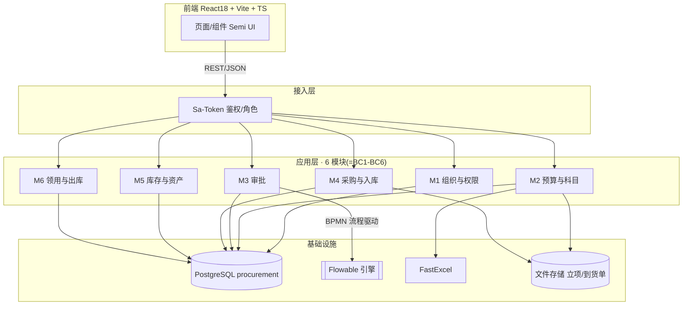
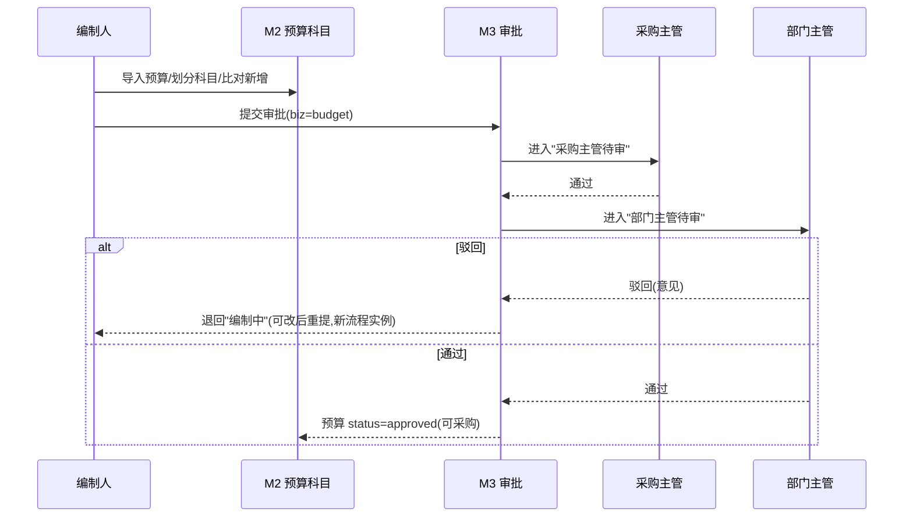
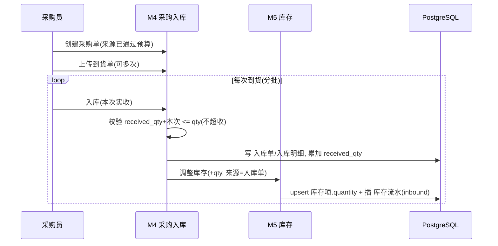
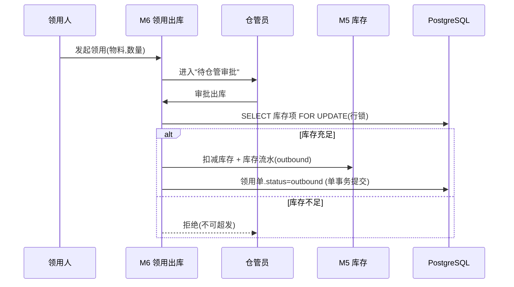
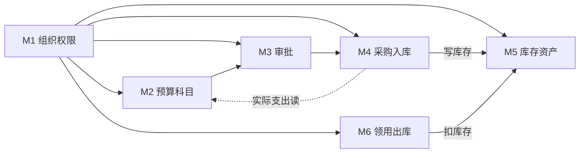

# 采购项目管理系统 · 概要设计

> 阶段三·概要设计产物 · 创建日期：2026-06-05 · 状态：草稿
> 上游：产品阶段 `tkxm-prd`（`docs/prd/procurement-prd.md`）、`tkxm-prototype`（`docs/prototype/index.html`）、`tkxm-plan`（`docs/plan/procurement-plan.md`）
> 同步产物：E-R 设计（DDD，见 `docs/design/er/procurement-er.md`）
> 下游：阶段三 `tkxm-database`（`docs/design/db/procurement-db.md`）、`tkxm-detail`（`docs/design/detail/`）

---

## 1. 概述

- **系统定位**：多项目采购全流程管理系统，覆盖「预算 → 科目 → 两级审批 → 采购执行 → 验收入库 → 领用/出库 → 盘点」可追溯闭环，供编制人、采购主管、部门主管、仓管员、领用人使用。
- **设计目标与约束（非功能）**：企业内部量级；库存扣减**零超发**、入库**不超收**；审批/库存全程可审计；预算导入可校验、错误行可定位；单体可水平扩展；预算与实际**仅展示对比、不核减**。
- **设计方法**：领域驱动设计（DDD）— 先划分 6 个限界上下文（BC1–BC6）再建模，E-R 同步产出（见 `docs/design/er/procurement-er.md`）；模块边界以对外契约刻画；关键技术选型经候选对比并留决策记录（见 §2.3）。

---

## 2. 总体架构

### 2.1 分层

| 层 | 职责 | 关键技术/框架 |
|---|---|---|
| 接入层 | 鉴权、路由、参数校验、统一响应 | Spring MVC、**Sa-Token**（拦截器 + `@SaCheckRole`）、`@Validated` |
| 应用层 | 用例编排、**事务边界**、DTO 装配 | Spring `@Service` / `@Transactional` |
| 领域层 | 业务规则、聚合不变量（库存记账、审批状态机、超收/超发校验） | POJO 领域服务 |
| 基础设施层 | 持久化、迁移、审批引擎、Excel、文件、API 文档 | **MyBatis-Plus**、**Flyway**、**Flowable**、**FastExcel**、文件存储、**springdoc-openapi** |

### 2.2 架构图

### 2.3 技术选型

> 聚焦**关键选型**（换不起、影响全局的），与 `tkxm-database`、`backend/pom.xml` 一致。

#### 2.3.1 选型总览

| 维度 | 选型 | 理由（回指需求/非功能目标） | 替代方案 | 状态 |
|---|---|---|---|---|
| 后端语言/框架 | Java 17 + Spring Boot 3.4.1 | 现有脚手架；生态成熟 | — | 沿用既定 |
| 持久层 | MyBatis-Plus 3.5.9 | CRUD + 分页 + 逻辑删除全局配置 | JPA | 沿用既定 |
| 迁移 | Flyway（含 PG 模块） | DDL 版本化，与 Flowable 建表协调 | Liquibase | 沿用既定 |
| 数据库 | PostgreSQL（`procurement`） | 与 `tkxm-database` 一致；`pg_trgm` 支持科目模糊搜索 | MySQL | 沿用既定 |
| 认证授权 | Sa-Token 1.40 + spring-security-crypto(BCrypt) | 轻量 RBAC、注解式角色校验（A2） | 完整 Spring Security | 已确认 |
| 审批引擎 | **Flowable 7.1**（BPMN） | 两节点审批 + 预留可配置审批流（C1–C3） | 状态机手写 | 已确认 |
| Excel 导入 | FastExcel 1.1 | 预算模板流式解析 + 行级校验（B1） | EasyExcel/POI | 已确认 |
| API 文档 | springdoc-openapi 2.7 | Swagger UI | — | 沿用既定 |
| 前端 | React 18 + Vite 6 + TS 5 + **Semi UI** | 现有脚手架；设计风格 Semi Design | Ant Design | 已确认 |

#### 2.3.2 关键选型决策记录（ADR 轻量版）

**SEL-1 · 审批的实现方式（手写状态机 vs 流程引擎）**
- **决策**：本期直接用 **Flowable 7.1**，流程定义 `budget_approval`（采购主管 → 部门主管）。
- **背景/驱动**：PRD C1–C3 要两级审批 + 驳回退回重提 + 流转历史；预留区要「可配置审批流」。
- **候选对比**：

  | 候选 | 优势 | 劣势/代价 | 关键维度 |
  |---|---|---|---|
  | Flowable 7.1 ✅ | BPMN 驱动、历史表自带、可配置审批流一步到位 | 引入引擎表 `ACT_*`、学习成本 | 扩展性优 |
  | 手写状态机 | 轻、可控 | 后续可配置审批流需重构 | 锁定未来 |
  | 不引入（硬编码两节点） | 最简 | 完全不可配置 | 不够用 |

- **代价/已知短板**：引擎表与业务表同库，Flyway 与 Flowable 建表需协调顺序（详设 TBD）。
- **后续对策**：`审批单`/`审批记录` 做业务投影便于查询；流程实例 id、任务耗时可观测。

**SEL-2 · 库存并发控制（乐观锁 vs 悲观锁）**
- **决策**：库存扣减用**悲观行锁** `SELECT ... FOR UPDATE` + `CHECK(quantity>=0)` 兜底。
- **背景/驱动**：非功能目标「零超发」（E2）；企业内部并发量级不高，正确性优先。
- **候选对比**：悲观锁（正确性最强、并发吞吐略低）✅ / 乐观锁 version（高并发友好、冲突需重试）/ 不加锁（会超发，不可）。
- **后续对策**：库存量级上来后可评估改乐观锁；流水审计可对账兜底。

---

## 3. 关键流程时序

### 3.1 预算 → 两级审批（驳回退回重提）

### 3.2 采购执行 → 多次到货入库

### 3.3 领用 → 仓管审批出库（防超发）

---

## 4. 模块划分

> 模块边界 = 限界上下文（DDD）；契约用「能力」描述（命令=写，查询=读）。

| 模块 | 对应限界上下文 | 核心职责 | 对外提供能力（概要） |
|---|---|---|---|
| **M1 组织与权限** | BC1 | 部门/项目组/用户/角色维护、登录鉴权 | 登录、当前用户、组织树查询、用户角色维护 |
| **M2 预算与科目** | BC2 | 预算导入、科目树、比对新增、预算vs实际读模型 | 导入预算、科目查询/模糊搜索、新增科目、提交审批、预算vs实际查询 |
| **M3 审批** | BC3 | 通用审批（多业务类型）、两级、驳回退回、流转历史 | 提交审批、审批(通过/驳回)、待办查询、历史查询 |
| **M4 采购与入库** | BC4 | 采购执行、到货单、多次到货验收入库 | 创建采购单、上传到货单、入库(写库存) |
| **M5 库存与资产** | BC5 | 库存项 SoR、库存流水、盘点与差异调整 | 库存查询、库存增减(内部能力)、发起盘点、确认差异调整 |
| **M6 领用与出库** | BC6 | 领用申请、仓管核库存审批出库、扣减库存 | 发起领用、审批出库、领用/出库查询 |

### 4.1 关键模块契约要点

- **M2 预算与科目**
  - `导入预算(项目组, 模板文件)` → 命令；前置：模板合法；后置：生成 预算 + 预算明细，金额仅挂叶子级。
  - `科目模糊搜索(关键字)` → 查询；基于 `pg_trgm`。
  - `比对并新增科目(划分结果)` → 命令；缺失科目人工确认后写入。
  - `预算vs实际(预算id)` → 查询（读模型）；按 subject 聚合 预算明细.amount vs 采购明细.amount，仅展示。
- **M3 审批**（通用，Flowable BPMN 驱动）
  - `提交审批(biz_type, biz_id)` → 命令；启动流程实例（key=`budget_approval`，采购主管→部门主管）。
  - `审批(任务id, approve/reject, opinion)` → 命令；complete 用户任务；reject→流程结束、退回编制态、新实例重提。
- **M4 采购与入库**
  - `入库(采购单, 本次实收)` → 命令；不变量 `received_qty ≤ qty`（不超收）；写 入库单/入库明细、累加 received_qty、upsert 库存项、插 库存流水(inbound)，**单事务**。
- **M5 库存与资产**
  - `调整库存(库存项, qty_change, 来源)` → 内部能力，仅经流水改数量；对外只读 + 盘点确认。
- **M6 领用与出库**
  - `审批出库(领用单)` → 命令；前置：库存充足（行锁校验）；后置：扣减库存 + 库存流水(outbound) + 领用单.status=outbound，**单事务**。

---

## 5. 模块依赖关系

- **依赖方向**：M1 为共享内核（被全员依赖）；主链 M2→M3→M4→M5，M6→M5；**无环（DAG）**。
- **依赖类型**：同进程**同步调用**为主；库存写入由 M4/M6 调 M5 的内部能力，**不跨模块直接读写对方表**（库存项是 M5 的 SoR）。M4→M2「预算 vs 实际」为**只读读模型**。

---

## 6. 功能点 ↔ 模块对照（沿用 tkxm-plan）

> 功能点清单与依赖来自 `docs/plan/procurement-plan.md`，本节只做「功能点 → 模块」归属，**不另造编号**；DAG/波次/关键路径以计划为准。原型把模块在 UI 上合并为 A/B/D/F 四导航域（B=M2+M3、D=M4+M5+M6），领域边界仍按模块。

| 功能点（U-ID） | 所属模块 | 原型导航域 | 备注 |
|---|---|---|---|
| U2 认证/权限基座 | M1 | A | Sa-Token 登录 + 角色校验 |
| U4 组织/项目组/用户角色 | M1 | A | FP-1 |
| U5 预算科目树 | M2 | B | FP-2 |
| U6 预算模板导入 | M2 | B | FP-3 |
| U13 预算 vs 实际 | M2 | B | FP-10，读模型 |
| U7 通用审批 | M3 | B | FP-4，Flowable |
| U8 采购执行 + 到货单 | M4 | D | FP-5 |
| U9 多次到货验收入库 | M4（写 M5） | D | FP-6 |
| U10 库存查询 + 流水 | M5 | D | FP-7 |
| U11 领用 + 审批出库 | M6（扣 M5） | D | FP-8 |
| U12 盘点 + 差异调整 | M5 | F | FP-9 |
| U3 前端外壳 / U14 前端集成 | 跨模块（前端） | 全局 | Semi UI 对接各模块契约 |

> 下一步：进入 `tkxm-detail` 详细设计（已产出全部 U1–U14 共 14 份详设）。

---

## 7. 横切关注点（Cross-cutting）

| 关注点 | 设计要点 |
|---|---|
| 鉴权与权限 | Sa-Token 登录态 + 注解式角色校验（`@SaCheckRole`）；数据按项目组/部门归属过滤；口令 BCrypt |
| 事务一致性 | Spring `@Transactional` 聚合内单事务（入库/出库/盘点确认）；跨模块同进程同步，无分布式事务 |
| 并发控制 | 库存扣减 `SELECT ... FOR UPDATE` 行级悲观锁 + `CHECK(quantity>=0)` 兜底，杜绝超发 |
| 库存记账 | 唯一 SoR=库存项；所有变动经库存流水（入库/出库/盘盈亏），天然审计与对账 |
| 附件存储 | 立项文档、到货单存文件系统/对象存储，库内存路径（TBD-3） |
| Excel 导入 | FastExcel 流式解析 + 行级校验，错误行可定位（B1） |
| 审计与可观测 | 审批记录、库存流水即业务审计流水；统一日志 + Swagger 文档 |
| 异常处理 | 全局异常处理器 + 统一错误码与响应体（`Result`/`BizException`，错误码全集在详设定义） |

---

## 8. 非功能性设计

| 维度 | 目标 | 设计对策 |
|---|---|---|
| 性能 | 列表/树查询 P99 < 300ms | 索引（含 `pg_trgm` 模糊）、分页、按需联合索引 |
| 并发 | 库存操作零超发/超收 | 行锁 + CHECK 约束 + received_qty 约束 |
| 可用性 | 内部系统常规可用 | 单体多实例 + Flyway 版本化迁移 |
| 安全 | 越权拒绝、口令不明文 | Sa-Token 角色校验、BCrypt、输入校验 |
| 可维护 | 模块边界清晰、可演进 | 模块对齐 BC、预留扩展点（折旧/预算变更/可配置审批流） |

---

## 9. 风险与权衡

| 编号 | 风险/决策 | 备选 | 取舍理由 |
|---|---|---|---|
| R-1 | 审批用 Flowable（见 SEL-1） | 手写状态机 | BPMN 一步到位支持可配置审批流；代价是引擎表与建表顺序协调 |
| R-2 | 库存高并发超发（见 SEL-2） | 乐观锁 | 悲观行锁 + CHECK 兜底，正确性优先 |
| R-3 | 预算导入大文件/错误定位 | 全量校验 | FastExcel 流式 + 行级错误回报 |
| R-4 | 库存项聚合粒度（继承 ER TBD-1） | 批次/序列号 | 暂定物料名+项目组 |
| R-5 | Flowable 引擎表与 Flyway 迁移顺序 | — | 暂定先 Flowable 自动建表再业务迁移，详设确认 |

---

## 10. 待确认 (TBD)

| 编号 | 待确认项 | 现状/暂定 | 拍板人 |
|---|---|---|---|
| TBD-1 | 库存项聚合粒度（同 ER TBD-1） | 物料名 + 项目组 | 业务 |
| TBD-2 | 附件存储介质（同 ER TBD-3） | 存路径，文件落本地/对象存储 | 技术 |
| TBD-3 | Flowable 引擎表与业务迁移执行顺序 | 暂定先引擎建表再业务迁移 | 技术 |
