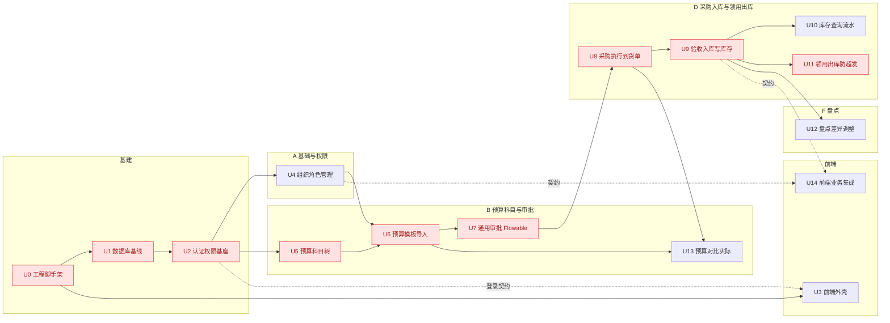
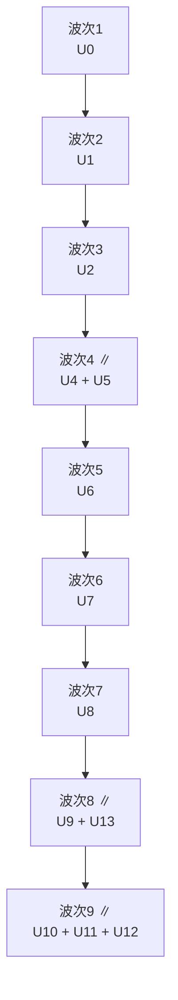

# 采购项目管理系统 · 计划看板

> 阶段四·执行计划产物 · 创建日期：2026-06-04（2026-06-05 按 PRD + 原型重构对齐；2026-06-08 进度同步） · 状态：执行中（U0、U1 已完成，下一步 U2）
> 来源（回链）：PRD `docs/prd/procurement-prd.md`、原型 `docs/prototype/index.html`；参考 E-R `docs/design/er/procurement-er.md`、数据库 `docs/design/db/procurement-db.md`、概要设计 `docs/design/general/procurement-general.md`
> 说明：核心是**依赖关系**——串行脊柱、并行波次、关键路径。功能点 U-ID 对应概要设计 §9 的 FP；**阶段分组镜像原型导航域**（A 基础与权限 / B 预算科目与审批 / D 采购入库与领用出库 / F 盘点），「原型屏」列打通计划↔原型↔PRD。

---

## 1. 看板（按状态）

> 2026-06-08 同步：U0/U1/U2 完成；**U4 组织/项目组/用户角色完成（18 接口；17 本地 PG 集成测试全绿，覆盖详设 T-1..T-16）**。下一步 **U5 预算科目树**（主关键路径，U2→U5→U6）；U6 待 U4+U5 齐备。U3 前端外壳可并行。
> 测试策略（无 Docker）：上下文型集成测试（Health/Auth/Org）跑本地 PG（`@EnabledIf` LocalPg 门控）；迁移单测 `MigrationBaselineTest` 因含破坏性校验和篡改、且 procurement 角色无 CREATEDB，保留 Docker 门控（U1 已由实库状态佐证）。
> 待办（U4 已实现，下列为后续承接）：失效用户会话回收——用户停用/软删时 `StpUtil.logout(userId)` 踢出会话（代码审查 F2，建议在用户停用流补上）。

| 就绪 | 进行中 | 阻塞 | 已完成 |
|---|---|---|---|
| **U5 ← U2**（关键路径，下一步） | — | U6 ← U4,U5（待 U5）；U7 ← U6 | U0 工程脚手架 |
| U3 ← U0,U2(契约) | | U8 ← U7；U9 ← U8 | U1 数据库基线（23 表 + 6 角色种子） |
| | | U13 ← U6,U8 | U2 认证/权限基座（审查 + 本地集成测试） |
| | | U10/U11/U12 ← U9 | **U4 组织/项目组/用户角色（18 接口，17 集成测试全绿）** |
| | | U14 ← U4..U13（契约） | |

---

## 2. 计划列表（功能点拆分）

> 功能点 = 可独立交付的纵向切片。层：后端/前端/全栈/运维。依赖类型：**硬**（用到上游真实产物）/ **软·契约级**（只需接口契约，可基于 mock 先行）。
> 「原型屏」= `docs/prototype/index.html` 的屏 id；「需求」= PRD `docs/prd/procurement-prd.md` 功能点编号。

| 阶段（原型域） | U-ID | 功能点 | 原型屏 | FP 映射 | 主要层 | 前置依赖 | 可并行 | 依赖类型 | 需求(PRD) | 粗估 | 状态 |
|---|---|---|---|---|---|---|---|---|---|---|---|
| 基建 | U0 | 工程脚手架（Spring Boot/Vite 已建） | — | — | 运维 | — | — | — | — | S | 已完成 |
| 基建 | U1 | 数据库基线 / Flyway 迁移（23 表 + Flowable 引擎表） | — | — | 后端 | U0 | — | 硬 | — | M | ✅ 已完成 |
| 基建 | U2 | 认证 / 权限基座（Sa-Token + 角色校验） | （登录态） | FP-1(部分) | 后端 | U1 | — | 硬 | A2 | M | ✅ 已完成（审查+本地集成测试） |
| 前端 | U3 | 前端外壳（Semi UI 布局/导航/路由） | 全局导航 | — | 前端 | U0 | U4,U5 | 软·契约(登录) | A2 | M | 🔜 就绪 |
| A 基础与权限 | U4 | 组织/项目组/用户角色管理 | `org` | FP-1 | 全栈 | U2 | U5 | 硬 | A1,A2 | M | ✅ 已完成（18 接口·17 集成测试） |
| B 预算科目与审批 | U5 | 预算科目树（多级/模糊搜索/比对新增） | `subject` `compare` | FP-2 | 全栈 | U2 | U4 | 硬 | B2,B3,B4 | M | 🔜 就绪 |
| B 预算科目与审批 | U6 | 预算模板导入（FastExcel + 校验） | `import` | FP-3 | 全栈 | U4,U5 | — | 硬 | B1 | M | 阻塞 |
| B 预算科目与审批 | U7 | 通用审批（Flowable 两级/驳回/流转历史） | `approval` | FP-4 | 全栈 | U6 | — | 硬 | C1,C2,C3 | L | 阻塞 |
| B 预算科目与审批 | U13 | 预算 vs 实际（只读读模型） | `subject`内卡 | FP-10 | 全栈 | U6,U8 | U9 | 硬 | D4 | S | 阻塞 |
| D 采购入库与领用出库 | U8 | 采购执行 + 到货单上传 | `purchase` | FP-5 | 全栈 | U7 | — | 硬 | D1,D2 | M | 阻塞 |
| D 采购入库与领用出库 | U9 | 多次到货验收入库（写库存+流水） | `inbound` | FP-6 | 全栈 | U8 | U13 | 硬 | D3 | M | 阻塞 |
| D 采购入库与领用出库 | U10 | 库存查询 + 库存流水 | （嵌入 `inbound`/`outbound`） | FP-7 | 全栈 | U9 | U11,U12 | 硬 | — | S | 阻塞 |
| D 采购入库与领用出库 | U11 | 领用 + 仓管审批出库（防超发） | `requisition` `outbound` | FP-8 | 全栈 | U9 | U10,U12 | 硬 | E1,E2,E3 | M | 阻塞 |
| F 盘点 | U12 | 盘点 + 差异调整库存 | `stocktake` | FP-9 | 全栈 | U9 | U10,U11 | 硬 | F1,F2 | M | 阻塞 |
| 前端 | U14 | 前端业务页面集成（含工作台聚合） | `dashboard` + 全部屏 | — | 前端 | U4..U13（契约） | 并行 | 软·契约级 | 全部 | L | 阻塞 |

> 粗估：S(≤1d) / M(2-3d) / L(≥1w)。
> 对齐说明：原型导航把「B 预算与科目 + C 审批」合并为 **B 域**、把「D 采购入库 + E 领用出库」合并为 **D 域**；本表阶段列与之一致。PRD 的 C1–C3 归入 B 域 U7、D1–D4 与 E1–E3 归入 D 域 U8–U11/U13，编号仍按 PRD 可追溯。

---

## 3. 串行/并行依赖图（DAG）

> 实线=硬依赖；虚线 `-.->`=软·契约级依赖；红色=关键路径节点。子图分组镜像原型导航域。

**图注**：
- **串行脊柱**：U0 → U1 → U2（脚手架→数据库基线→认证权限，强串行）。
- **并行对**：U4 ∥ U5（组织管理与科目树互不引用对方表，U2 后同时开工）；U9 ∥ U13（入库与「预算vs实际」读模型互不依赖，U8 后并行）；U10 ∥ U11 ∥ U12（库存就绪后三支线并行）。
- **汇合点**：U6 需 U4、U5 都完成（预算导入要科目映射 + 项目组）；U13 需 U6+U8（预算 + 采购实际）；U10–U12 汇于 U9。
- **软依赖**：U3 前端外壳只需 U2 登录契约；U14 前端集成只需各业务模块接口契约，可基于 mock 并行，仅联调时等待（不计入硬关键路径）。

---

## 4. 并行批次（波次）

> 拓扑分层：`波次(节点) = 1 + max(各前置波次)`。软依赖（U3/U14）不参与硬分层。

| 波次 | 功能点 | 并行度 | 说明 |
|---|---|---|---|
| 1 | U0 | 1 | 脚手架（已完成） |
| 2 | U1 | 1 | 数据库基线 / 迁移 |
| 3 | U2 | 1 | 认证 / 权限基座 |
| 4 | U4 + U5 | 2 | 组织管理 ∥ 预算科目树 |
| 5 | U6 | 1 | 预算导入（汇合 U4+U5） |
| 6 | U7 | 1 | 通用审批 Flowable |
| 7 | U8 | 1 | 采购执行 + 到货单 |
| 8 | U9 + U13 | 2 | 验收入库 ∥ 预算vs实际读模型（U13 仅需 U6+U8，已可并行） |
| 9 | U10 + U11 + U12 | 3 | 库存查询 / 领用出库 / 盘点并行 |

> 软依赖：U3 前端外壳可从波次 3（U2 契约）起并行；U14 前端业务集成可从波次 4 起基于 mock 并行，联调收口安排在波次 8/9 后。

---

## 5. 关键路径与团队分工

- **关键路径**：`U0 → U1 → U2 → U5 → U6 → U7 → U8 → U9 → U11`（9 节点，决定总工期）。
  - **协同关键路径（co-critical）**：U4 与 U5 等长且同汇入 U6，`…→U4→U6→…` 同为关键路径；终点 U11 与 U12 等长同源 U9，`…→U9→U12` 同样关键。任一延误均拖累全局。
  - U13 经依赖精化后离开关键路径尾段（波次 8 与 U9 并行），不再压在 U9 之后。
- **执行方式**：

| 人力 | 执行策略 |
|---|---|
| 单人 | 退化为串行：U1→U2→U4→U5→U6→U7→U8→U9→U13→U10→U11→U12→U14 |
| 两人 | A 走关键路径（U1→U2→U5→U6→U7→U8→U9→U11）；B 在 U2 后承接 U4，并行做 U3 前端外壳、提前 mock U14；波次 8 起分摊 U13，波次 9 分摊 U10/U12 |
| 单元内前后端并行 | 每个全栈功能点内：后端先定接口契约，前端（U14 范畴）即并行开发，联调收口 |

---

## 6. 阻塞与里程碑

> 里程碑按原型导航域归并，便于演示验收按域推进。

| 里程碑 | 达成条件（哪个功能点验收通过即达成） | 关联功能点 |
|---|---|---|
| M1 基建就绪 | U2 认证/权限验收通过 | U0,U1,U2 |
| M2 预算科目与审批闭环（B 域） | U7 两级审批验收通过 | U4,U5,U6,U7 |
| M3 采购入库闭环（D 域·上半） | U9 验收入库验收通过 | U8,U9 |
| M4 领用出库与盘点闭环（D 域·下半 + F 域） | U11、U12 验收通过 | U10,U11,U12 |
| M5 预算对比 + 可演示 | U13 + U14 前端联调通过 | U13,U3,U14 |

**阻塞分类**：
- **实现型阻塞**：等上游功能点完成（如 U6 等 U4/U5；U10–U12 等 U9）。
- **外部依赖型阻塞**：代码可完成，但验收依赖外部 TBD 拍板——需尽早推动。

| 阻塞项 | 类型 | 影响功能点 | 推动方 |
|---|---|---|---|
| 预算模板列定义未定（PRD TBD-2） | 外部依赖型 | U6 | 业务/财务 |
| 附件存储介质未定（PRD TBD-4 / DB TBD-3） | 外部依赖型 | U6,U8 | 技术 |
| 库存项聚合粒度（PRD TBD-3 / ER·DB TBD-1） | 外部依赖型 | U9,U11,U12 | 业务 |

**最大连锁风险**：关键路径前段 U0→U1→U2 基建脊柱任一延误，全部业务功能点顺延。

---

## 7. 交付说明 / 可加项

- **一句话总结**：串行脊柱 U0→U1→U2；并行对 U4∥U5、U9∥U13、U10∥U11∥U12；汇合点 U6（科目+组织）、U9（库存）、U13（预算+采购）；软依赖 U3/U14 前端可提前 mock 并行。阶段分组与里程碑镜像原型导航 4 域（A/B/D/F）。
- **可加项（按需）**：甘特排期 / 导出 GitHub Issues（本仓库非 git，缺 `gh`，需先 `git init` 或产出可执行导出件+脚本）/ 与 `tkxm-detail` 详细设计的功能点逐项对齐（已产出全部 U1–U14 共 14 份详设；U0 脚手架本身无需详设）。
