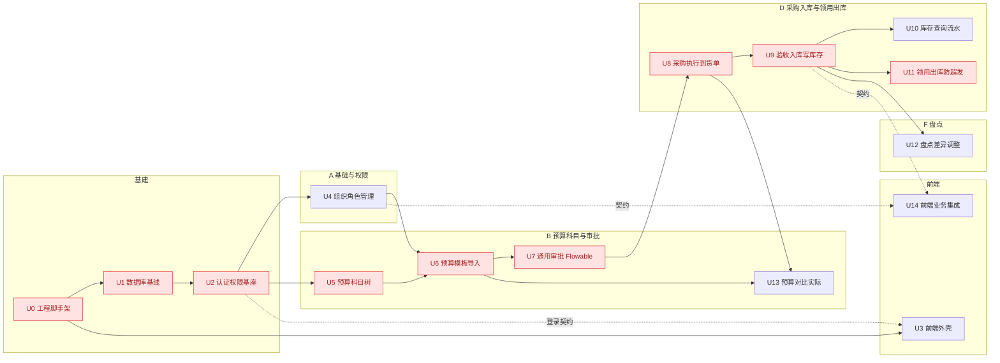
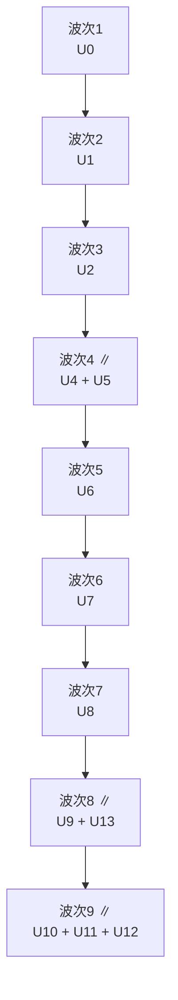

# 采购项目管理系统 · 计划看板

> 阶段四·执行计划产物 · 创建日期：2026-06-04（2026-06-05 按 PRD + 原型重构对齐；2026-06-08 进度同步） · 状态：**全功能点 U0–U14 完成**（后端 9 模块 + 前端 11 屏；里程碑 M1–M5 达成，详见 §1 同步记录）
> 来源（回链）：PRD `docs/prd/procurement-prd.md`、原型 `docs/prototype/index.html`；参考 E-R `docs/design/er/procurement-er.md`、数据库 `docs/design/db/procurement-db.md`、概要设计 `docs/design/general/procurement-general.md`
> 说明：核心是**依赖关系**——串行脊柱、并行波次、关键路径。功能点 U-ID 对应概要设计 §9 的 FP；**阶段分组镜像原型导航域**（A 基础与权限 / B 预算科目与审批 / D 采购入库与领用出库 / F 盘点），「原型屏」列打通计划↔原型↔PRD。

---

## 1. 看板（按状态）

> 2026-06-08 同步：U0–U5 完成；**U6 预算模板导入完成（FastExcel 流式解析 + 行级校验汇总不中断 + 科目映射 + 金额挂叶子 + 附件留档；3 接口、9 本地 PG 集成测试覆盖 T-1..T-9；零落库原则 + 单事务）**。下一步 **U7 通用审批（Flowable 两级：采购主管→部门主管）**，消费 U6 产出的 budget(draft)。U14 前端业务集成解锁面随各业务页推进。
> 2026-06-10 同步：**U7 通用审批完成（Flowable 7.1 嵌入式 BPMN `budget_approval` 两节点；提交/待办/通过/驳回/流转历史 5 接口；TaskListener 投影一致性单点 + 同事务；节点-角色双重护栏；驳回=结束实例退回编制态[D-3]；11 本地 PG 集成测试覆盖 T-1..T-11，T-12 原子性由结构保证）**。错误码编码归一：状态冲突 40903、驳回意见必填 42203、对象不存在沿用 40401（详设 §8 / TBD-7 已拍板）。下一步 **U8 采购执行 + 到货单**，消费 U7 产出的 budget(approved)。
> 2026-06-10 同步：**U8 采购执行 + 到货单完成（创建采购单含明细 / 详情+分页列表 / 多文件上传到货单 / 查询+下载 共 6 个 REST 端点；预算 approved 校验 + 科目叶子校验 + 单事务写主单+明细；`FileStorage` 抽象 + `LocalFileStorage`，下载做目录穿越防护；11 本地 PG 集成测试覆盖 T-1..T-11）**。错误码沿用 40903/40401 归一口径；详设 TBD-1 存储抽象已落地。下一步 **U9 多次到货验收入库（写 `stock_item`/`stock_txn`，累加 received_qty）**，消费 U8 产出的 `purchase_order`(executing)。
> 2026-06-10 同步：**U9 多次到货验收入库完成（入库 / 入库记录查询 2 接口；单事务写 inbound_order/inbound_item + 累加 purchase_item.received_qty + M5 库存 SoR 记账[stock_item upsert + stock_txn] + 全收转 inbounded；`purchase_item` FOR UPDATE 串行化不超收，`stock_item` ON CONFLICT 原子 upsert 化解并发；12 本地 PG 集成测试覆盖 T-1..T-10 含真实并发 T-7 与对账 INV-3/INV-4）**。新增 M5 `StockService` 为库存唯一记账入口；错误码归一：累计超收 42204、PO 非 executing 40903。下一步 **U10 库存查询+流水 / U11 领用出库 / U12 盘点**（均消费 U9 的库存）。
> 2026-06-10 同步：**U11 领用 + 仓管审批出库完成（M6 领用单：发起领用 / 待办核库存 / 审批出库 / 驳回 / 查询 5 接口；审批出库单事务行锁防超发——领用单与库存项均 `SELECT … FOR UPDATE`，锁内校验库存充足后经 M5 `StockService.deductStock` 扣减+写 outbound 流水+生成出库单/明细+转 outbound，多明细按 stock_item_id 升序加锁避死锁；驳回意见落库需 Flyway V3 加 `requisition.reject_opinion` 列；12 本地 PG 集成测试覆盖 T-1..T-13 含真实并发零超发与 CHECK 兜底）**。错误码归一：状态不符 40903、库存不足 40904（新增）、驳回意见 42203（复用 U7）。**关键路径 U0→…→U9→U11 全部完成**；剩余 U10/U12/U13 可并行，U14 前端联调。
> 2026-06-11 同步：**U10 库存查询 + 库存流水完成（M5 只读查询面：库存分页查询 `GET /api/stocks`（项目组/部门/物料名 ILIKE 组合过滤，按 project_group_id+material_name 升序）/ 某库存项流水倒序分页 `GET /api/stocks/{id}/txns`（created_at DESC + id DESC tie-breaker 深翻页稳定，附 bookQty/txnSum 对账汇总 INV-1）共 2 接口；新增 `StockQueryService`，与写入侧记账入口 `StockService` 分离——全 `@Transactional(readOnly=true)` 不写表/不持锁；分页越界显式抛 40001；11 本地 PG 集成测试覆盖 T-1..T-10）**。错误码归一：参数非法 40001、非 warehouse/admin 40301（`SaMode.OR`）、库存项不存在 40401。下一步 **U12 盘点 + 差异调整** 或 **U13 预算 vs 实际**（均就绪、可并行）；前端各业务页归 U14 统一集成。
> 2026-06-11 同步：**U12 盘点 + 差异调整库存完成（M5 盘点能力：发起盘点 `POST /api/stocktakes`（单事务快照项目组下各库存项账面数 + 批量建明细）/ 录入实盘 `PUT /api/stocktakes/{id}/items`（重算 diff/diff_type，不触库存）/ 确认调整 `POST /api/stocktakes/{id}/confirm`（单事务 FOR UPDATE 锁盘点单防重复确认 → 逐有差异项经新增 M5 记账入口 `StockService.adjustTo` 行锁置数+记 gain/loss 流水 → 翻 confirmed，多明细按 stock_item_id 升序加锁避死锁）共 3 接口；新增 `stocktake` 模块（独立 BC5 聚合）+ `StockService.adjustTo`（绝对值置数，qty_change 按调整时库内当前值算保证 INV-3）；13 本地 PG 集成测试覆盖 T-1..T-12 含真实并发重复确认幂等 T-11、快照后并发改动记账 T-12）**。错误码编码归一（详设草稿早于归一）：状态冲突=已确认 40903（非草稿 40901，与 U7/U9/U11 一致）、实盘数为负新增 42205（草稿 42204 已被 U9 超收占用）、对象不存在 40401、非 warehouse 40301。**剩余仅 U13（预算 vs 实际，只读读模型）后端切片就绪**；其后 U14 前端业务集成联调收口。
> 2026-06-11 同步：**U13 预算 vs 实际完成（M2 只读读模型：`GET /api/budgets/{id}/vs-actual` 按预算科目聚合「预算 budget_item.amount vs 已发生 purchase_item.amount」对比——预算侧 / 实际侧两段聚合 SQL（实际侧经 purchase_order.budget_id 锚定同一预算，AC-8 不串他预算）+ 应用层以预算科目为基准左连接合并，逐行算 remaining=budgeted−actual / overspent（仅标识不拦截）+ 三项合计，金额两位小数 HALF_UP；新增 `BudgetVsActualMapper`（不绑定单表）/ `BudgetVsActualService`（`@Transactional(readOnly=true)` 零副作用）；查看角色 editor|purchase_mgr|dept_mgr|admin（`SaMode.OR`）；7 本地 PG 集成测试覆盖 T-1..T-7）**。新增通用基建：`GlobalExceptionHandler` 补 `ConstraintViolationException → 40001` 映射（`@Validated`+`@Positive` 路径参非正整数归一为参数错误，原落兜底 50000）。错误码：参数非法 40001、无查看角色 40301、未登录 40110、预算不存在 40401。**至此 U0–U13 后端功能点全部完成；仅剩 U14 前端业务页面集成（消费各业务接口契约，联调收口）**。
> 2026-06-11 同步：**U14 前端业务集成（首批增量·进行中）**——在 U3 外壳上落地共享数据层（`src/api/*Api.ts` 按后端模块分文件的强类型接口封装 + `Page<T>` + `useAsync` 加载/重试 hook + 盘点差异纯函数 `computeDiff`）与 **3 个业务页**：①**工作台 DashboardPage**（`Promise.allSettled` 并行聚合审批待办/出库待办/执行中采购/在管项目 4 卡，按角色可见性容错——无权限源显示「—」不阻断；我的待办合并审批+出库两类、行可跳转带 bizId，AC-10）；②**盘点 StocktakePage**（选项目组→发起快照→逐项录入实盘实时算盘盈/盘亏→保存→确认调整，确认前自动持久化最新实盘，对接 U12，AC-9）；③**仓管出库 OutboundPage**（待办按项目组列出、逐明细库存核验，不足行标红「库存不足，不可超发」并禁用审批出库[前端前置防护]+后端行锁兜底，支持驳回意见必填，对接 U11，AC-8）。`router.tsx` 按路径覆盖占位页（未实现屏仍走 Placeholder 保证导航可达）。前端 20 测试全绿（新增 stocktakeDiff 4 / Dashboard 2 / Outbound 2 / Stocktake 1）、`tsc` 类型检查 + `vite build` 生产构建通过。**余 8 页待续：org / import / subject(+U13 对比卡) / compare / approval / purchase / inbound / requisition**。
> 2026-06-11 同步：**U14 B 域写链 4 页完成（进行中）**——落地设计「主线一：导入→比对→审批」：①**ImportPage**（U6：选项目组+预算名→下载模板/上传立项附件得 path→上传 .xlsx 导入；校验失败按 `errorRows` 逐行红条呈现不跳转[AC-1]、全通过 Toast 并可跳比对/审批[AC-2]）；②**ComparePage**（U5：多行「/」分级路径→比对 EXISTS/MISSING→默认勾选缺失项确认新增[AC-3]）；③**SubjectPage**（U5 科目树全量加载+Semi `Tree` 渲染 / 模糊搜索祖先路径面包屑 / 新增根&子级 / 删除[40901 受限]，内嵌 **U13 预算 vs 实际对比卡**——按科目展示预算/已发生/差额、超支红标不拦截[AC-3]）；④**ApprovalPage**（U7：按角色显隐——编制人「提交审批」入口 + 采购主管/部门主管待办通过/驳回[意见必填]/流转历史[AC-4]）。新增通用前端基建：`ApiError` 透传 `Result.data`（导入 `errorRows` 结构化呈现的关键）；二进制模板下载绕过 Result 解包直触发浏览器下载。前端 **29 测试全绿**（新增 comparePaths 3 / importApi[42201+data.errorRows 数据通路] 2 / ApprovalPage 2 / SubjectPage 1 / ComparePage 1）、`tsc` + `vite build` 通过。**U14 已落 7/11 页；余 4 页：org / purchase / inbound / requisition**。
> U14 契约缺口（待业务拍板）：`requisition`（领用，requester 角色）需选库存物料，但 `GET /api/stocks` 限 warehouse|admin——requester 无法列库存。需定：给 requester 开只读库存查询，或领用页改按项目组/物料名检索。做该页前拍板。
> 2026-06-11 同步：**U14 完成 —— requisition 页 + 全部 11 屏落地（功能点全收口）**。**RequisitionPage**（对接 U11，领用人）：选项目组拉取可领用库存 → 逐项选物料+数量+用途发起领用（前端校验 qty>0）→ 转待仓管审批；「我的领用」按 `me.userId` 展示本人各单状态。**配套补 U11 后端缺口**（解前述领用契约缺口）：新增 `GET /api/requisitions/stock-options?projectGroupId=`（requester 可见的项目组库存只读列表——领用人无权访问 warehouse 的库存查询 U10，故由领用模块提供；RequisitionIntegrationTest 增 T-14 覆盖列表/40401/40301，后端 12→13 全绿）。前端 **36 测试全绿**（新增 Requisition 1）、`tsc` + `vite build` 通过。**至此 U14 全部 11 屏落地（dashboard/org/import/compare/subject[含 U13 卡]/approval/purchase/inbound/requisition/outbound/stocktake），U0–U14 全功能点完成；里程碑 M5（预算对比 + 可演示）达成。** 两处 U14 契约缺口均以「按角色的只读列表端点」补齐（U9 pending-items / U11 stock-options），思路一致、各带集成测试。
> 2026-06-11 同步：**U14 A 域 org 页完成（进行中）**——**OrgPage**（对接 U4，Semi `Tabs` 三视图）：①部门（列表/新增/编辑/删除[40901 受限]）；②项目组（列表/增改删 + 所属部门 Select）；③用户与角色（列表展示角色 Tag / 新增[账号+初始口令+部门] / 编辑[姓名+部门] / 删除 / **角色全量覆盖分配**[Checkbox 组，对接 `PUT /users/{id}/roles`]）。写操作限 admin（导航已按角色显隐，后端权威鉴权；编码重复 40902 / 删除受限 40901 由 apiClient Toast）。`orgApi` 扩为完整 18 接口封装。前端 **35 测试全绿**（新增 OrgPage 1）、`tsc` + `vite build` 通过。**U14 已落 10/11 页；仅余 requisition（待契约缺口拍板）**。
> 2026-06-11 同步：**U14 D 域采购入库链 2 页完成（进行中）**——①**PurchasePage**（U8：选 approved 预算建采购单含动态明细行[预算非 approved 后端回 40903 Toast]、供应商/合同号选填；采购单列表按状态筛选；详情 Modal 含明细 + 到货单上传/下载[AC-5]）；②**InboundPage**（U9：输采购单号查待收明细→逐项录本次实收、**前端实时核「累计超收」本次>待收即标红禁用入库**[AC-6]+后端 42204 兜底→入库并展示入库记录）。**配套补 U9 后端缺口**：新增 `GET /api/inbounds/pending-items?purchaseOrderId=`（warehouse 可见的待收明细只读视图——仓管无权访问 editor 的采购单详情，故由入库模块提供；InboundIntegrationTest 增 T-11 覆盖待收/40401/40301，后端入库测试 12→13 全绿）。新增前端 `download.ts`（二进制下载统一助手，模板/到货单复用）、`purchaseApi`/`inboundApi`。前端 **34 测试全绿**（新增 inboundGuard[超收核验纯函数] 3 / Purchase 1 / Inbound 1）、`tsc` + `vite build` 通过。**U14 已落 9/11 页；余 2 页：org（U4 组织/角色，admin）+ requisition（待上述契约缺口拍板）**。
> 依赖修复：commons-compress 锁 1.25.0（FastExcel 的 POI 5.2.5 需 putArchiveEntry(ZipArchiveEntry)，传递的 1.24.0 缺该重载致写 xlsx 失败）。
> 测试策略（无 Docker）：上下文型集成测试（Health/Auth/Org）跑本地 PG（`@EnabledIf` LocalPg 门控）；迁移单测 `MigrationBaselineTest` 因含破坏性校验和篡改、且 procurement 角色无 CREATEDB，保留 Docker 门控（U1 已由实库状态佐证）。
> 待办（U4 已实现，下列为后续承接）：失效用户会话回收——用户停用/软删时 `StpUtil.logout(userId)` 踢出会话（代码审查 F2，建议在用户停用流补上）。

| 就绪 | 进行中 | 阻塞 | 已完成 |
|---|---|---|---|
| —（全功能点完成） | — | — | U0 脚手架；U1 基线；U2 认证；U3 前端外壳；U4 组织角色；U5 科目树 |
| | | | **U6 预算导入（3 接口·9 测试）**；**U7 通用审批（5 接口·11 测试）** |
| | | | **U8 采购执行+到货单（6 端点·11 测试）**；**U9 验收入库（3 接口·13 测试·M5 SoR）** |
| | | | **U11 领用+审批出库（6 接口·13 测试·FOR UPDATE 防超发）**；**U10 库存查询+流水（2 接口·11 测试·只读）** |
| | | | **U12 盘点+差异调整（3 接口·13 测试·M5 adjustTo 记账）**；**U13 预算 vs 实际（1 接口·7 测试·只读读模型）** |
| | | | **U14 前端集成（11 屏全落地·前端 36 测试·`vite build` 通过）** |

---

## 2. 计划列表（功能点拆分）

> 功能点 = 可独立交付的纵向切片。层：后端/前端/全栈/运维。依赖类型：**硬**（用到上游真实产物）/ **软·契约级**（只需接口契约，可基于 mock 先行）。
> 「原型屏」= `docs/prototype/index.html` 的屏 id；「需求」= PRD `docs/prd/procurement-prd.md` 功能点编号。

| 阶段（原型域） | U-ID | 功能点 | 原型屏 | FP 映射 | 主要层 | 前置依赖 | 可并行 | 依赖类型 | 需求(PRD) | 粗估 | 状态 |
|---|---|---|---|---|---|---|---|---|---|---|---|
| 基建 | U0 | 工程脚手架（Spring Boot/Vite 已建） | — | — | 运维 | — | — | — | — | S | 已完成 |
| 基建 | U1 | 数据库基线 / Flyway 迁移（23 表 + Flowable 引擎表） | — | — | 后端 | U0 | — | 硬 | — | M | ✅ 已完成 |
| 基建 | U2 | 认证 / 权限基座（Sa-Token + 角色校验） | （登录态） | FP-1(部分) | 后端 | U1 | — | 硬 | A2 | M | ✅ 已完成（审查+本地集成测试） |
| 前端 | U3 | 前端外壳（Semi UI 布局/导航/路由） | 全局导航 | — | 前端 | U0 | U4,U5 | 软·契约(登录) | A2 | M | ✅ 已完成（Router/守卫/apiClient·11 测试） |
| A 基础与权限 | U4 | 组织/项目组/用户角色管理 | `org` | FP-1 | 全栈 | U2 | U5 | 硬 | A1,A2 | M | ✅ 已完成（18 接口·17 集成测试） |
| B 预算科目与审批 | U5 | 预算科目树（多级/模糊搜索/比对新增） | `subject` `compare` | FP-2 | 全栈 | U2 | U4 | 硬 | B2,B3,B4 | M | ✅ 已完成（6 接口·13 集成测试） |
| B 预算科目与审批 | U6 | 预算模板导入（FastExcel + 校验） | `import` | FP-3 | 全栈 | U4,U5 | — | 硬 | B1 | M | ✅ 已完成（3 接口·9 集成测试） |
| B 预算科目与审批 | U7 | 通用审批（Flowable 两级/驳回/流转历史） | `approval` | FP-4 | 全栈 | U6 | — | 硬 | C1,C2,C3 | L | ✅ 已完成（5 接口·11 集成测试） |
| B 预算科目与审批 | U13 | 预算 vs 实际（只读读模型） | `subject`内卡 | FP-10 | 全栈 | U6,U8 | U9 | 硬 | D4 | S | ✅ 已完成（1 接口·7 集成测试·只读读模型） |
| D 采购入库与领用出库 | U8 | 采购执行 + 到货单上传 | `purchase` | FP-5 | 全栈 | U7 | — | 硬 | D1,D2 | M | ✅ 已完成（6 端点·11 集成测试） |
| D 采购入库与领用出库 | U9 | 多次到货验收入库（写库存+流水） | `inbound` | FP-6 | 全栈 | U8 | U13 | 硬 | D3 | M | ✅ 已完成（2 接口·12 集成测试） |
| D 采购入库与领用出库 | U10 | 库存查询 + 库存流水 | （嵌入 `inbound`/`outbound`） | FP-7 | 全栈 | U9 | U11,U12 | 硬 | — | S | ✅ 已完成（2 接口·11 集成测试·只读） |
| D 采购入库与领用出库 | U11 | 领用 + 仓管审批出库（防超发） | `requisition` `outbound` | FP-8 | 全栈 | U9 | U10,U12 | 硬 | E1,E2,E3 | M | ✅ 已完成（5 接口·12 集成测试） |
| F 盘点 | U12 | 盘点 + 差异调整库存 | `stocktake` | FP-9 | 全栈 | U9 | U10,U11 | 硬 | F1,F2 | M | ✅ 已完成（3 接口·13 集成测试·M5 adjustTo） |
| 前端 | U14 | 前端业务页面集成（含工作台聚合） | `dashboard` + 全部屏 | — | 前端 | U4..U13（契约） | 并行 | 软·契约级 | 全部 | L | ✅ 已完成（11 屏全落地·API 层/hook·前端 36 测试·补 U9 pending-items / U11 stock-options） |

> 粗估：S(≤1d) / M(2-3d) / L(≥1w)。
> 对齐说明：原型导航把「B 预算与科目 + C 审批」合并为 **B 域**、把「D 采购入库 + E 领用出库」合并为 **D 域**；本表阶段列与之一致。PRD 的 C1–C3 归入 B 域 U7、D1–D4 与 E1–E3 归入 D 域 U8–U11/U13，编号仍按 PRD 可追溯。

---

## 3. 串行/并行依赖图（DAG）

> 实线=硬依赖；虚线 `-.->`=软·契约级依赖；红色=关键路径节点。子图分组镜像原型导航域。

**图注**：
- **串行脊柱**：U0 → U1 → U2（脚手架→数据库基线→认证权限，强串行）。
- **并行对**：U4 ∥ U5（组织管理与科目树互不引用对方表，U2 后同时开工）；U9 ∥ U13（入库与「预算vs实际」读模型互不依赖，U8 后并行）；U10 ∥ U11 ∥ U12（库存就绪后三支线并行）。
- **汇合点**：U6 需 U4、U5 都完成（预算导入要科目映射 + 项目组）；U13 需 U6+U8（预算 + 采购实际）；U10–U12 汇于 U9。
- **软依赖**：U3 前端外壳只需 U2 登录契约；U14 前端集成只需各业务模块接口契约，可基于 mock 并行，仅联调时等待（不计入硬关键路径）。

---

## 4. 并行批次（波次）

> 拓扑分层：`波次(节点) = 1 + max(各前置波次)`。软依赖（U3/U14）不参与硬分层。

| 波次 | 功能点 | 并行度 | 说明 |
|---|---|---|---|
| 1 | U0 | 1 | 脚手架（已完成） |
| 2 | U1 | 1 | 数据库基线 / 迁移 |
| 3 | U2 | 1 | 认证 / 权限基座 |
| 4 | U4 + U5 | 2 | 组织管理 ∥ 预算科目树 |
| 5 | U6 | 1 | 预算导入（汇合 U4+U5） |
| 6 | U7 | 1 | 通用审批 Flowable |
| 7 | U8 | 1 | 采购执行 + 到货单 |
| 8 | U9 + U13 | 2 | 验收入库 ∥ 预算vs实际读模型（U13 仅需 U6+U8，已可并行） |
| 9 | U10 + U11 + U12 | 3 | 库存查询 / 领用出库 / 盘点并行 |

> 软依赖：U3 前端外壳可从波次 3（U2 契约）起并行；U14 前端业务集成可从波次 4 起基于 mock 并行，联调收口安排在波次 8/9 后。

---

## 5. 关键路径与团队分工

- **关键路径**：`U0 → U1 → U2 → U5 → U6 → U7 → U8 → U9 → U11`（9 节点，决定总工期）。
  - **协同关键路径（co-critical）**：U4 与 U5 等长且同汇入 U6，`…→U4→U6→…` 同为关键路径；终点 U11 与 U12 等长同源 U9，`…→U9→U12` 同样关键。任一延误均拖累全局。
  - U13 经依赖精化后离开关键路径尾段（波次 8 与 U9 并行），不再压在 U9 之后。
- **执行方式**：

| 人力 | 执行策略 |
|---|---|
| 单人 | 退化为串行：U1→U2→U4→U5→U6→U7→U8→U9→U13→U10→U11→U12→U14 |
| 两人 | A 走关键路径（U1→U2→U5→U6→U7→U8→U9→U11）；B 在 U2 后承接 U4，并行做 U3 前端外壳、提前 mock U14；波次 8 起分摊 U13，波次 9 分摊 U10/U12 |
| 单元内前后端并行 | 每个全栈功能点内：后端先定接口契约，前端（U14 范畴）即并行开发，联调收口 |

---

## 6. 阻塞与里程碑

> 里程碑按原型导航域归并，便于演示验收按域推进。

| 里程碑 | 达成条件（哪个功能点验收通过即达成） | 关联功能点 |
|---|---|---|
| M1 基建就绪 | U2 认证/权限验收通过 | U0,U1,U2 |
| M2 预算科目与审批闭环（B 域） | U7 两级审批验收通过 | U4,U5,U6,U7 |
| M3 采购入库闭环（D 域·上半） | U9 验收入库验收通过 | U8,U9 |
| M4 领用出库与盘点闭环（D 域·下半 + F 域） | U11、U12 验收通过 | U10,U11,U12 |
| M5 预算对比 + 可演示 | U13 + U14 前端联调通过 | U13,U3,U14 |

**阻塞分类**：
- **实现型阻塞**：等上游功能点完成（如 U6 等 U4/U5；U10–U12 等 U9）。
- **外部依赖型阻塞**：代码可完成，但验收依赖外部 TBD 拍板——需尽早推动。

| 阻塞项 | 类型 | 影响功能点 | 推动方 |
|---|---|---|---|
| 预算模板列定义未定（PRD TBD-2） | 外部依赖型 | U6 | 业务/财务 |
| 附件存储介质未定（PRD TBD-4 / DB TBD-3） | 外部依赖型 | U6,U8 | 技术 |
| 库存项聚合粒度（PRD TBD-3 / ER·DB TBD-1） | 外部依赖型 | U9,U11,U12 | 业务 |

**最大连锁风险**：关键路径前段 U0→U1→U2 基建脊柱任一延误，全部业务功能点顺延。

---

## 7. 交付说明 / 可加项

- **一句话总结**：串行脊柱 U0→U1→U2；并行对 U4∥U5、U9∥U13、U10∥U11∥U12；汇合点 U6（科目+组织）、U9（库存）、U13（预算+采购）；软依赖 U3/U14 前端可提前 mock 并行。阶段分组与里程碑镜像原型导航 4 域（A/B/D/F）。
- **可加项（按需）**：甘特排期 / 导出 GitHub Issues（本仓库非 git，缺 `gh`，需先 `git init` 或产出可执行导出件+脚本）/ 与 `tkxm-detail` 详细设计的功能点逐项对齐（已产出全部 U1–U14 共 14 份详设；U0 脚手架本身无需详设）。
